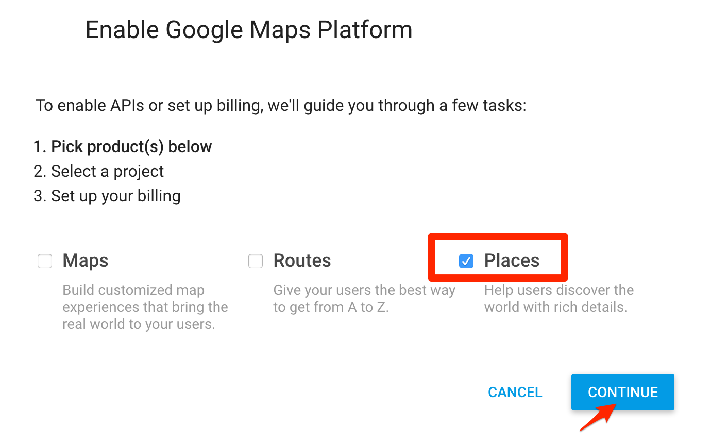
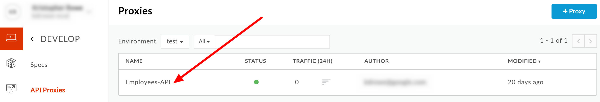
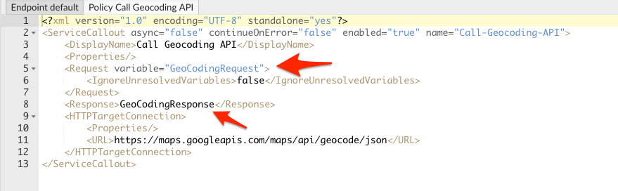
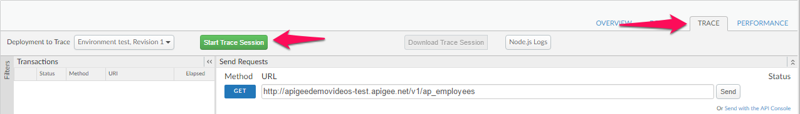
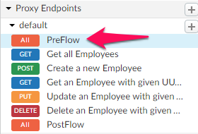

# API Development : Create a Mashup with APIs (Composite APIs)

*Duration : 30 mins*

*Persona : API Team*

# Use case

As a member of the API team, you would like to aggregate multiple APIs, in this case the Employee API and Google Geolocation API, into a single interface for ease of consumability for your App Developers when searching for employees located within a certain distance of a given location.

The goal is to have the proxy perform a geolocation query against our Employee data collection to return results within a certain radius of a zip code.

This API supports the ability to retrieve entities within a specified distance of any geocoordinate based on its location property:

```
location within {distance_in_miles} of {latitude},{longitude}
```

As you can see, you need to provide the latitude and longitude information to perform the query.

For mobile applications meant for smartphones, obtaining geocode information is easy and can be provided directly as part of an API call. For this lesson, assume that this API interface is being created for devices and applications that cannot easily provide the geocoordinate information, but simply requests the user to provide the zip code. In such a situation, the first thing is to obtain the geo-coordinates for the zip code provided before doing further processing. Below are the high level steps to implement this in the proxy:

* Retrieve the zipcode and radius from the request query parameters

* Use the zipcode as an input parameter to call an external service that converts the zipcode to the geo-coordinates

* Extract the latitude and longitude geo-coordinates information from the response of the external service call

* Apply the geo-coordinates retrieved in the final call to the target service to limit the results to a geographic area

A pictorial representation of the logic is depicted below:


For the service callout to convert the zipcode to the geocoordinate, you will use the [Google GeoCoding API](https://developers.google.com/maps/documentation/geocoding/).

# How can Apigee Edge help?

Apigee Edge enables you to design API behavior by using the out of the box policies. A policy is like a module that implements a specific, limited management function. Policies are designed to let you add common types of management capabilities to an API easily and reliably.

In this lab we will see how you can extend an existing API by aggregating it with another API and creating a single interface for your App Developers to consume. In this example, we will be combining data from our Employee API with the Google Weather to have a single response of the employee information and weather for their location. We will discover and use the following types of policies:

**Traffic Management Policies** in the traffic management category enable you to control the flow of request and response messages through an API proxy. These policies support both operational- and business-level control. They give you control over raw throughput, and can also control traffic on a per-app basis. Traffic management policy types enable you to enforce quotas, and they also help you to mitigate denial of service attacks.

**Mediation Policies** in the mediation category enable you to actively manipulate messages as they flow through API proxies. They enable you to transform message formats, from XML to JSON (and vice-versa), or to transform one XML format to another XML format. They also enable you to parse messages, to generate new messages and to change values on outbound messages. Mediation policies also interact with basic services exposed by API Services, enabling you to retrieve data about apps, developers, security tokens, and API products at runtime.

**Security Policies** in the security category support authentication, authorization, as well as content-based security.

**Extension Policies** in the extension category enable you to tap into the extensibility of API Services to implement custom behavior in the programming language of your choice.

# Pre-requisites

* An existing API proxy.

# Instructions

## Obtain the API key for Google Maps APIs.
1. Open the Google Map API documentation [page](https://developers.google.com/maps/documentation/geocoding/start?authuser=0#get-a-key). Click on **Get Started** to register and activate Google Map APIs. 
2. Select the **Places** product as that contains the Geocode APIs. Click Continue.

3. Click on **Create a Project** option under *Select or Create a Project* drop down. Provide a name. Click **Next**.
4. Enable and Create or Set Billing Account (if already available)
5. Enable the API to complete the configuration
6. Once the configuration is complete, you should find your API Key. Please copy this in a safe place. Click **Done**.


## Select existing Employees API

1. Go to [https://apigee.com/edge](https://apigee.com/edge) and log in. This is the Edge management UI. 

2. Select **Develop → API Proxies** in the side navigation menu.


3. Click on the proxy you created before.



4. Click on the **Develop** tab

## Use an Assign Message Policy to prepare the service callout request

5. Click on **+ Step** on PreFlow Request Flow.


6. Modify the policy to reflect a request with the appropriate query parameters for the Google Geolocation API. Also replace `YOUR_KEY_GOES_HERE` with your Google Map's API key.

```
<?xml version="1.0" encoding="UTF-8" standalone="yes"?>
<AssignMessage async="false" continueOnError="false" enabled="true" name="Create-Geocoding-Request">
    <DisplayName>Create Geocoding Request</DisplayName>
    <AssignTo createNew="true" type="request">GeoCodingRequest</AssignTo>
    <Set>
        <QueryParams>
            <QueryParam name="address">{request.queryparam.zipcode}</QueryParam>
            <QueryParam name="region">US</QueryParam>
            <QueryParam name="sensor">false</QueryParam>
            <QueryParam name="key">YOUR_KEY_GOES_HERE</QueryParam>
        </QueryParams>
        <Verb>GET</Verb>
    </Set>
    <!-- Set variables for use in the flow -->
    <AssignVariable>
        <Name>zipcode</Name>
        <Ref>request.queryparam.zipcode</Ref>
    </AssignVariable>
    <AssignVariable>
        <Name>radius</Name>
        <Value>0</Value>
        <Ref>request.queryparam.radius</Ref>
    </AssignVariable>
</AssignMessage>
```

Here's a brief description of the elements in this policy. You can read more about this policy in Assign Message policy.

**<AssignMessage name>** - Gives this policy a name. The name is used when the policy is referenced in a flow.

**<AssignTo>** - Creates a named variable called ’GeoCodingRequest’of type ‘Request’. This variable encapsulates the request object that will be sent by the ServiceCallout policy.

**<Set><QueryParams>** - Sets the query parameters that are needed for the service callout API call. In this case, the Google Geocoding API needs to know the location, which is expressed with a zipcode. The API calling client supplies this information, and we simply extract it here. The region and sensor parameters are by the API, and we just hardcode it to certain values here.

**<Verb>** - In this case, we are making a simple GET request to the API.

**<AssignVariable>** - zipcode and radius are new variables being created to store values being passed to the API. In this example, the variables will be accessed later in the proxy flow.

Note: The properties associated with the ‘Assign Message’ policy could have been modified using the ‘Property Inspector’ panel that’s presented in the ‘Develop’ tab on the right. Any changes made in the ‘Code’ panel are reflected in the ‘Property Inspector’ panel and vice-versa. We will use the ‘Property Inspector’ panel to set properties for some of the policies as the lesson progresses.

* **Save** the API Proxy

## Use Service Callout Policy to invoke the Google GeoCoding API

1. Click on **+ Step**


Scroll down the policy list and select **Service Callout** and update the default display name to **Call Geocoding API** select **HTTP** and then enter the **HTTP Target** with the following URL:

```
https://maps.googleapis.com/maps/api/geocode/json
```


Then click on **Add** button.

2. Update the **Request** variable from *myRequest* to **GeoCodingRequest** and also update the *Response* variable from *calloutResponse* to **GeoCodingResponse**.



**<Request variable>** - This is the variable ‘GeoCodingRequest’ that was created in the AssignMessage policy in the previous step. It encapsulates the request going to the Google Geocoding API.

**<Response>**- This element names a variable ‘GeoCodingResponse’ in which the response from the Google Geocoding API will be stored. As you will see, this variable will be accessed later by the ExtractVariables policy.

**<HTTPTargetConnection><URL>** - Specifies the target URL to be used by the service callout - in this case the URL of the Google Geocoding API: [https://maps.googleapis.com/maps/api/geocode/json](https://maps.googleapis.com/maps/api/geocode/json) 

* **Save** the API Proxy.

## Use Extract Message Policy to parse the service callout response

3. Click on **+ Step**


Scroll down the policy list and select **Extract Variables** and update the default display name to **Extract Geocodes**


Then click on **Add**.

4. Update the policy to parse the **GeoCodingResponse** and store the results in variables.

```
<?xml version="1.0" encoding="UTF-8" standalone="yes"?>
<ExtractVariables async="false" continueOnError="false" enabled="true" name="Extract-Geocodes">
    <DisplayName>Extract Geocodes</DisplayName>
    <Source>GeoCodingResponse</Source>
    <VariablePrefix>geocodeResponse</VariablePrefix>
    <JSONPayload>
        <Variable name="latitude">
            <JSONPath>$.results[0].geometry.location.lat</JSONPath>
        </Variable>
        <Variable name="longitude">
            <JSONPath>$.results[0].geometry.location.lng</JSONPath>
        </Variable>
    </JSONPayload>
</ExtractVariables>
```

Here's a brief description of the elements that were modified in this policy. You can read more about this policy in [Extract Variables policy](http://apigee.com/docs/api-services/reference/extract-variables-policy).

- Specifies the response variable ‘GeoCodingResponse’ that we created in the ServiceCallout policy. This is the variable from which this policy extracts data.

- The variable prefix ‘geocodeResponse’ specifies a namespace for other variables created in this policy. The prefix can be any name, except for the reserved names defined by the [Apigee Edge Platform's predefined variables](http://apigee.com/docs/api-platform/api/variables-reference).

- This element retrieves the response data that is of interest and puts it into named variables. In fact, the Google Geocoding API returns much more information than latitude and longitude. However, these are the only values needed for these lessons. You can see a complete rendering of the JSON in the [Google Geocoding API documentation](https://developers.google.com/maps/documentation/geocoding/). The values of geometry.location.lat and geometry.location.lng are simply two of the many fields in the returned JSON object.

It may not be obvious, but it's important to see that ExtractVariables produces two variables whose names consist of the variable prefix (geocodeResponse) and the actual variable names that are specified in the policy. These variables are stored in the API proxy and will be available to other policies within the proxy flow, as you will see. The variables are: geocodeResponse.latitude & geocodeResponse.longitude

* Save the API Proxy.

## Use the Assign Message Policy to add the Latitude and Longitude to the querystring before target endpoint invocation

7. Click on **+ Step**


Scroll down the policy list and select **Assign Message** and update the default display name to **Set Query Parameters**


* Update the policy to modify the query string by adding the *latitude* and *longitude* parameters and removing the *zipcode* parameter before passing on to the target endpoint.

```
<?xml version="1.0" encoding="UTF-8" standalone="yes"?>
<AssignMessage async="false" continueOnError="false" enabled="true" name="Set-Query-Parameters">
    <DisplayName>Set Query Parameters</DisplayName>
    <Remove>
        <QueryParams>
            <QueryParam name="zipcode"/>
        </QueryParams>
    </Remove>    
    <Add>
        <QueryParams>
            <QueryParam name="latitude">{geocodeResponse.latitude}</QueryParam>
            <QueryParam name="longitude">{geocodeResponse.longitude}</QueryParam>
        </QueryParams>
    </Add>
</AssignMessage>
```

Here's a brief description of the elements that were modified in this policy. You can read more about this policy in [Extract Variables policy](http://apigee.com/docs/api-services/reference/extract-variables-policy).

- Removes the query string parameter named ‘zipcode’, which was sent in the original client request to the API Proxy.

- Adds two new query string parameters named ‘latitude’ and ‘longitude’ with the values returned from Google's Geocode API

## Testing the API Proxy with the location query after deploying changes

* Click on the **Save** button to save and deploy the changes to the API Proxy.


*  Go to the **Trace** tab and start a trace session by clicking the *Start Trace Session* button.



* Using your browser or the [Apigee REST Client](https://apigee-rest-client.appspot.com/), invoke the API with the following query parameter combinations and review the results being returned:
```
zipcode=75001&radius=100
```
```
zipcode=75001&radius=1000
```
```
No query parameters
```

Note: radius is measured in miles.

Example URL: 
```
http://apigeedemovideos-test.apigee.net/v1/ap_employees?zipcode=75001&radius=1000
```

# Lab Video

If you like to learn by watching, here is a short video on creating a mash-up services [https://youtu.be/S4SLEogusp**4](https://youtu.be/S4SLEogusp4)

# Earn Extra-points

You should may have noticed at the end of the lab, if you did not include the **zipcode** query string parameter, you will receive an Unresolved variable error. You can add a conditional policy to the steps you defined in the API Proxy PreFlow to automatically detect if a query string parameter was not passed.

* Under Proxy Endpoints, select PreFlow.



* For each Step, add a condition to check for null query parameters.

```
<Condition>(request.queryparam.radius != null) and (request.queryparam.zipcode != null)</Condition>
```


* Start a new **Trace** session and invoke the API again. You should no longer receive the **Unresolved variable **error and now receive a full list of all employees from the Employees API.

# Quiz

1. Which policy performed the actual request to the Google Geocoding API?

2. In this lab, we used the Javascript policy to set variables used in the request to the backend. What other policy could we use to achieve the same result?

# Summary

That completes the policy oriented approach to build composite APIs. You learned how to use a variety of transformation and extensibility policies to a proxy to create an API facade that has a more consumable interface than the raw backend target endpoint interface. You also learned how to call external services within the flow using the Service Callout extensibility policy and to use the results to augment the request to the target endpoint. You also learned how to quickly incorporate Javascript code to transform and manipulate data before sending it to the API consumer. Alternatively you can achieve this by using programmability feature of Apigee Edge to implement this functionality. We will see that in the next section.

Common themes and use cases, are best handled with standard implementations and configuration. Apigee Edge provides Traffic Management, Security, Mediation and other policies out of the box that you can leverage, configure, and reuse across projects. These policies provide common, consistent, scalable, tuned implementations of common functionality. However complex problems are best handled via software development, or a combination of configuration and development. Apigee Edge enables you to solve these complex or unique needs through extension policies. You can write these extension policies in JavaScript, Java, node.js, or external services. In addition, with our micro-services architecture, you can implement a set small, independent, decoupled, focused processes with node.js and deploy them in the gateway to meet your unique needs.

# References

* Useful Apigee documentation links on API Mashups 

    * Watch this 4 minute video on "Create a Mashup using Edge" - [https://youtu.be/Htx5cdinNBQ](https://youtu.be/Htx5cdinNBQ) 

# Rate this lab

How did you like this lab? Rate [here](https://goo.gl/forms/4elHC2g6EuwnBlon1).

