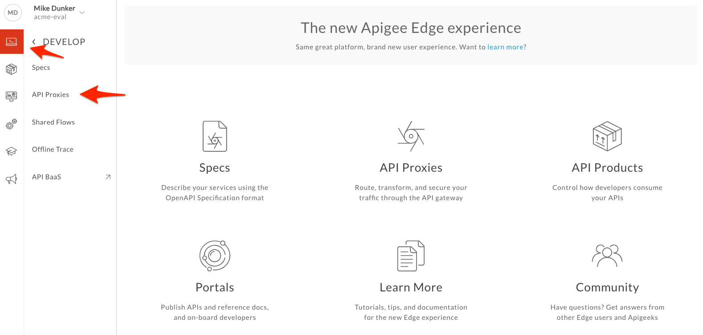
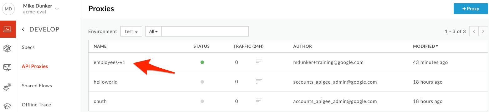
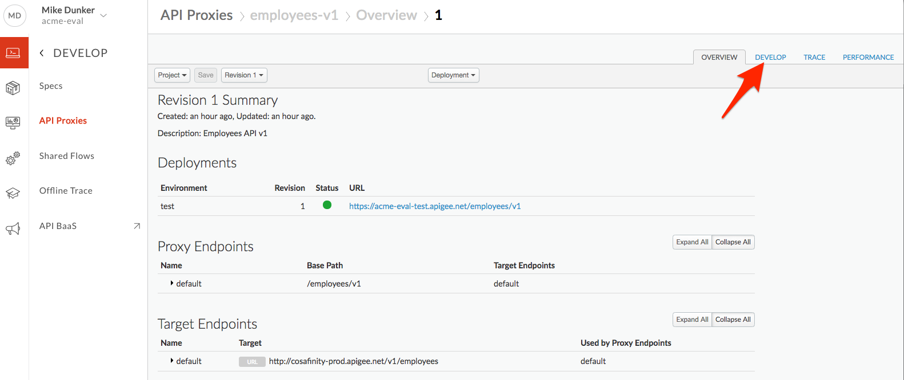
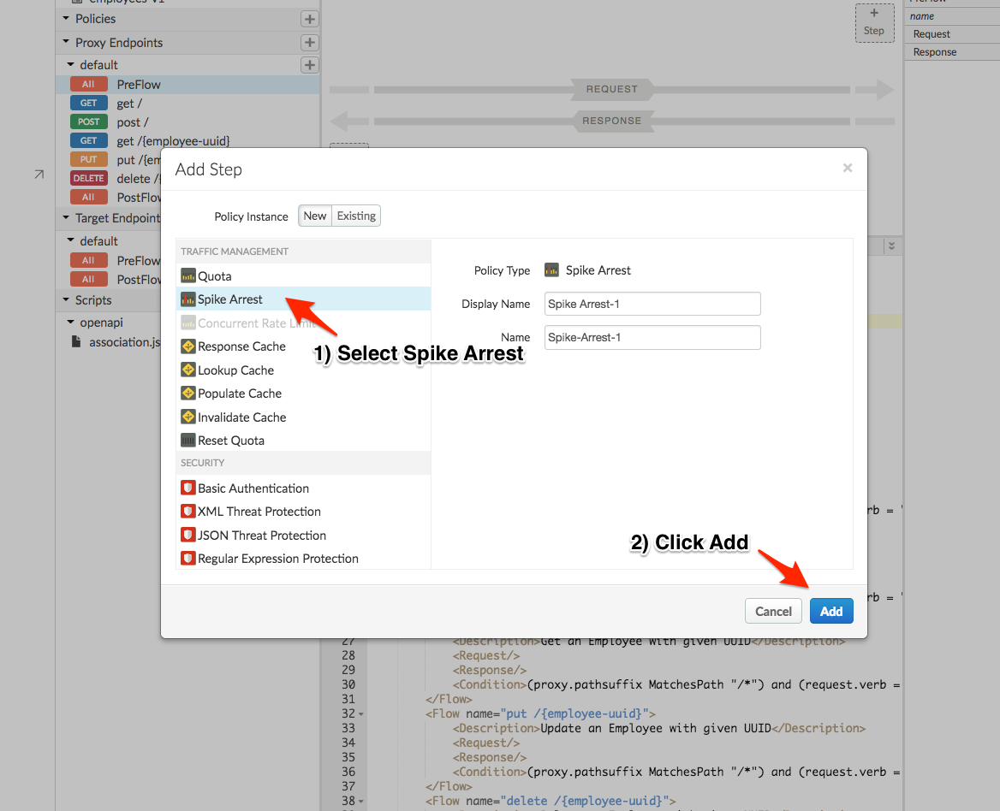
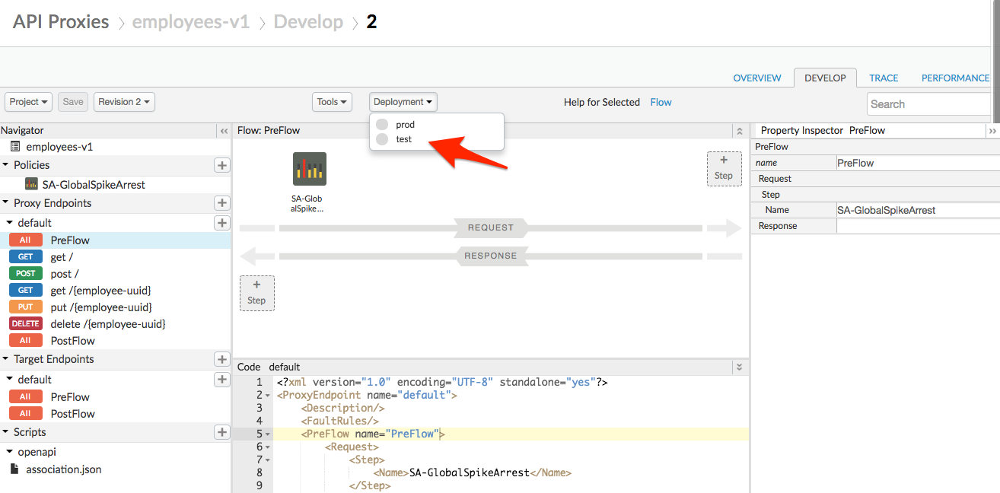

# Traffic Management : Throttle APIs 

*Duration : 20 mins*

*Persona : API Team / Security*

# Use case

You have a requirement to protect your target servers (backend) from traffic spikes. You would like to protect your APIs from denial of service attacks that might lead to performance lags or downtime of your backend.

# How can Apigee Edge help?

By exposing an API through Apigee Edge, you gain the ability to modify and monitor its behavior using out-of-the-box policies. Edge's out-of-the-box policies enable you to enhance your API with sophisticated features to control traffic, enhance performance, enforce security, and increase the utility of your APIs, without requiring you to write any code or to modify any backend services. Extension policies enable you to implement custom logic in the form of JavaScript, Java, and XSLT (although you cannot use Java in an evaluation org).

In this lab we will see how to use an out of the box traffic management policy, "Spike Arrest", to protect against traffic spikes. A Spike Arrest policy can throttle the number of requests processed by an API proxy and sent to a backend, protecting against performance lags and downtime.

# Pre-requisites

Apigee Edge API Proxy created in earlier lab exercise. If not, jump back to "API Design - Create a Reverse Proxy with OpenAPI specification" lab.

# Instructions

1. Go to [https://apigee.com/edge](https://apigee.com/edge) and log in. This is the Edge management UI. 

2. Select **Develop → API Proxies** in the side navigation menu.



3. Click on the **employees-v1** proxy that you created in earlier lab exercise.



4. Click on **Develop** tab to access API Proxy development dashboard.



5. Click on **PreFlow** under Proxy Endpoint default, Click on **+Step** on above the Request flow to attach a spike arrest policy.


6. Select **Spike Arrest Policy**. We can change the name and display name in this dialog, but let's leave it as the default. We'll change the name when we paste in new code for the spike arrest. Click on **Add** button to add spike arrest policy to proxy endpoint preflow request.



7. The Spike Arrest policy icon shows exactly where the policy is attached, and you can see the policy's XML configuration in the editor below.


8. Copy the code below into the editor, replacing the existing XML configuration for the policy.
```
<SpikeArrest continueOnError="false" enabled="true" name="SA-GlobalSpikeArrest">
    <Rate>12pm</Rate>
    <UseEffectiveCount>true</UseEffectiveCount>
</SpikeArrest>
```

You are removing extraneous fields and lines -- keeping the policy configuration as simple as possible is a best practice. Specifically, we have removed the async field from the first line (async field is deprecated), removed the display name (this can get out of sync), and changed the policy's name. The new policy name is SA-GlobalSpikeArrest. The "SA" indicates the policy type: Spike Arrest. The rest of the name, "GlobalSpikeArrest", indicates that this spike arrest is active for all traffic. This `{TypeAbbreviation}-{PolicyName}` naming convention is a recommended one.

Think of Spike Arrest as a way to protect against spikes of traffic, rather than as a way to limit traffic to a specific number of requests. Your APIs and backend can handle a certain amount of traffic, and the Spike Arrest policy helps you smooth traffic to avoid sending more traffic than can be safely handled.

The runtime Spike Arrest behavior differs from what you might expect to see from the literal per-minute or per-second values you enter.

For example, say you enter a rate of 6pm (6 requests per minute). You might think you could send 6 requests in 1 second, as long as they came within a minute. But that's not how the policy enforces the setting. If you think about it, 6 requests inside a 1-second period could be considered a mini spike in some environments.

What actually happens then? To prevent traffic spikes, Spike Arrest smooths the number of requests allowed by dividing your settings into smaller intervals:

* **Per-minute** rates get smoothed into requests allowed in intervals of **seconds**. For example, 6pm gets smoothed like this: 60 seconds (1 minute) / 6pm = 10-second intervals, or 1 request allowed every 10 seconds. A second request inside of 10 seconds will fail.

* **Per-second** rates get smoothed into requests allowed in intervals of **milliseconds**. For example, 10ps gets smoothed like this: 1000 milliseconds (1 second) / 10ps = 100-millisecond intervals, or 1 request allowed every 100 milliseconds. A second request inside of 100ms will fail.

9. Click on **Save** to save the API Proxy changes.


8. You should be prompted to create a new revision. This is because we changed the original name of the policy. If you are prompted to, click on *Save as new Revision*. 


9. Saving the proxy to the new revision did *not* cause this new version to be deployed. When you select the *Deployment* menu, you'll see that the proxy is not deployed to the test environment. **Deploy** the new revision to the *test* environment by selecting the test deployment.



*Congratulations!*...You have now secured your backend against traffic spikes, reducing chance of downtime or poor performance of your target servers.

## Test the API policy configuration

1. Let us test the updated API proxy using the Trace Console. Click on the **Trace** tab.


2. Click on **Start Trace Session** to see API Proxy with spike arrest in action.


3. Click on **Send** button multiple times, You will see 429 status code (Too Many Requests) when the spike arrest policy kicks in to protect target servers from the spike in traffic. Click around in the Transaction Map to see what information is available in the trace.


4. You might notice that the number of requests with a 200 response is higher or lower than you expect given the spike arrest rate configuration. This is because your org is deployed to multiple message processors (where the policies get executed), and each message processor keeps track of the time of the last request separately.

5. You can also use [Apigee Rest Client](https://apigee-restclient.appspot.com/) to test the spike arrest policy.


# Lab Video

If you like to learn by watching, here is a short video on using the Spike Arrest policy: [https://youtu.be/3Gi-GGTqllg](https://youtu.be/3Gi-GGTqllg)

# Earn Extra-points

Now that you have protected your backend against spikes in traffic, explore more about the spike arrest policy using the Apigee docs here: [https://docs.apigee.com/api-platform/reference/policies/spike-arrest-policy](https://docs.apigee.com/api-platform/reference/policies/spike-arrest-policy)

Experiment with the Identifier and MessageWeight configuration elements in your spike arrest policy.

# Quiz

1. Assume there is a single message processor, and the spike arrest rate limit is 2 per minute. How soon after receiving a request is the next request allowed?

2. Is it possible to implement spike arrest per developer or per app?

3. What does the Spike Arrest configuration field *UseEffectiveCount* do?

# Summary

That completes this hands-on lesson. In this simple lab you learned how to protect target servers against traffic spikes.

# References

* Useful Apigee documentation links on Traffic Management & Spike Arrest Policy  - 

    * Spike Arrest Policy - https://docs.apigee.com/api-platform/reference/policies/spike-arrest-policy

    * Rate Limiting - [https://docs.apigee.com/api-platform/develop/rate-limiting](https://docs.apigee.com/api-platform/develop/rate-limiting)

    * Comparing Rate Limiting Policies - [https://docs.apigee.com/api-platform/develop/comparing-quota-spike-arrest-and-concurrent-rate-limit-policies](https://docs.apigee.com/api-platform/develop/comparing-quota-spike-arrest-and-concurrent-rate-limit-policies) 

# Next step

Now go to [Lab-3](../Lab%203%20API%20Diagnostics%20-%20Trace%20tool)
