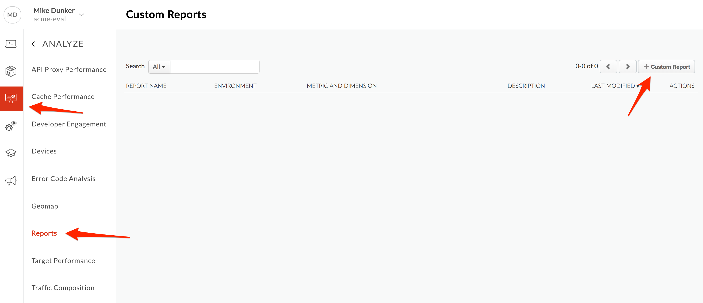
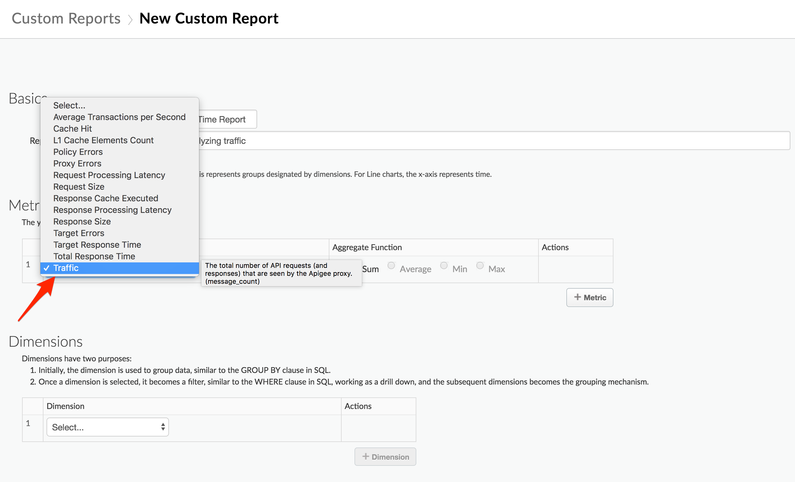
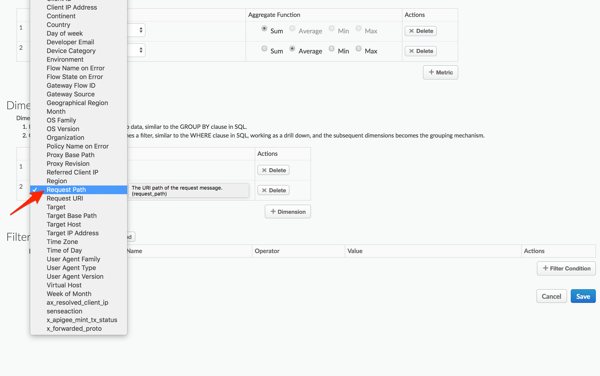
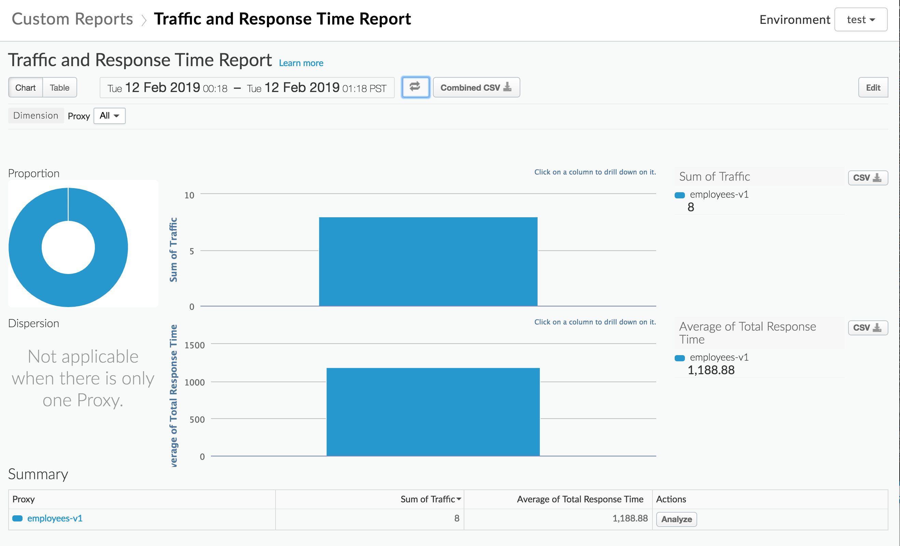
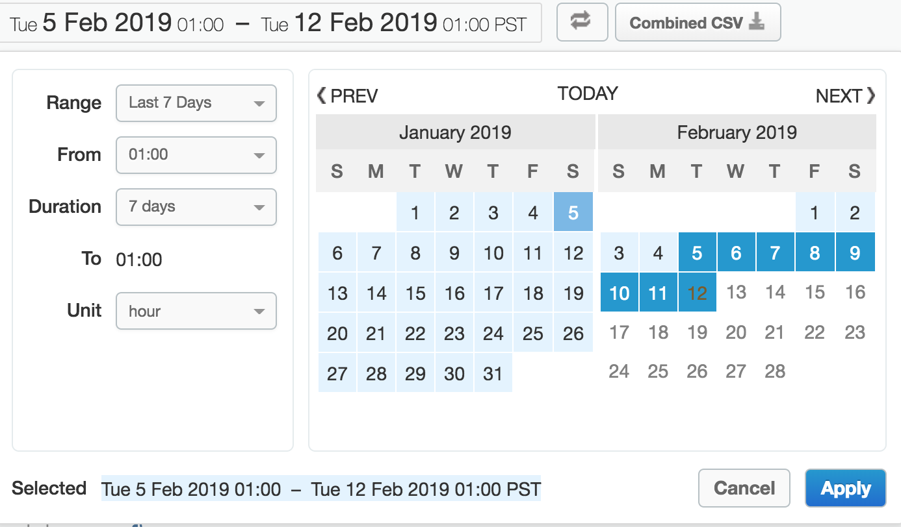

# API Analytics : Custom Reporting

*Duration : 20 mins*

*Persona : API Team*

# Use case

Let's say your API has gained wide adoption. It's popular. You have attracted a number of talented, creative app developers and people are downloading and installing their apps. The API team is very interested in how the API is performing, how it's being used, and how to plan for improvements. 

# How can Apigee Edge help?

Apigee Edge Analytics Services collects and analyzes a wealth of information associated with your APIs. This information is gathered, analyzed, and provided to you in near-real time. In this lab we will see how you can extend the Edge analytics services by create custom dimensions and metrics and use them in custom reports.

**Custom Reports** 

There are several out-of-the-box, standard reports that are automatically provided for every Edge organization. They track several critical operational metrics, such as proxy response time, target response time, cache performance, and error rates. An API publisher can create custom reports to augment the standard reports. By adding custom reports, you can create a set of charts that provide insight into the exact aspects of your API program that you wish to analyze.

In this lab, you will create a custom report to provide insight into the consumption of your APIs.

# Pre-requisites

* An existing API proxy created in Apigee Edge.

* Traffic to API Proxy.

# Instructions

## Navigate to the Analytics section of Edge

1. Go to [https://apigee.com/edge](https://apigee.com/edge) and log in. This is the Edge management UI. 

2. Select **Analyze → Reports** in the side navigation menu.

## Creating a Custom Report

1. Click **+Custom Report**.

2. Enter the **Report Name** and **Report Description**. Select a chart type, **Column**. This is the style of chart that will be used to present your custom analytic data.

3. In the Metrics sections, choose the metric that you wish to analyze. Select **Traffic** as the metric. See [Analytics Metrics, Dimensions, and Filters Reference](https://docs.apigee.com/api-platform/analytics/analytics-reference.html) for a description of each metric.

4. Select an **Aggregate Function** that you want applied to the data for the first metric. You can select an aggregation function to display the *Sum*, *Average*, *Min*, or *Max* values. Select **Sum** as the Aggregate Function. You'll also add another metric. Click **+Metric** to add an additional metric. 

5. Select **Total Response Time** as the metric and **Average** as the Aggregate Function.

6. Click on the **Dimension** dropdown and select **Proxy**. Every dimension you add (by clicking **+Dimension**) constrains the data set used to generate the reports. In effect, you're presenting more and more specific data with each drill down. Click **+Dimension** to add another dimension.

7. Add an additional **Dimension** for **Request Path**.

8. You can further narrow the data displayed by adding filters to your report definition. 
In the **Filter** section of the page, click **+Filter Condition**. 
Select **Proxy** as the entity you want to filter on, select **=** as the **Operator** and set the **Value** to your API Proxy name (employees-v1). Click on the check button to save this filter.

9. Click **Advanced** to see the corresponding filter string. You can also edit this string directly. Click **Save**. 

## Viewing a Custom Report

Once you have saved the **Custom Report** you can view it immediately. You should see something similar to the following:

*Note: Data delay interval - After API calls are made to proxies, it takes about **10 minutes** for the data to appear in dashboards, custom reports, and management API calls.*

If no data is returned, verify that the timeframe of the **Custom Report** matches a timeframe where traffic was being sent to the API.

Also, verify that the appropriate **Environment** (in this case *test*) has been selected on the top right dropdown.

## Drilldown dimensions

You can select from a large number of custom drilldown dimensions. Drilldown dimensions let you specify which dimensions to measure in your custom report. Apigee Edge Analytics collects data on a wide range of dimensions. And, you can also select any custom dimensions that have been created in your organization. See [Analytics reference](http://docs.apigee.com/analytics-services/reference/analytics-reference).

To drill down into the custom report you just created, click on the name of your **Proxy** under the **Summary** on the bottom of the report.

You should now be able to view a drill-down into the **Request Path** dimension for your **API Proxy**.

## Editing and deleting your reports

When you've completed building your custom report, the data is populated immediately. The graph is defaulted to plot the first metric you chose for the tab in your custom report. If you want to see different metrics, or compare them against each other, follow these steps:

1. Click the report name to view the graphs of the selected report.

2. Click the Edit button to edit the display name, dimensions, and measures.

3. Click **Save**.

You also have the option to delete a report by clicking the **Delete** button.

# Lab Video

If you like to learn by watching, [here](https://youtu.be/p91de5WkR98) is a short video on creating a custom report.

# Earn Extra-points

You can extend the Edge analytics services by using the Statistics collector policy to extend custom dimensions and metrics for use in Custom reports. 

The **Statistics Collector** policy enables you to collect custom statistics for data in a request/response, such as product ID, price, etc. The data can come from flow variables predefined by Apigee or custom variables that you define. The statistics data is passed to the analytics server, which analyzes the statistics and generates reports. You can view the reports by using the Edge management UI or Edge API.

# Quiz

1. What is the difference between a dimension and a metric?

2. What happens when you drill down into additional dimensions?

# Summary

In this exercise, you learned about custom reports in Apigee Edge. You also added the custom report along with other reports to a custom dashboard. Please visit the documentation to see the different kinds of operational reports and dashboards that are available to you.

# References

* Useful Apigee documentation links on API Analytics - 

    * Apigee Analytics dashboards documentation [http://docs.apigee.com/analytics-services/content/analytics-dashboards](http://docs.apigee.com/analytics-services/content/analytics-dashboards)

    * Analytics Best Practices
    [https://apigee.com/about/blog/digital-business/api-best-practices-analytics](https://apigee.com/about/blog/digital-business/api-best-practices-analytics)

    * Watch this 4 minute video on "Custom Reports using Apigee Edge Analytics" - [https://youtu.be/lTcuc2so4oI](https://youtu.be/lTcuc2so4oI)

# Next step

Congratulations on completing this Apigee API Jam! Continue learning about Apigee with the [Apigee Learning Guide](https://apigeek.page.link/learning-guide) on [Apigee Community](https://community.apigee.com).

