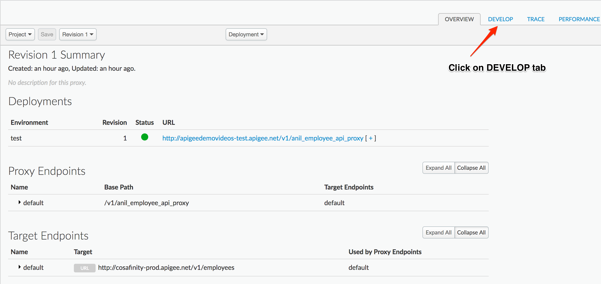
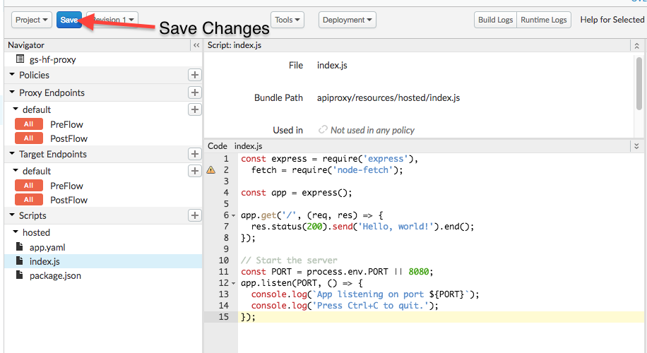

# API Development : Hosted Targets : Doing more and Orchestration

*Duration : 20 mins*

*Persona : API Developer*

# Use case

One main use case for switching to code instead of policies is if you know that you want to execute callouts in parallel and then combine the outputs creatively. In this lab we're going to start by adding some new functionality to our script (weather lookup) and then we'll combine the driving instructions and routes including arrival time so that our weather is returned in proper context.

# Pre-requisites

* Basic understanding of [node.js](https://nodejs.org/en/) (Serverside Javascript)

# Instructions

## Add a weather lookup function

1. Our function is great for routing information but let's extend it now by adding the ability to lookup weather from a different provider entirely (yahoo). Let's click back on develop.


2. Now click on the `index.js` file from the scripts pane in the lower left hand corner.


3. Now update the script with the following:
```javascript
const express = require('express'),
  fetch = require('node-fetch'),
  key = require('./mapquestKey');

const app = express();
//const routeURL = 'http://maps.googleapis.com/maps/api/directions/json';
const routeURL = 'https://www.mapquestapi.com/directions/v2/route';
const yqlURL = 'https://query.yahooapis.com/v1/public/yql?format=json&env=store%3A%2F%2Fdatatables.org%2Falltableswithkeys';
const weatherQuery = 'select * from weather.forecast where woeid in (select woeid from geo.places(1) where text="@LOCATION@")';


/*
 * Fetch routing info passed in as query parameters
 */
function getRoute(from,to)  {
  let url = `${routeURL}?from=${from}&to=${to}&key=${key.key}`;
  console.log('About to fetch: ', url);
  return fetch( url )
    .then( d => d.json() )
    //.then( route => route.routes[0].legs[0] )
    .then( route => route.route.legs[0] )
}

/*
 * Fetch weather info for the given location
 */
function getWeather(location)  {
  let query = encodeURIComponent( weatherQuery.replace('@LOCATION@',location) );
  let url = `${yqlURL}&q=${query}`;
  console.log('About to fetch weather: ', url);
  return fetch( url )
    .then( d => d.json() )
}

app.get('/', (req, res) => {
  res.status(200).send('Hello, world!').end();
});

app.get('/weather/:location', (req, res) => {
  getWeather(  req.params.location ) 
    .then( d => {
      res.status(200).json(d).end();
    });
});

app.get('/route', (req, res) => {
  getRoute( req.param('from'), req.param('to') ) 
    .then( d => {
      res.status(200).json(d).end();
    });
});

// Start the server
const PORT = process.env.PORT || 8080;
app.listen(PORT, () => {
  console.log(`App listening on port ${PORT}`);
  console.log('Press Ctrl+C to quit.');
});

```

4. Save the script which will deploy it to the hosted targets backend


5. Test it by using the new route and sending in a location `https://apigee-hf-testing-test.apigee.net/gs-hf-proxy/weather/Austin%2CTX%2CUSA`

What we've done in this latest version is add a new function called `getWeather` and an associated expressjs route that accepts a path paramter: `:location`. This tells express to populate a variable in the req.params object with whatever is sent in after `/weather/`. In this way we can pull off the location from URL path directly and use it dynamically in our API development. The getWeather function reuses logic we already saw in the last lab. It takes the location and using a promise makes an API call that looks up the weather. It's using a fancy yahoo api that relies on an SQL-like interface but all we're really doing here is some basic string parsing.

Using this same technique you could write your own endpoints that grab variable information off the path just like we've done here.

## Add weather lookup to our routing API

It would be really nice if we could not only lookup driving directions but retrieve the weather for our trip so that we knew what the weather conditions would be when we start and end. Now that we have a function for looking up weather lets use this function inside of our routes lookup.

To do this efficiently we're going to use an additional promise library called: Bluebird. Bluebird makes it simple for us to orchestrate several calls and then retrieve the data from them all separately so that we can handle the processing.

1. Let's click back on develop.


2. Now click on the `index.js` file from the scripts pane in the lower left hand corner.


3. Now update the script with the following:
```javascript
const express = require('express'),
  Promise = require('bluebird'),
  fetch = require('node-fetch'),
  key = require('./mapquestKey');

const app = express();
//const routeURL = 'http://maps.googleapis.com/maps/api/directions/json';
const routeURL = 'https://www.mapquestapi.com/directions/v2/route';
const yqlURL = 'https://query.yahooapis.com/v1/public/yql?format=json&env=store%3A%2F%2Fdatatables.org%2Falltableswithkeys';
const weatherQuery = 'select * from weather.forecast where woeid in (select woeid from geo.places(1) where text="@LOCATION@") and u="c"';


/*
 * Fetch routing info passed in as query parameters
 */
function getRoute(from,to)  {
  let url = `${routeURL}?from=${from}&to=${to}&key=${key.key}`;
  console.log('About to fetch: ', url);
  return fetch( url )
    .then( d => d.json() )
    //.then( route => route.routes[0].legs[0] )
    .then( route => route.route.legs[0] )
}

/*
 * Fetch weather info for the given location
 */
function getWeather(location)  {
  let query = encodeURIComponent( weatherQuery.replace('@LOCATION@',location) );
  let url = `${yqlURL}&q=${query}`;
  console.log('About to fetch weather: ', url);
  return fetch( url )
    .then( d => d.json() )
}

app.get('/', (req, res) => {
  res.status(200).send('Hello, world!').end();
});

app.get('/weather/:location', (req, res) => {
  getWeather(  req.params.location ) 
    .then( d => {
      res.status(200).json(d).end();
    });
});

app.get('/route', (req, res) => {
  Promise.join(
    getWeather( req.param('from') ),
    getWeather( req.param('to') ),
    getRoute( req.param('from'), req.param('to') ),
    (wFrom,wTo,route) => {
      route.startWeather = wFrom.query.results.channel.item.condition;
      route.endWeather = wTo.query.results.channel.item.condition;
      return route;
    })
    .then( d => {
      res.status(200).json(d).end();

    });
});

// Start the server
const PORT = process.env.PORT || 8080;
app.listen(PORT, () => {
  console.log(`App listening on port ${PORT}`);
  console.log('Press Ctrl+C to quit.');
});

```

This time we've upated the `/route` endpoint with a `Promise.join`. The join lets us run three separate function calls (which in turn make their own outbound api calls) which are executed in parallel. Then it takes the results of those three calls and passes it to that last fat arrow function that starts with `(wFrom,wTo,route) => {`. As you can see we've simply passed the responses from those three separate calls into a single function where we can combine them into a new response. With that done the promise chain continues and returns the new javascript object containing two new attributes that we've added: startWeather and endWeather.

## Using time for better weather handling

Now we're getting real responses, but what if our trip is going to take a couple of days. The weather for my destination may not be the same once I arrive as it is right now. The responses from the routing service include some data for duration of the trip. The weather data also includes a forecast for the next several days. Let's combine these two so that we can set the endWeather attribute so that it gives the best possible data based on what we've selected here so far.

1. Let's click back on develop.


2. Now click on the `index.js` file from the scripts pane in the lower left hand corner.


3. Now update the script with the following:
```javascript
const express = require('express'),
  Promise = require('bluebird'),
  fetch = require('node-fetch'),
  key = require('./mapquestKey');

const app = express();
//const routeURL = 'http://maps.googleapis.com/maps/api/directions/json';
const routeURL = 'https://www.mapquestapi.com/directions/v2/route';
const yqlURL = 'https://query.yahooapis.com/v1/public/yql?format=json&env=store%3A%2F%2Fdatatables.org%2Falltableswithkeys';
const weatherQuery = 'select * from weather.forecast where woeid in (select woeid from geo.places(1) where text="@LOCATION@") and u="c"';


/*
 * Fetch routing info passed in as query parameters
 */
function getRoute(from,to)  {
  let url = `${routeURL}?from=${from}&to=${to}&key=${key.key}`;
  console.log('About to fetch: ', url);
  return fetch( url )
    .then( d => d.json() )
    //.then( route => route.routes[0].legs[0] )
    .then( route => route.route.legs[0] )
}

/*
 * Fetch weather info for the given location
 */
function getWeather(location)  {
  let query = encodeURIComponent( weatherQuery.replace('@LOCATION@',location) );
  let url = `${yqlURL}&q=${query}`;
  console.log('About to fetch weather: ', url);
  return fetch( url )
    .then( d => d.json() )
    .then( d => {
      console.log('got this: %j', d);
      return d;
    } )
    .catch( e => {
      console.error('We received an error and stuff: %s', e.stack );
    } )
}

/*
 * Using the forecast array and arrival date we return that day or null
 * if nothing is found.
 */
function getWeatherForDate( forecast, date ) {
  let arrivalConditions = null;
  forecast.forEach( f => {
    let d = new Date( f.date ).getTime();
    let diff = date - d;
    if ( (diff > 0) && diff < (24*60*60*1000) )  {
      console.log('compared %s with %s', (date-d), (24*60*60*1000));
      arrivalConditions = f;
    }
  })
  return arrivalConditions;
}

app.get('/', (req, res) => {
  res.status(200).send('Hello, world!').end();
});

app.get('/weather/:location', (req, res) => {
  getWeather(  req.params.location ) 
    .then( d => {
      res.status(200).json(d).end();
    });
});

app.get('/route', (req, res) => {
  Promise.join(
    getWeather( req.param('from') ),
    getWeather( req.param('to') ),
    getRoute( req.param('from'), req.param('to') ),
    (wFrom,wTo,route) => {
      let totalSeconds = ( 
        (route.formattedTime.split(':')[0] * 60 *60) + 
        (route.formattedTime.split(':')[1] * 60) + 
        (route.formattedTime.split(':')[2] ) 
      );
      route.startWeather = wFrom.query.results.channel.item.condition;
      route.endWeather = getWeatherForDate( wTo.query.results.channel.item.forecast,
        new Date().getTime() + totalSeconds )
      return route;
    })
    .then( d => {
      res.status(200).json(d).end();

    });
});

// Start the server
const PORT = process.env.PORT || 8080;
app.listen(PORT, () => {
  console.log(`App listening on port ${PORT}`);
  console.log('Press Ctrl+C to quit.');
});

```

What we've added here is a `weatherForDate` function which is using the duration plus the current time and associating it with the forecast data in order to return the weather that's most likely correct (we're doing some simple math to see if it's within the last 24 hours).


# Quiz


# Summary

That completes this hands-on lesson. In this simple lab you learned how to do hosted targets development on your local machine and then you leanred that you could take that same script and move it directly to your running proxy.

# References

* TBD ... we don't have anything to link here yet


# Rate this lab

How did you like this lab? Rate .. to be filled in later
