# API Development : Using Routing Rules for Multiple Backends

*Duration : 30 mins*

*Persona : API Team*

# Use case

It's common for large companies to have multiple backend systems that provide duplicate functionality for certain sets of data. A common example is a company that, usually through mergers and acquisitions, has multiple customer, contract, or ordering systems. From an API perspective, it's desirable to mask the routing complexity from the end API consumer to make it appear as though the organization has single unified API for a given business function or data type. Therefore, it's helpful to have a way to conditionally route a request to a paticular backend based on information in the request.

# How can Apigee Edge help?

Apigee Edge provides a construct known as a *Routing Rule* which allows API developers to include conditional logic and multiple backend target endpoint definitions for a single API Proxy. In this lab, we will examine the steps required to implement Routing Rules inside of Apigee Edge.

# Context

In this lab, we'll build a branch finder for a fictional banking company. We will be working with two APIs that both return branch locations based on zip code. The first API returns exclusively bank branches located in Canada. The other returns branches in the US. 

The Canadian API is located here: `https://findemo-168618.appspot.com/can/branches`

The US API is located here: `https://findemo-168618.appspot.com/us/branches`

Instead of making the API consumers keep track of which API to use, we'll create a single API and route between the two backends. Canadian zip codes and US zip codes can be differentiated by evaluating their structure and seeing if it matches a regex pattern. US zip codes will be identified by five numeric digits while Canadian zip codes will match the pattern of letter, number, letter, space, number, letter, number. For example, a US zip code will be something like "43210" and a Canadian zip code will be something like "A1A 1A1".

When a request comes into our API proxy, we will first make sure that a zip code has been supplied. If it matches the pattern of a US zip code, we will route it to the US backend. If it matches the pattern of a Canadian zip code, we will route it to the Canadian backend. If it matches neither, we'll skip the request and return an empty JSON array.

# Pre-requisites

None

# Instructions

* Go to [https://apigee.com/edge](https://apigee.com/edge) and log in. This is the Edge management UI. 

## Create a new API Proxy

* Open the Develop Menu from the left hand side navigation bar then click on the API Proxies menu item.


* Click on the +Proxy button in the upper right corner of the API proxy list panel

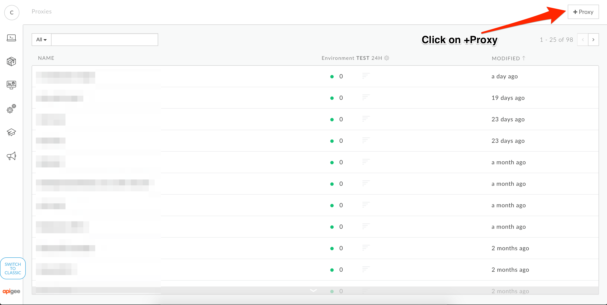

* In the new proxy creation wizard, select the Reverse Proxy option and then click on Next


* Enter values for Proxy Name, Proxy Base Path and Existing API. Click Next.


```
Proxy Name: {your initials}-branches
Proxy Base Path: /{your initials}-branches
Existing API: https://findemo-168618.appspot.com/can/branches
```

* Select the pass through option for Authorization then click Next.

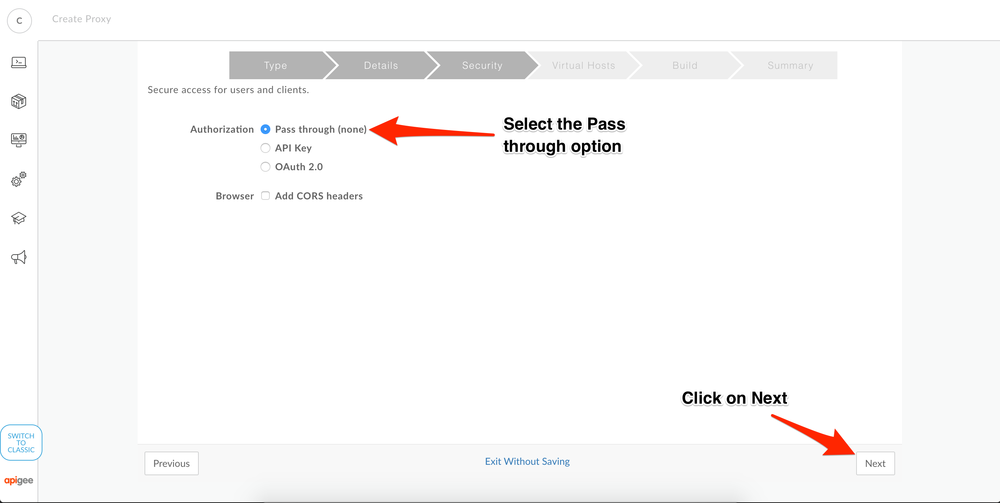

* Accept all the default values for the Virtual Host configuration then click Next.


* Accept all the default values for the final configuration confirmation, then click Next.

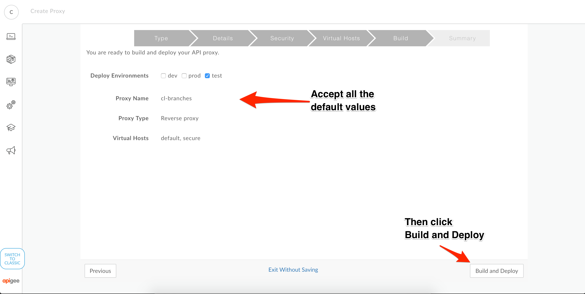

* When the confirmation displays, click on the proxy name link to open a detailed view of your API proxy.


## Make a test call to the API

* From the API Overview, click on the URL link. This should open up a list of bank branches from Canada. Once you've verified your API Proxy is working, click on the Develop tab to open the proxy editor. 


## Add the US Target Endpoint

* On the Proxy Editor, click on the *default* Target Endpoint

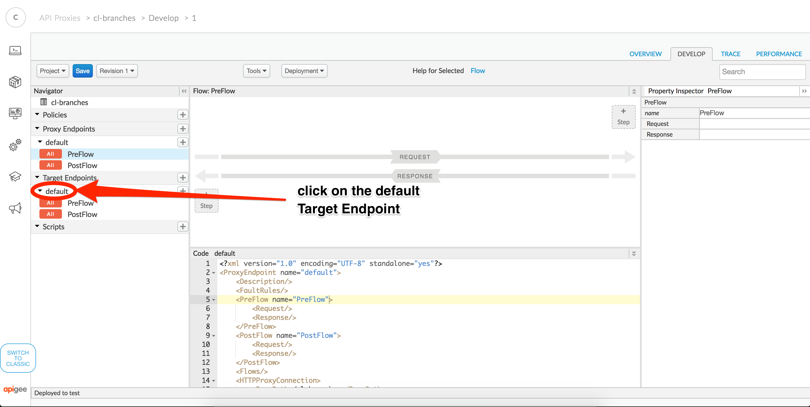

* In the XML definition, change the name attribute name on the default TargetEndpoint from *default* to *canada*

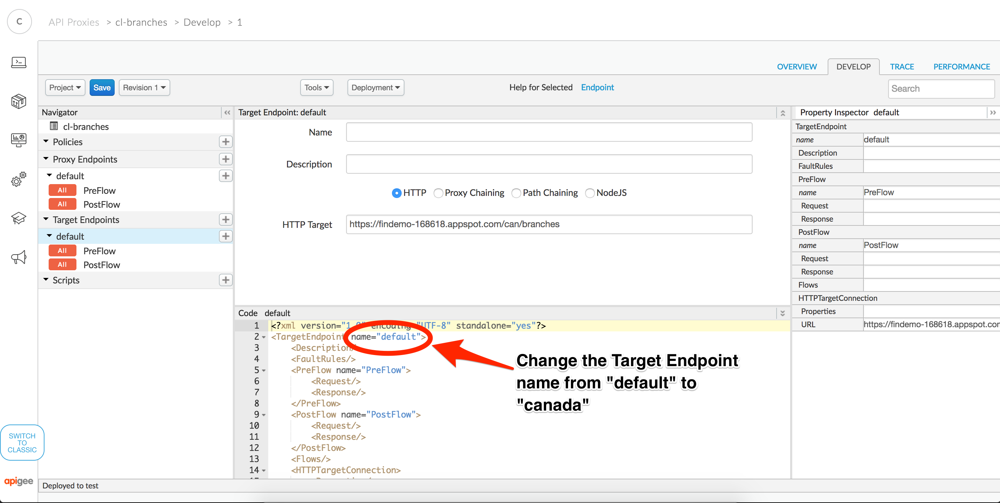

* Click on the + button next to Target Endpoints to create a new target endpoint


* Enter details for the US branch API endpoint


```
Target Endpoint Name: usa
HTTP Target: https://findemo-168618.appspot.com/us/branches
```

* Click on the Save button to bring up the save API proxy dialog


* Click on the *Save as New Revision* button on the Save dialog

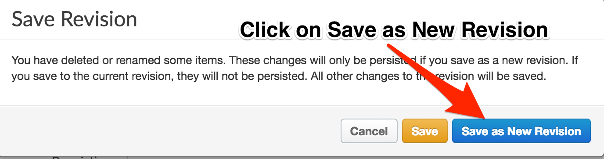

* Click on +Step on the Request pipeline to add a new policy

## Add validation for missing zip codes

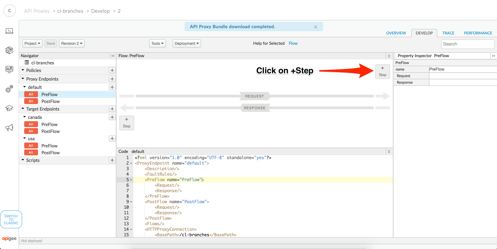

* Scroll down and select the Raise Fault policy and enter a display name of *Missing Zip Code*, this will automatically populate the Name field to *Missing-Zip-Code*


* Click on the Missing Zip Code policy to open up the XML policy definition in the editor pane. Replace the XML definition with the one provided below.


```
<?xml version="1.0" encoding="UTF-8" standalone="yes"?>
<RaiseFault async="false" continueOnError="false" enabled="true" name="Missing-Zip-Code">
    <DisplayName>Missing Zip Code</DisplayName>
    <Properties/>
    <FaultResponse>
        <Set>
            <Payload contentType="text/plain">Missing required query parameter: zipcode</Payload>
            <StatusCode>400</StatusCode>
            <ReasonPhrase>Bad Request</ReasonPhrase>
        </Set>
    </FaultResponse>
    <IgnoreUnresolvedVariables>true</IgnoreUnresolvedVariables>
</RaiseFault>
```

* Click on the *default* Proxy Endpoint


* Add a condition to only raise a fault if the zipcode query parameter wasn't supplied in the API request. Once the condition is added, click on the Save button.


* Once the API has been saved, click on the Deployment drop down menu and select the test option. Note that in the image below there is a dev environment, this will very likely not be present in your organization.


* When the deployment dialog displays, click on the Deploy button.


* Click on the Overview tab

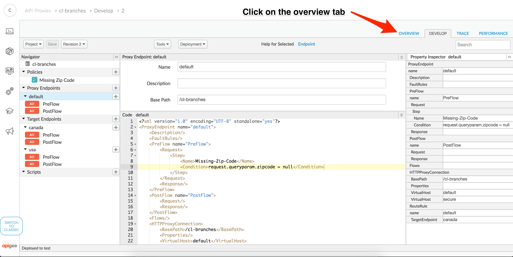

* Click on the API URL to verify the condition is working. If everything is working correctly, you will see a message indicating: `Missing required query parameter: zipcode`


## Add Routing Rules for US vs Canadian Zip Codes

* After verifying the validation is working, click on the Develop tab to open the proxy editor. 

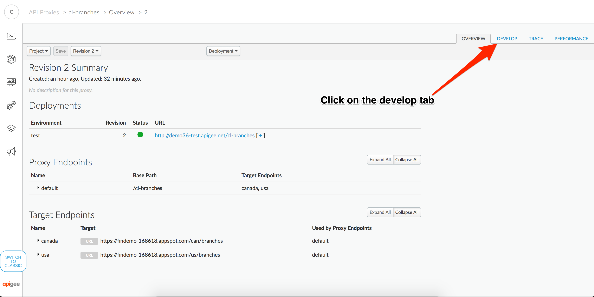

* In the Proxy Editor, click on the default Proxy Endpoint and scroll down to the bottom of the XML. Add in the Route Rule for the USA endpoint and conditions to route to the correct target based on the structure of the zip code query parameter.


```
    <RouteRule name="default">
        <TargetEndpoint>canada</TargetEndpoint>
        <Condition>request.queryparam.zipcode JavaRegex "[a-zA-Z]\d[a-zA-Z] \d[a-zA-Z]\d"</Condition>
    </RouteRule>
    <RouteRule name="usa">
        <TargetEndpoint>usa</TargetEndpoint>
        <Condition>request.queryparam.zipcode JavaRegex "\d{5}"</Condition>
    </RouteRule>
```

* After the confirmation appears that your API Proxy has been saved, click on the Trace tab.


## Use Trace to Verify Routing is Working

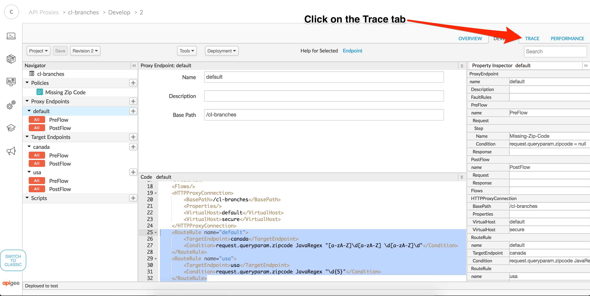

* Click on the Start Trace Session button

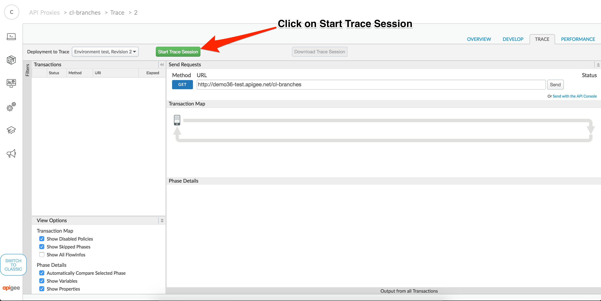

* Add a query parameter called zipcode with a value of 70909: `?zipcode=70909`


* Now make another API call using a Canadian zip code value: `?zipcode=S1C 9P7` *Note that you will need to make this request outside the trace window due to limitations in sending query params with whitespace.*

* Verify using Trace that your route rules are correctly sending Canadian zip codes to the Canadian endpoint and that US zip codes to the USA endpoint.

If you successfully retrieve both branches when supplying a Canadian and a US zip code, Congratulations! You have successfully configured conditional routing rules and have completed the main instructions for this lab.

# Lab Video

[Routing Rules Video](https://www.youtube.com/watch?v=elnCVKVM9yU&list=PLIXjuPlujxxxe3iTmLtgfIBgpMo7iD7fk&index=15)

# Earn Extra Points

* The current configuration does not route appropriately in the case that a zip code does not conform to a US or Canadian zip code. For instance, if you send a value of `?zipcode=ABC123` no route rules are matched. Start a trace session and see what happens when you send this value. Add in the necessary logic to your API Proxy to return an empty JSON array when an invalid zip code is provided.

# Quiz

* What is a Route Rule, how is it used in Apigee Edge?

* What is the relationship between a Route Rule and a Target Endpoint in an API Proxy?

* What are some other scenarios where Route Rules could be beneficial?

# Summary

This lab demonstrates how to use route rules to conditionally route an API request to multiple backends based on some aspect of the incoming request. By applying Route Rules you can use Apigee Edge to provide a single facade to create a more usable API for your consumers.

# References

[Route Rules Documentation](http://docs.apigee.com/api-services/content/understanding-routes)

[Routing Rules Tutorial](https://www.youtube.com/watch?v=elnCVKVM9yU&list=PLIXjuPlujxxxe3iTmLtgfIBgpMo7iD7fk&index=15)

