# API Development : Externalize Target URLs using Target Servers

*Duration : 20 mins*

*Persona : API Team*

# Use case

Backend target URLs often change as an API is promoted from development through testing and finally into production. The ability to externalize these endpoints ensures you can take your API configuration and promote it through your SDLC without making manual changes as part of your deployment/promotion process.

# How can Apigee Edge help?

Apigee Edge includes the ability to externalize your backend target URL through a concept known as *Target Servers*. Target Servers are configured for each environment and allow you to replace a static target URL in your API Proxy definition with a named target server that is automatically replaced at runtime. 

# Pre-requisites

None

# Instructions

* Go to [https://apigee.com/edge](https://apigee.com/edge) and log in. This is the Edge management UI. 

* On the left hand menu, navigate to *Admin->Environments*:

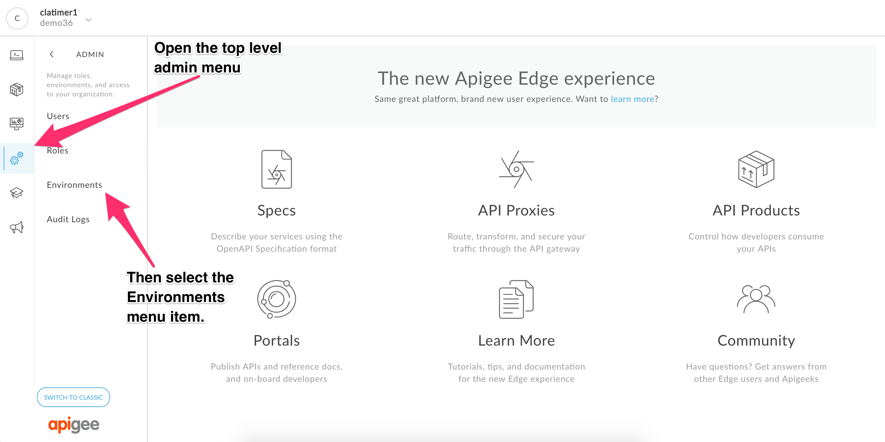

* In the Environments Configuration page, select the Target Servers tab:


* Click on the Edit button in the top right corner of the target servers tab

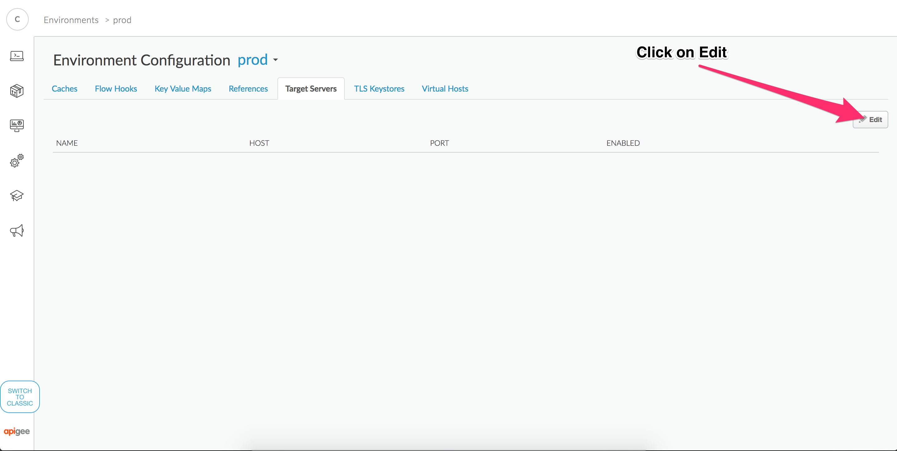

* Click on the *+Target Server* button to add a new target server

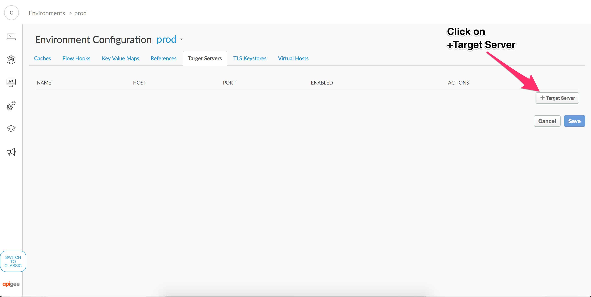

* Making sure the prod environment is selected, enter the following values for your production target server, then save your configuration:

Name: {your-initials}-employees-service

Host: cosafinity-prod.apigee.net

Port: 80

Enabled: checked

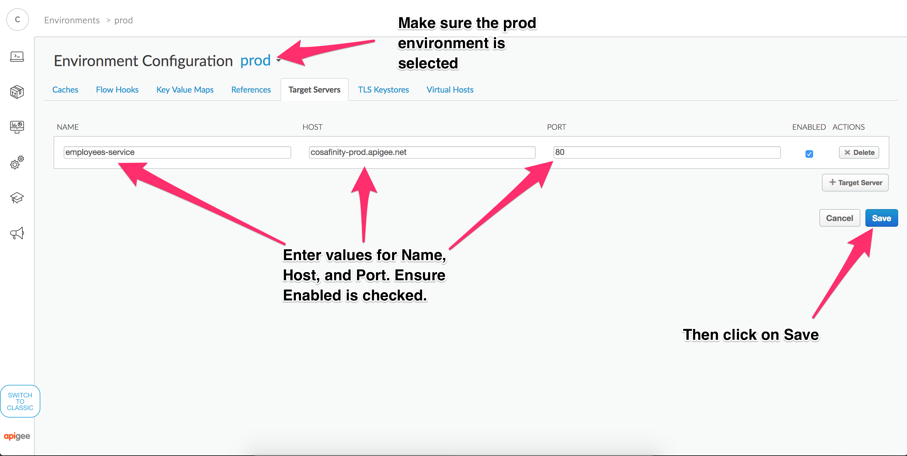

You should see a message indicating your target server was created successfully and your new target server should be displayed on the sreen.

* Using the environment drop down, change to the *test* environment:

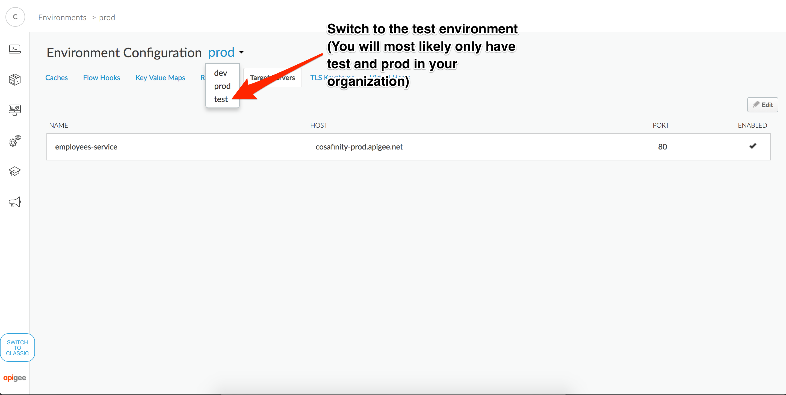

* Click on the Edit button in the top right corner of the target servers tab


* Click on the *+Target Server+ button to add a new target server


* Making sure the test environment is selected, enter the following values for your test target server then save your configuration:

Name: {your-initials}-employees-service

Host: cosafinity-test.apigee.net

Port: 80

Enabled: checked

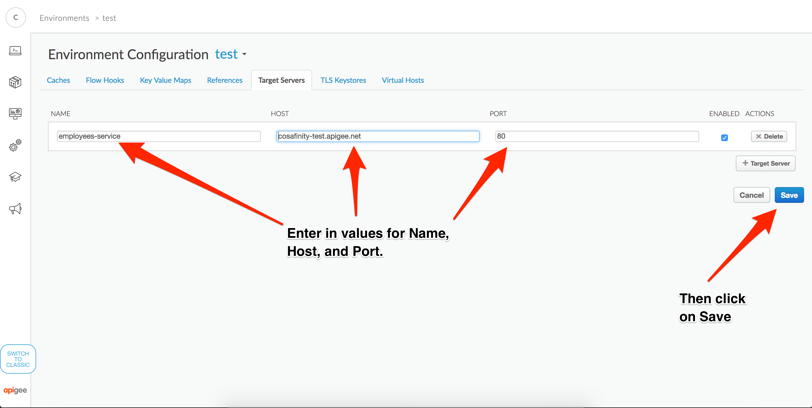

At this point we now have created our target server for the *Employees Service* in both the test and prod environments. Our next task will be configuring a proxy that uses the named target servers.

* Navigate to the API Proxies list view:


* Click on +API Proxy to create a new API Proxy

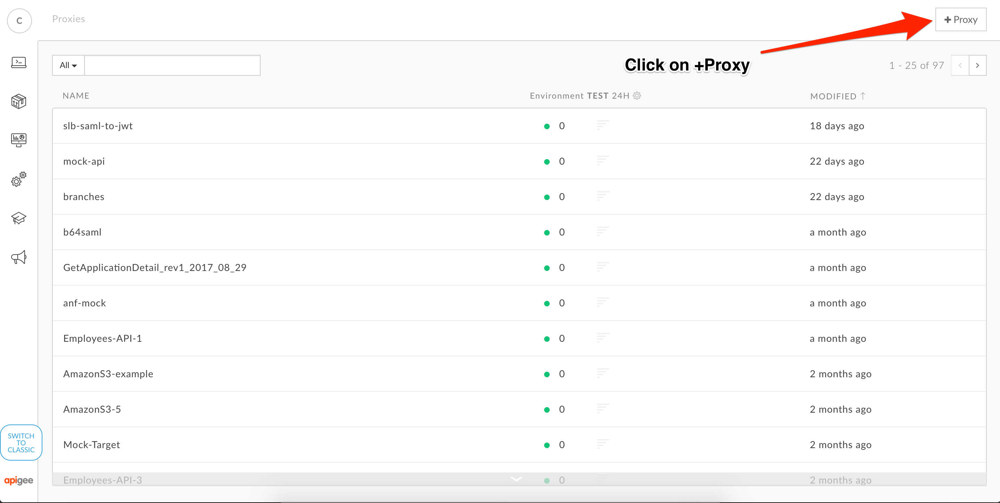

* Select the Reverse Proxy option then click on Next


* Configure your API Proxy as shown in the following diagram:


* Select the Pass Through option for Authorization

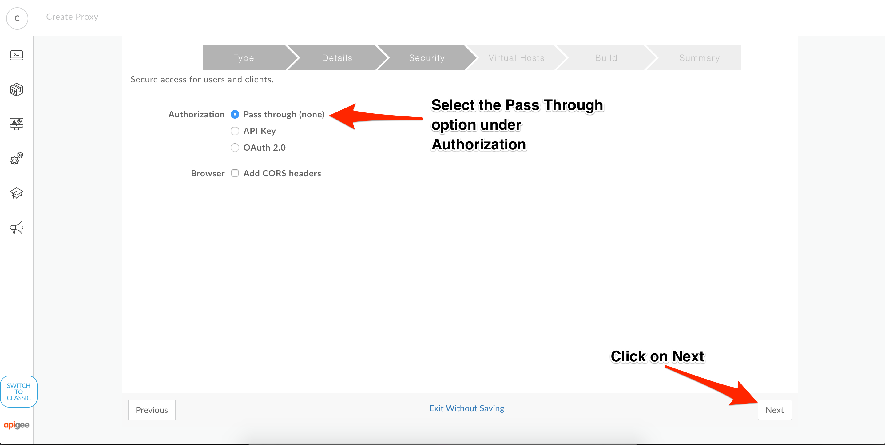

* Select the default options for virtual host bindings:

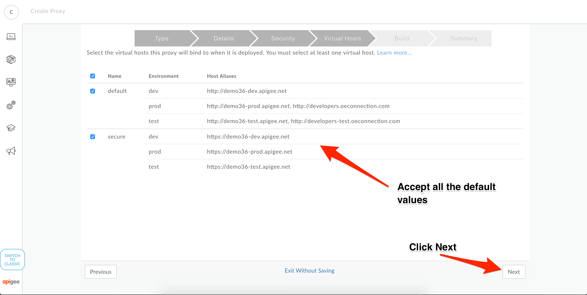

* Select the default options for deployment options


* Once you get confirmation your proxy was successfully created, click on the provided link to open your API Proxy


* Once you arrive on the Overview page for your new proxy, click on the develop tab.


* In the develop tab, select the *default* Target Connection from the left hand pane. Scroll down to the bottom of the XML configuration until you see a tag labeled `HTTPTargetConnection`:

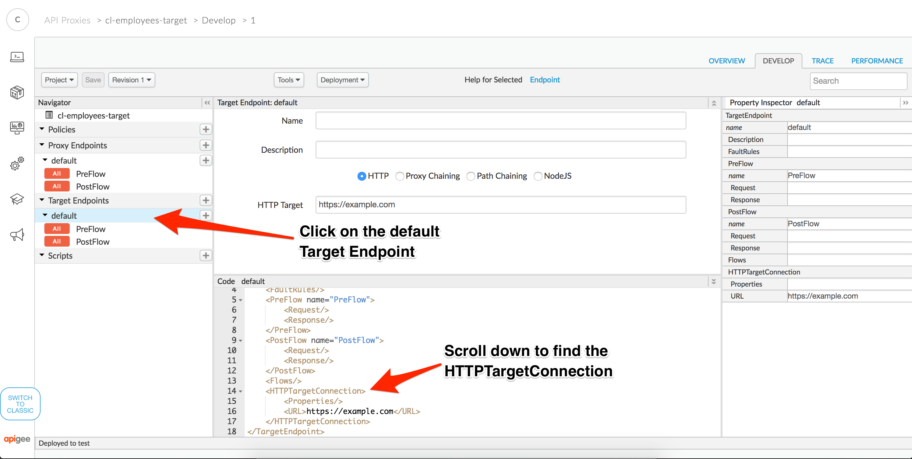

* Modify the `HTTPTargetConnection` to use a Load Balancer configuration as shown below. You can copy and paste the configuration provided below the image, making sure to replace {your-initials} with your actual initials. Click Save to save the proxy changes.


You can copy/paste the following configuration for your `HTTPTargetConnection`:

```
  <HTTPTargetConnection>
    <LoadBalancer>
      <Server name="{your-initials}-employees-service" />
    </LoadBalancer>
    <Path>/v1/employees</Path>
  </HTTPTargetConnection>
```

* Click on the Deployment drop down and select the prod environment to deploy your proxy to prod. This will bring up a confirmation dialog, click on the *Deploy* button to deploy.

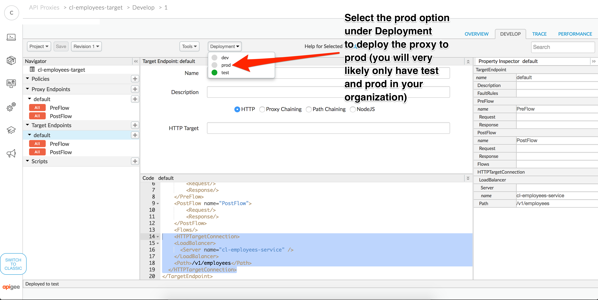

* Click on the Overview tab to verify that your API Proxy is deployed to both test and prod:

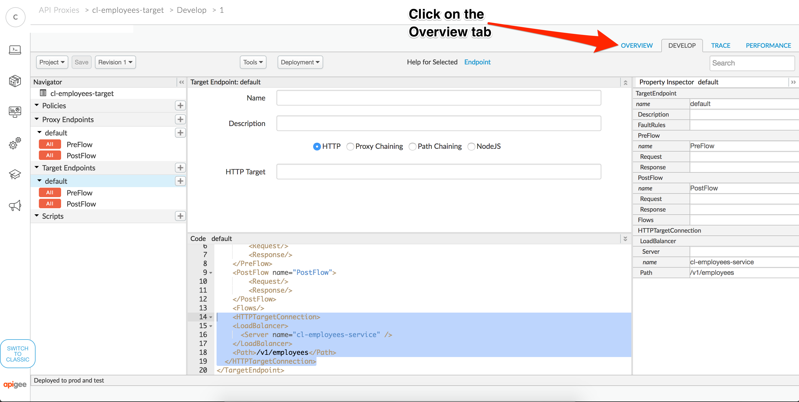

* On the Overview tab, click on the test and prod URLs to call the API in each environment.


* Verify you get a JSON response from both the test and prod APIs. If you do, congrats, you've successfully configured an API which relies on named target servers instead of hard coded URLs!

# Lab Video

[Configuring Target Servers](https://www.youtube.com/watch?v=crnuHAgj9Vo&index=18&list=PLIXjuPlujxxxe3iTmLtgfIBgpMo7iD7fk)

# Earn Extra Points

In this lab, we configured a single target server, but Apigee Edge can actually [load balance between multiple target servers](http://docs.apigee.com/api-services/content/load-balancing-across-backend-servers). Try some of these more advanced options as well:
* Add a second target server and configure the load balancer to send traffic equally between th e two target servers.
* Configure a weighted load balancer configuration to send 2 times the traffic to one target server versus the other
* Disable one target server and experiment with failover behavior
* Try creating a target server from the [management API](http://docs.apigee.com/management/apis/post/organizations/%7Borg_name%7D/environments/%7Benv_name%7D/targetservers)

# Quiz

1. How might target servers be useful as part of your CI/CD process?

2. What additional steps would you need to think about if you didn't have the ability to create named target servers in Apigee Edge?

# Summary

In this lab, we saw how target URLs can be externalized using Target Servers to implement routing to the correct backend server based on the environment an API is deployed to. This helps to make it easy to configure Apigee Edge to work in a way that conforms to your SDLC.

# References

* [Target Server and load balancing documentation](http://docs.apigee.com/api-services/content/load-balancing-across-backend-servers)
* [Management API documentation for creaating Target Servers](http://docs.apigee.com/management/apis/post/organizations/%7Borg_name%7D/environments/%7Benv_name%7D/targetservers)

