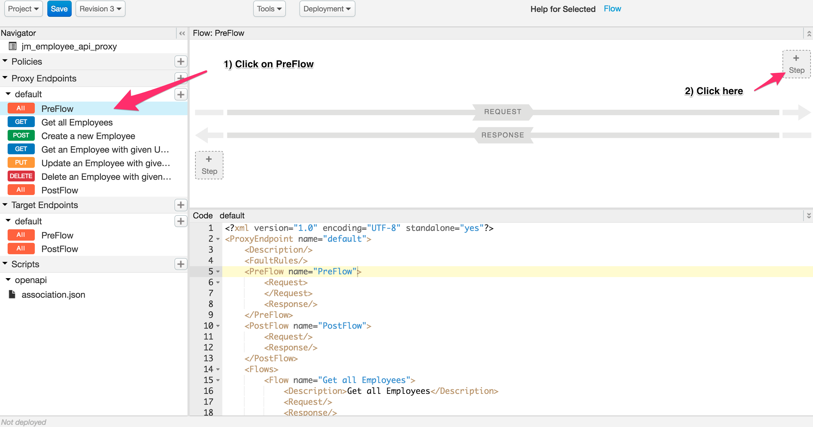
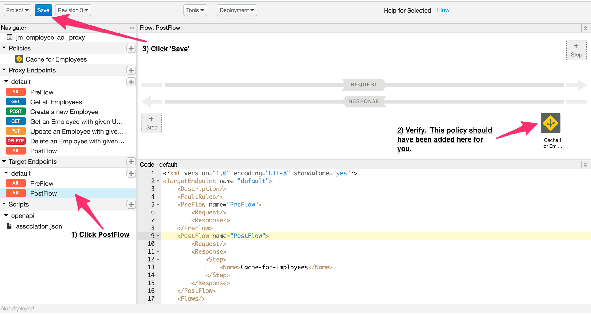
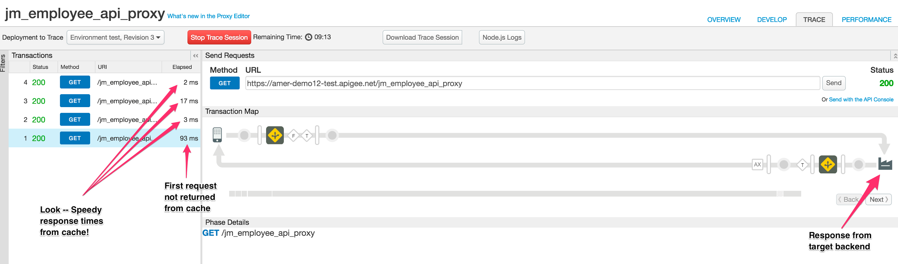
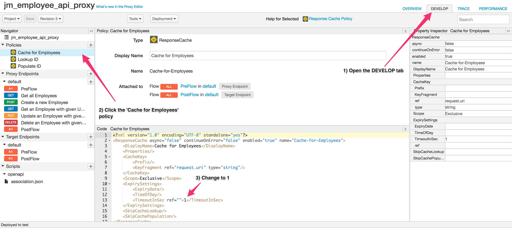
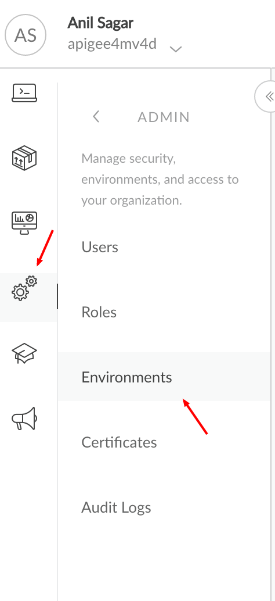

# API Performance : Caching

*Duration : 30 mins*

*Persona : API Team*

# Use case

You just launched your app -- and it’s a hit!  One of your backend services is swamped, responding slowly and damaging the end-user experience. Since the information returned by this service does not change frequently, it’s a perfect candidate for caching.  Your team decides to improve performance by implementing caching for this service in your API layer. 

# How can Apigee Edge help?

Apigee Edge provides caching for runtime persistence of data across requests.  You may access the cache with policies (see chart below).  Apigee Edge supports different caching policies enabling you to:

* Reduce latency: A request satisfied from the cache gets the representation and displays it in a shorter time. The server is more responsive with requests satisfied from the cache, which is closer to the client than the origin server.

* Reduce network traffic: Representations are reused, reducing the impact of processing duplicate or redundant requests. Using a cache also reduces the amount of bandwidth you use.

* Persist data across transactions: You can store session data for reuse across HTTP transactions.

* Support security:You may need "scope" access to the contents of a cache so it can only be accessed in a particular environment or by a specific API proxy.

Here’s a breakdown of the Apigee Edge caching policies:

<table>
  <tr>
    <td>Policy Name</td>
    <td>What Does it Do?</td>
  </tr>
  <tr>
    <td>ResponseCache</td>
    <td>Uses a cache to cache the response from the backend resource. This reduces the number of requests to the resource. When the response is already available in cache, it is returned directly by Edge, without contacting the backend. ResponseCache policy.</td>
  </tr>
  <tr>
    <td>PopulateCache</td>
    <td>Write arbitrary data, not necessarily response content, to the cache. You can use composite keys for the cache, so that you could cache user information, client information, Nonces, and so on. Each cache item can be tagged with an individual Time-to-Live, so data can be available for 10 seconds or 10 hours or 10 days, etc. PopulateCache.</td>
  </tr>
  <tr>
    <td>LookupCache</td>
    <td>Retrieve values that have been cached with the PopulateCache policy. LookupCache.</td>
  </tr>
  <tr>
    <td>InvalidateCache</td>
    <td>Purges values that have been cached by PopulateCache. Invalidate Cache policy.</td>
  </tr>
</table>


In this lab, we will configure your proxy to cache the results of a request for 60 seconds at a time.  Once we’ve seen how this affects runtime performance, we’ll leverage the cache a different way -- explicitly defining the cache key and contents.  We’ll populate this cache with an employee ID and demonstrate how to retrieve this value from cache with a LookupCache policy. 

# Pre-requisites

You have an API proxy created in Apigee Edge. If not, jump back to the "Create Reverse Proxy with OpenAPI specification" lab.

# Instructions

# Part 1 - Response Cache Policy

* Go to [https://apigee.com/edge](https://apigee.com/edge) and log in. This is the Edge management UI. 

* Select **Develop → API Proxies** in the side navigation menu


* Select the **{your_initials}_employee_api_proxy** that you created in an earlier lab exercise.	


	
* Click on the **Develop** tab to access the API Proxy development dashboard.


* Click on **Pre Flow** under Proxy Endpoints, then click **+ Step** on the Request flow to attach a *Response Cache* policy.

	

* Select **Response Cache** rename to something descriptive like *Cache for Employees* and click on the **Add** button to add the Response Cache policy.

	

* The default configuration for this policy looks like the following:

```
<?xml version="1.0" encoding="UTF-8" standalone="yes"?>
<ResponseCache async="false" continueOnError="false" enabled="true" name="Cache-for-Employees">
    <DisplayName>Cache for Employees</DisplayName>
    <Properties/>
    <CacheKey>
        <Prefix/>
        <KeyFragment ref="request.uri" type="string"/>
    </CacheKey>
    <Scope>Exclusive</Scope>
    <ExpirySettings>
        <ExpiryDate/>
        <TimeOfDay/>
        <TimeoutInSec ref="">3600</TimeoutInSec>
    </ExpirySettings>
    <SkipCacheLookup/>
    <SkipCachePopulation/>
</ResponseCache>
```

* This stipulates that the cache should timeout after 3600 seconds, or one hour.  Change this to read ‘60’.  This way, your cache will expire in one minute.


**A Quick Note on Cache Expiry, Resources**

The expiry settings are quite flexible. You could, for example, set the expiry to a particular time of day - say 3:00am Pacific time each day. This allows you to hold a cache all day, and refresh it at the beginning of each day, for example. For more information, see [the cache documentation](http://apigee.com/docs/api-services/reference/response-cache-policy). 

Apigee Edge provides a default cache resource that can be used for quick testing, which is what is being used in this lesson. Cache policies like ResponseCache can also used named cache resources. A Named cache resource can be manipulated administratively, outside of policy control. For examine, if you would like to clear a cache administratively, you can do that with a named cache resource. It takes just a moment. For more information on Cache Resources, see [Manage Caches for an Environment](http://apigee.com/docs/api-services/content/manage-caches-environment).

* Click **Target Endpoints → default → PostFlow**.  Verify your cache policy appears here, as well -- on the Response side.  Then, save your proxy and wait for it to successfully deploy.

	
	

* Switch to the **Trace** tab.  We’ll use this to test the caching we just configured for our proxy.  For more on Trace, see the *Diagnostics - API Trace* lab.  

* Start a new trace session and click **Send** multiple times (two or three) to fire a few test requests.

	
* Note the difference between your first request and subsequent requests made within 60 seconds of the first (remember, this is the lifetime defined for your cache).  A few things should jump out at you:

  * Response times reduced with cache.

    

  * Trace graph shows a response generated **_in the gateway, from cache _**-- eliminating the need to forward these requests to the target backend.


* Well done!  You’ve added a general purpose cache which will survive for 60 seconds, before repopulating on the next request made after that window.  Responses generated from cache spare your backend from serving those requests -- and are returned to clients far quicker than would non-cached responses.

# Part 2 - Populate Cache and Lookup Cache

You’ve improved the performance of your API with some clever caching of employee information.  Let’s take things a step further.  There may be times when saving a bit of metadata (unrelated to response payload) to cache can be useful.  In this section of the lab, we’ll capture the path -- which includes employee ID -- as specific employee records are requested.  Then, we’ll show how to retrieve this cached path info with a simple Lookup Cache policy.

* Return to the **Develop** tab to access the API Proxy development dashboard.

* Change the expiry time on your Response Cache policy to 1s.  This will allow us to make multiple requests for *Part 2* of the lab without triggering a cached response from our *Part 1* work.

	

* Click **Proxy Endpoints → default → Get an Employee with given UUID**.

* Click **+ Step** on the **Request** side.

	

* Add a **Populate Cache** policy, changing the name to Populate ID

**What have we done here?**

We’ve attached a Populate Cache policy to what Apigee calls a **Conditional Route** (in this case, get employee by UUID).  This means that the caching logic will only take effect when a request is made following the pattern ```/{your proxy name}/{specific employee UUID}```.  The XML below represents a slightly revised version of the standard policy, specifying a cache key, expiry, and source for the cache data.  For simplicity’s sake, our cache will be instructed to hold the employee ID being requested (albeit prepended with a forward slash).  For more information on this policy, see [Populate Cache](https://docs.apigee.com/api-services/reference/populate-cache-policy) in our docs.

* Copy/paste the below XML into the config for your newly added Populate Cache policy.

```
<?xml version="1.0" encoding="UTF-8" standalone="yes"?>
<PopulateCache async="false" continueOnError="false" enabled="true" name="Populate-ID">
    <DisplayName>Populate ID</DisplayName>
    <Properties/>
    <CacheKey>
        <Prefix>EmployeeID</Prefix>
        <KeyFragment>LastRequested</KeyFragment>
    </CacheKey>
    <Scope>Exclusive</Scope>
    <ExpirySettings>
        <TimeoutInSec>60</TimeoutInSec>
    </ExpirySettings>
    <Source>proxy.pathsuffix</Source>
</PopulateCache>
```

* This time, click **+Step** on the **Response** side.

* Add a **Lookup Cache** policy, changing the name to Lookup ID

**What have we done here?**

We’ve attached a Lookup Cache policy to the response flow of our route. This policy will check the cache, by key name, for previously seeded data.  If it finds it, the data will be saved to a variable specified in the XML config.  The XML below represents a slightly revised version of the standard policy, specifying a cache key and variable name for storing the cached content.  For more information on this policy, see [Lookup Cache](https://docs.apigee.com/api-services/reference/lookup-cache-policy) in our docs.

* Copy/paste the below XML into the config for your newly added Lookup Cache policy.

```
<?xml version="1.0" encoding="UTF-8" standalone="yes"?>
<LookupCache async="false" continueOnError="false" enabled="true" name="Lookup-ID">
    <DisplayName>Lookup ID</DisplayName>
    <Properties/>
    <CacheKey>
        <Prefix>EmployeeID</Prefix>
        <KeyFragment>LastRequested</KeyFragment>
    </CacheKey>
    <Scope>Exclusive</Scope>
    <AssignTo>employeePathID</AssignTo>
</LookupCache>
```

* **Save** your configuration and wait for it to successfully deploy.  Then, switch to the **Trace** tab.

* Change the URL so that the following is appended to the end -- this will change your request to ask for a **specific employee record**, invoking the cache logic we’ve just applied.  

```
/05d3c8cd-ee18-11e6-b5a4-122e0737977d
```

* Start a **New Trace Session** and click **Send**.

* Your graph should look something like this, below.  Take note -- you have two new cache policies in effect.  One is populating the cache with the url suffix ```/{employee-id}``` -- and the other is looking up that value, by key name, in cache.  You can see proof of this in the assigned variable, employeePathID

* *Congratulations!*  You’ve done a few cool things here -- defined a custom key for your new cache, seeded it with some data from the client request, and retrieved that data later in the flow.  On retrieving this data from cache, you’ve assigned it to a flow variable.  In a real life scenario, you could use this flow variable to drive conditional logic, or otherwise take action on the data retrieved from cache.  Nice work!

# Lab Video

If you prefer to learn by watching, here is a video lab on using Cache policies

[https://youtu.be/u8FOaGkp-no](https://youtu.be/u8FOaGkp-no)

# Earn Extra-points

Use the EdgeUI to examine the cache resources available in the Environment.



You should see something like this, Select the **test** environment:


Create a named cache resource with your initials. Then, return to your Proxy, and modify the ResponseCache policy to explicitly use that named cache resource. hint: see [the documentation for the ResponseCache policy](http://apigee.com/docs/api-services/reference/response-cache-policy). It might have something to do with adding an element like this to the configuration: 

```
<CacheResource>name_of_cache_resource</CacheResource>
```

Verify the behavior with 10 second TTL is now changed. Another thing to try: reset the TTL in the policy to 3600, and then run a few test requests. Verify that the cache is hot. Return to the cache management page, and clear the cache you created. Then try a new request. You should see that the cache is now cold.

Keep in mind that all of the administrative actions you can perform in the Edge UI can also be performed via an administrative API. So you could set up an agent to clear the Edge cache based on a slack command, or running as a cron job, or part of a CI/CD flow, and so on.

# Quiz

1. Name two key benefits to using cache.

2. Describe the differences between Response Cache and Populate Cache policies.

# Summary

In this lab, you learned how to apply cache policies to enhance the performance of your API.  Caching is not a silver bullet for all API performance problems.  Fear not!  Apigee Edge analytics are a powerful tool for deciding what to cache, how long, and what performance gains to expect.  Consider giving the analytics lab a try next. 

# References

* Apigee Docs: Cache.   [http://docs.apigee.com/api-services/content/caching-edge](http://docs.apigee.com/api-services/content/caching-edge)

* Apigee Community on Caching:  [https://community.apigee.com/topics/caching.html](https://community.apigee.com/topics/caching.html)

* Watch this 4minute video to learn about the Trace Tool

    * [https://community.apigee.com/articles/17971/implementing-responsecaching-within-edge.html](https://community.apigee.com/articles/17971/implementing-responsecaching-within-edge.html)

# Rate this lab

How did you link this lab? Rate [here](https://docs.google.com/a/google.com/forms/d/1TUk1BCNO75Cli2OzAFNctykuJ9TF6d9uv7HwBYX2S9Q).

