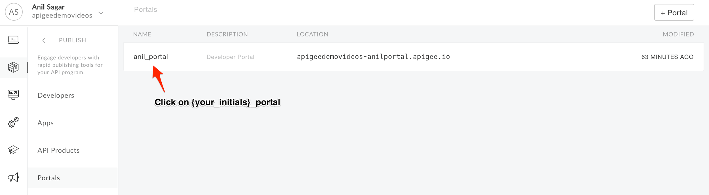
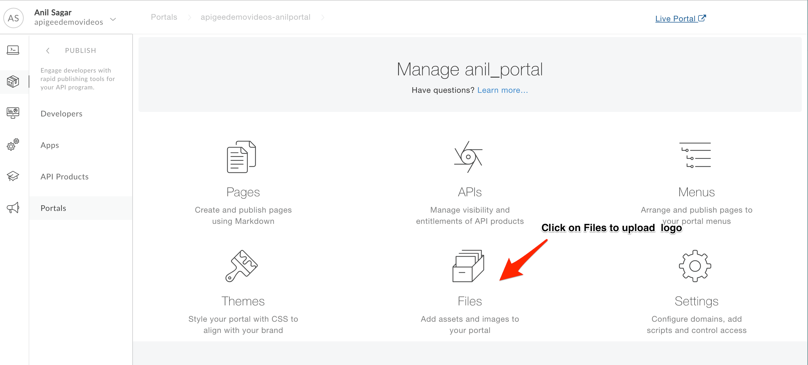
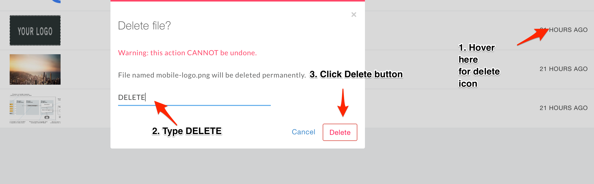
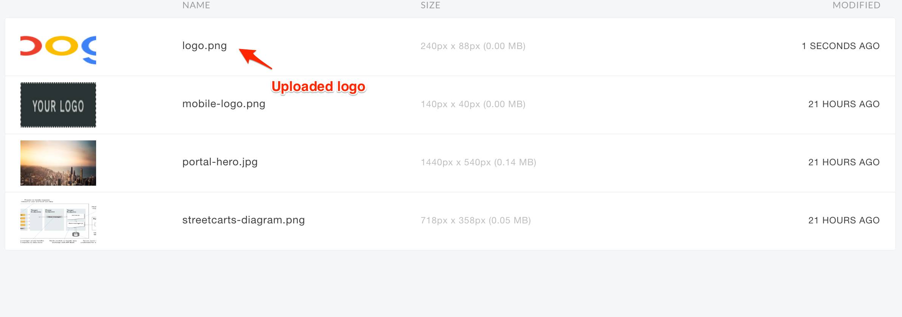
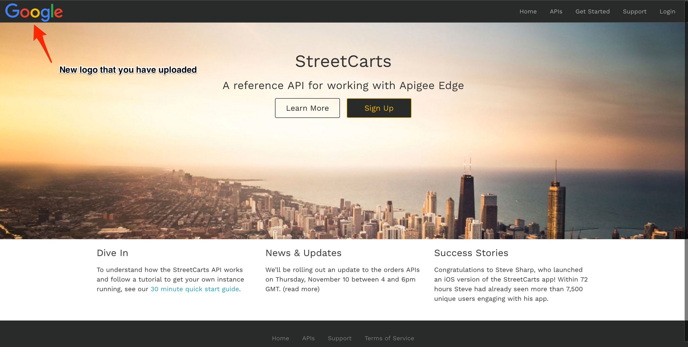
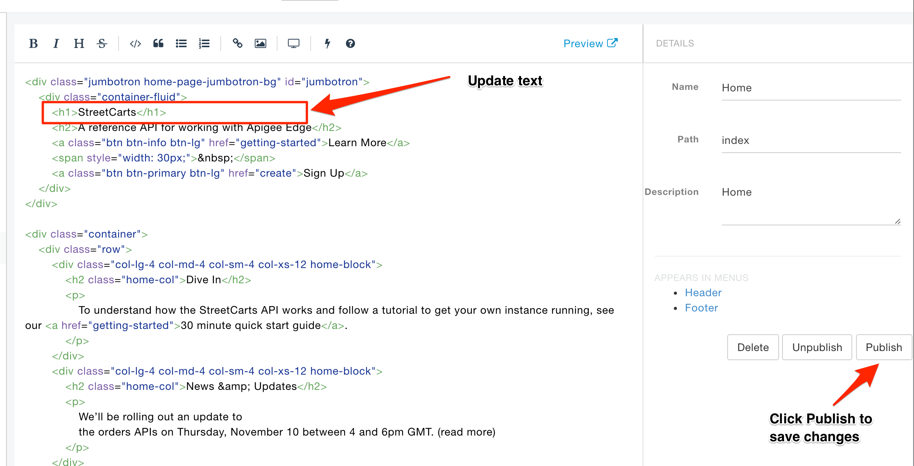

# API Publishing - Developer Portal Customization 

*Duration : 30 mins*

*Persona : API Team*

# Use case

You have a requirement to modify the default developer portal theme with your own branding, look and feel. You were asked to theme API Developer Portal with your own organization branding & styling.

# How can Apigee Edge help?

Apigee Edge has out of the box lightweight Developer Portal which allows you to publish API Documentation and Onboard Developers onto your API Platform. Lightweight Developer Portal comes with basic content creation administration screens and settings for customising look and feel of developer portal.

In this lab, we will be updating out of the box theme with Google branding to understand Developer Portal theme customisation.

# Pre-requisites

Apigee Developer Portal created in earlier lab exercise. If not, jump back to *API Publishing - Documentation* lab.

# Instructions

## Open Your Portal

1. Go to [https://apigee.com/edge](https://apigee.com/edge) and log in. This is the Edge management UI. 

2. Select **Publish → Portals** in the side navigation menu.


3. Click on **{your_initials}_{api_proxy_name}_portal** that you have created in earlier lab exercise.	



4. Click on **Live Portal** link to access Apigee Developer Portal to see out of the box theme.


## Change The Logo

1. Let’s change the logo of the developer portal with Google logo, Navigate to [https://goo.gl/jNaH2y](https://goo.gl/jNaH2y) and download the Google logo to your local machine. **Rename** the file to logo.png.

2. Go back to **{your_initials}_{api_proxy_name}**_portal overview screen and click on files section to upload the Google logo.



3. Delete the *logo.png* file from the files list.



4. Upload the Google logo that you have downloaded in earlier step,




5. Click on **Live Portal** to see logo changes. 



Note: Flush browser cache if it displays old logo.

## Add Custom CSS

1. Switch to **Theme Settings** page by selecting **Theme** from the drop down next to *Live Portal* link in the UI.


2. Replace the css mentioned in below screenshot with the code mentioned below,


```
.navbar-default { /* modify the header treatment */
  background-color: #fafafa;
  border: none;
}

body nav.navbar-default ul.nav li a {
    font-size: 14px;
    color: #777;
}

body nav.navbar-default ul.nav li a:hover {
    color: #222;
    background-color: #fafafa;
}

.open > .dropdown-toggle.btn-default:focus {
    color: #222;
}
```

3. Publish the changes by clicking on **Publish** button at right bottom and Confirm the changes.

	

## Create Your Own Portal Content

1. Let’s update the home page text by selecting **Pages** from dropdown.


2. Click on **Home** to edit homepage content,


3. Update h1 tag content to "**Apigee Edge**", Click **Publish** to save changes.



4. Click on **Live Portal** to see header and home page content changes.


**Congratulations!** You have now customised the out-of-box developer portal with a shiny new look and feel.

# Lab Video

If you like to learn by watching, here is a short video on customising Apigee lightweight Developer Portal [https://youtu.be/TRhqt7L2Obs](https://youtu.be/TRhqt7L2Obs)

# Earn Extra-points

Now that you have customised look & feel, Explore more by changing the home page banner and modifying footer CSS. You can also add new pages & update menus.

# Quiz

1. Is it possible to make content modifications in developer portal using Rich Text Editor?

2. Is it possible to add Custom Javascript to the Developer Portal?

# Summary

That completes this hands-on lesson. In this simple lab you learned how to customise look and feel of developer portal & modify content present in the developer portal.

# References

* Useful Apigee documentation links on Apigee lightweight portal customisation,

    * Building your portal , [https://docs-new.apigee.com/portal](https://docs-new.apigee.com/portal)

# Rate this lab

How did you like this lab? Rate [here](https://goo.gl/forms/GvGcxAgV1RTGAV2y1).

Now to go [Lab-8](https://github.com/apigee/devjam3/tree/master/Labs/Core/Lab%208%20Consume%20APIs)
