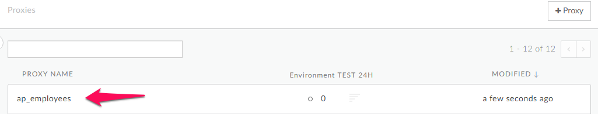
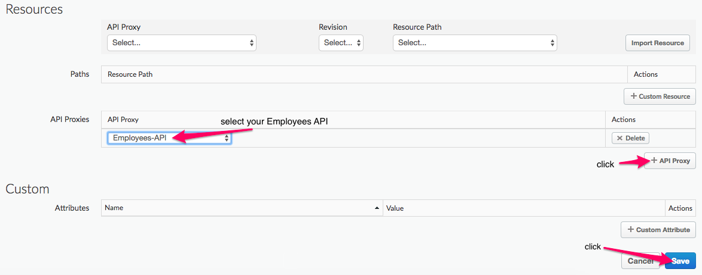
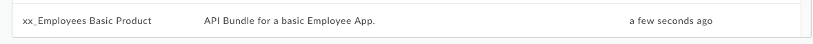
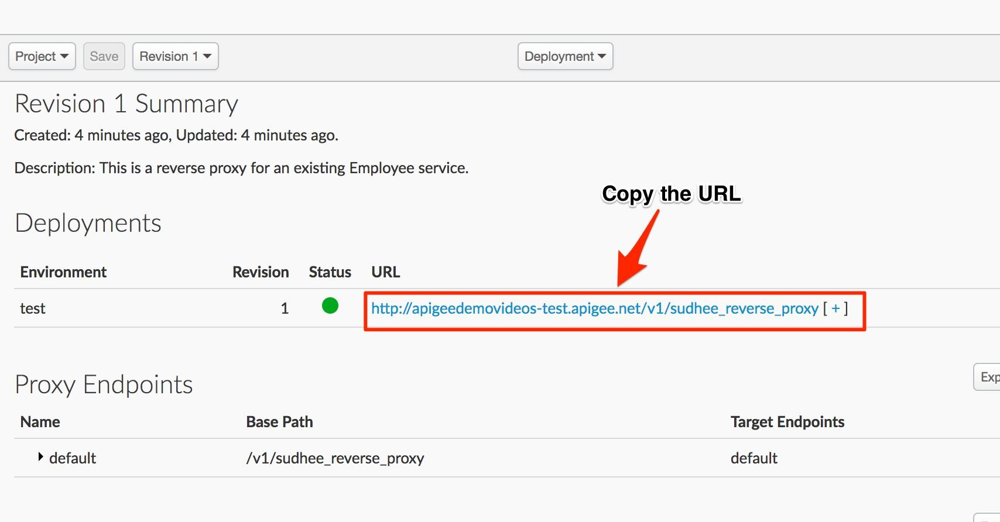

# API Publishing : Packaging APIs

*Duration : 20 mins*

*Persona : API Product Manager*

# Use case

You have a set of APIs that are to be consumed by trusted partners. You want to package the APIs into a meaningful context for the creation of a developer app, and you want to make that package available for a developer to subscribe to, in order to provide access to an API Key.

# How can Apigee Edge help?

Apigee has the concept of ‘API Products’. API products enable you to bundle and distribute your APIs to multiple developer groups simultaneously, without having to modify code. An API product consists of a list of API resources (URIs) combined with a Service Plan (rate-limiting policy settings) plus any custom metadata required by the API provider. API products provide the basis for access control in Apigee, since they provide control over the set of API resources that apps are allowed to consume.

As part of the app provisioning workflow, the developer selects from a list of API products. This selection of an API product is usually made from within the context of a developer portal, however for the purposes of this lab we will show you how to create a developer App and get access to an API Key via the Edge UI. The developer app is provisioned with a key and secret (generated by and stored on Apigee Edge) that enables the app to access the URIs bundled in the selected API product. To access API resources bundled in an API product, the app must present the API key issued by Apigee Edge. Apigee Edge will resolve the key that is presented against an API product, and then check associated API resources and quota settings.

The API supports multiple API products per app key - your developers can consume multiple API products without requiring multiple keys. Also, a key can be 'promoted' from one API product to another. This enables you to promote developers from 'free' to 'premium' API products seamlessly and without user interruption.

The following defines some of the terms used to register apps and generate keys:

* **API product** A bundle of API proxies combined with a service plan that sets limits on access to those APIs. API products are the central mechanism that Apigee Edge uses for authorization and access control to your APIs. For more information, see [API Products](http://apigee.com/docs/developer-services/content/what-api-product)

* **Developer** The API consumer. Developers write apps the make requests to your APIs.

* **App** A client-side app that a developer registers to access an API product. Registering the app with the API product generates the API key for accessing the APIs in that product.

* **API Key** A string with authorization information that a client-side app uses to access the resources exposed by the API product. The API key is generated when a registered app is associated with an API product.

# Pre-requisites

* You have an API proxy created in Apigee Edge. If not, jump back to *API Design - Create a Reverse Proxy with OpenAPI specification* lab.

* The API Proxy contains an API Key Verification policy. Follow the *API Security : Securing APIs with API Key* lab to enable this.

# Instructions

# Part 1 - Create API Product

* From the Apigee Edge Management UI, Using sidebar Navigation, go to **Publish → API Products**

* Click on ‘**+ API Product**’ button to add a new product 

* In the *Product Details* section of the new product screen, enter or select the following values for the various fields:

    *   Display Name: *{Your_Initials}*_Employees Basic Product

    *   Description: API Bundle for a basic Employee App.

    *   Environment: Test

    *   Access: Public

    *   Key Approval Type: Automatic

* In the ‘Resources’ section click the **+ API Proxy** button, and in the dropdown select your Employees API Proxy, and click **Save** to save the API Product.

* The new product should now be listed on the *Products* page.

# Part 2 - Create a Developer and a Developer App

In order to get access to an API key you must register a developer App with the API Product, and before you can register a developer App you must create a developer. Whilst this is typically one via the developer portal in a self service paradigm, for this lab we will do this via the Edge UI.

* From the Apigee Edge Management UI, Using sidebar Navigation, go to **Publish → Developers**

* Click the **+ Developer** button to add a new developer

* Fill in the developer details and click create,

* The new developer should be listed on the ‘Developer’ page. Note that it shows the expanded view of the developer details.

* From the Apigee Edge Management UI, Using sidebar Navigation, go to **Publish → Apps**

* Click the **+ Apps** button to add a new App

* In the ‘Developer App Details’ section, specify **{your_intitials}**_Employees App as the App name, and select your developer from the developer drop down. You may need to start typing your name in the text box to get it to appear.

* In the credentials section, select **+ API Product** and select your API Product

* Hit the save button and verify that your new App appears in the ‘Apps’ page

* Click on your app to open it up, and then hit the show button next to ‘Consumer Key’ to reveal your API Key. Copy this value as we will need it to test the API.

# Part 3 - Test access to the API using the API Key

* Let us test the API proxy using the [REST Client](https://apigee-rest-client.appspot.com/). Open the REST Client on a new browser window.  

* Copy the URL for your API proxy. 

	

* Paste the link on the REST Client and make a **GET** call

* You should see a failure response similar to this, indicating that the API Key Verification has failed -

* Modify the Get call to include the API Key we copied from the previous section as a query parameter called ‘apikey’.

* You should see a success response similar to this -

# Lab Video

If you like to learn by watching, here is a short video on creating an API Product

[http://www.youtube.com/watch?v=c1GWDey4DyM](http://www.youtube.com/watch?v=c1GWDey4DyM) 

# Earn Extra-points

Now that you know how to create an API Product to include entire API Proxies, explore the finer grained control for packaging APIs. Modify your API Product to only allow access to specific revisions and / or resources within your API.

# Quiz

1. What criteria should you use to choose which APIs should be added to any given API Product?

2. How would you use the Edge UI in order to revoke access to your APIs for a specific developer App?

# Summary

That completes this hands-on lesson. In this simple lab you learned how to create an API Product, and how to use the Edge UI to create a developer App associated with that API and get access to an API Key.

# References

* Useful Apigee documentation links on API Products - 

    * API Product overview - [http://docs.apigee.com/developer-services/content/what-api-product](http://docs.apigee.com/developer-services/content/what-api-product) 

    * How to create an API Product -  [http://docs.apigee.com/developer-services/content/creating-api-products](http://docs.apigee.com/developer-services/content/creating-api-products) 

* Watch this 4minute video on "Anatomy of an API proxy" - [https://www.youtube.com/watch?v=HWRSKZwCwkY](https://www.youtube.com/watch?v=HWRSKZwCwkY) - along with it’s community article [http://bit.ly/2hWFSfZ](http://bit.ly/2hWFSfZ)

# Rate this lab

How did you link this lab? Rate [here](https://goo.gl/forms/kcxQkKomLXCXw95r1).

