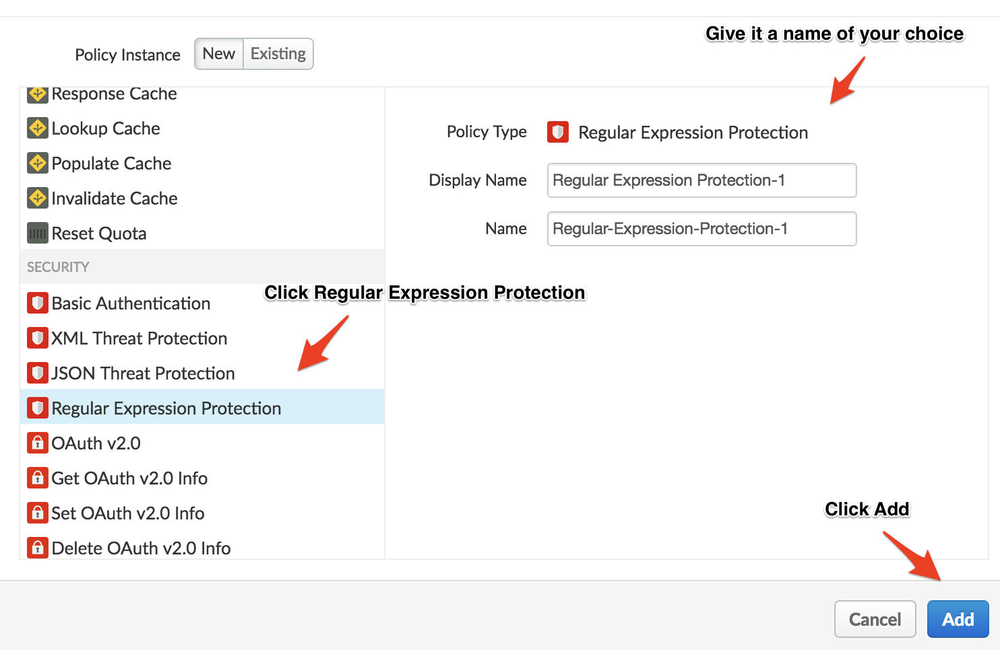
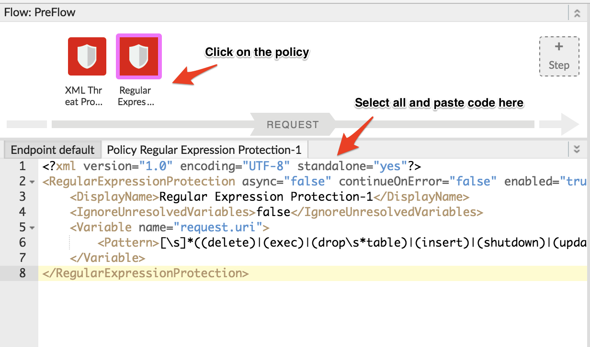
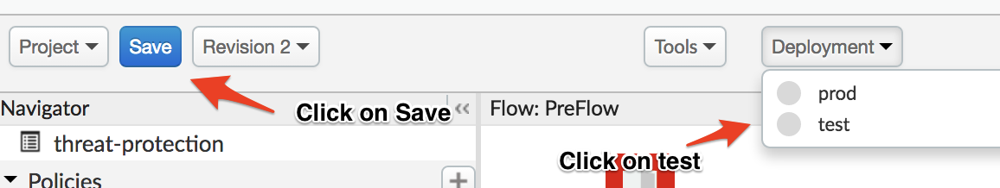
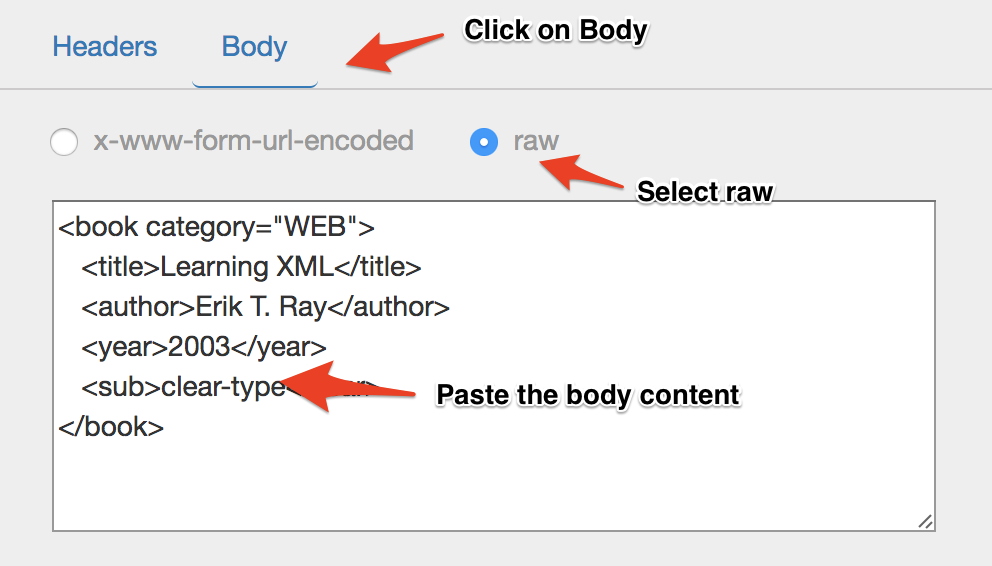
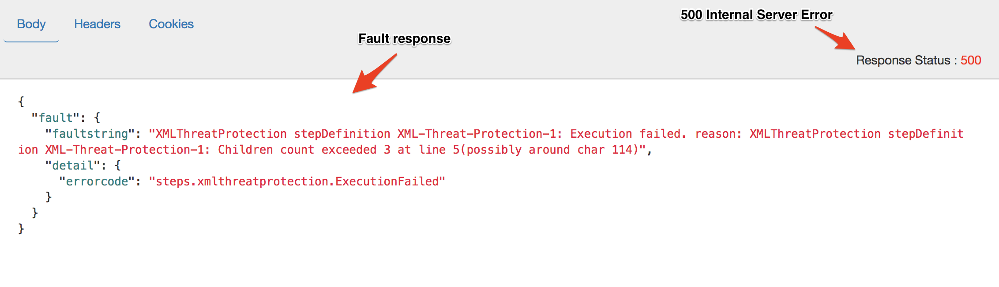

# API Security : Threat Protection

*Duration : 20 mins*

*Persona : API Team/Security*

# Use case

You have a set of APIs that are either consumed by partners or open to public. You want to keep those APIs secure by protecting the backend from SQL Injection and XML threats. 

# How can Apigee Edge help?

Policies like XML/JSON threat protection and Regular Expression protection in Apigee Edge, help you easily protect your backend and minimize attacks on your API against these threats by addressing the vulnerabilities.

For example, the XML Threat Protection policy screens against XML threats by validating messages against an XML schema (.xsd), evaluating message content for specific blacklisted keywords or patterns and detecting corrupt or malformed messages before those messages are parsed. And, the JSON Threat Protection policy minimizes the risk posed by content-level attacks by enabling you to specify limits on various JSON structures, such as arrays and strings.

# Pre-requisites

You have an API proxy created in Apigee Edge. If not, jump back to *API Design : Create a Reverse Proxy with OpenAPI Specification* lab.

# Instructions

* Go to [https://apigee.com/edge](https://apigee.com/edge) and log in. This is the Edge management UI. 

* Select **Develop → API Proxies** in the side navigation menu


* From the list of proxies, click on your Employee API proxy that you created in the earlier lab.


* Click on the **Develop** tab. Select **PreFlow** from the sidebar under **Proxy Endpoints** section


* First, let’s protect your backend from XML threats by enforcing certain limits on the XML structure of the payload.

* In the Request flow, click the **+ Step** button and from the *Security* section, add the policy named **XML Threat Protection**.


* Click on the Policy in PreFlow and clear the boilerplate code and paste the code below in the code editor.

```
<?xml version="1.0" encoding="UTF-8" standalone="yes"?>
<XMLThreatProtection async="false" continueOnError="false" enabled="true" name="XML-Threat-Protection-1">
    <DisplayName>XML Threat Protection-1</DisplayName>
    <Source>request</Source>
    <StructureLimits>
        <NodeDepth>3</NodeDepth>
       <AttributeCountPerElement>2</AttributeCountPerElement>
        <NamespaceCountPerElement>3</NamespaceCountPerElement>
    </StructureLimits>
</XMLThreatProtection>
```


* Now, let’s protect your backend from SQL Injection threats. For this, you’ll be using the **Regular Expression Protection** policy	

* In the Request flow, click the **+ Step** button and from the *Security* section, add the policy named **Regular Expression Protection**



* Click on the Policy in PreFlow and clear the boilerplate code and paste the code below in the code editor

```
<?xml version="1.0" encoding="UTF-8" standalone="yes"?>
<RegularExpressionProtection async="false" continueOnError="false" enabled="true" name="Regular-Expression-Protection-1">
    <DisplayName>Regular Expression Protection-1</DisplayName>
<IgnoreUnresolvedVariables>false</IgnoreUnresolvedVariables>
    <Variable name="request.uri">    <Pattern>[\s]*((delete)|(exec)|(drop\s*table)|(insert)|(shutdown)|(update)|(or))</Pattern>
    </Variable>
</RegularExpressionProtection>
```



* **Save** the proxy and deploy it on the *test* environment.



* *Congratulations!*...Your API is now protected from SQL Injection Attacks.

* Firstly, let’s test XML threat protection using the [REST Client](https://apigee-rest-client.appspot.com/). Open the REST Client on a new browser window.  

* Copy the URL for your API proxy. 


* Paste the URL, select **POST** from the dropdown and then add *Content-type* header with the value ``application/xml``


* Select the **body** tab and then paste the following body content and click the **Send** button

```
<book category="WEB">
   <title>Learning XML</title>
   <author>Erik T. Ray</author>
   <year>2003</year>
   <sub>clear-type</sub>
</book>
```



* You should see a response like this



Note: The above response shows that the children count exceeded 3 because, the provided XML body had 4 children for the root node whereas we had set a restriction in the policy to 3 - ```<NodeDepth>3</NodeDepth>```.

* Now, let’s test SQL Injection protection. Clear the body and remove the header that we had used for the previous call.

* Add a query param to your URL with a SQL command like this ```?query=delete * from table``` and hit send.

* You should see a response like this


# Lab Video

If you are lazy and don’t want to implement this use case, it’s OK. You can watch this short video to see how to protect your apis from threats [https://www.youtube.com/watch?v=B4vk7wuZBsk](https://www.youtube.com/watch?v=B4vk7wuZBsk) 

# Earn Extra-points

Now that you know how to protect your APIs from XML threats and SQL Injection threats, try to protect it for a JSON Payload. 

# Quiz

1. How do you protect your backend from Cross Site Tracing (XST) attacks? 

2. Can you use JSON Threat protection policy to detect empty payloads? If yes, how? If no, why?

3. Which policy would you use to protect your backend from SQL Injection threats?

# Summary

In this lab you learned how to protect your backend from SQL Injection and XML threats by using various policies like Regular Expression protection and XML threat protection in Apigee Edge.

# References

* Link to Apigee docs page

    * XML Threat Protection Policy [http://docs.apigee.com/api-services/reference/xml-threat-protection-policy](http://docs.apigee.com/api-services/reference/xml-threat-protection-policy) 

    * JSON Threat Protection Policy [http://docs.apigee.com/api-services/reference/json-threat-protection-policy](http://docs.apigee.com/api-services/reference/json-threat-protection-policy) 

    * Regular Expression Protection Policy
[http://docs.apigee.com/api-services/reference/regular-expression-protection](http://docs.apigee.com/api-services/reference/regular-expression-protection)

* Take a look at this community [article](https://community.apigee.com/articles/19487/api-vulnerabilites-and-their-mitigation-in-apigee.html) which explains various vulnerabilities and how they can be addressed using Apigee Edge.

* Watch this 4minute [video](https://www.youtube.com/watch?v=rC8kZJgwBFM) to learn about the SQL Injection Threat Protection.

# Rate this lab

How did you link this lab? Rate [here](https://drive.google.com/open?id=1kLZnmuq1CuQ6OmuaKXfOXwBobmzt0LWO_aEo0yAc0BE).

