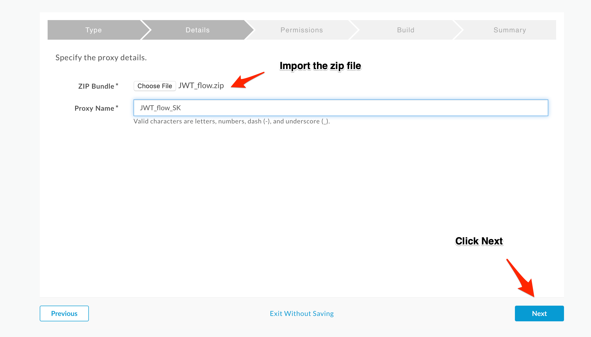
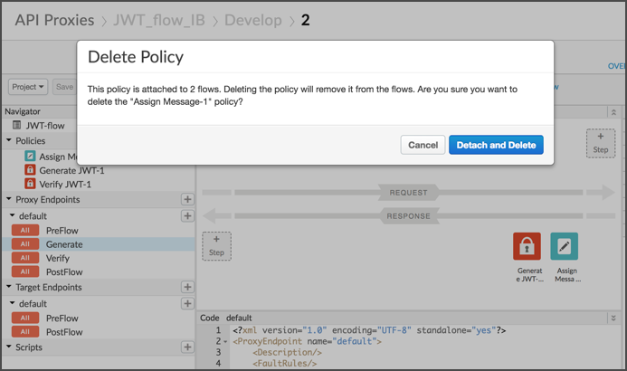
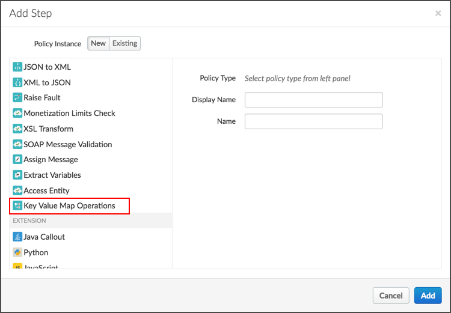
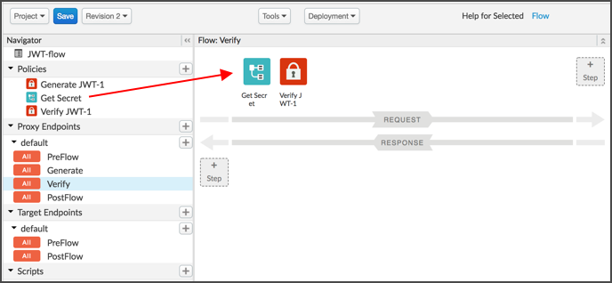

# Encrypt your data using Key Value Maps

*Duration : 10 mins*

*Persona : API Team*

# Use case

Many Cloud services are secured with Identity and Access Management (IAM), which provides access control through a combination of policies, roles, and groups that are applied to users and services.

When you make API calls to IAM-protected services, IAM requires the Access Key and Secret Access Key of a user registered in your AWS account. Keeping the keys secure is paramount, yet they need to be provided on API calls from Edge to your Cloud.

# How can Apigee Edge help?

Apigee Edge lets you create encrypted key value maps (KVMs) that you'll use to store and retrieve these keys.

# Instructions

In this lab we will start with a simple proxy that generates and validates JWT tokens. This proxy uses a secret to sign the JWT token, but the secret is hard-coded in the app and visible to all developers. We'll go through a series of steps to move our secret into an encrypted KVM where it's not in plain sight.

Pre-Req: Download the pre-built proxy bundle from [here](./Resources/JWT_flow.zip) 

1. Create a new proxy using this proxy bundle and name it "JWT_flow_{your_initials}.

    

    
    
    
    
    

2. Deploy the proxy to `test` environment. Then go ahead and test the proxy using the trace tool by making the following calls:
 
 
- Make a `GET` call to `http://<org-name>-<org-env>.apigee.net/jwt-flow/generate`. You may also use the curl command `curl http://<org-name>-<org-env>.apigee.net/jwt-flow/generate`

  > You should receive a JWT token in the response body. Copy that token, we'll call it `jwt_token`, as you'll use it for the next call.

- Make a `GET` call to `http://<org-name>-<org-env>.apigee.net/jwt-flow/verify` and add a header `key: <jwt_token>`. You may also use the curl command `curl http://<org-name>-<org-env>.apigee.net/jwt-flow/generate -H "key:<jwt_token>"`

3. If you examine the assign message policy named `set secret`, you can see the secret that we use to sign the JWT token. This secret, just like your password credentials, is very sensitive and shouldn't be out in the open. Let's use an encrypted KVM to store this secret instead and modify this proxy to retrieve it from that KVM.

    

4. Keep this tab open. And in a new tab, Head over to `Admin -> Environments -> Key Value Maps`, and make sure you have the `test` environment selected.

    

5. Click on `+ Key Value Map` and name it `JWTSecrets`. Also check the box `encrypted`, this will encrypt the data you store in this KVM.

    

    

6. Select the `JWTSecrets` KVM and add an entry by clicking the `+ Entry` button. Put `secret` in the as the name and `apigee0` as the value. Hit save.

    

7. Hit refresh on your browser and you'll notice that the data in that KVM is now masked.

    

8. Head back to your previous tab, you'll edit your proxy to use the KVM we just created.

9. Delete the Assign Message policies.

    

10. Create a new `Key Value Map Operations` policy and replace its content with the XML below.
```
<?xml version="1.0" encoding="UTF-8" standalone="yes"?>
<KeyValueMapOperations async="false" continueOnError="false" enabled="true" name="Key-Value-Map-Operations-1" mapIdentifier="JWTSecrets">
    <DisplayName>Get Secret</DisplayName>
    <Properties/>
    <Get assignTo="private.secret" index="1">
        <Key>
            <Parameter>secret</Parameter>
        </Key>
    </Get>
    <Scope>environment</Scope>
</KeyValueMapOperations>
```
Here we are calling our KVM and storing the key `secret` in a variable named `private.secret`. In Apigee, the `private.` prefix in front of a variable name masks its value during runtime and is required for all values extracted from an encrypted KVM.

  

11. Add this policy in two places: 1. Before the JWT-Generate policy in the /generate flow; 2. Before the JWT-Verify policy in the /verify flow.

    
    

12. Test your proxy in a same manner as in step 2. You'll have the same experience, but now your credentials are secure!

    
    

# Summary

In this lab you have learned how to use an encrypted KVM in Apigee to secure your crednetials.

