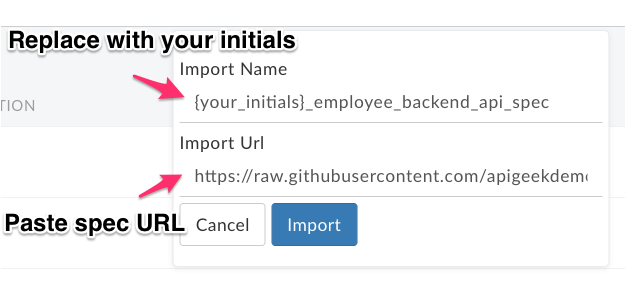
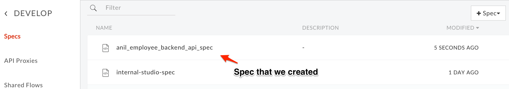
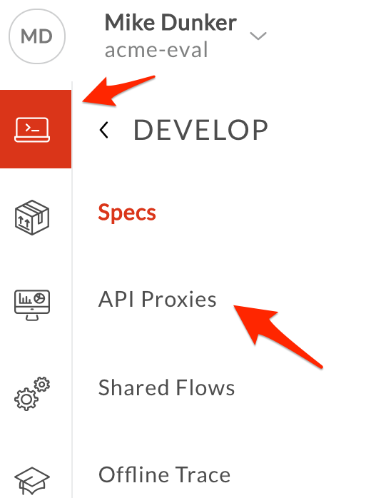
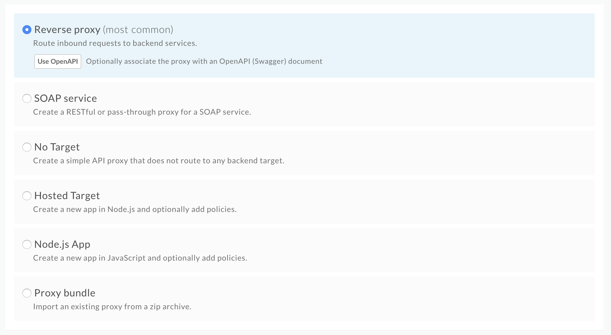
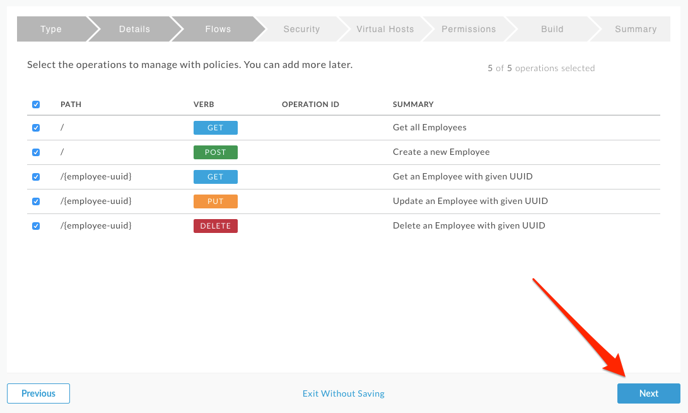
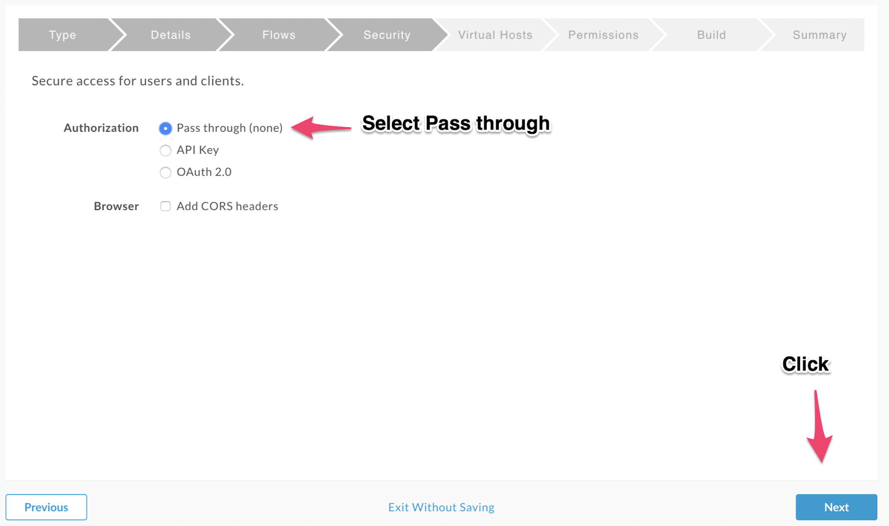
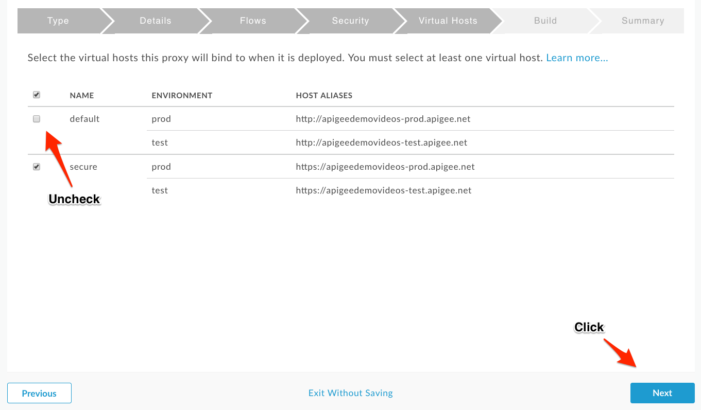
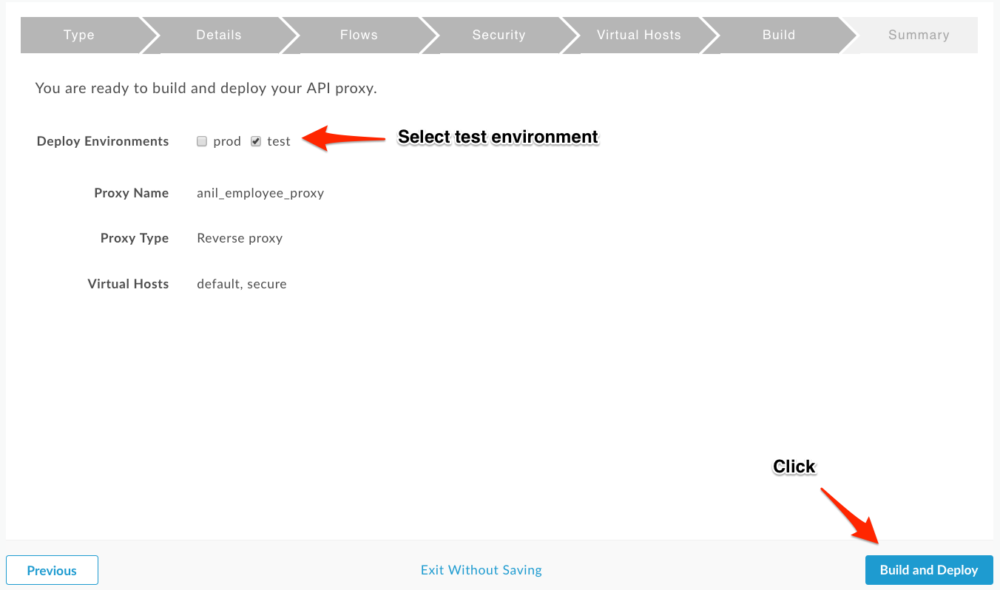
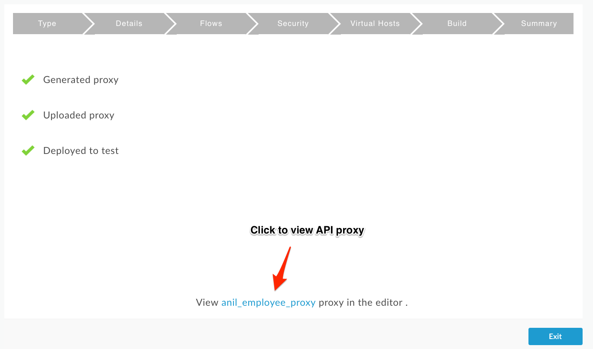
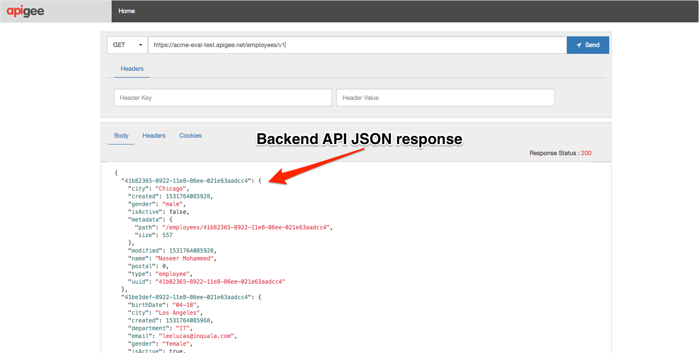

# API Design : Create a Reverse Proxy with OpenAPI Specification

*Duration : 20 mins*

*Persona : API Team*

# Use case

You have a requirement to create a reverse proxy for taking requests from the Internet and forward them to an existing service. You have decided to follow a design first approach & built a reusable component, a specification which can be used to build API Proxies, generate API documentation, generate API test cases using OpenAPI Specification format. You would like to generate an Apigee API Proxy by using the OpenAPI Specification (Swagger) instead of building the API Proxy from scratch.

# How can Apigee Edge help?

Apigee Edge enables you to quickly expose backend services as APIs. You do this by creating an API proxy that provides a facade for the backend service that you want to expose. Apigee Edge out of the box supports the OpenAPI specification, allowing you to auto-generate API Proxies. Apigee Edge also has an OpenAPI specification editor & store which you can use to maintain your OpenAPI specifications. 

The API proxy decouples your backend service implementation from the API that developers consume. This shields developers from future changes to your backend services. As you update backend services, developers, insulated from those changes, can continue to call the API uninterrupted.

In this lab, we will see how to create a reverse proxy, that routes inbound requests to existing HTTP backend services using a readily available OpenAPI specification.

# Pre-requisites

* Basic understanding of [OpenAPI Specification](https://github.com/OAI/OpenAPI-Specification) (Swagger)
* Open the [REST Client](https://apigee-restclient.appspot.com/) on a browser window.

# Instructions

## Import an Open API Specification

1. Go to [https://apigee.com/edge](https://apigee.com/edge) and log in. This is the Edge management UI. 

2. Select **Develop → Specs** in the side navigation menu

3. Click **+Spec**. Select **Import URL...** to add a new spec from an existing spec URL.

4. Enter the spec details.

   * Import Name: Employee Backend

   * Import Url: [https://raw.githubusercontent.com/apigeekdemos/apijam/master/Resources/employee-openapi-spec.yaml](https://raw.githubusercontent.com/apigeekdemos/apijam/master/Resources/employee-openapi-spec.yaml)

5. Verify the values and click **Import**. Spec has been imported into Apigee Edge and is ready to use. You should see your spec in the list. For example,

6. Click on the spec in the list to access the OpenAPI spec editor & interactive documentation that lists the backend API details and resources. You can explore the spec and live documentation if you'd like -- we'll be doing more in a later lab.

## Create an API Proxy

1. It’s time to create an Apigee API Proxy from Open API Specification. We will be creating an API Proxy that calls the backend service documented in the OpenAPI spec. Click on the Develop icon if you are not already on the Develop menu, then select **API Proxies** in the side navigation menu. 

2. You should see some proxies that were added when your org was created. If you have been using this org, you may also have your own proxies. Let's create a new proxy based upon the backend API spec. Click **+Proxy** The *Create Proxy* wizard is opened. 

3. Select **Reverse proxy**. Click on the **Use OpenAPI** button.

4. You should see a popup with a list of specs. Choose **Employee Backend** and click **Select**.

5. You can see the selected OpenAPI Spec URL below the Reverse Proxy option, Click **Next** to continue.

6. Enter the proxy name, base path, and description. This is the first version of our Employees API, so we'll make it version 1. When you enter the proxy name, the proxy base path will automatically be populated, but you'll need to change the hyphen before the version to a forward slash.

    * Proxy Name: employees-v1

    * Proxy Base Path: /employees/v1

    * Existing API: *Auto-filled from OpenAPI spec*

    * Description: Employees API v1

    Note that the base path is the URL you will use to call your API.

7. Verify the values and click **Next**.

8. You can select and de-select list of API Proxy Resources that are pre-filled from the OpenAPI Spec. For example, you might decide that you don't want to expose the delete operation via the API. In this case, we will expose all the operations, so make sure all 5 are selected and click on **Next**.

9. Select **Pass through (none)** for the authorization in order to choose not to apply any security policy for the proxy. Leave the CORS headers checkbox unchecked -- we will be adding CORS to our proxy manually later. Click **Next**. 

10. The next pane allows us to decide whether the proxy will be available over http (default), https (secure), or both. In this case, our API deals with employee data. This is generally sensitive information, so we will only allow access via https. If we allowed access via http, all traffic to and from the API would be in plaintext across the internet. Unless there is a specific requirement to expose a specific API via http, you should always only allow access via https. **Uncheck the default virtual host and click Next**.

11. The proxy is certainly not ready to deploy to production yet! Ensure that only the **test** environment is selected, and click **Build and Deploy**. 

12. You should see that the proxy has been generated, uploaded, and deployed to test. Once the API proxy is built and deployed, click the **employees-v1** link to view your proxy in the proxy editor. 

13. *Congratulations!* ...You have now built a reverse proxy for an existing backend service. You should see the proxy **Overview** screen.

## Test the API Proxy
1. Let us test the newly built API proxy using the [Apigee REST Client](https://apigee-restclient.appspot.com/). Open the REST Client in a new browser window.  

2. Copy the URL for your API proxy. 

3. Paste the link into the REST Client and make a GET call.

4. You should see a success response similar to this:

## Save the API Proxy

1. Let’s save the API Proxy locally as an API Bundle so that we can reuse it in other labs.

2. Save the API Proxy by downloading the proxy bundle. Return to the Overview tab, and see screenshot below for instructions.

# Lab Video

If you like to learn by watching, here is a short video on creating a reverse proxy using an Open API Specification - [https://youtu.be/3XBG9QOUPzg](https://youtu.be/3XBG9QOUPzg) 

# Earn Extra-points

Now that you have created a reverse proxy using an OpenAPI spec, select the Develop tab & explore the flow conditions populated from the OpenAPI spec. Also, explore OpenAPI Spec editor in which you can edit OpenAPI specifications.

# Quiz

1. How do you import the proxy bundle you just downloaded? 
2. How does Apigee Edge handle API versioning? 
3. Are there administrative APIs to create, update and delete API proxies in Apigee?

# Summary

That completes this hands-on lesson. In this simple lab you learned how to create a proxy for an existing backend using an OpenAPI Specification and the Apigee proxy wizard.

# References

* Useful Apigee documentation links on API Proxies:

    * Build a simple API Proxy - [https://docs.apigee.com/api-platform/fundamentals/build-simple-api-proxy](https://docs.apigee.com/api-platform/fundamentals/build-simple-api-proxy) 

    * Best practices for API proxy design and development - [https://docs.apigee.com/api-platform/fundamentals/best-practices-api-proxy-design-and-development](https://docs.apigee.com/api-platform/fundamentals/best-practices-api-proxy-design-and-development) 

* Watch this 4minute video on the "Anatomy of an API proxy" - [https://youtu.be/O5DJuCXXIRg](https://youtu.be/O5DJuCXXIRg) 

# Next step

Now go to [Lab-2](../Lab%202%20Traffic%20Management%20-%20Throttle%20APIs)

