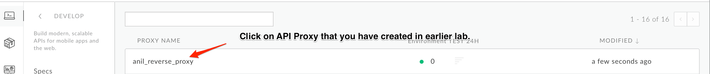
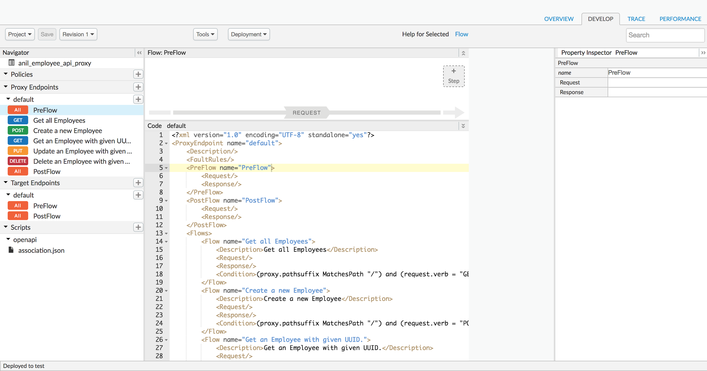
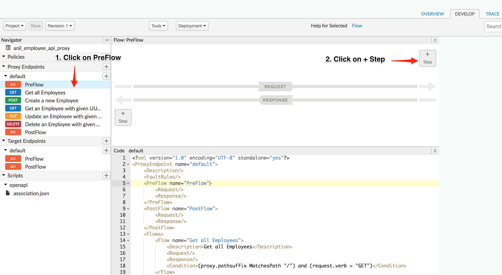
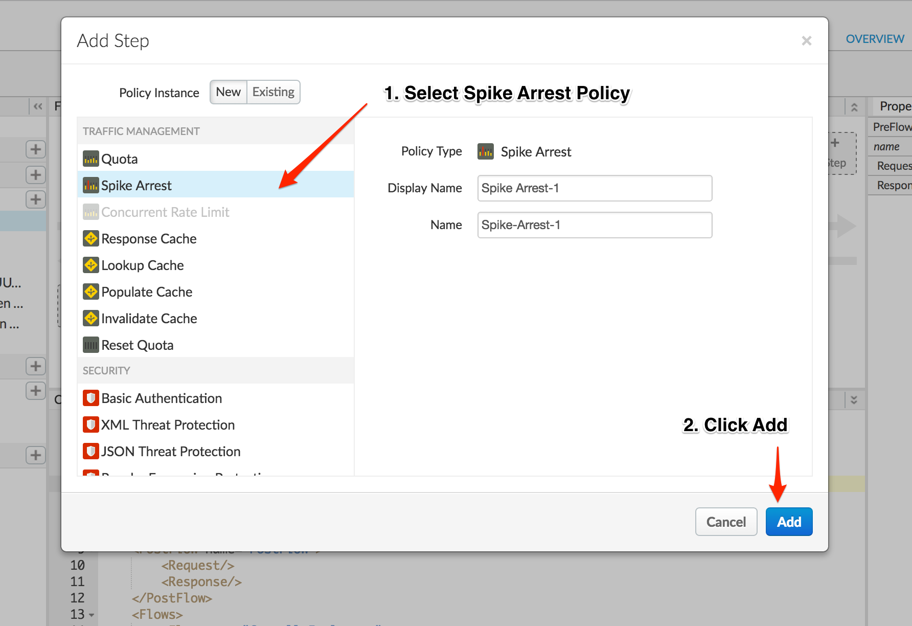
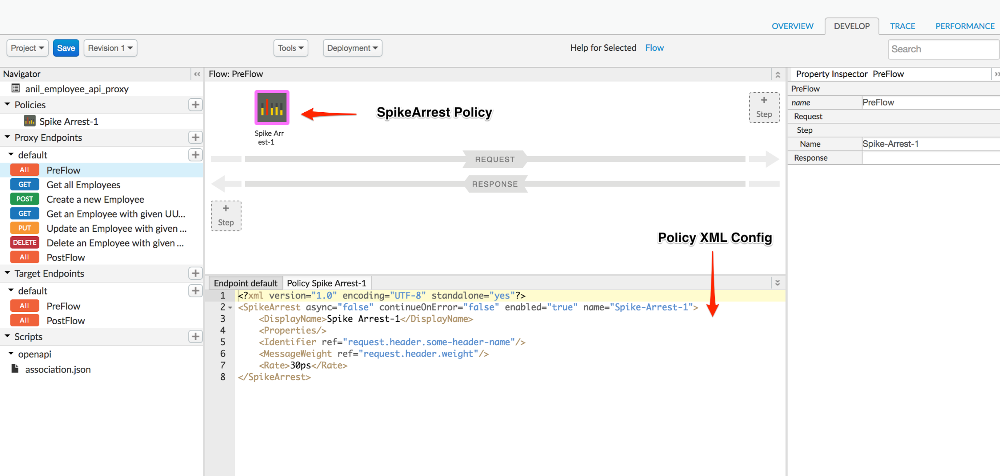
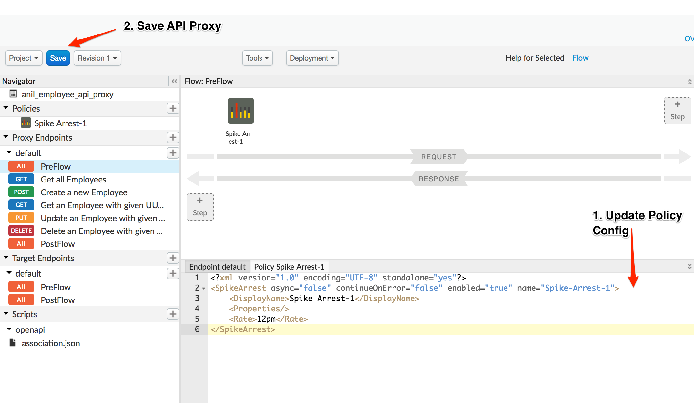
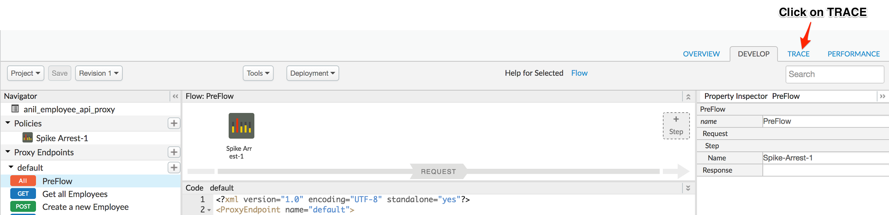
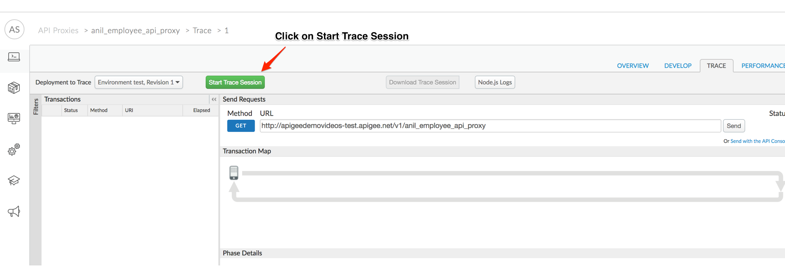
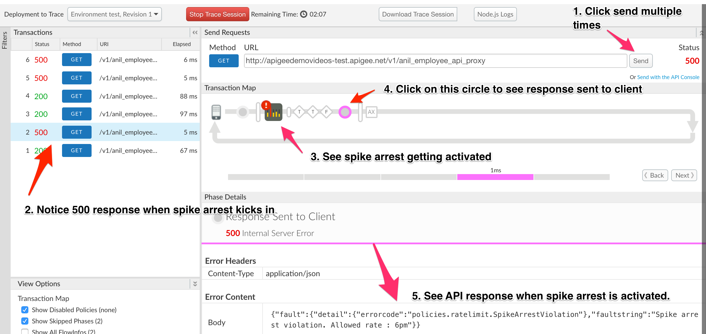
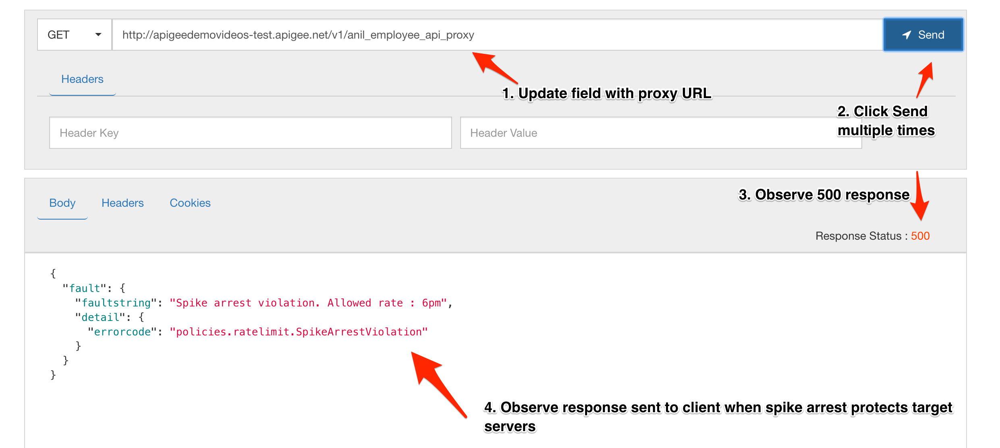

# Traffic Management : Throttle APIs 

*Duration : 20 mins*

*Persona : API Team / Security*

# Use case

You have a requirement to protect your target servers (backend) from traffic spikes. You would like to protect your APIs from denial of service attacks that might lead to performance lags or downtime of your backend.

# How can Apigee Edge help?

By exposing an API through Apigee Edge, you gain the ability to modify and monitor its behavior using out-of-the-box policies. Edge's out-of-the-box policies enable you to enhance your API with sophisticated features to control traffic, enhance performance, enforce security, and increase the utility of your APIs, without requiring you to write any code or to modify any backend services. Extension policies enable you to implement custom logic in the form of JavaScript, Python, Java, and XSLT.

In this lab we will see how to use an out of the box traffic management policy, "Spike Arrest", to protect against traffic spikes. A Spike Arrest policy can throttle the number of requests processed by an API proxy and sent to a backend, protecting against performance lags and downtime.

# Pre-requisites

Apigee Edge API Proxy created in earlier lab exercise. If not, jump back to "API Design - Create a Reverse Proxy with OpenAPI specification" lab.

# Instructions

* Go to [https://apigee.com/edge](https://apigee.com/edge) and log in. This is the Edge management UI. 

* Select **Develop → API Proxies** in the side navigation menu.


* Click on **{your_initials}**_employee_proxy that you have created in earlier lab exercise.





* Click on **Develop** tab to access API Proxy development dashboard.




* Click on **PreFlow** under Proxy Endpoint default, Click on **+Step** on top of Request flow to attach a spike arrest policy.



* Select **Spike Arrest Policy**. Click on **Add** button to add spike arrest policy to proxy endpoint preflow request.



* You can notice Spike Arrest policy icon on top of request flow that shows where exactly policy is attached and policy XML configuration below in editor.



* Change the Policy XML configuration to below code & update the rate to 12pm.
```
<?xml version="1.0" encoding="UTF-8" standalone="yes"?>
<SpikeArrest async="false" continueOnError="false" enabled="true" name="Spike-Arrest-1">
    <DisplayName>Spike Arrest-1</DisplayName>
    <Properties/>
    <Rate>12pm</Rate>
</SpikeArrest>
```

Think of Spike Arrest as a way to generally protect against traffic spikes rather than as a way to limit traffic to a specific number of requests. Your APIs and backend can handle a certain amount of traffic, and the Spike Arrest policy helps you smooth traffic to the general amounts you want.

The runtime Spike Arrest behavior differs from what you might expect to see from the literal per-minute or per-second values you enter.

For example, say you enter a rate of 6pm (6 requests per minute). In testing, you might think you could send 6 requests in 1 second, as long as they came within a minute. But that's not how the policy enforces the setting. If you think about it, 6 requests inside a 1-second period could be considered a mini spike in some environments.

What actually happens, then? To prevent spike-like behavior, Spike Arrest smooths the number of full requests allowed by dividing your settings into smaller intervals:

* **Per-minute** rates get smoothed into full requests allowed in intervals of **seconds**. For example, 6pm gets smoothed like this: 60 seconds (1 minute) / 6pm = 10-second intervals, or 1 request allowed every 10 seconds. A second request inside of 10 seconds will fail. Also, a 7th request within a minute will fail.

* **Per-second** rates get smoothed into full requests allowed in intervals of **milliseconds**. For example, 10ps gets smoothed like this: 1000 milliseconds (1 second) / 10ps = 100-millisecond intervals, or 1 request allowed every 100 milliseconds. A second request inside of 100ms will fail. Also, an 11th request within a second will fail.

* Click on **Save** to save the API Proxy changes.



* *Congratulations!*...You have now secured your backend against denial of service attacks, performance lags or downtime of target servers.

* Let us test the updated API proxy using the Trace Console. Click on **Trace** tab.



* Click on **Start Trace Session** to see API Proxy with spike arrest in action.



* Click on **Send** button multiple times, You will see 500 response code when spike arrest policy kicks in to protect target servers from spike in traffic.

	

* You might notice that number of requests with 200 response is more than spike arrest rate value configured, It’s due to multiple message processors where policies gets executed and each has individual counters.

* You can also use [Apigee Rest Client](https://apigee-rest-client.appspot.com/) to test Spike Arrest Policy.



# Lab Video

If you like to learn by watching, here is a short video on using Spike Arrest policy. [https://youtu.be/3Gi-GGTqllg](https://youtu.be/3Gi-GGTqllg)

# Earn Extra-points

Now that you have protected your backend against spike in traffic, Explore more about spike arrest policy using docs here, [http://docs.apigee.com/api-services/reference/spike-arrest-policy](http://docs.apigee.com/api-services/reference/spike-arrest-policy) & update the policy with identifer like queryparam on which spike arrest counter is updated. Use message weight property to assign a weight to the counter.

# Quiz

1. Assume there is a single message processor, Spike Arrest rate limit is 2 pm, What is the interval of time in which a single API Request is allowed to reach target server ?

2. Is it possible to implement spike arrest based on run time variables like per developer / per app ?

# Summary

That completes this hands-on lesson. In this simple lab you learned how to protect target servers against denial of service attacks.

# References

* Useful Apigee documentation links on Traffic Management & Spike Arrest Policy  - 

    * Spike Arrest Policy - http://docs.apigee.com/api-services/reference/spike-arrest-policy

    * Rate Limiting - [http://docs.apigee.com/api-services/content/rate-limiting](http://docs.apigee.com/api-services/content/rate-limiting)

    * Comparing Rate Limiting Policies - [http://docs.apigee.com/api-services/content/comparing-quota-spike-arrest-and-concurrent-rate-limit-policies](http://docs.apigee.com/api-services/content/comparing-quota-spike-arrest-and-concurrent-rate-limit-policies) 

# Rate this lab

How did you like this lab? Rate [here](https://goo.gl/forms/oivm4A6DqBKM9AEJ3).

Now go to [Lab-3](https://github.com/apigee/devjam3/tree/master/Labs/Core/Lab%203%20API%20Diagnostics%20-%20Trace%20tool)
