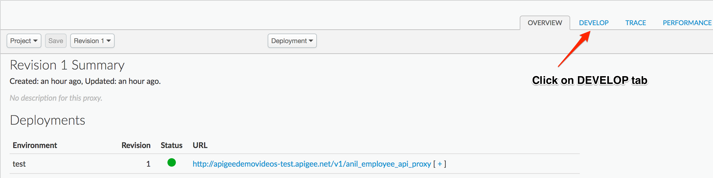
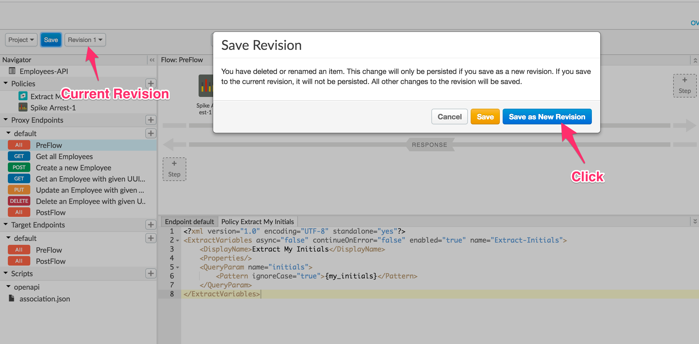
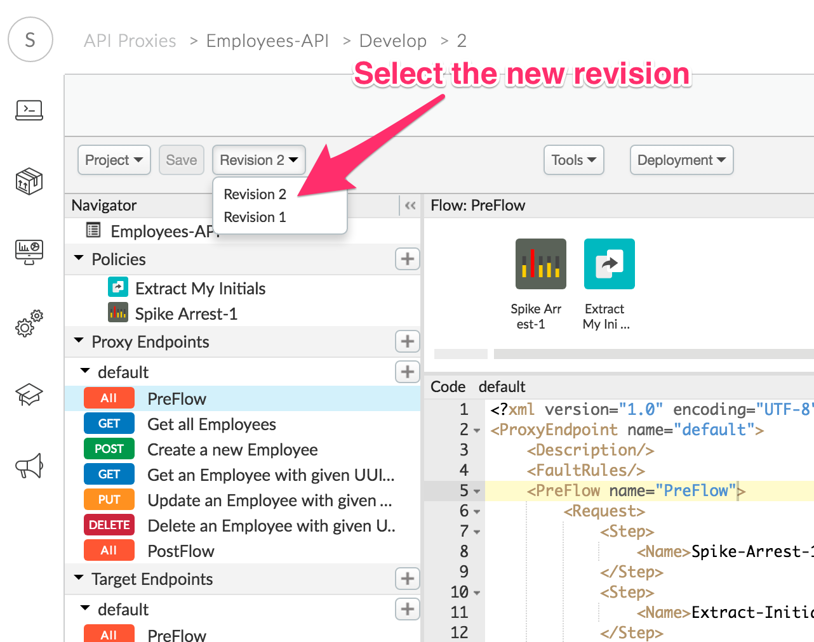
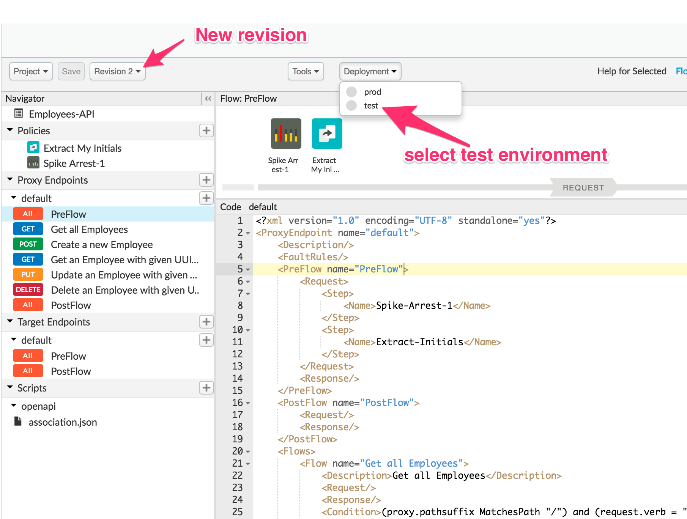
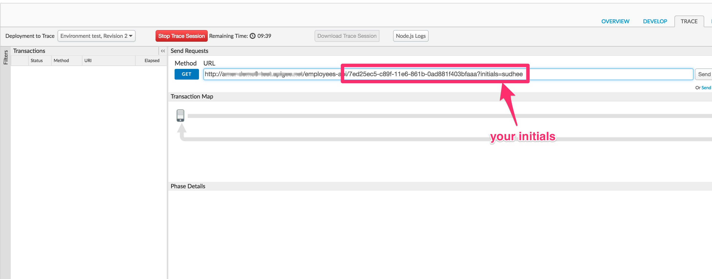
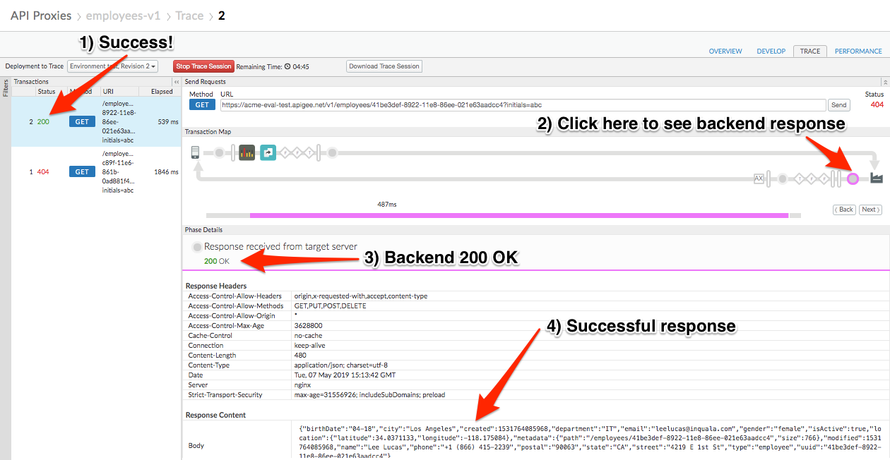
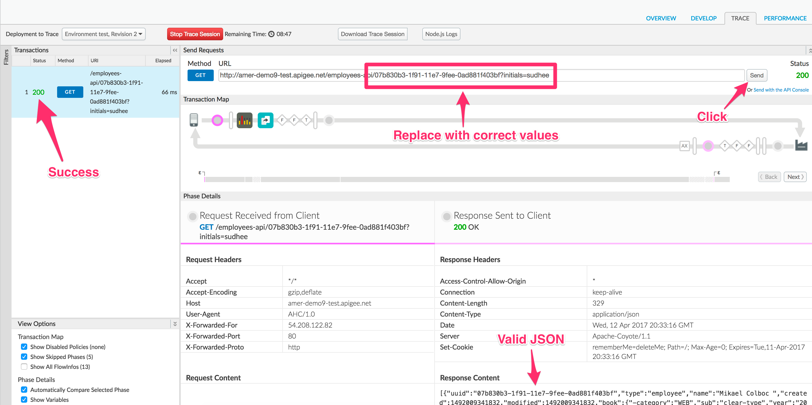
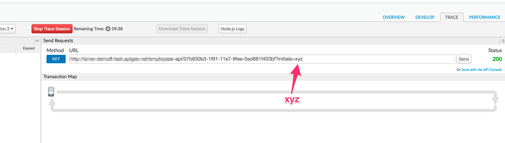
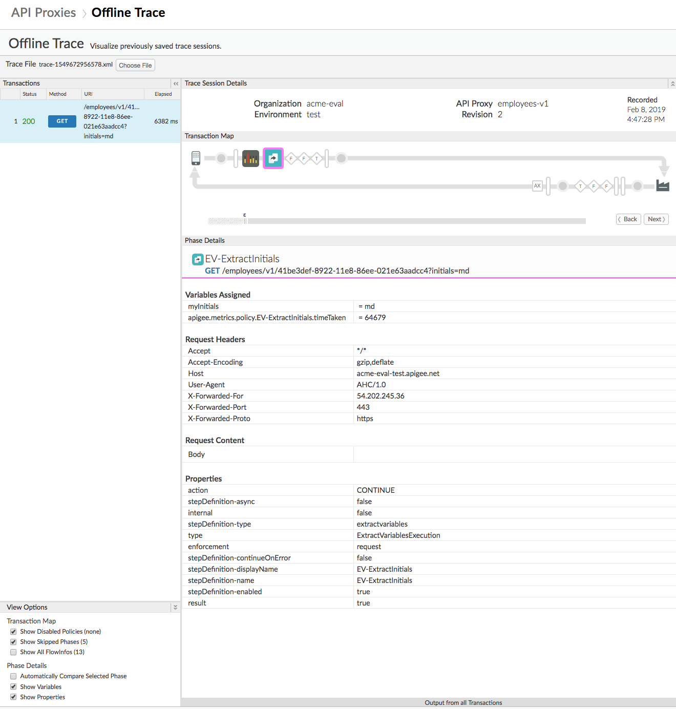

# API Diagnostics : Trace Tool

*Duration : 20 mins*

*Persona : API Team / DevOps*

# Use case

One of your team members is complaining that the API call is returning an error. You are asked to monitor the traffic and debug the issue.

# How can Apigee Edge help?

The Trace component in Edge is a powerful tool for troubleshooting and monitoring API proxy behavior.  Trace features an intuitive visual graph which outlines each step in an API proxy flow -- request, response, policies, etc.  Drill into each step to understand its impact on proxy behavior, filter your view to zero in on specific requests, and export your Trace session for non-real-time diagnostics.

In this lab, we will configure your proxy to expect a new query parameter -- called "initials" (your initials).  We will then use the trace tool to find the root cause of a 404 error, filtering the view to show only those requests containing your initials.

# Pre-requisites

You have an API proxy created in Apigee Edge. If not, jump back to the "Create Reverse Proxy with OpenAPI specification" lab.

# Instructions

## Configure API Proxy

1. Go to [https://apigee.com/edge](https://apigee.com/edge) and log in. This is the Edge management UI. 

2. Select **Develop → API Proxies** in the side navigation menu


3. Select the **employees-v1** proxy that you created in an earlier lab exercise.	



4. Click on the **Develop** tab to access the API Proxy development dashboard.


5. Click on **PreFlow** under Proxy Endpoints default, Click on **+Step** on the Request flow to attach an *Extract Variables*  policy.



6. Select **Extract Variables Policy**. Change the display name to "EV-ExtractInitials". The Name field should automatically get the same value. Click on the **Add** button to add the Extract Variables policy.



7. The Extract Variables policy icon is visible on the request flow and shows exactly where the policy is attached. Corresponding XML (in keeping with Edge’s config-then-code approach) can be seen in an edit pane below.

Change the Policy XML configuration to match the snippet below. Your proxy will extract your initials from a query parameter in the API request.

Note: In the following snippet, the Pattern value that reads *{myInitials}* specifies that the value of the query parameter should be extracted into a variable in your API proxy called *myInitials*. You do not need to replace this with your initials. 

```
<ExtractVariables continueOnError="false" enabled="true" name="EV-ExtractInitials">
    <QueryParam name="initials">
        <Pattern ignoreCase="true">{myInitials}</Pattern>
    </QueryParam>
</ExtractVariables>
```



8. Click on **Save**. This should auto deploy the new version, unless you are asked to save to a new revision. If you are asked this, save to a new revision and then deploy the new revision to the test environment using the Deployment menu. See Lab #2 for more information on the Save as New Revision dialog.

## Trace and Troubleshoot

Consider a scenario where one of your API consumers reports seeing 404 errors in response to their requests.  How would you get to the bottom of this issue?  The Trace tool allows you to capture specific matching requests and step through proxy logic one step at a time.  Let’s send some traceable requests, note the failure, and attempt to understand why it’s failing.

1. Click on the **TRACE** tab to access the real-time API Trace tool. Locate the URL field and append the following to the end:

```
/7ed25ec5-c89f-11e6-861b-0ad881f403bfaaa?initials={your initials}
```
Update the string *{your initials}* with your actual initials, removing the braces.



2. Click the green **Start Trace Session** button, wait for the button to turn red (indicating the trace tool is running), then click **Send**. Note a trace log is captured, with a 404 response.  

3. Step through the visualization, clicking points of interest along the request/response flow and taking note of the metadata provided at the bottom of the screen.

	**Trace-Step 1:** Extract Variables Policy

	**Trace-Step 2:** Request sent to target

	**Trace-Step 3:** Response returned from target

*Congratulations!*  You’ve found the problem.  Your target service cannot find an entity with the ID provided (7ed25ec5-c89f-11e6-861b-0ad881f403bfaaa).  This is a trivial example, but you can see how the tool -- providing before and after insight into message, query, and header contents -- would be of immense use in diagnosing malformed requests and other common issues.

4. Edit your URL field once more to follow the pattern below:

```
/41be3def-8922-11e8-86ee-021e63aadcc4?initials={your initials}
```

5. Update above {your initials} with your actual initials & remove the braces. Click the **Send** button again. This time, your request returns a valid JSON response with a 200 status code.



## Filtering

Now, imagine troubleshooting this issue - except with hundreds or thousands of requests flowing through the system at a given time.  Fortunately, the Trace tool can filter its real-time capture so that it only shows entries with a given query or header parameter.

1. Click the red **Stop Trace Session** button.  

2. Expand the filters pane on the left side of your screen.  Then add a query parameter filter named ‘initials’.  Put your initials in the value column and ensure the URL also holds your initials, like before:

```
/41be3def-8922-11e8-86ee-021e63aadcc4?initials={your initials}
```



3. Click the green **Start Trace Session** button, wait for the button to turn red, and then click the **Send** button again to fire another API call.  Note the captured trace entry.

4. Update the URL with a different value for the initials query parameter.  Example below.

```
/41be3def-8922-11e8-86ee-021e63aadcc4?initials=xyz
```

5. Click the **Send** button. 

Note: No matter how many times you click send, no new trace entry is captured!  This is expected behavior, as our filter is configured to only trace requests with your initials in the query.


6. With your trace session still shown, click the **Download Trace Session** button to export a record of the trace results. 



7. Now we'll use the Offline Trace tool to reopen our saved trace file. Select **Develop → Offline Trace** in the side navigation menu. Select *Choose file* and select the downloaded trace file.


8. You can now explore the trace information for all call(s) captured in the trace session. You can share this file with colleagues or support staff, who can load this into the Offline Trace tool in any organization.



# Summary

During this lab you’ve diagnosed a real-time problem with your API and filtered the calls to show only requests relevant to your investigation.  In a true-to-life scenario, you’d likely filter on API key or something else.

You have also learned how to save trace files and examine them again using the Offline Trace tool. This can be very useful when troubleshooting issues.

# Lab Video

If you prefer to learn by watching, here is a video lab on using the Trace tool:

[https://youtu.be/luCU2XTh5J0](https://youtu.be/luCU2XTh5J0)

# Earn Extra-points

Take a few minutes and explore the Trace interface a bit deeper.  Hover over the steps in the request/response visualization and note the latency bars that pop up, showing you how much time elapsed at that particular step.  Drill into the metadata in the bottom window.  Click the Extract Variables policy and note that the initials you provided are shown as an extracted variable called ‘myInitials’.  

Finally, take a look at the exported trace session from the lab.  See if you can interpret the results -- imagine some scenarios where this export could be ingested into other tools for offline diagnostics.

# Quiz

1. Name two kinds of metadata the Trace tool provides you with.

2. How do you determine the total time taken for the API transaction? 

3. How do you detemine the time taken for individual policies on the request/response side?

# Summary

In this lab, you learned how to diagnose a reported problem with your API in real-time using the Trace tool.  You learned how to filter those results down to a relevant subset of data -- and how to export the results for later review. 

# References

* Apigee Docs: Trace: [https://docs.apigee.com/api-platform/debug/using-trace-tool-0](https://docs.apigee.com/api-platform/debug/using-trace-tool-0

* Apigee Community on Tracing: [https://community.apigee.com/topics/trace.html](https://community.apigee.com/topics/trace.html)

* Watch this 4minute video to learn about the Trace Tool

    * [https://community.apigee.com/articles/36248/apigee-4mv4d-api-proxy-trace-console.html](https://community.apigee.com/articles/36248/apigee-4mv4d-api-proxy-trace-console.html)

# Next step

Now to go [Lab-4](../Lab%204%20API%20Security%20-%20Securing%20APIs%20with%20API%20Keys)
