# API Security : Securing APIs using API Keys

*Duration : 30 mins*

*Persona : API Team*

# Use case

You have an API Proxy that you want to secure, managing access and performing business logic based on the client making the call.  In addition to authorizing users, you want to know which Developer App is making calls so you can leverage that data to customize your API behavior based on the entitlement level of the caller.  You also would like to be able to see who is calling your API Proxies in your Analytics dashboards.

# How can Apigee Edge help?

The [Verify API Key Policy](https://docs.apigee.com/api-platform/reference/policies/verify-api-key-policy) in Edge verifies that the call is coming from an approved application in a valid state.  App developers who wish to access secure operations must request [API keys](https://docs.apigee.com/api-platform/security/api-keys) for their apps via the developer portal.

In addition to authenticating requests, the [Verify API Key Policy](https://docs.apigee.com/api-platform/reference/policies/verify-api-key-policy) provides context about the app making the call.  This context can be used to apply policies such as quota enforcement or routing based upon the client app.  On successful verification of the API Key, the API Context is populated with details about the App, Developer, and API Product associated with the call.  This data can be used for applying business logic as well as gaining business insights through analytics.

In this lab, you will protect an existing API Proxy with the [Verify API Key Policy](https://docs.apigee.com/api-platform/reference/policies/verify-api-key-policy) and use the trace tool to see the policy in action.  To accomplish this you will modify an existing API Proxy to add a security policy to handle the authorization.  You will also create several artifacts in your [Organization](https://docs.apigee.com/api-platform/fundamentals/apigee-edge-organization-structure).

* [App Developer](https://docs.apigee.com/api-platform/publish/adding-developers-your-api-product)

* [Developer App](https://docs.apigee.com/api-platform/publish/creating-apps-surface-your-api)

* [API Product](https://docs.apigee.com/api-platform/publish/what-api-product)

In addition, you will add [CORS functionality](https://docs.apigee.com/api-platform/develop/adding-cors-support-api-proxy) to your proxy so that your API can be called from the developer portal we will be adding later.


# Pre-requisites

For this lab, you will need an API Proxy that is not currently secured.  If you do not have an API Proxy available for this lab, revisit the lab "API Design : Create a Reverse Proxy with OpenAPI Specification" and then return here to complete these steps.

# Instructions

## Choose (and invoke) an API Proxy to secure

1. Go to [https://apigee.com/edge](https://apigee.com/edge) and log in. This is the Edge management UI.

2. Select **Develop → API Proxies**, and select the **employee-v1** proxy that you created in an earlier lab exercise.

3. Verify that the API Proxy is deployed to an environment from the **Overview** page.  Environment(s) to which the selected revision of the API Proxy is deployed will be indicated by a green circle.  If it is not deployed, click an environment from the "Deployment" pull-down to deploy the API Proxy to that environment.

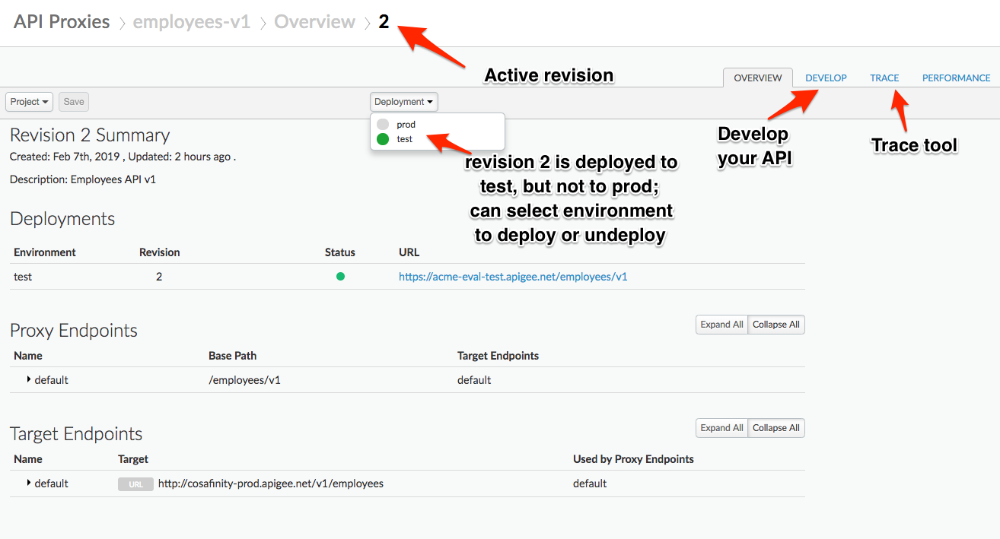

4. Remove the **Extract Variables** policy that you added in the previous lab.  Click on **X** on the top right corner of the policy to remove the policy.


You should see the policy still in the policies section Click **Save** to save the proxy. Save as a new revision and redeploy if necessary.

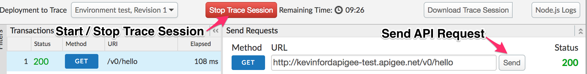

## Publish API as part of API Product

Once secured, consuming apps will need an API Key to successfully invoke your API.  The way that Developer (consumer) Apps request API Keys is via an API Product.  In short, API Products are the unit of deployment to the Developer Portal, where App Developers can learn about, register for, and consume your APIs.  Read more about API Products [here](https://docs.apigee.com/api-platform/publish/what-api-product).

1. Select **Publish → API Products** from the side navigation menu, and click **+API Product**.

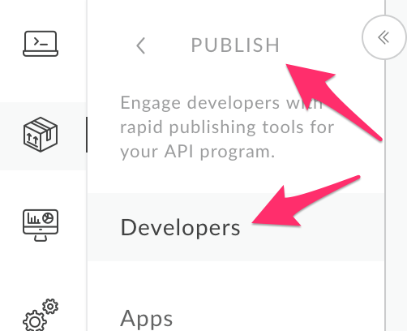

Populate the following fields:

    * Section: Product Details

        * Name: employee-product

        * Display Name: Employee Product

        * Description: Access the Employee API

        * Environment: test

        * Access: Public

    * Section: API Resources

        * Section: API Proxies

            * Click **Add a proxy**

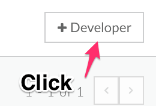

2. Select your **employee-v1** API Proxy.

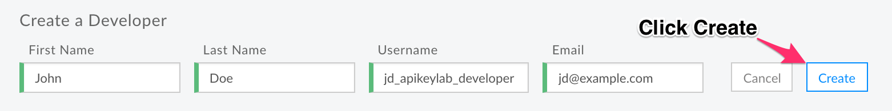

3. **Save** the API Product. If the Save button is not blue, make sure you have answered all required fields (marked with an asterisk).

   Note: We are adding the entire API Proxy to the API Product.  We can just as easily select one or more paths from one or more API Proxies and bundle them together in an API Product.

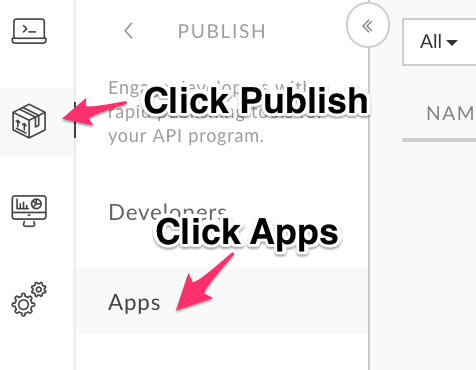

## Create An App Developer

Next we will create an App Developer who can consume the new API Product.

1. Select **Publish → Developers** from the side navigation menu.

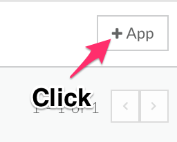

2. Click **+Developer**.

* Populate the following fields:

    * First Name: **{your_first_name}**

    * Last Name: **{your_last_name}**

    * Username: **{choose a username}**

    * Email: **{your_email}**

Click **Create** to save the new App Developer.

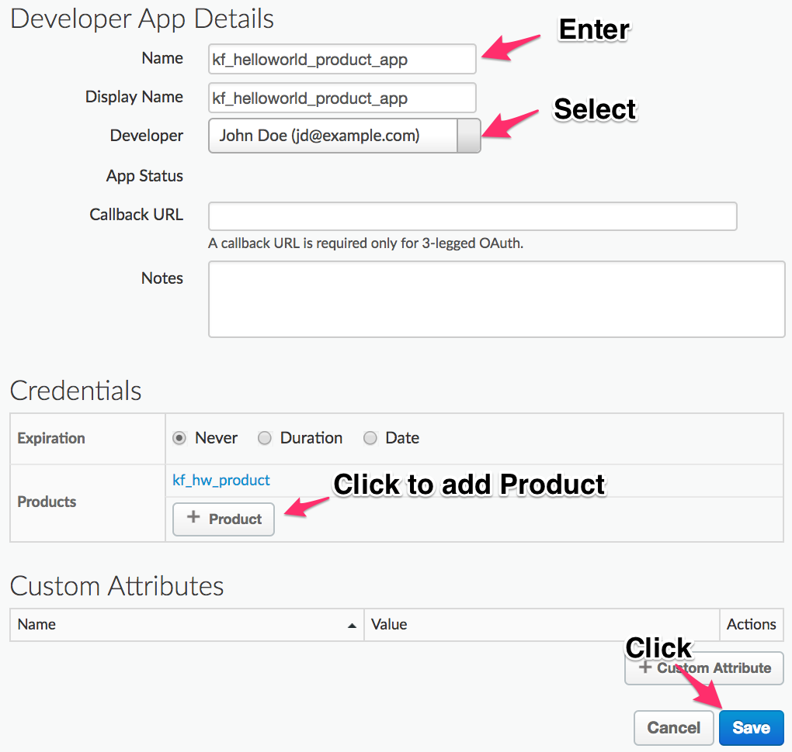

## Create An App And Retrieve its API Key

An App Developer can create any number of Apps.  Each App can register for any number of products.  We will create an App for our new App Developer, and register it with the API Product we created earlier in the lab.  Read more about Developer Apps [here](https://docs.apigee.com/api-platform/publish/creating-apps-surface-your-api).

1. Click **Publish → Apps** in the side navigation.


2. Click **+App**. Populate the following fields:

    * Name: My Employee App

    * Developer: *Select Developer, then the developer you created from the pulldown.*

    * Callback URL: Leave it blank. The Callback URL is required for 3-legged OAuth implementation scenarios.

    * Credentials: *Click "Add a credential".*

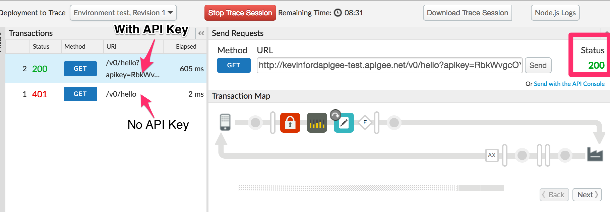

3. Leave Expiry at Never, and click OK.

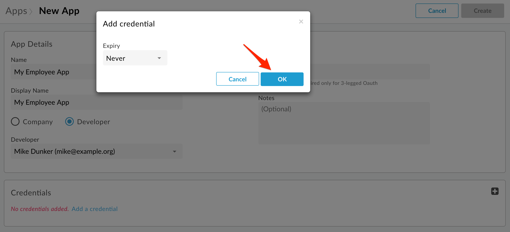

4. Click *Add Product*.

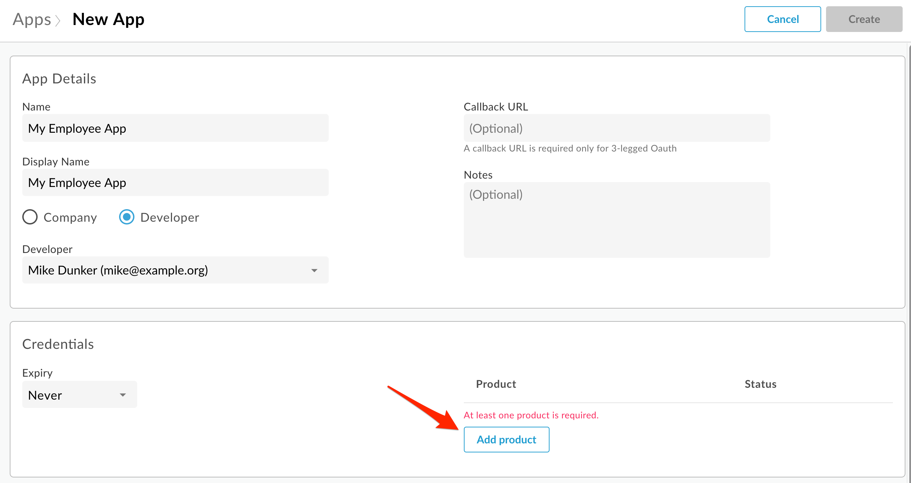

5. Select **employee-product**, and click Add.

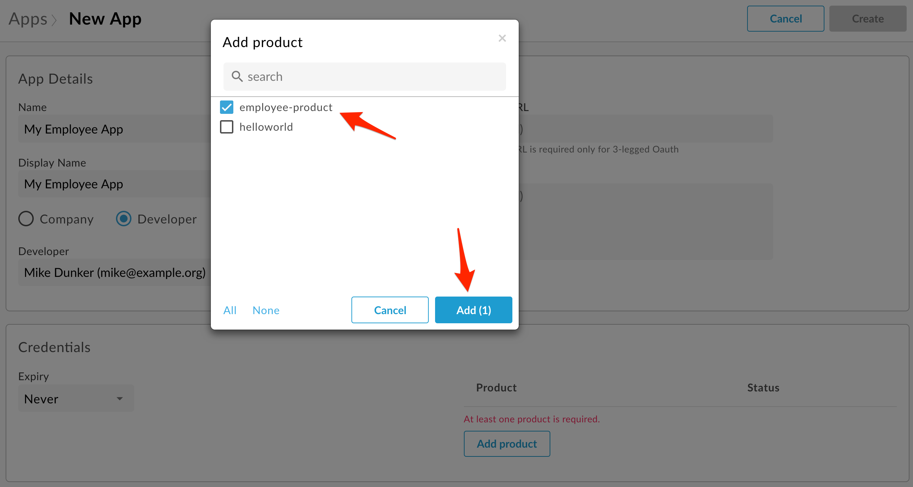

6. Click **Create**.

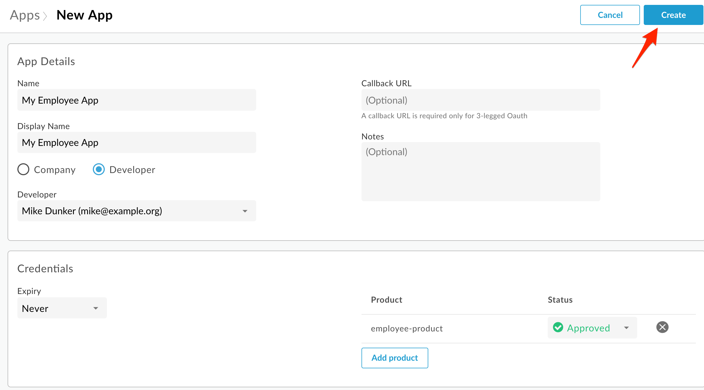

7. Click *Show* for *Key*.  This will reveal the API Key that must be used to invoke the API when API Key verification is in use.  Copy this key into a text document for later use.  

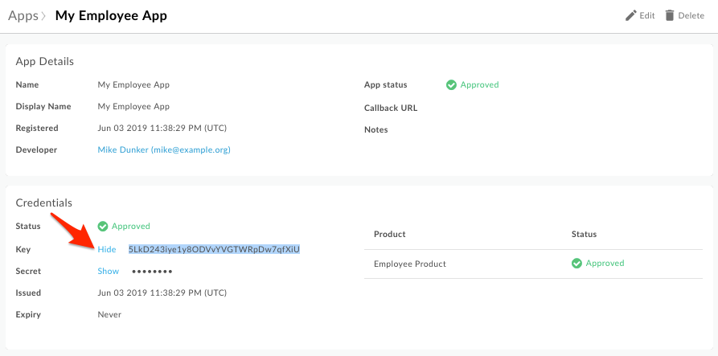

## Add a Verify API Key Policy

1. Menu: **Develop > API Proxies**

2. Open your API Proxy and click the **Develop** tab to see the flow editor (you may have to move the panes to see the full request and response flow lines).

3. Click **+Step** on the request flow and select *Verify API Key* policy from the *Security* section of the list.  The name can be changed or left at the default. Click **Add**.


4. The policy will be added after any policies you previously had in the Request flow.  Whenever adding a policy to a flow, think about where the policy should be in relation to the other policies in the flow. In this case, drag the new policy to be the leftmost. The policy order in the flow configuration will change to reflect the new order.

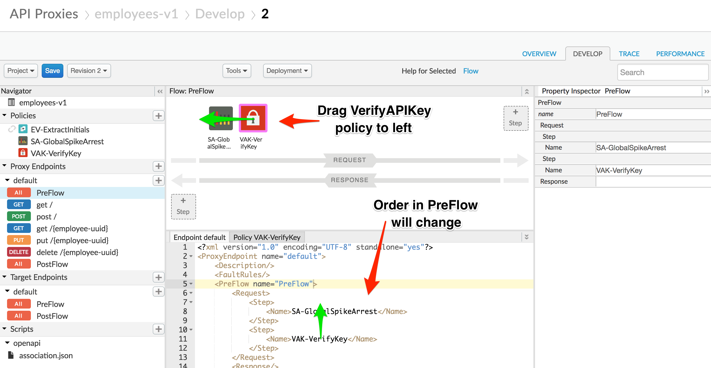

5. With the *Verify API Key* policy selected, you can see its configuration. The default config can be used unchanged. Note that the API Key is being retrieved from the context as the variable *request.queryparam.apikey*.  This is the default, but the policy can be configured to retrieve the key from any variable you prefer. You can use the snippet below to simply the configuration.

```
<VerifyAPIKey continueOnError="false" enabled="true" name="VAK-VerifyKey">
    <APIKey ref="request.queryparam.apikey"/>
</VerifyAPIKey>
```


6. Let's also add [CORS functionality](https://docs.apigee.com/api-platform/develop/adding-cors-support-api-proxy) to the proxy. We didn't use the *Add CORS* checkbox when we created the proxy using the wizard. This is because you might run into problems if you use the default implementation when using the "Try it out" functionality of the portal API documentation, which we will be doing later.

First, select the **Proxy PostFlow**, and click **+Step** on the *Response* flow.


7. Select *Assign Message* policy from the *Mediation* section of the list. Name the policy *AM-AddCORSHeaders*.

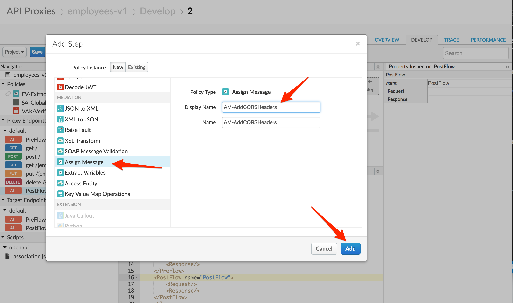

Replace the *Assign Message* policy text with the following:

```
<AssignMessage continueOnError="false" enabled="true" name="AM-AddCORSHeaders">
    <Set>
        <Headers>
            <Header name="Access-Control-Allow-Origin">{request.header.Origin}</Header>
            <Header name="Access-Control-Allow-Headers">origin, x-requested-with, accept, content-type</Header>
            <Header name="Access-Control-Max-Age">600</Header>
            <Header name="Access-Control-Allow-Methods">GET, PATCH, PUT, POST, DELETE</Header>
        </Headers>
    </Set>
    <IgnoreUnresolvedVariables>true</IgnoreUnresolvedVariables>
    <AssignTo createNew="false" transport="http" type="response"/>
</AssignMessage>
```


This policy will set the required CORS headers. We only want to set the headers if the Origin header is set in the request, so add a condition line to the existing *Add-CORS* policy step:

```
    <PostFlow name="PostFlow">
        <Request/>
        <Response>
            <Step>
                <Name>AM-AddCORSHeaders</Name>
                <Condition>request.header.Origin != null</Condition>
            </Step>
        </Response>
    </PostFlow>
```


We also want to make sure that the target is skipped if the request verb is "OPTIONS". We'll add a no target route rule for this case. Change the complete list of route rules in the proxy endpoint to this (you should find the rout rules at the bottom of the Endpoint default XML file):

```
    <RouteRule name="NoRoute">
        <Condition>request.verb == "OPTIONS" AND request.header.Origin != null</Condition>
    </RouteRule>
    <RouteRule name="default">
        <TargetEndpoint>default</TargetEndpoint>
    </RouteRule>
```

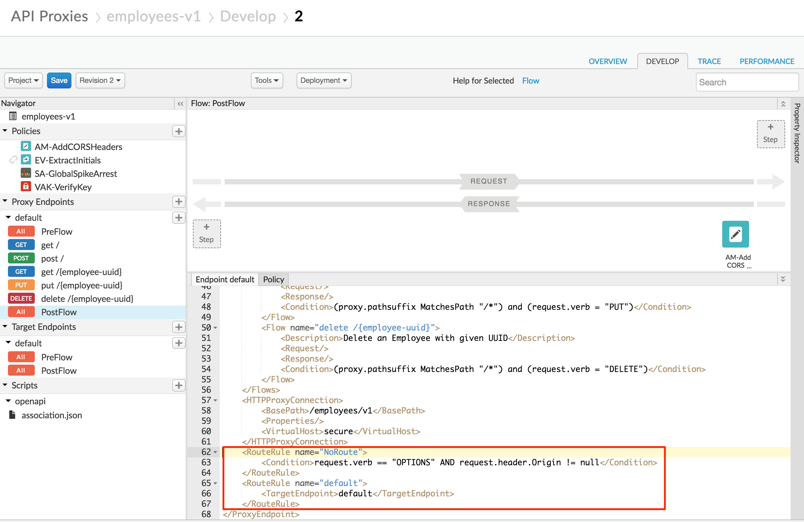

If the request verb is "OPTIONS", we also shouldn't require the API key. Add a condition that does not verify the API key for OPTIONS requests:

```
            <Step>
                <Name>VAK-VerifyKey</Name>
                <Condition>request.verb != "OPTIONS"</Condition>
            </Step>
```

8. **Save** the API Proxy.

9. Click the **Trace** tab near the top of the window.

10. Click **Start Trace Session** to begin a trace session.

11. Click **Send** to send a request.  If your API Proxy requires query parameters, add them prior to sending, but do not add the API Key yet.

   You should see a 401 (unauthorized) response for your API Call because the API Proxy was expecting an API Key as a query parameter.


12. Now add the query parameter ```?apikey={your_api_key}``` to the URL in the trace tool and try again.  Use the API Key you created earlier and resend the request.

   You should see a 2xx response code and the Trace for that request should show that the Verify API Key policy is now passing.

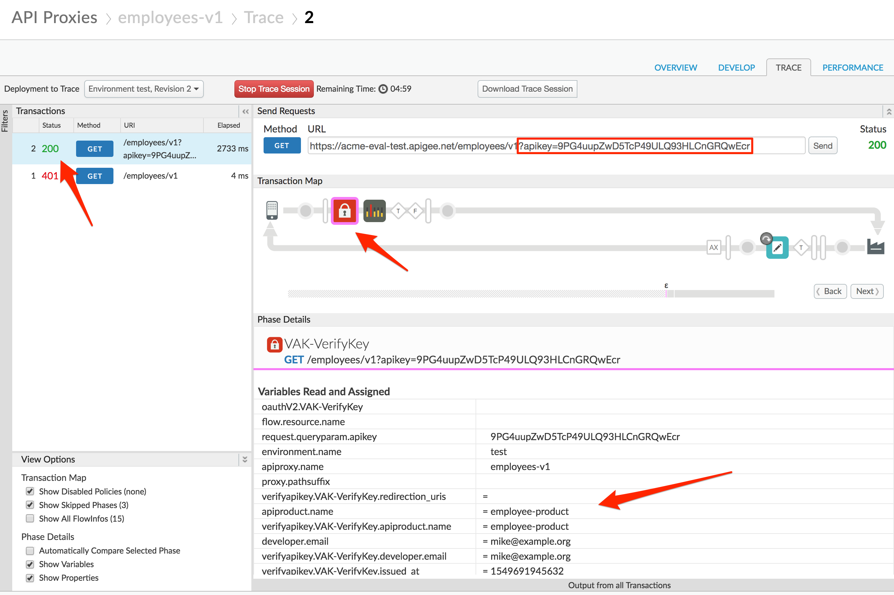

# Lab Video

If you would rather watch a video that covers this topic, point your browser [here](https://youtu.be/3nUFCOgGlS8).

# Earn Extra-points

Now that you have secured an API Proxy with an API Key, you have access to details about the calling App, Developer, and associated API Product in the API flow.  See if you can locate these details for a protected API call.

A few examples of where this might be useful.

* Route to a sandbox backend when a Product has the custom attribute of sandbox=true.

* Implement different quota policies for Apps that have been approved but not yet verified.

* Analyze traffic by calling App, Developer, or Product.

# Quiz

1. Why is the Verify API Key policy typically one of the first policies in the Proxy Request PreFlow?  When might it be in a conditional flow instead of the "All" PreFlow?

2. How would you configure the policy to get the API Key from a header called "Api-Key" instead of the default query parameter location?

3. If an API key (consumer key) was compromised, and was being used by a malicious actor, how could you create a new API key, and later invalidate the old one?

# Summary

In this lab you learned how to protect your API Proxy using the Verify API Key policy.  You implemented the policy and tested it using the built-in Trace Tool.

# References

* Link to Apigee docs page

    * Verify Api Key Policy [https://docs.apigee.com/api-platform/reference/policies/verify-api-key-policy](https://docs.apigee.com/api-platform/reference/policies/verify-api-key-policy)

# Next step

Now go to [Lab-5](../Lab%205%20Traffic%20Management%20-%20Rate%20Limit%20APIs)
