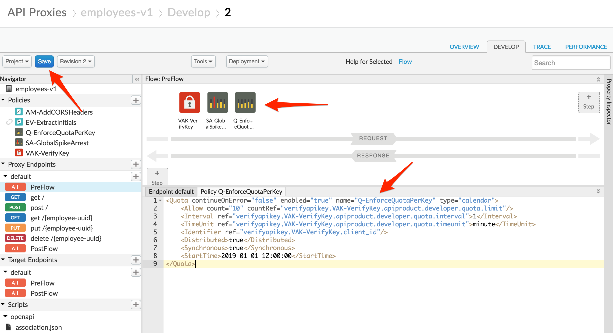
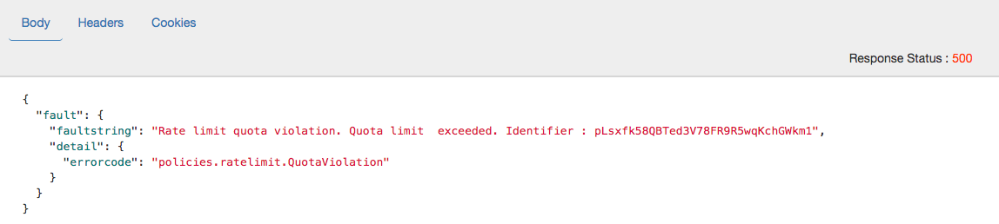

# Traffic Management : Rate Limit APIs

*Duration : 20 mins*

*Persona : API Team / API Product Manager*

# Use case

You have a requirement to apply rate limits (quota limits) dynamically, such that you can package your APIs into different service levels, each with its own quota applied. For example, you want to be able to provide ‘Platinum’ level access that has a very high quota, and ‘Bronze’ level access that has a very low quota, both to the same underlying APIs.

# How can Apigee Edge help?

Apigee provides the capability to apply quotas to API Proxies to limit access to them as required.

Apigee also allows you to set API Quota settings at the ‘API Product’ level, allowing you to define multiple products for the same APIs, each with its own quota settings.

# Pre-requisites

You must have completed the *API Security - Securing APIs using API Keys* lab in order to run this lab. 

# Instructions

Note: As you will have already completed the *API Security - Securing APIs using API Keys* lab and are familiar with how to setup API Products and Developer Apps, and how to use the test client to specify an API Key, detailed instructions for those steps will be omitted here. Refer back to the *API Security - Securing APIs using API Keys* lab if you need to see detailed instructions for those steps.

1. Login to Edge Management UI.

2. Open up the **Develop** tab of your Employees API that you used in the previous lab.

3. In the proxy request pre-flow add a **Quota policy** named *Q-EnforceQuotaPerKey* directly after the spike arrest policy. Use the following configuration (note that in the below configuration ‘VAK-VerifyKey’ refers to the name of the Verify API Key policy that you have in your proxy. If you are using a different name, you will need to replace all occurrences of 'VAK-VerifyKey' in this policy with the name you used for your API key policy):

```
<Quota continueOnError="false" enabled="true" name="Q-EnforceQuotaPerKey" type="calendar">
    <Allow count="10" countRef="verifyapikey.VAK-VerifyKey.apiproduct.developer.quota.limit"/>
    <Interval ref="verifyapikey.VAK-VerifyKey.apiproduct.developer.quota.interval">1</Interval>
    <TimeUnit ref="verifyapikey.VAK-VerifyKey.apiproduct.developer.quota.timeunit">minute</TimeUnit>
    <Identifier ref="verifyapikey.VAK-VerifyKey.client_id"/>
    <Distributed>true</Distributed>
    <Synchronous>true</Synchronous>
    <StartTime>2019-01-01 12:00:00</StartTime>
</Quota>
```

Note the *Identifier* field -- the quota will be enforced per client_id (API key). The *Allow*, *Interval*, and *TimeUnit* fields will take their values from the API product quota configuration.

Also add a condition to the policy that skips the quota check if the request verb is OPTIONS (this is for CORS -- see Lab 4):

```
        <Request>
            <Step>
                <Name>VAK-VerifyKey</Name>
                <Condition>request.verb != "OPTIONS"</Condition>
            </Step>
            <Step>
                <Name>SA-GlobalSpikeArrest</Name>
            </Step>
            <Step>
                <Name>Q-EnforceQuotaPerKey</Name>
                <Condition>request.verb != "OPTIONS"</Condition>
            </Step>
        </Request>
```

Your API Proxy should now look like this:



4. Press **Save** to save your proxy.

5. Edit the API product that was created before (Employee Product). This will now be the Bronze proxy. Change the display name to **Employee Product - Bronze**.

For the **Bronze** product, specify a quota limit of 1 request per minute:


Click **Save**.

6. Create a new API Product named **employee-product-platinum**.
 
Populate the following fields:

    * Section: Product Details

        * Name: employee-product-platinum

        * Display Name: Employee Product - Platinum

        * Description: Platinum Access to the Employee API

        * Environment: test

        * Access: Public

        * Quota: 1000 requests every 1 minute

    * Section: API Resources

        * Section: API Proxies

            * API Proxy: employees-v1



Click **Save**.

7. Register 2 new Developer Apps, one for each of your products. Record the API Keys for each App.

8. Launch the [REST Test client](https://apigee-rest-client.appspot.com/) and run some tests using each API Key. Verify that with the *Bronze* API key that you cannot send in more than 1 request per minute without triggering a quota exceeded exception:

    

8. Verify with the *Platinum* key that you can send in more than 1 request per minute.	

# Lab Video

If you like to learn by watching, here is a short video on setting up dynamic quotas [https://www.youtube.com/watch?v=f9jg1fJJTRE](https://www.youtube.com/watch?v=f9jg1fJJTRE) 

# Earn Extra-points

Start a trace session for your API Proxy and use it to determine at what point the quota values specified in the API product are made available within the API Proxy.

# Quiz

1. What would happen if the Quota Policy were placed before the Verify API Key policy?

2. In the configuration we provided the ‘Distributed’ and ‘Synchronous’ attributes were both set to ‘true’. What is the implication if we set these to ‘false’?

3. How would you configure the quota so that POST calls are counted as 2 calls for the purposes of evaluating the quota?

4. What adverse effect could happen for the caller if the quota policy had been put before the spike arrest policy?

# Summary

That completes this hands-on lesson. In this simple lab you learned how to apply a quota to an API Proxy and use API Product configuration to dynamically alter the quota within different contexts.

# References

* Useful Apigee documentation links on quotas - 

    * Quota Policy Reference - [https://docs.apigee.com/api-platform/reference/policies/quota-policy](https://docs.apigee.com/api-platform/reference/policies/quota-policy) 

    * Community post on setting up dynamic quotas [https://community.apigee.com/questions/1488/how-do-the-quota-settings-on-an-api-product-intera.html](https://community.apigee.com/questions/1488/how-do-the-quota-settings-on-an-api-product-intera.html) 

* Watch this 4 minute video on "Dynamic Quotas’ - [https://youtu.be/z8Rj_VzSbh4](https://youtu.be/z8Rj_VzSbh4) 

# Next step

Now to go [Lab-6](../Lab%206%20API%20Publishing%20-%20Documentation)
