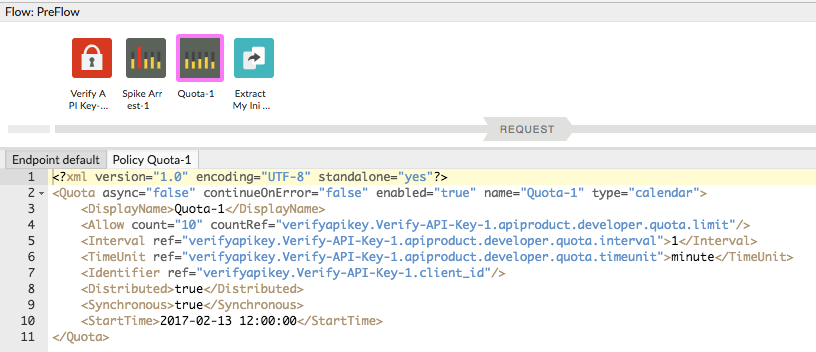

# Traffic Management : Rate Limit APIs

*Duration : 20 mins*

*Persona : API Team / API Product Manager*

# Use case

You have a requirement to apply rate limits (quota limits) dynamically, such that you can package your APIs into different bundles each with their own quotas applied. For example, you want to be able to provide ‘Platinum’ level access that has a very high quota, and ‘Bronze’ level access that has a very low quota, both to the same underlying APIs.

# How can Apigee Edge help?

Firstly, Apigee provides the capability to apply quotas to API Proxies to limit access to them as however required.

Secondly, Apigee provides the capability to apply API Quota settings at the ‘API Product’ level, allowing you to define multiple products for the same APIs each with their own quota settings.

# Pre-requisites

You must have completed the *API Security - Securing APIs with API Keys* lab in order to run this lab. 

# Instructions

Note: As you will have already completed the *API Security - Securing APIs with API Keys* lab and are familiar with how to setup API Products and Developer Apps, and how to use the test client to specify an API Key, detailed instructions for those steps will be omitted here. Refer back to the *API Security - Securing APIs with API Keys* lab if you need to see detailed instructions for those steps.

* Login to Edge Management UI.

* Open up the **Develop** tab of your Employees API that you used in the previous lab.

* In the proxy request pre-flow add a **Quota policy** directly after the *Verify API Key Policy* with the following configuration (note that in the below configuration ‘Verify-API-Key-1’ refers to the name of the Verify API Key policy that you had added. If you used a different name you will need to alter this in the configuration):

```
<?xml version="1.0" encoding="UTF-8" standalone="yes"?>
<Quota async="false" continueOnError="false" enabled="true" name="Quota-1" type="calendar">
    <DisplayName>Quota-1</DisplayName>
    <Allow count="10" countRef="verifyapikey.Verify-API-Key-1.apiproduct.developer.quota.limit"/>
    <Interval ref="verifyapikey.Verify-API-Key-1.apiproduct.developer.quota.interval">1</Interval>
    <TimeUnit ref="verifyapikey.Verify-API-Key-1.apiproduct.developer.quota.timeunit">minute</TimeUnit>
    <Identifier ref="verifyapikey.Verify-API-Key-1.client_id"/>
    <Distributed>true</Distributed>
    <Synchronous>true</Synchronous>
    <StartTime>2017-02-13 12:00:00</StartTime>
</Quota>
```

* Your API Proxy should now look like this:



* Create 2 new API Products that include this proxy, ‘**{your_initials}**_Employees Bronze Product’ and ‘**{your_initials}**_Employees Platinum Product’

For both products specify as before:

  * Environment: test

  * Access: Public

  * Key Approval Type: Automatic

For the **Bronze** product specify a quota limit of 1 request per minute:


For the **Platinum** product specify a quota limit of 1000 requests per minute:

	

* Register 2 new Developer Apps, one for each of your new products. Record the API Keys for each App.

* Launch the [REST Test client](https://apigee-rest-client.appspot.com/) and run some tests using each API Key. Verify that with the *Bronze* API key that you cannot send in more than 1 request per minute without triggering a quota exceeded exception:


* Verify with the *Platinum* key that you can send in more than 1 request per minute.	

# Lab Video

If you like to learn by watching, here is a short video on setting up dynamic quotas [https://www.youtube.com/watch?v=f9jg1fJJTRE](https://www.youtube.com/watch?v=f9jg1fJJTRE) 

# Earn Extra-points

Start a trace session for your API Proxy and use it to determine at what point the quota values specified in the API product are made available within the API Proxy.

# Quiz

1. In the configuration we provided the ‘distributed’ and ‘synchronous’ attributes were both set to ‘true’. What is the implication if we set these to ‘false’?

2. How would you configure the quota so that POST calls are counted as 2 calls for the purposes of evaluating the quota?

# Summary

That completes this hands-on lesson. In this simple lab you learned how to apply a quota to an API Proxy and use API Product configuration to dynamically alter the quota within different contexts.

# References

* Useful Apigee documentation links on quotas - 

    * Quota Policy Reference - [http://docs.apigee.com/api-services/reference/quota-policy](http://docs.apigee.com/api-services/reference/quota-policy) 

    * Community post on setting up dynamic quotas [https://community.apigee.com/questions/1488/how-do-the-quota-settings-on-an-api-product-intera.html](https://community.apigee.com/questions/1488/how-do-the-quota-settings-on-an-api-product-intera.html) 

* Watch this 4minute video on "Dynamic Quotas’ - [https://youtu.be/z8Rj_VzSbh4](https://youtu.be/z8Rj_VzSbh4) 

# Rate this lab

How did you like this lab? Rate [here](https://goo.gl/forms/BJGUY07XCGboHxrw2).

Now to go [Lab-6](https://github.com/apigee/devjam3/tree/master/Labs/Core/Lab%206%20API%20Publishing%20-%20Documentation)
