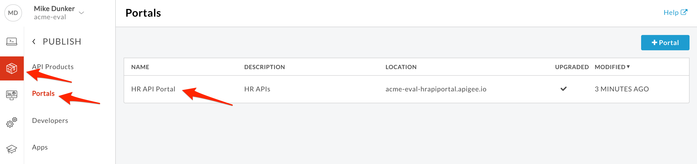
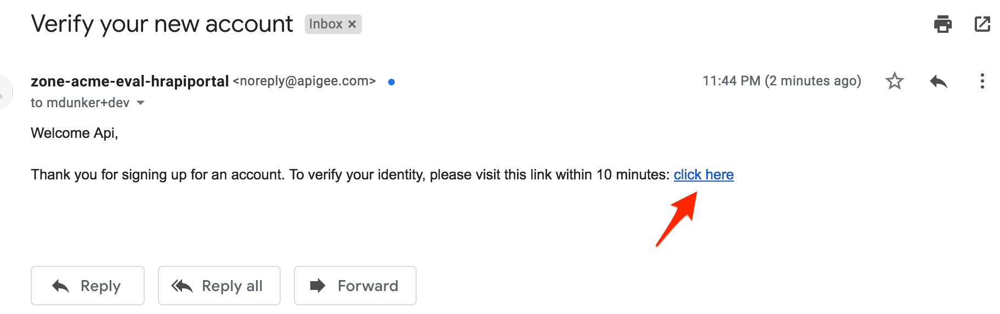
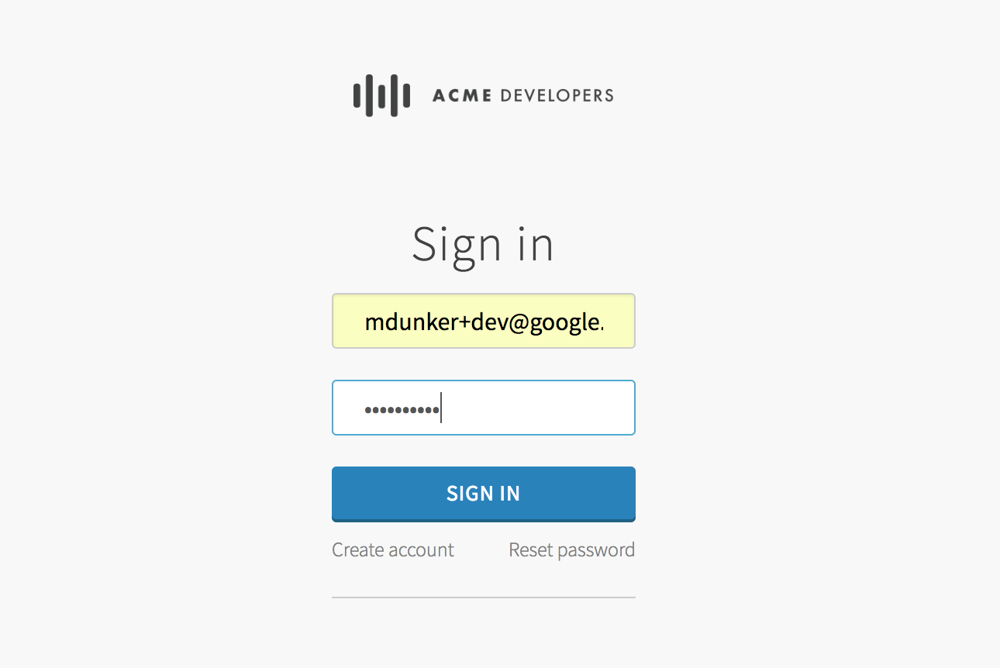
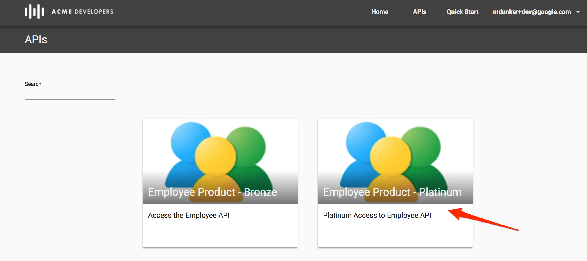
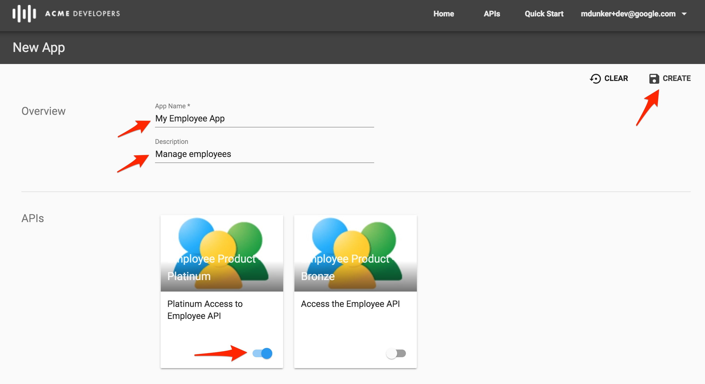
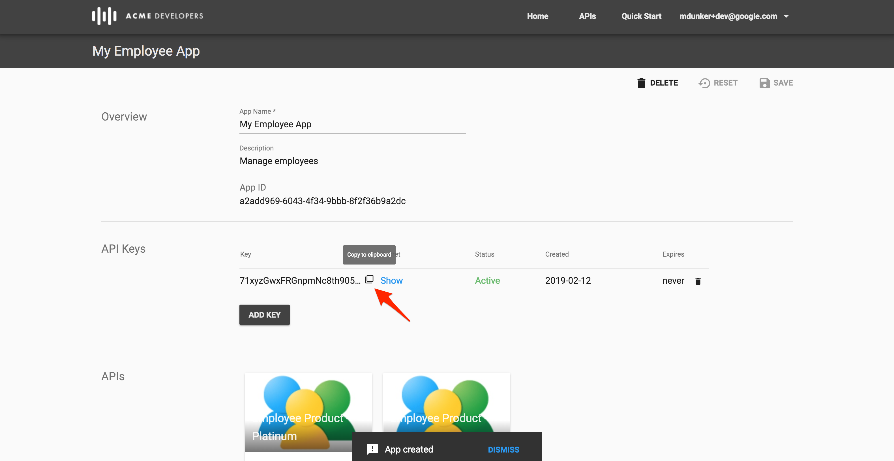

# API Publishing : Consume APIs 

*Duration : 20 mins*

*Persona : Developer*

# Use case

As an App Developer you would like to learn about APIs exposed by the API Team using API Documentation. Register in the API Portal to get access to the APIs exposed by the API Team.

# How can Apigee Edge help?

Apigee Edge provides an out of the box lightweight Developer Portal which allows an API Team to publish API documentation, and allows app developers to self register for the portal. Once logged in, an app developer can create apps to get API Keys used to access the APIs.

In this lab, we will see how to use the Developer Portal to register as an app developer, navigate through API documentation, create an app in the Developer Portal to access API keys, and test the APIs using the keys we got from the Developer Portal.

# Pre-requisites

Secure APIs using API Keys, Publishing API Documentation lab exercises. If not, jump back to *API Security - Securing APIs using API Keys* lab.

# Instructions

## Open Your Portal

1. Go to [https://apigee.com/edge](https://apigee.com/edge) and log in. This is the Edge management UI. 

2. Select **Publish → Portals** in the side navigation menu. Click on the **HR API Portal** that you have created in earlier lab exercise.	

4. Click on **Live Portal** link to access Developer Portal to start interacting as Developer persona.

## Gain Access to API Documentation

1. In this lab, we will play the role of App Developer who would like to access the APIs and API Documentation.

2. Let’s register as an App Developer by clicking on **Sign In** link on home page, and then **Create Account**.

3. Fill in first and last name, email address (must be a real address to get the email), and a password. Click the terms and conditions box, and then click on **Create Account**.

4. You will get a message that says, **Check your inbox**. Check your inbox for the email, and click the link.

5. You'll be returned to the portal homepage. Click **Sign In**, and then sign in to the portal.

6. You will see your email address in the upper right corner, indicating you are logged in. Click on the **APIs** link in top menu or center box.

7. Click the platinum API product.

8. Explore the API Documentation and understand the API requests and responses.

## Register a New App

Typically, developers who want to consume APIs go to the developer portal and register to use them. When registering, the developer gets to select which of the API products he or she wishes to use. For example, some products may be offered for free, while others require payment depending on a service plan. Upon completion, this registration step produces an Edge entity called a **developer app**. A developer app includes the products the developer selected and a set of API keys that the developer will be required to use to access the APIs that are associated with those products. 

1. To Create a developer app, Click on your email address in the upper right and then **My Apps** in top menu bar.

2. Click on **+New App** to create an App.

3. Update the App Name and Description, and select the platinum product. Click on **Create** button to create a new App.

**Congratulations** You have successfully generated an API key which can be used to make secured API calls! Click on the box to the right of the Key to copy the API key to the clipboard. You can use this key to make API calls to the Employee API.

# Lab Video

If you like to learn by watching, here is a short video on consuming APIs using Apigee Developer Portal [https://youtu.be/nCJwlVF6waw](https://youtu.be/nCJwlVF6waw)

# Earn Extra-points

You have registered in the Developer Portal, created an app, and read the API Documentation. Now that you have an API key, use it to make some calls via the portal's live documentation and via an API tool like [Postman](https://getpostman.com) or the [Apigee REST Tool](https://apigee-restclient.appspot.com).

# Quiz

1. When you create an app, what is created along with the key, and when is it used?

2. Is it possible to create different apps with same app name?

3. Is it possible to associate multiple API Products with a single app?

# Summary

In this simple lab you learned how to self register as an app developer to access APIs, create apps, access API keys, and use live API documentation.

# References

* Useful Apigee documentation links on Apigee Developer Portal.

    * Apigee Developer Portal , [https://docs-new.apigee.com/portal](https://docs-new.apigee.com/portal)

# Next step

Now go to [Lab-8](../Lab%208%20API%20Analytics%20-%20Custom%20Reports)
