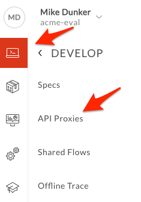
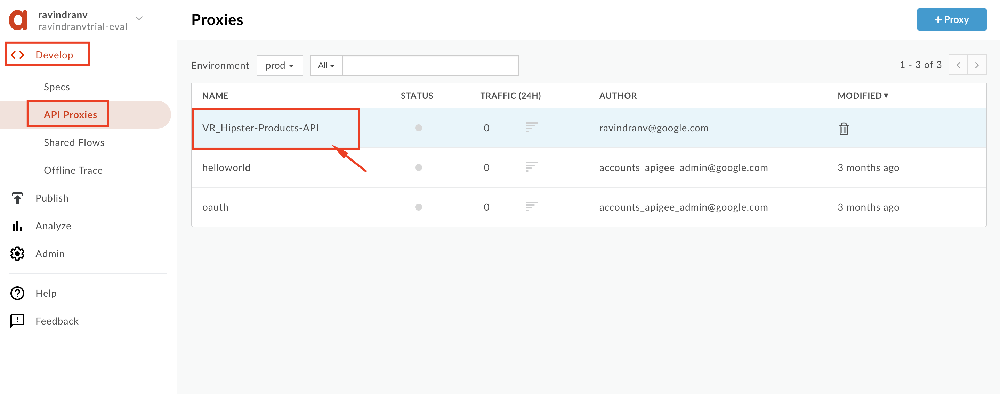
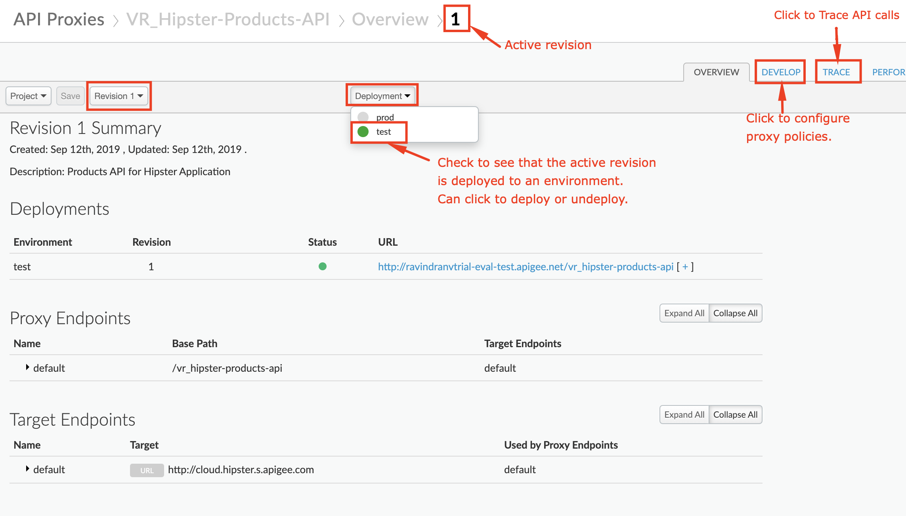
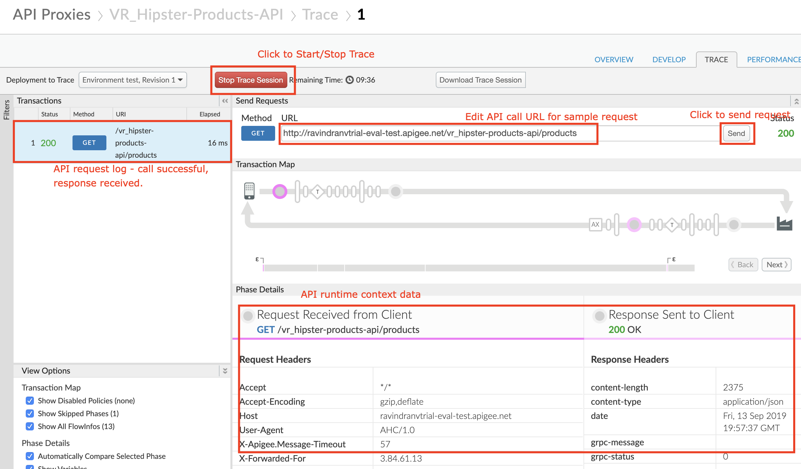
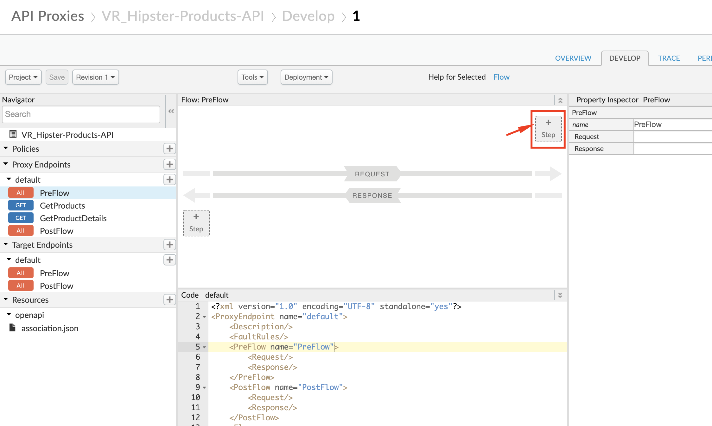
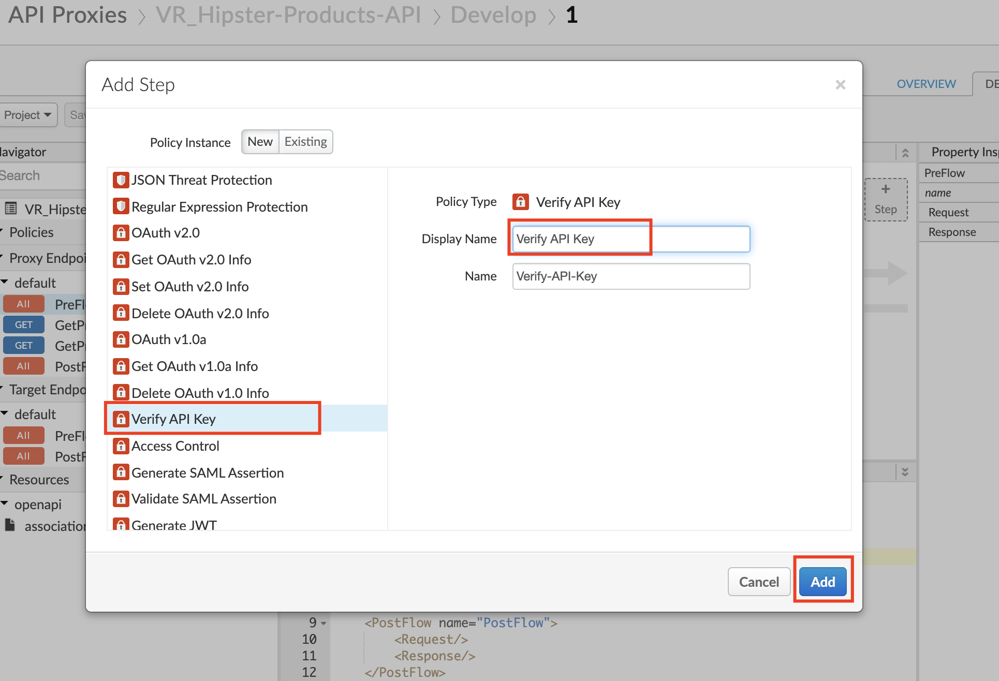
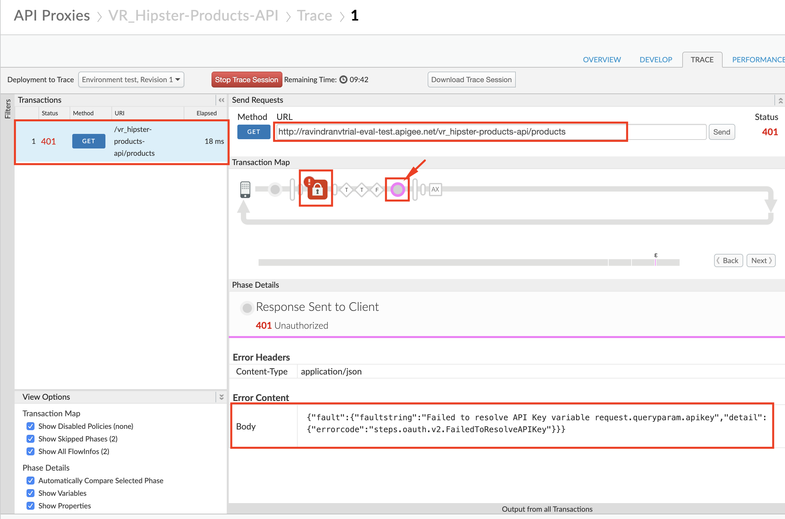

# API Security : Securing APIs with API Keys

*Duration : 10 mins*

*Persona : API Team*

# Use case

You have an API proxy that you want to secure, so that you can manage access and perform business logic based on the client making the call.  In addition to authorizing users, you want to know which developer app is making calls so you can leverage that data to customize your API behavior based on the entitlement level of the caller, or even the specific caller.  You also would like to be able to see who is calling your API proxies in your Analytics dashboards.

# How can Apigee Edge help?

The [Verify API Key Policy](http://docs.apigee.com/api-services/reference/verify-api-key-policy) in Edge authenticates that the call is coming from an approved application in a valid state.  App developers who wish to access secure operations must request [API keys](https://docs.apigee.com/api-platform/security/api-keys) for their apps via the developer portal.

In addition to authenticating requests, the [Verify API Key Policy](https://docs.apigee.com/api-platform/reference/policies/verify-api-key-policy) provides context about the app making the call.  This context can be used to apply policies such as quota enforcement or routing based on the client app.  Upon successful verification of the API Key, the API Context is populated with details about the app, developer, and API product associated with the call.  This data can be used for applying business logic as well as gaining business insights through analytics.

In this lab, you will protect an existing API proxy with the [Verify API Key Policy](https://docs.apigee.com/api-platform/reference/policies/verify-api-key-policy) and use the trace tool to see the policy in action.  To accomplish this you will modify an existing API proxy to add a security policy to handle the authorization.  

# Pre-requisites

For this lab, you will need an API proxy that is not currently secured.  If you do not have an API proxy available for this lab, revisit the lab "API Design : Create a Reverse Proxy from OpenAPI Spec" and then return here to complete these steps.

# Instructions

## Choose (and invoke) an API Proxy to secure

* Go to [https://apigee.com/edge](https://apigee.com/edge) and log in. This is the Edge management UI

* Select **Develop → API Proxies**



* Select the **employees-v1** proxy that you created in an earlier lab exercise.



* Verify that the API proxy is deployed to an environment from the **Overview** page.  Environment(s) to which the selected revision of the API proxy is deployed will be indicated by a green circle.  If it is not deployed, click an environment from the "Deployment" pull-down to deploy the API proxy to that environment.



* Verify that you can successfully make calls using the built-in trace tool.

* Click the **Trace** tab near the top of the window.

* The Trace view allows you to initiate tracing for up to 10 minutes, during which time all requests (regardless of whether they are sent from the trace tool or any other client) will be captured and their traces made visible to you.

* Click **Start Trace Session** to begin a trace session.

* Click **Send** to send a request.  If your API proxy requires query parameters add them here prior to sending.

* You should see a successful 2xx response for your API Call (it may take a few seconds for the trace results to appear)



## Add a Verify API Key Policy

* Menu: **Develop > API Proxies**

* Open your API proxy and click the **Develop** tab (in the upper right area of the page) to see the flow editor (you may have to move the panes to see the full request and response flow lines)

* Click **+Step** on the request flow.



* Select *Verify API Key* policy from the *Security* section of the list.  The name can be changed or left at the default.

* Click **Add**



* The policy will be added after any policies you previously had in the Request flow.  Since we likely want this to occur first, drag the new policy to be the leftmost of any policies in the flow.

* With the *Verify API Key* policy selected, you can see its configuration (the default policy configuration is below).  Note that the API Key is being retrieved from the context as the variable *request.queryparam.apikey*.  This is the default but the policy can be configured to retrieve the key from any parameter key you prefer.

```
<?xml version="1.0" encoding="UTF-8" standalone="yes"?>
  <VerifyAPIKey async="false" continueOnError="false" enabled="true" name="VAK-VerifyKey">
    <DisplayName>VAK-VerifyKey</DisplayName>
     <Properties/>
    <APIKey ref="request.queryparam.apikey"/>
</VerifyAPIKey>
```

* **Save** the API proxy.

* Click the **Trace** tab near the top of the window.

* Click **Start Trace Session** to begin a trace session.

* Click **Send** to send a request.  

* You should see a 401 (unauthorized) response for your API Call because the API proxy was expecting an API Key as a query parameter.  See the trace session below

* NOTE: In Lab 4, you will get an API Key that will allow you to make this API call successfully.



# Lab Video

If you would rather watch a video that covers this topic, point your browser [here](https://youtu.be/3nUFCOgGlS8). (note: you only need to watch until the 3:00 minute mark for this specific lab).

# Quiz

1. Why is the Verify API Key policy typically found as the first policy in the Request PreFlow?  When might it be in a conditional PreFlow instead of the "All" PreFlow?

2. How would you configure the policy to get the API Key from a header called "Api-Key" instead of the default query parameter location?

# Summary

In this lab you learned how to protect your API proxy using the Verify API Key policy.  You implemented the policy and tested it using the built-in Trace Tool.

# References

* Link to Apigee docs page

    * Verify Api Key Policy [https://docs.apigee.com/api-platform/reference/policies/verify-api-key-policy](https://docs.apigee.com/api-platform/reference/policies/verify-api-key-policy)

# Rate this lab

How did you like this lab? Rate [here](https://goo.gl/forms/XxDqVtWHnyFdEChv1).

Now go to [Lab-3](../Lab%203%20API%20Publishing%20-%20API%20Products%20and%20Developer%20Portals)

