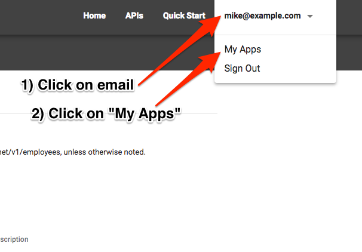
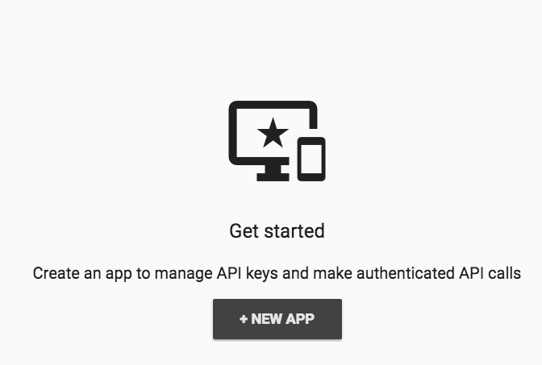
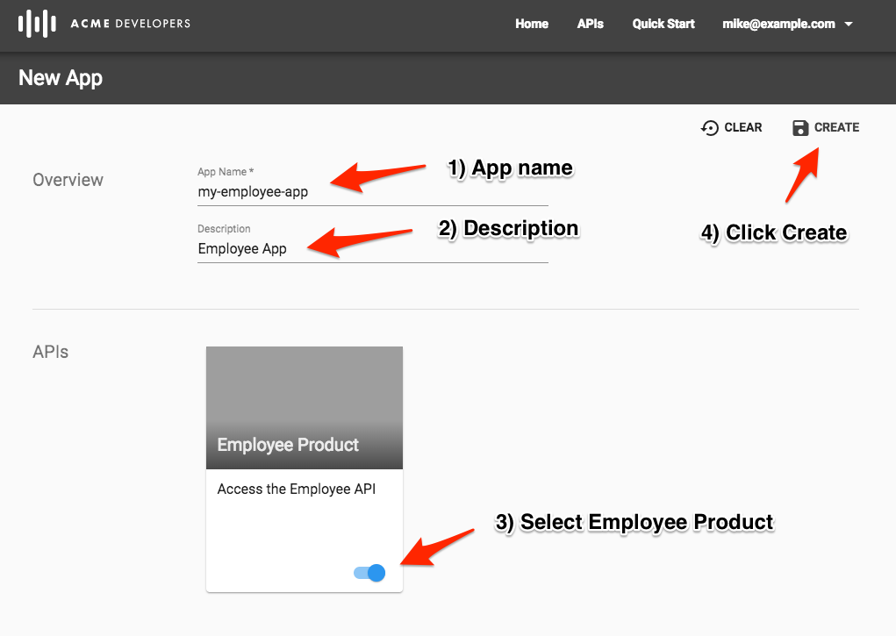
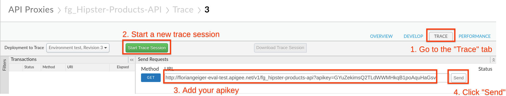
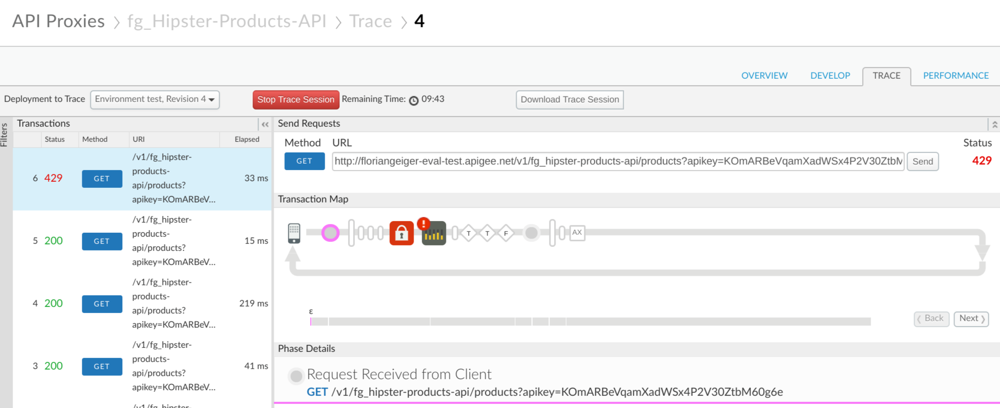

# API Consumption : Developers and Apps 

*Duration : 15 mins*

*Persona : Developer*

# Use case

As an app developer you would like to learn about APIs exposed by the API Team using API Documentation. Register using the Developer Portal to get access to the APIs exposed by the API Team.

# How can Apigee Edge help?

Apigee Edge has an out-of-the-box lightweight Developer Portal which allows the API Team to publish API Documentation. As an app developer you can self register with API Platform. Once logged in, you can create apps to get API keys.  API keys can be used to access protected APIs.

In this lab, we will see how to register as an app developer, create an app in the Developer Portal to access API keys, and test the APIs using the keys we got from the Developer Portal.

# Pre-requisites

*API Security* and *API Publishing* lab exercises. 

# Instructions

* Go to [https://login.apigee.com/](https://login.apigee.com/) and log in.

* Select **Publish → Portals** in the side navigation menu. Select the developer portal that you created in earlier lab exercise.	


* Click on the **Live Portal** link to access the Developer Portal to start interacting as a developer.


* In this lab, we will play the role of an app developer who would like to access the APIs and API Documentation.

* Let’s register as an app developer by clicking on the **Sign In** link on the home page.


* In the **Sign In** page, click on **Create account**


* Fill in the details and then click on **Create Account**


* As the message indicates, check your inbox to view the confirmation email.


* Click on the verification link in your confirmation email to verify your account. You will be redirected back to the developer portal.


* Once again, click on the **Sign In** button, then fill in your Developer Portal credentials to log into the portal.


* Note that the **Sign In** button has been replaced with your email, indicating a successful login.


* Click on the **APIs** link in the top menu to view the list of API products associated to this portal.


* Click on the employee product to view the API Product documentation.


* Go through API Documentation to view the list of APIs and visualize the API Request and Response.


* Let’s **create** a developer app.

Typically, developers who want to consume APIs go to the developer portal and register to use them. When registering, the developer gets to select which of the API products he or she wishes to use. For example, some products may be offered for free, while others require payment depending on a service plan. Upon completion, this registration step produces an Edge entity called a **developer app**. A developer app includes the products the developer selected and a set of API keys that the developer will be required to use to access the APIs that are associated with those products. 

* To Create an app, Click on your **Email Address** & then **My Apps** in the top menu bar.



* Click on **+ New App** to create an app.



* Fill in the app's name, description, and click on the toggle to enable access to the Employee product.  Click on the **Create** button to create a new developer app.



* After the app has been created, the app page will now have a new section containing the API key. Copy the key, which can be used to make secured API calls.



* From the main Apigee UI (not the Developer Portal), go back to the Employee API you've already created and click the **Trace** tab in the upper right.

* Click **Start Trace Session** to begin a trace session.

* Click **Send** to send a request. (Do not add the API key to the query string yet). You should see a 401 (Unauthorized) response for your API call because the API proxy was expecting an API key as a query parameter.  See the trace session below.

* Now add the query parameter ```?apikey={your_api_key}``` to the URL in the trace tool and try again.  (Replace ```{your_api_key}``` with the API key you just copied in this lab and resend the request. You should see a 2xx response code and the Trace for that request should show that the Verify API Key policy is now passing.



# Lab Video

If you like to learn by watching, here is a short video on consuming APIs using Apigee Developer Portal [https://youtu.be/nCJwlVF6waw](https://youtu.be/nCJwlVF6waw)

# Earn Extra-points

* Now that you have registered in your developer portal and created an app, read the API documentation, and explore more by making more API calls using keys generated above.

* Explore the Edge UI (not the developer portal) and find and examine the developer and developer app you created using the developer portal.

# Quiz

1. When you create an app, what are the different keys associated with it?

2. Is it possible to create different apps with same app name?

3. Is it possible to associate multiple API products with same app?

# Summary

That completes this hands-on lesson. In this simple lab you learned how to self register as an app developer to access APIs, create apps, access API keys, and navigate through API documentation.

# References

* Useful Apigee documentation link on lightweight Apigee developer portal:

    * Apigee Developer Portal: [https://docs-new.apigee.com/portal](https://docs-new.apigee.com/portal)

# Rate this lab

How did you like this lab? Rate [here](https://goo.gl/forms/H4qE5nLy36yWjj642).

Now to go [Lab-5](../Lab%205%20Traffic%20Management%20-%20Rate%20Limit%20APIs/README.md)


