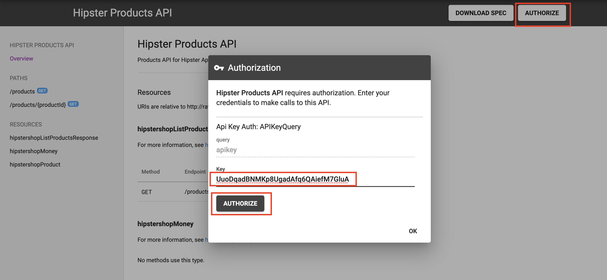

# Lab 4 - Build an App Developer Experience using Apigee Integrated Developer Portals

*Duration : 15 mins*

*Persona : API Team*

# Use case

You want to provide and manage an easy, self-service on-boarding experince for app developers who wish to consume your API Products via a Developer Portal.  You want to enable app developers to learn about, register for, and begin using your APIs, as well as control visibility and access to different API Products.

# How can Apigee Edge help?

Apigee Edge provides multiple options for your Developer Portal. Apigee supports several developer portal solutions, ranging from simple turn-key to fully customizable and extensible. The turn-key [Integrated Developer Portal](https://docs.apigee.com/api-platform/publish/portal/build-integrated-portal) option supports branding and customization of much of the site, such as theme, logos, and page content, and can be published in seconds, directly from the management UI.  We also provide a [Drupal-based portal](https://docs.apigee.com/api-platform/publish/drupal/open-source-drupal-8) if you want full control and to leverage any of the hundreds of Drupal modules available in the Drupal Market.  This lab focuses on the Integrated Developer Portal.

## Developer Programs, Teams and Audience Management

On Apigee Edge, a [Developer Program](https://docs.apigee.com/api-platform/publish/portal/intro-developer-program) is the configuration set associated to each Developer Portal - specifically, App Developer accounts, App Developer identity management configuration, App Developer Teams, and Audience configuration for access to content published on the portal.

App Developers have the option of creating [Teams](https://docs.apigee.com/api-platform/publish/portal/developer-teams) to share responsibility for an app with other developers. Each developer within a Team is assigned a role (`Owner`, `App Admin` or `Viewer` ) that defines their access level to the shared apps.

[Audience](https://docs.apigee.com/api-platform/publish/portal/portal-audience) configurations are used to segment portal users or developer teams to control access to the following resources:
* Pages in your portal
* Published API products

The following figure shows how audiences are used to control access to a set of resources.


In this lab, you will create an Integrated Developer Portal wherein you will publish API Products, and through which app developers can 
* learn API usage through OpenAPI specification based interactive documentation
* register Apps that consume API Products, and thereby
* generate App client credentials (API Key and Secret) that can be used to consume APIs.

# Pre-requisites

For this lab, you should have completed [Lab 1](https://github.com/aliceinapiland/apijam/tree/master/Module-1/Labs/Lab%201), [Lab 2](https://github.com/aliceinapiland/apijam/tree/master/Module-1/Labs/Lab%202) and [Lab 3](https://github.com/aliceinapiland/apijam/tree/master/Module-1/Labs/Lab%203) of this module.

You will need…

* An OpenAPI specification uploaded to your Spec store within your Organization. This specification will make up the documentation of your API.  If you do not have an OpenAPI Specification available for this lab, revisit [*Lab 1 - Design & Create an API Proxy with OpenAPI Specification*](https://github.com/aliceinapiland/apijam/tree/master/Module-1/Labs/Lab%201)
* API Products that bundle your API Proxies. If you do not have an API Product configured, revisit [*Lab 2 - API Security and API Producer/Consumer Relationship on Apigee Edge*](https://github.com/aliceinapiland/apijam/tree/master/Module-1/Labs/Lab%202), and [Lab 3 - Manage tiered API Product subscription through API call quotas](https://github.com/aliceinapiland/apijam/tree/master/Module-1/Labs/Lab%203).

# Instructions

## Update the Open API Spec

In order to ensure that we have an updated OpenAPI Spec that accurately describes the API endpoint exposed through our API Proxy, we must first modify the spec - specifically the `host`, `basepath`, `securityDefinitions` and `security` properties. To do this, navigate to **Develop → Specs** on the main menu, select the spec that we previously imported in Lab 1, and modify the the `host`, `basepath`, `securityDefinitions` and `security` properties as shown below:

    `host: {{your API proxy host}}`  _<--- In Apigee Trial orgs this will be {{your org}}-{{environment}}.apigee.net_
    `basepth: /v1/{{your initials}}_hipster-products-api`
    ```
        securityDefinitions:
            APIKeyQuery:
                type: "apiKey"
                in: "query"
                name: "apikey"
        security:
        - APIKeyQuery: []
    ```


## Create a Developer Portal

1. Navigate to **Publish → Portals** and click **+Portal**, or **Get started** (if you haven't created any portals yet within the org).


2. Enter details in the portal creation wizard. Replace **{{your-initials}}** with the initials of your name.

  * Name: {{your initials}}\_Hipster API Portal

  * Description: Developer portal for consumption of Hipster APIs.

3. Click **Create**


## Publish the Bronze API Product to the Portal

1. Click the Portal Editor’s dropdown and select **APIs**.


2. Click **+API** to select the Bronze API Product to publish to the Portal. Select the API Product to publish and click **Next**.


3. Click the **Change Spec Source** dropdown and select **Choose a different spec...**.


4. Select the recently updated OpenAPI Specification to use as a source. The current version (snapshot) of the selected OpenAPI Specification will be used to generate the documentation for this API product in the portal.


5. Select the **Registered users** option so registered developers on the Developer Portal can view this API through the portal. Click **Next**.


6. Select the **Image** button to update the icon image associated with this API product. 


7. Then select **External Image** and provide the following URL to import image.

`Image URL: https://raw.githubusercontent.com/aliceinapiland/apijam/master/Module-1/Labs/Lab%204/media/HipsterAPIProductImage.png`


8. Click **Finish**.


The API product is now published to the developer portal.

## App Developer sign-up

1. Click the **Live Portal** link to launch a browser tab/window with the new Developer Portal.


2. On the developer portal, click the main menu option labeled **Sign In**. This will take you to the App Developer login page. Here, click **Create Account**.


3. Provide the following details, and then click **Create Account**.

    ```
    First Name: {{your first name}}
    Last Name: {{your last name}}
    Email: {{your email address}}
    Password: {{enter a password}}
    Check the "I agree to terms." box
    ```


4. On account creation, the App Developer will receive an email notification with an account verification link. 


Since we you have provided your own email address as the App Developer in this lab, you should have received this notification. Click the link or copy and paste it into the browser to verify the account.


5. Once account is verified, the App Developer can sign into the portal using their credentials.


## View API Documentation

1. Log in as App Developer using the account credentials created in the previous steps. Click on the **APIs** menu link on the Developer Portal. This will take you to the API catalog page. Here' you will see that API product we previously published to be visible to all registered developers.


2. Click the API Product icon for the Bronze product in the catalog, to view it's documentation. This will take you to an interactive documentation page generated from the OpenAPI spec that we associated to the API product at the time of publishing.


3. To test the API, first click on the **Authorize** button to provide a valid API Key.
Provide one of the API Keys you obtained from the previous labs to authorize test calls to the API.




4. Select one of the API resource paths from the left pannel of the docs and click **Execute**. You will then see the response in the right pannel.

## Enable Audience and Teams features

1. To utilize Audience and Teams features, you must first enroll into the Beta program within Edge. To do this, navigate to the **Publish -> Developer Programs** menu on the Edge UI, and select the developer program associated with your developer portal.


2. Click the **Enroll** button to "Enroll in beta for team and audience management".


## Create Developer Team

2. Ensure that you are logged into the Developer Portal with your App Developer credentials. Navigate to the **Teams** menu from your account drop-down.

* In the Portal UI, click **APIs** to view the products that have been published. Products are used to bundle APIs together so that a developer can request access to a set of related functionality without registering for each API.  They are also useful for managing access to, and quotas for, particular developers.  For more on API products, [read this document](https://docs.apigee.com/api-platform/publish/what-api-product).


* The Portal will display live documentation based on the OpenAPI Specification. The left pane is an index of the resources and API calls documented. The center pane shows the documentation for the selected item. The right pane allows the user to try out the API. Select the first API documented in the left pane. This API returns a list of all employees. Depending on the method, you’d expect to see model details, response codes, etc., as per the [OpenAPI Specification](https://github.com/OAI/OpenAPI-Specification/blob/master/versions/2.0.md). Try the API yourself using the right pane. 


# Lab Video

If you would rather watch a video that covers this topic, point your browser [here](https://youtu.be/_gDpzDJPNQg). (note: instead of using the "Street Carts" sample, use the "Employee API" that you have built in Lab 1).

# Earn Extra-points

* Add a second product to the portal and test it by launching the Live Portal.

* Update your API specification, and then [take a snapshot](https://docs-new.apigee.com/publish-apis#take-snapshot) of the specification to update the portal documentation. 

# Quiz

1. What are two reasons why you might publish multiple API products to the Developer Portal?

2. Changes made to OpenAPI Specification are made available in the Developer Portal automatically.  True or False?

# Summary

You’ve learned how to do the following:

* Deploy the Apigee Lightweight Developer Portal

* Publish an API Product with an OpenAPI Specification

* Use the Developer Portal UI to browse the OpenApi Specification Snapshot as a developer.

# Rate this lab

How did you link this lab? Rate [here](https://goo.gl/forms/j33WG2U0NFf02QHi1).

Now go to [Lab-4](../Lab%204%20API%20Consumption%20-%20Developers%20and%20Apps)
