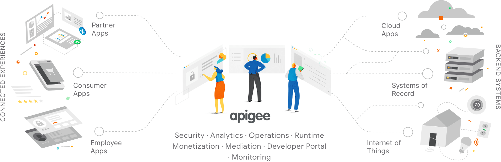

# Module 1 - API Management
This is the supporting material for a one-day hands-on workshop that introduces developers to Apigee Edge. We call this event an "**Apigee API Jam**". This module - the **"Apigee API Jam - Module 1 - API Management"** - focuses on giving attendees an overall understanding of how to build a successful API program with a well managed developer ecosystem. Attendees will learn how to manage their APIs across all phases of the API Lifecycle - including API design, API Security, Developer consumption, as well as API Analytics and Monitoring. 

All of the material here is released under the [Apache 2.0 license](./LICENSE.md)

### Agenda
* A brief presentation & product overview: 15 mins

### [Labs](./Labs) 
1. **API Design & Creation** - Design OAS & Create a Reverse Proxy with the OpenAPI specification [Link](./Labs/Lab%201)
2. **API Products, Apps & API Keys** - Securing APIs with API Keys, bundle APIs into API Products and understand the association between Apps, API Products & API Keys [Link](./Labs/Lab%202)
3. **Rate Limiting**: Rate Limit API Consumption based on API Product tier quotas. [Link](./Labs/Lab%203)
4. **App Developer Experience** - Publish API Products Catalog through a self-service Developer Portal. Test App Developer on-boarding experience & API consumption. Restrict access to resources using Teams and Audience entitlements. [Link](./Labs/Lab%204)
5. **API Analytics** - Measure API Program Success with Apigee Analytics [Link](./Labs/Lab%205)

You can start with the first lab [1. API Design - Design & Create an API Proxy with OpenAPI specification](./Labs/Lab%201)

#### Apigee Community 
If you have any questions/comments please visit https://community.apigee.com/index.html

##### This is not an official Google or Apigee product. This repository is used for educational/training purposes only.
