# Security : Throttle APIs

*Duration : 10 mins*

*Persona : API Team / Security*

# Use case

You have an existing Apigee API proxy that takes requests from the Internet and forwards them to an existing service. You have a requirement to protect your target servers (backend) from traffic spikes. You would like to protect your APIs from denial of service attacks that might lead to performance lags or downtime of your backend. 

# How can Apigee Edge help?

By exposing an API through Apigee Edge, you gain the ability to modify and monitor its behavior using out-of-the-box policies. Edge's out-of-the-box policies enable you to enhance your API with sophisticated features to control traffic, enhance performance, enforce security, and increase the utility of your APIs, without requiring you to write any code or to modify any backend services. Extension policies enable you to implement custom logic in the form of JavaScript, Python, Java, and XSLT.

In this lab we will see how to use an out of the box traffic management policy, "Spike Arrest", to protect against traffic spikes. A Spike Arrest policy can throttle the number of requests processed by an API proxy and sent to a backend, protecting against performance lags and downtime.

# Pre-requisites

* Basic understanding of [OpenAPI Specification](https://github.com/OAI/OpenAPI-Specification) (Swagger)
* Completed a previous [Virtual API Jam](https://github.com/rmistry75/devjam3/tree/master/Labs/VirtualAPIJam) or have the equivalent knowledge. Alternatively, go through the ["Getting started guide"](https://docs.apigee.com/api-platform/get-started/get-started) in the Apigee Docs site.

# Instructions

## Deploy an API Proxy

1. An initial Apigee API proxy has been created for you. Download the API proxy [here](https://github.com/aliceinapiland/AdvancedVirtualAPIJam/blob/master/SecurityJam/Lab%201%20Traffic%20Management%20-%20Throttle%20APIs/apiproxy/Mock-Target-API.zip?raw=true).

2. Go to [https://apigee.com/edge](https://apigee.com/edge) and log in. This is the Edge management UI. 

3. Select **Develop → API Proxies** in the side navigation menu.

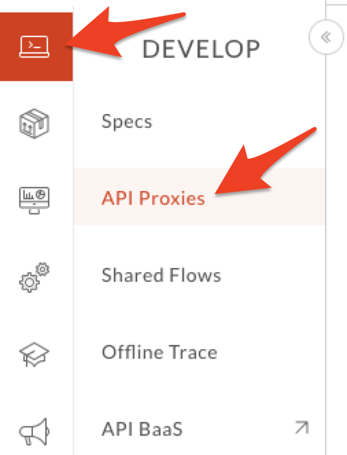

4. Click the **+Proxy** button on the top-right corner to invoke the Create Proxy wizard. 


5. Select **Proxy Bundle** and then click **Next** to import an existing proxy form a zip archive.

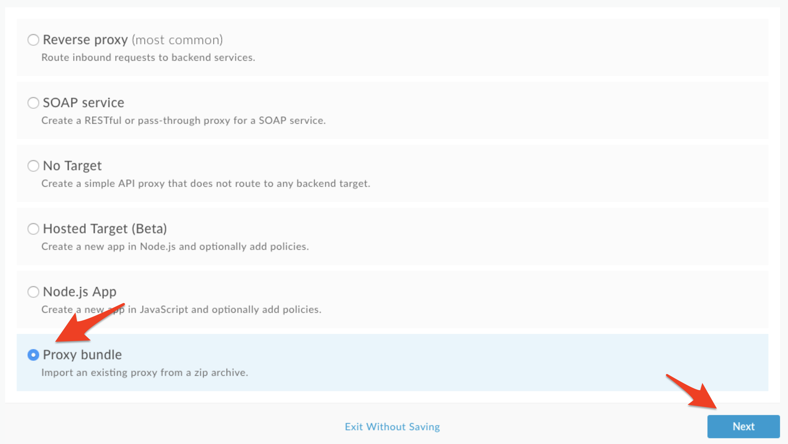

6. Click on **Choose File** and select the **Mock-Target-API.zip** that was previously downloaded in step 1 and click **Next**.

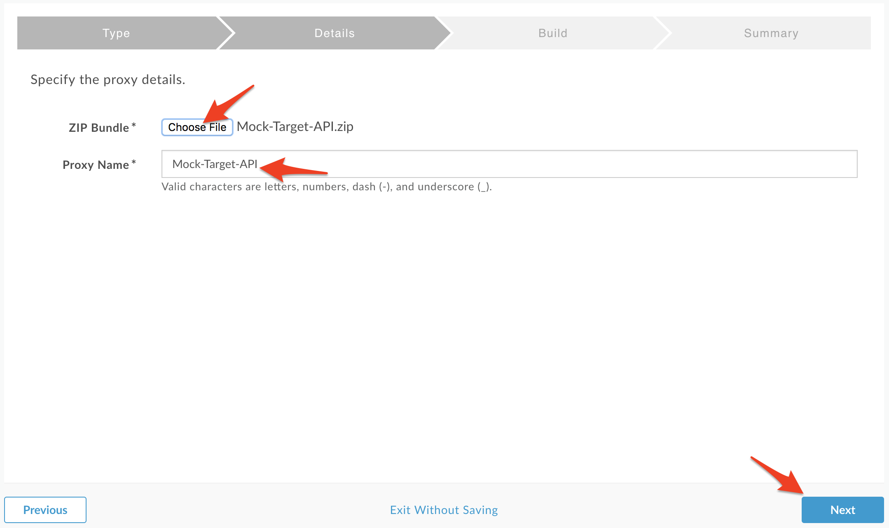

7. Click on **Build** to upload the the proxy.

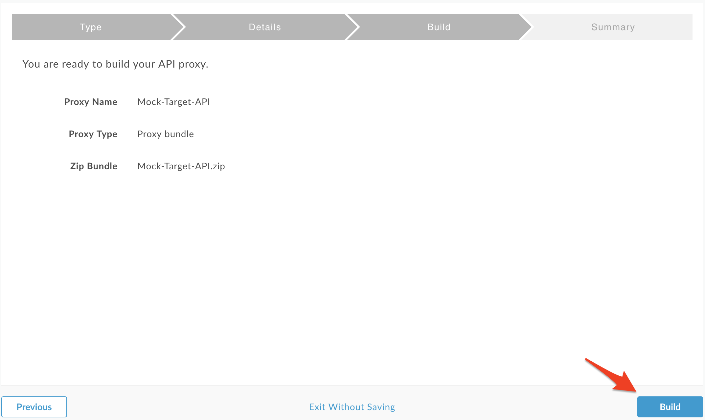

8. Verify the proxy was uploaded by selecting **Develop → API Proxies** in the side navigation menu.


* You should see the new **Mock-Target-API** proxy listed.

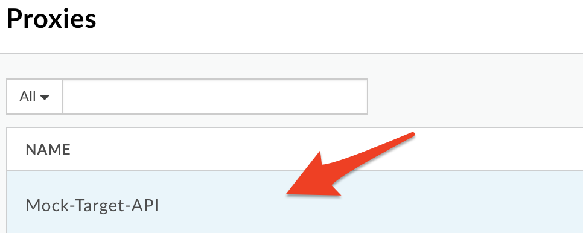

* Click on the **Mock-Target-API** proxy. Then click on **Deployment** and select the **test** environment to deploy the proxy to the test environment. 

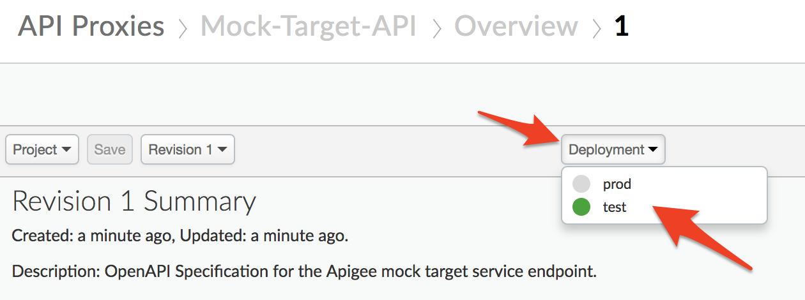

9. Verify that the proxy has been successfully deployed.

* Click on the Trace tab on the upper right corner.

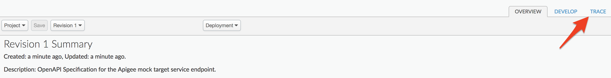

* Click on the **Start Trace Session** button and then click on the **Send** button to send traffic to your new proxy. You should see transactions appear on the left hand pane as requests are sent to your proxy.

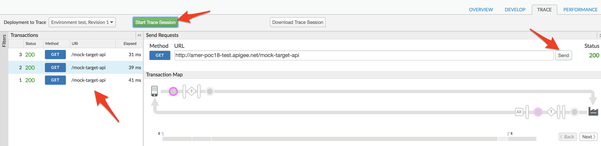

You have successfully deployed an API proxy that fronts a service. Let us now add rate limiting to this proxy to protect the backend from denial of service attacks.

## Add Rate Limiting to the API Proxy
1. Select **Develop → API Proxies** in the side navigation menu.


2. Click on the **Mock-Target-API** proxy that you created earlier.


3. Click on the **Develop** tab to access the API Proxy development dashboard.


4. Click on **PreFlow** under Proxy Endpoints default, and then click on **+Step** on the upper right of the Request flow to attach a Spike Arrest policy.

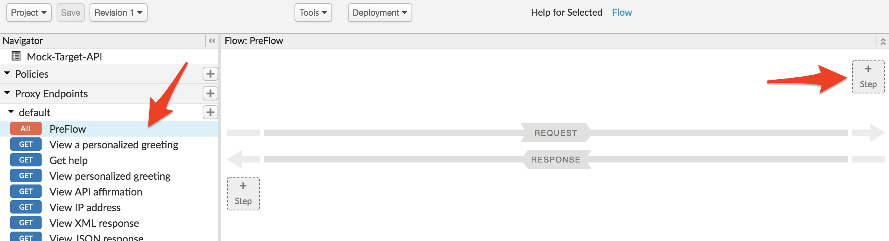

5. Select **Spike Arrest Policy**. Click on **Add** button to add the spike arrest policy to the proxy endpoint preflow request.

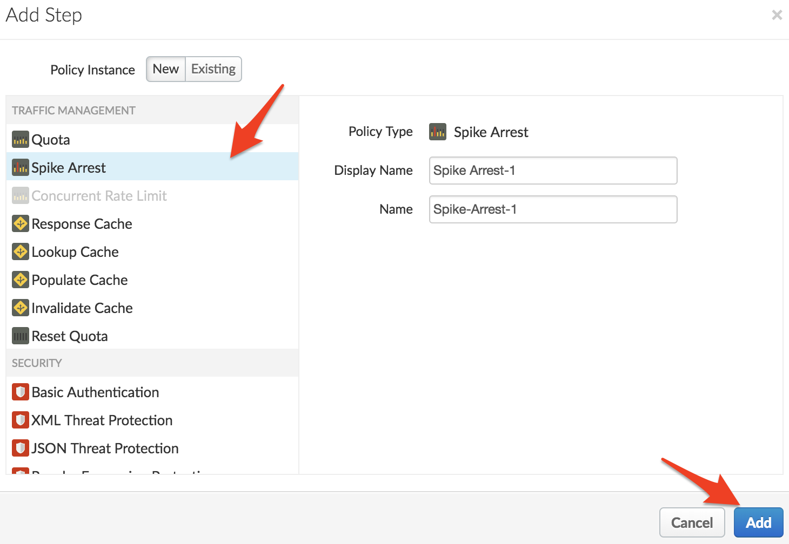

6. Note the Spike Arrest policy icon on top of request flow that shows exactly where the policy is attached. Select the policy to display the policy's XML configuration in the editor.

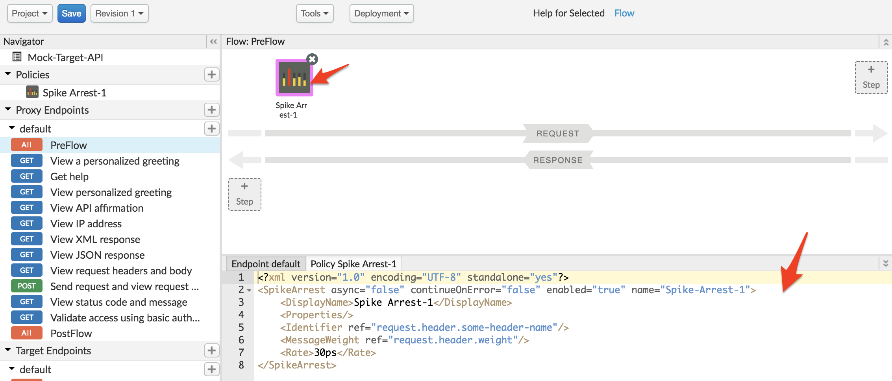

7. Change the Policy XML configuration to the below snippet to enforce a rate of 12 requests per minute.
```
<?xml version="1.0" encoding="UTF-8" standalone="yes"?>
<SpikeArrest async="false" continueOnError="false" enabled="true" name="Spike-Arrest-1">
    <DisplayName>Spike Arrest-1</DisplayName>
    <Properties/>
    <Rate>12pm</Rate>
    <UseEffectiveCount>true</UseEffectiveCount>
</SpikeArrest>
```

Think of Spike Arrest as a way to generally protect against traffic spikes rather than as a way to limit traffic to a specific number of requests. Your APIs and backend can handle a certain amount of traffic, and the Spike Arrest policy helps you smooth traffic to the general amounts you want.

The runtime Spike Arrest behavior differs from what you might expect to see from the literal per-minute or per-second values you enter.

For example, say you enter a rate of 6pm (6 requests per minute). In testing, you might think you could send 6 requests in 1 second, as long as they came within a minute. But that's not how the policy enforces the setting. If you think about it, 6 requests inside a 1-second period could be considered a mini spike in some environments.

What actually happens, then? To prevent spike-like behavior, Spike Arrest smooths the number of full requests allowed by dividing your settings into smaller intervals:

* **Per-minute** rates get smoothed into full requests allowed in intervals of **seconds**. For example, 6pm gets smoothed like this: 60 seconds (1 minute) / 6pm = 10-second intervals, or 1 request allowed every 10 seconds. A second request inside of 10 seconds will fail. Also, a 7th request within a minute will fail.

* **Per-second** rates get smoothed into full requests allowed in intervals of **milliseconds**. For example, 10ps gets smoothed like this: 1000 milliseconds (1 second) / 10ps = 100-millisecond intervals, or 1 request allowed every 100 milliseconds. A second request inside of 100ms will fail. Also, an 11th request within a second will fail.

8. Click on **Save** to save the API Proxy changes.

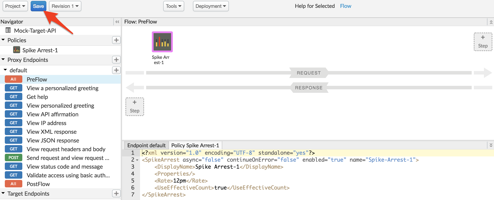

*Congratulations!*...You have now secured your backend against denial of service attacks, performance lags or downtime of target servers.

## Test the Spike Arrest

1. Let us test the updated API proxy using the Trace Console. Click on **Trace** tab.


2. Click on **Start Trace Session** to see API Proxy with spike arrest in action.

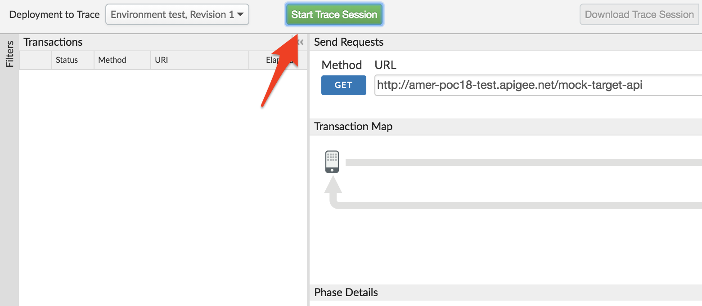

3. Click on **Send** button multiple times, You will see a 500 or 429 response code when spike arrest policy kicks in to protect target servers from spike in traffic.

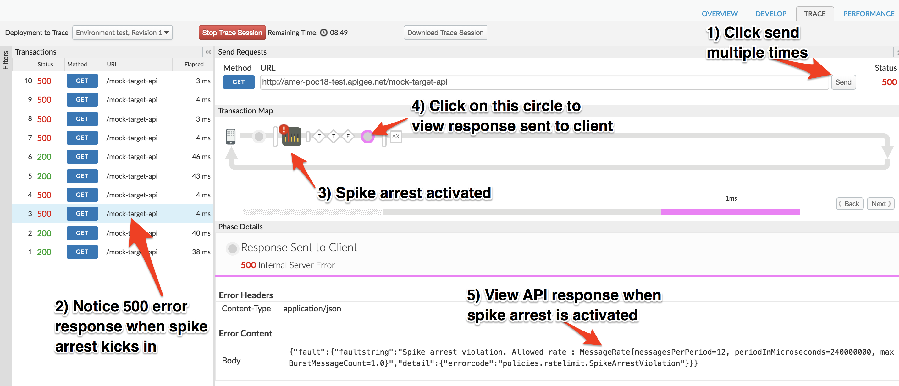

4. You might notice that number of requests with 200 response is more than spike arrest rate value configured, It’s due to multiple message processors where policies gets executed and each has individual counters.

# Lab Video

If you like to learn by watching, here is a short video on using Spike Arrest policy. [https://youtu.be/3Gi-GGTqllg](https://youtu.be/3Gi-GGTqllg)

# Earn Extra-points

Now that you have protected your backend against spike in traffic, Explore more about spike arrest policy using docs here, [http://docs.apigee.com/api-services/reference/spike-arrest-policy](http://docs.apigee.com/api-services/reference/spike-arrest-policy) & update the policy with identifer like queryparam on which spike arrest counter is updated. Use message weight property to assign a weight to the counter.

# Summary

That completes this hands-on lesson. In this simple lab you learned how to protect target servers against denial of service attacks.

# References

* Useful Apigee documentation links on Traffic Management & Spike Arrest Policy  - 

    * Spike Arrest Policy - http://docs.apigee.com/api-services/reference/spike-arrest-policy

    * Rate Limiting - [http://docs.apigee.com/api-services/content/rate-limiting](http://docs.apigee.com/api-services/content/rate-limiting)

    * Comparing Rate Limiting Policies - [http://docs.apigee.com/api-services/content/comparing-quota-spike-arrest-and-concurrent-rate-limit-policies](http://docs.apigee.com/api-services/content/comparing-quota-spike-arrest-and-concurrent-rate-limit-policies) 


Now go to [Lab-2](https://goo.gl/HvkmFV)
