# **API Security : Securing APIs with 2-legged OAuth (client credentials)**

*Duration : 30 mins*

*Persona : API Team/Security*

# **Use case**

You have an API that is consumed by trusted applications. You want to secure that API using two legged OAuth (client credentials grant type).

# **How can Apigee Edge help?**

Apigee Edge quickly lets you secure your APIs using out of the box OAuth policies. OAuth defines token endpoints, authorization endpoints, and refresh token endpoints. Apps call these endpoints to get access tokens, to refresh access tokens, and, in some cases, to get authorization codes. These endpoints refer to specific OAuth 2.0 policies that execute when the endpoint is called.

Most typically, the **"client_credentials"** grant type is used when the app is also the API resource owner. For example, an app may need to access a backend cloud-based storage service to store and retrieve data that it uses to perform its work, rather than data specifically owned by the end user. This grant type flow occurs strictly between a client app and the authorization server. An end user does not participate in this grant type flow. In this flow, Apigee Edge is the OAuth authorization server. Its role is to generate access tokens, validate access tokens, and pass authorized requests for protected resources, on to the resource server.

# **Pre-requisites**

* You have completed [Lab 1](https://github.com/aliceinapiland/AdvancedVirtualAPIJam/tree/master/SecurityJam/Lab%201%20Traffic%20Management%20-%20Throttle%20APIs). If not, please complete that first.

# **Instructions**

As part of this lab, we will:
- Expose OAuth access token edpoints via an API proxy, to generate access tokens based on the "client_credentials" grat type
- Secure our sample API with OAuth access token verification
- Publish API Products and manage API-consuming App cofigurations on Apigee Edge, to generate a valid set of client credentials.

## Create OAuth Token Endpoints

1. Go to [https://apigee.com/edge](https://apigee.com/edge) and log in. This is the Edge management UI.

2. Select **Develop** → **API Proxies** in the side navigation menu.


3. Click the **+Proxy** button on the top-right corner to invoke the Create Proxy wizard.

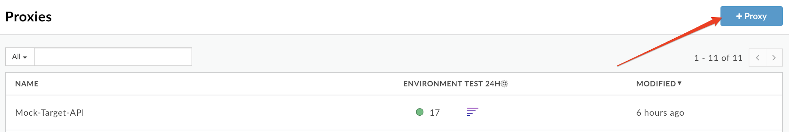

4. Select **Proxy Bundle** and then click **Next** to import an existing proxy form a zip archive.

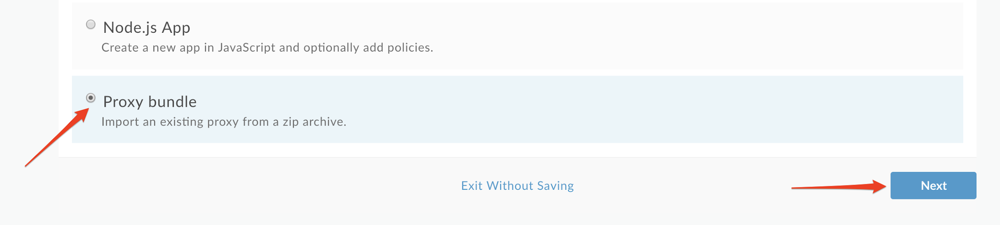

Download the API proxy "oauth.zip" that implements OAuth client credentials grant type [here](https://github.com/aliceinapiland/AdvancedVirtualAPIJam/blob/master/SecurityJam/Lab%203%20-%20Securing%20APIs%20with%20OAuth2%20Client%20Credentials/oauth.zip?raw=true). 

Back in the proxy creation wizard, click "Choose File", select the “oauth.zip” file you just downloaded and click **Next**:

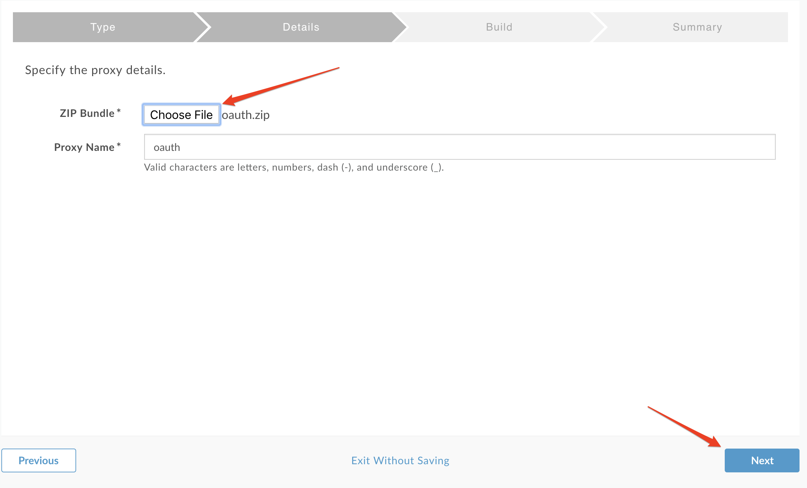

5. Click **Build**:

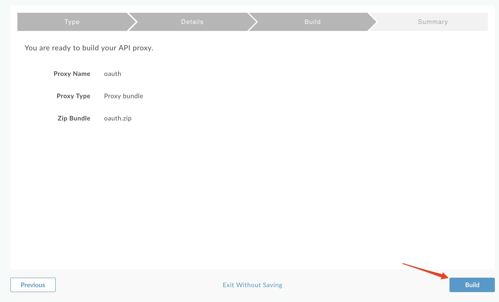

You should see a successful "Uploaded proxy" message as shown below.  You now have an OAuth Authorization Server that supports the client credentials grant type in Apigee.  Click “oauth” near the bottom of the page:

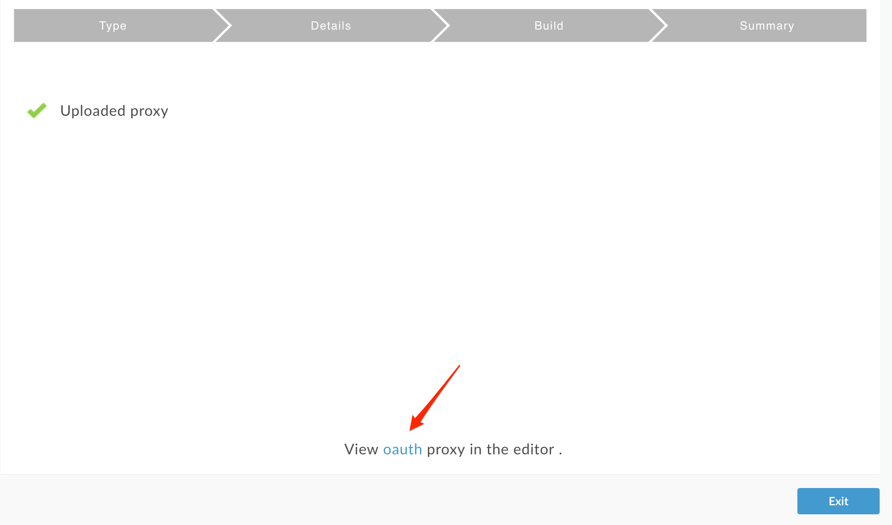

6. Deploy the oauth proxy by clicking on the **Deployment** dropdown and selecting the **test** environment:

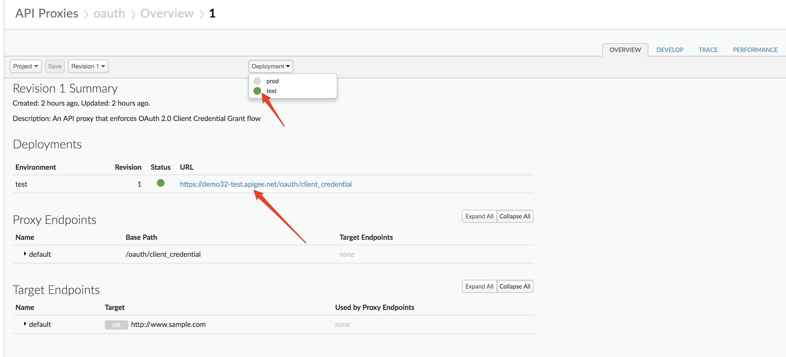

## Secure Mock Target API proxy with OAuth Access Token verification

1. Select **Develop** → **API Proxies** in the side navigation menu:


Select the previously created **Mock-Target-API** proxy:

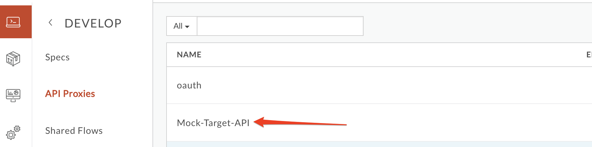

Click on the **Develop** tab:


2. Ensure that "Preflow" is selected in the “Proxy Endpoints” window, and then click the **+Step** button above the “Request” flow:

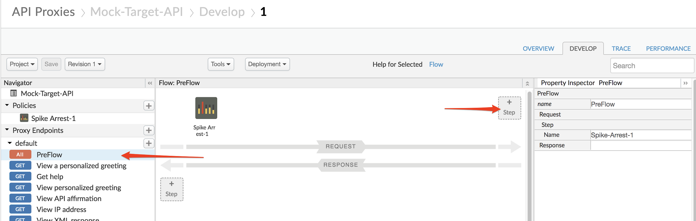

3. Select the **"OAuth v2.0"** security policy, leave the default names, and then click **Add**:

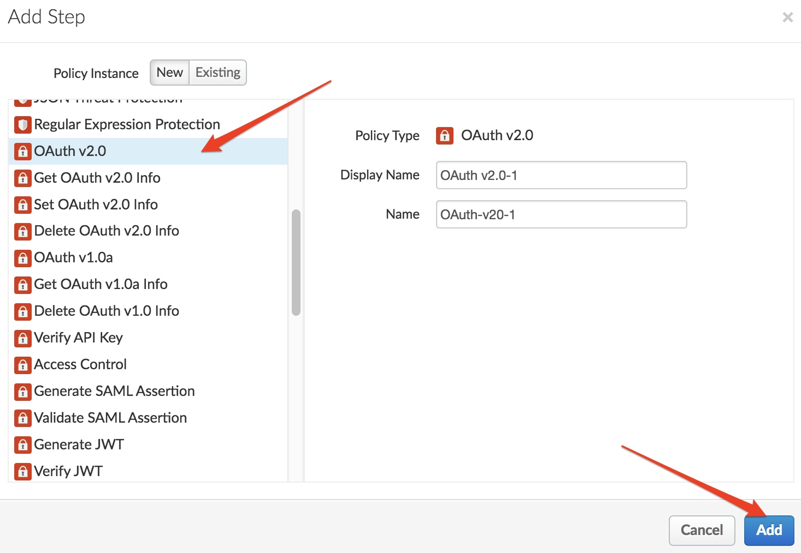

4. Drag and drop the OAuth v2.0 policy so it is the first policy (before Spike Arrest) and then click **Save**.  After the proxy is saved, click **Trace** in the upper right:

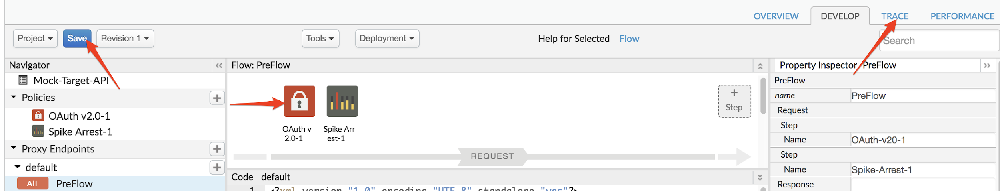

5. Click **"Start Trace Session"** and then click **Send**:

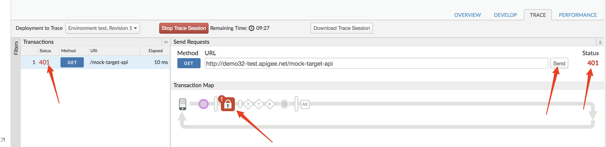

* You should see a 401 error because the proxy is now protected with an OAuth v2.0 policy and the incoming http request to the proxy did not contain an OAuth bearer token.  So now we will need to get a valid OAuth token in order to proceed.  This will require registering a **Developer** who creates an **App** that uses an **API Product** that contains the **API Proxy (Mock-Target-API)**.

## Create API Product, App Config and Generate Client Key & Secret

1. To provide access to the API, we must first package the API proxy into an API Product. To do this, first log into the Apigee Edge Management UI, and navigate to **Publish -> API Products**:


Then, click **+API Product** in the upper right of the screen:


2. Fill out the fields as shown below.  Click **+API Proxy** (step 4) and then select the **Mock-Target-API** (step 5) from the dropdown.  Finally click **Save** :

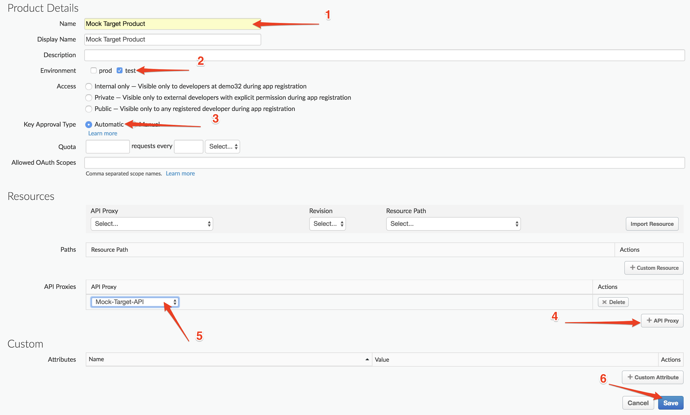

You should now see the Mock Target Product in the list of API Products.  

3. Typically, the client app developer will register his/her profile and the app profile, to obtain app credentials through a developer portal. However, for this lab, we will create these entities through the Apigee Edge Management UI. 

First let's create the developer profile. To do this, click on **Publish** → **Developer**:

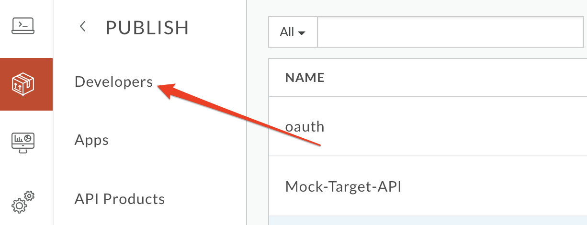

Click on **+Developer** in the upper right of the screen:

4. Fill out the fields with your **own name and email address** and click **Create**:


You should see the new Developer you just created in the list.  

5. Click on **Publish** → **Apps**


Click on **+App** in the upper right of the screen:


6. Fill out the details in the App screen as shown below.  Click **Save**:


You will now see your list of Apps again.  Click on your **Mock Target App** again and click the "Show/Hide" buttons next to the **Consumer Key** and **Consumer Secret** fields. Make a note of the Consumer Key and Consumer Secret so you can use them later. These are the client credentials you will need to get your OAuth token:

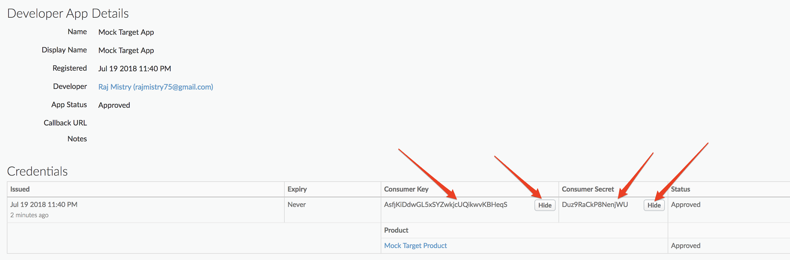

## To Test OAuth Token generation and API protection

1. First, send a valid request to the OAuth token endpoint to generate a valid access token. You can send this request either using a REST client like the one [here](https://apigee-rest-client.appspot.com/), or using **curl** in your Linux/Mac terminal. The request to send is:

```
POST /oauth/client_credential/accesstoken?grant_type=client_credentials HTTP/1.1
Host: {{org-name}}-{{env}}.apigee.net
Accept: application/json
Content-Type: application/x-www-form-urlencoded

client_id={{app_client_key}}&client_secret={{app_client_secret}}
```

* Replace {{org-name}} with your actual Apigee org name, and {{env}} with the deployment environment for your proxy (eg. 'test').

* Replace {{app_client_key}} and {{app_client_secret}} with your real Consumer Key and Consumer Secret noted down previously.

```
curl -X POST -H 'Content-Type: application/x-www-form-urlencoded' -H 'Accept: application/json' "https://{{org-name}}-{{env}}.apigee.net/oauth/client_credential/accesstoken?grant_type=client_credentials" -d 'client_id={{app_client_key}}&client_secret={{app_client_secret}}'
```

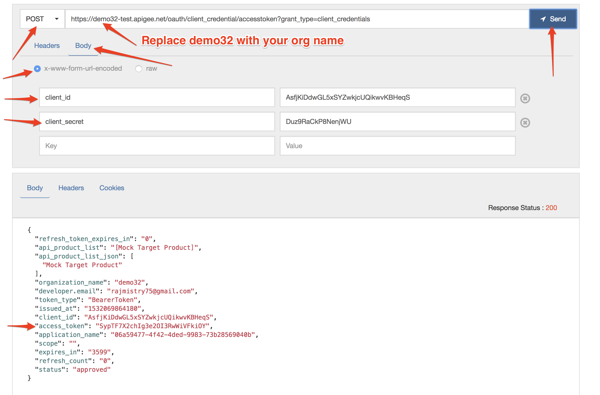

You now have an OAuth access token as seen in the body of the HTTP response.  Copy the value of the access_token (not including the " “) as you will need it for the next step.

2. Now, let's test the protected API by passing in the valid access token. You can send this request either using a REST client like the one [here](https://apigee-rest-client.appspot.com/), or using **curl** in your Linux/Mac terminal. The request to send is:

```
GET /mock-target-api HTTP/1.1
Host: {{org-name}}-{{env}}.apigee.net
Authorization: Bearer {{access-token}}
```

* Replace {{org-name}} with your actual Apigee org name, and {{env}} with the deployment environment for your proxy (eg. 'test').

* Add a header named **Authorization**, and in the value field write **Bearer** followed by your **access_token** you copied after your last POST request.

```
curl -X GET -H "Authorization: Bearer {{access-token}}" "http://{{org-name}}-{{env}}.apigee.net/mock-target-api"
```

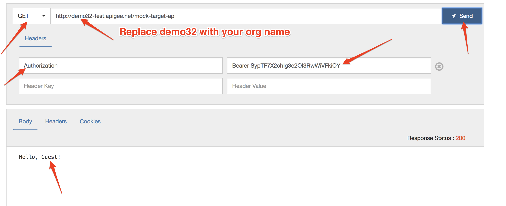

* If you see "Hello, Guest!" your OAuth token was valid and you’ve received the correct response!  

# **Lab Video**

If you are lazy and don’t want to implement this use case, it’s OK. You can watch this short video to see how to implement 2 legged OAuth on Apigee Edge [https://youtu.be/0pah5J7yQTQ](https://youtu.be/0pah5J7yQTQ)

# **Earn Extra-points**

Now that you’ve learned how to secure your API with OAuth 2.0, try to control the expiry of the access token that is generated, using the [<ExpiresIn>](https://docs.apigee.com/api-platform/reference/policies/oauthv2-policy#expiresinelement) configuration element of the [OAuthV2 policy](https://docs.apigee.com/api-platform/reference/policies/oauthv2-policy#expiresinelement).

# **Summary**

In this lab you learned how to secure your API using two legged OAuth 2.0 in client credentials grant type, by using the default oauth proxy to obtain an access token and using that token to validate requests to your API.

# **References**

* Link to Apigee docs page

    * OAuth 2.0: Configuring a new API proxy [http://docs.apigee.com/api-services/content/understanding-default-oauth-20-configuration](http://docs.apigee.com/api-services/content/understanding-default-oauth-20-configuration)

    * Secure an API with OAuth [http://docs.apigee.com/tutorials/secure-calls-your-api-through-oauth-20-client-credentials](http://docs.apigee.com/tutorials/secure-calls-your-api-through-oauth-20-client-credentials)

* [Link](https://community.apigee.com/topics/oauth+2.0.html) to Community posts and articles with topic as "OAuth 2.0"

* Search and Revoke tokens - [https://community.apigee.com/articles/1571/how-to-enable-oauth-20-token-search-and-revocation.html](https://community.apigee.com/articles/1571/how-to-enable-oauth-20-token-search-and-revocation.html)

Now go to [Lab 4](https://goo.gl/m1Ae3k).

