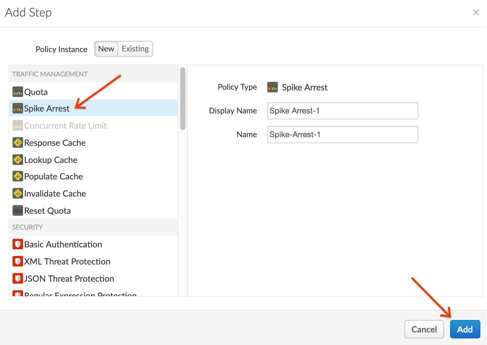
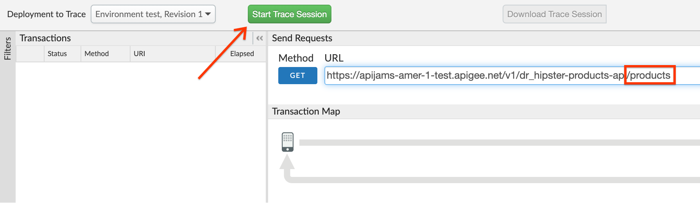
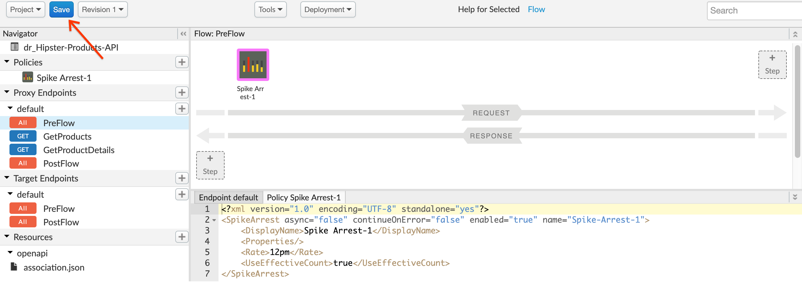
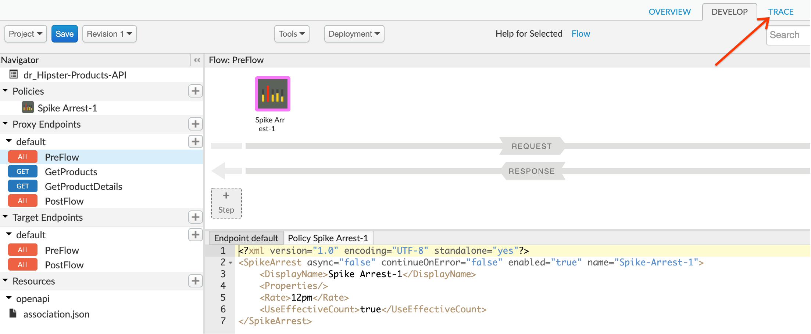
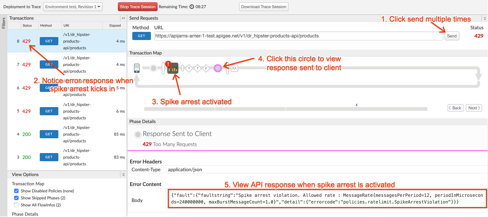

# Security : Throttle APIs

*Duration : 10 mins*

*Persona : API Team / Security*

# Use case

You have an existing Apigee API proxy that takes requests from the internet and forwards them to an existing service. You have a requirement to protect your target servers (backend) from traffic spikes. You would like to protect your APIs from denial of service attacks that might lead to performance issues or downtime of your backend. 

# How can Apigee Edge help?

By exposing an API through Apigee Edge, you gain the ability to modify and monitor its behavior using out-of-the-box policies. Edge's out-of-the-box policies enable you to enhance your API with sophisticated features to control traffic, enhance performance, enforce security, and increase the utility of your APIs, without requiring you to write any code or to modify any backend services. Extension policies also enable you to implement custom logic in the form of JavaScript, Python, Java, and XSLT.

In this lab we will see how to use an out-of-the-box traffic management policy known as "Spike Arrest" to protect against traffic spikes. A Spike Arrest policy can throttle the number of requests processed by an API proxy and sent to a target backend, thereby protecting against performance issues and downtime.

# Prerequisites

* A basic understanding of [OpenAPI Specification](https://github.com/OAI/OpenAPI-Specification) (aka Swagger)
* Have completed API Jam [Module-1](https://github.com/aliceinapiland/apijam/tree/master/Module-1)

# Instructions

## Deploy an API Proxy

1. Go to [https://apigee.com/edge](https://apigee.com/edge) and log in. This is the Edge management UI. 

2. Select **Develop → API Proxies** in the side navigation menu.


3. You should see the **{yourinitials}_Hipster-Products-API** proxy that was created as part of [Module-1](https://github.com/aliceinapiland/apijam/tree/master/Module-1).



The status column should show a green circle to indicate the proxy is already deployed to the test environment.

* If it doesn't, click on the **{yourinitials}_Hipster-Products-API** proxy. Then click on the **Deployment** drop down and select the **test** environment to deploy the proxy to the test environment:


Let us now add rate limiting to this proxy to protect the backend from denial of service attacks.

## Add Rate Limiting to the API Proxy
1. From the proxy overview page, click on the **Develop** tab to access the API Proxy development dashboard.



4. Click on **PreFlow** under Proxy Endpoints default, and then click on **+Step** on the upper right of the Request flow to attach a Spike Arrest policy.


5. Select **Spike Arrest Policy**. Click on **Add** button to add the spike arrest policy to the proxy endpoint preflow request.


6. Note the Spike Arrest policy icon on top of request flow that shows exactly where the policy is attached. Select the policy to display the policy's XML configuration in the editor.


7. Change the policy's XML configuration to the below snippet to enforce a rate of 12 requests per minute.
```
<?xml version="1.0" encoding="UTF-8" standalone="yes"?>
<SpikeArrest async="false" continueOnError="false" enabled="true" name="Spike-Arrest-1">
    <DisplayName>Spike Arrest-1</DisplayName>
    <Properties/>
    <Rate>12pm</Rate>
    <UseEffectiveCount>true</UseEffectiveCount>
</SpikeArrest>
```

Think of Spike Arrest as a way to generally protect against traffic spikes rather than as a way to limit traffic to a specific number of requests. Your APIs and backend can handle a certain amount of traffic, and the Spike Arrest policy helps you smooth traffic to the general rate you want to allow.

The runtime Spike Arrest behavior differs from what you might expect to see from the literal per-minute or per-second values you enter.

For example, say you enter a rate of 6pm (6 requests per minute). In testing, you might think you could send 6 requests in 1 second, as long as they came within a minute. But that's not how the policy enforces the setting. If you think about it, 6 requests inside a 1-second period could be considered a mini spike in some environments.

What actually happens, then? To prevent spike-like behavior, Spike Arrest smooths the number of full requests allowed by dividing your settings into smaller intervals:

* **Per-minute** rates get smoothed into full requests allowed in intervals of **seconds**. For example, 6pm gets smoothed like this: 60 seconds (1 minute) / 6pm = 10-second intervals, or 1 request allowed every 10 seconds. A second request inside of 10 seconds will fail. Also, a 7th request within a minute will fail.

* **Per-second** rates get smoothed into full requests allowed in intervals of **milliseconds**. For example, 10ps gets smoothed like this: 1000 milliseconds (1 second) / 10ps = 100-millisecond intervals, or 1 request allowed every 100 milliseconds. A second request inside of 100ms will fail. Also, an 11th request within a second will fail.

8. Click on **Save** to save the API Proxy changes.



*Congratulations!*...You have now secured your backend against denial of service attacks, performance lags or downtime of target servers.

## Test the Spike Arrest

1. Let us test the updated API proxy using the Trace console. Click on the **Trace** tab.



2. Click on the **Start Trace Session** button to see API Proxy with spike arrest in action.  Add `/products` to the end of the URL field.


3. Click on the **Send** button multiple times. You will see a 429 response code when the spike arrest policy kicks in to protect the target server from the spike in traffic.



4. You may notice that the number of requests with a 200 response is more than the spike arrest rate value configured. This is due to the fact that there are multiple message processors where proxies get executed, and by default each maintains its own counter.

# Lab Video

If you like to learn by watching, here is a short video on using the Spike Arrest policy. [https://youtu.be/3Gi-GGTqllg](https://youtu.be/3Gi-GGTqllg)

# Earn Extra Points

Now that you have protected your backend against spikes in traffic, go ahead and explore more about the Spike Arrest policy using the docs here: [http://docs.apigee.com/api-services/reference/spike-arrest-policy](http://docs.apigee.com/api-services/reference/spike-arrest-policy). Then update the policy with an identifer like queryparam on which the spike arrest counter is updated. Try using the message weight property to assign a weight to the counter.

# Summary

That completes this hands-on lab. In this simple lesson you learned how to protect target servers against denial of service attacks.

# References

* Useful Apigee documentation links on Traffic Management & Spike Arrest Policy: 

    * Spike Arrest Policy - http://docs.apigee.com/api-services/reference/spike-arrest-policy

    * Rate Limiting - [http://docs.apigee.com/api-services/content/rate-limiting](http://docs.apigee.com/api-services/content/rate-limiting)

    * Comparing Rate Limiting Policies - [http://docs.apigee.com/api-services/content/comparing-quota-spike-arrest-and-concurrent-rate-limit-policies](http://docs.apigee.com/api-services/content/comparing-quota-spike-arrest-and-concurrent-rate-limit-policies) 


You may now proceed to [Lab 2](https://github.com/aliceinapiland/apijam/tree/master/Module-2a/Labs/Lab%202).
