# API Security : Securing APIs with two-legged OAuth (client credentials)

*Duration : 30 mins*

*Persona : API Team/Security*

# Use case

You have an API that is consumed by trusted applications. You want to secure that API using two-legged OAuth (client credentials grant type).

# How can Apigee Edge help?

Apigee Edge quickly lets you secure your APIs using out of the box OAuth policies. OAuth defines token endpoints, authorization endpoints, and refresh token endpoints. Apps call these endpoints to get access tokens, to refresh access tokens, and, in some cases, to get authorization codes. These endpoints refer to specific OAuth 2.0 policies that execute when the endpoint is called.

Most typically, the **"client_credentials"** grant type is used when the app is also the API resource owner. For example, an app may need to access a backend cloud-based storage service to store and retrieve data that it uses to perform its work, rather than data specifically owned by the end user. This grant type flow occurs strictly between a client app and the authorization server. An end user does not participate in this grant type flow. In this flow, Apigee Edge is the OAuth authorization server. Its role is to generate access tokens, validate access tokens, and pass authorized requests for protected resources on to the resource server.

An introduction to OAuth 2.0 is available on our documentation site [here](https://docs.apigee.com/api-platform/security/oauth/oauth-introduction.html).

# Prerequisites

* You have completed Module-2a [Lab 1](https://github.com/aliceinapiland/apijam/tree/master/Module-2a/Labs/Lab%201)

# Instructions

As part of this lab, you will:
- Expose an OAuth token endpoint via an API proxy, to generate access tokens based on the "client_credentials" grant type
- Secure the sample Hipster Products API with an OAuth access token verification policy
- Publish API Products, as well as Developer and App configurations in Apigee Edge, to generate a valid set of credentials

## Create OAuth Token Endpoints

**Note: In Apigee Edge trial account orgs, the oauth endpoint should already have been created at the time of org provisioning. Check you API Proxies list under Develop -> API Proxies. If there is already a proxy labeled 'oauth', simply go to the proxy details page, click on 'Deployment' and ensure that it is deployed to the 'test' environment (Step 9 below). After that, you can skip this section and head to [the next section](https://github.com/aliceinapiland/apijam/tree/master/Module-2a/Labs/Lab%202#secure-the-hipster-products-api-proxy-with-oauth-access-token-verification).**

1. Go to [https://apigee.com/edge](https://apigee.com/edge) and log in. This is the Edge management UI.

2. Select **Develop** → **API Proxies** in the side navigation menu.


3. Click the **+Proxy** button on the top-right corner to invoke the Create Proxy wizard.


4. Select **Proxy Bundle** and then click **Next** to import an existing proxy form a zip archive.


5. Download the API proxy bundle named `oauth.zip` that implements the OAuth 2.0 client credentials grant type from [here](https://github.com/aliceinapiland/apijam/blob/master/Module-2a/Labs/Lab%202/resources/oauth.zip?raw=true). 

6. Back in the proxy creation wizard, click the **Choose File** button, select the `oauth.zip` file you just downloaded, and click **Next**:

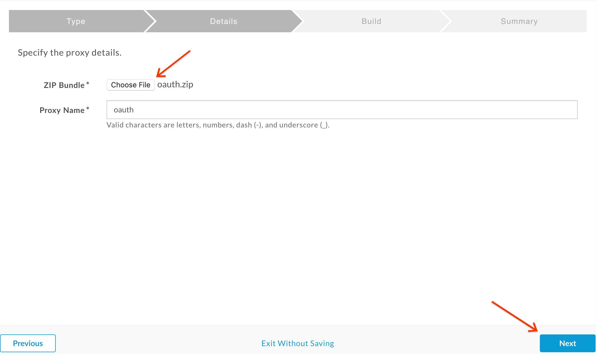

7. Click **Build**:

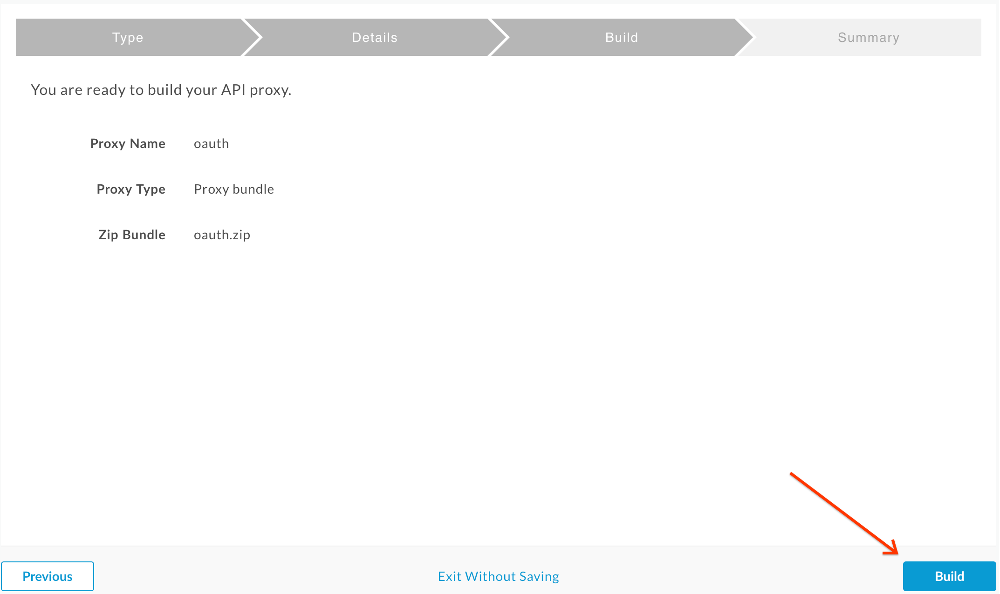

8. You should see a successful "Uploaded proxy" message as shown below.  You now have an OAuth Authorization Server that supports the client credentials grant type in Apigee.  Click the **oauth** link near the bottom of the page to view the proxy:


9. Deploy the oauth proxy by clicking on the **Deployment** dropdown and selecting the **test** environment:

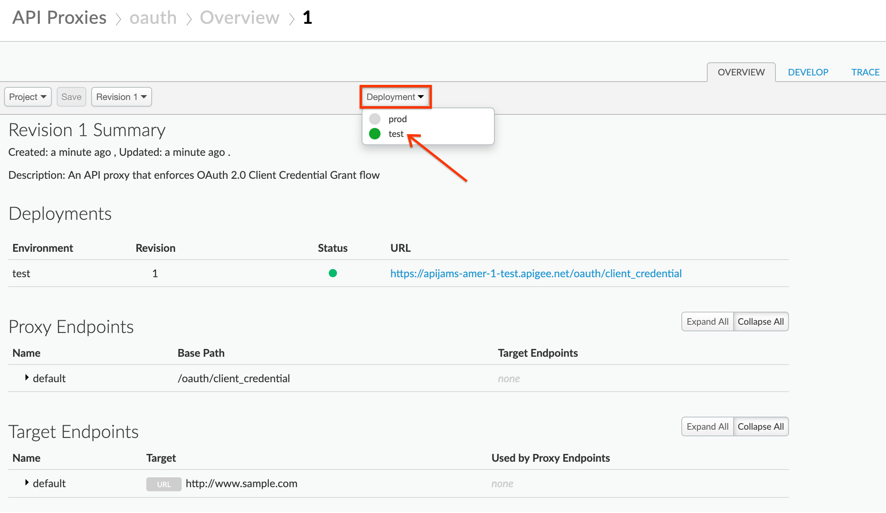

## Secure the Hipster Products API proxy with OAuth Access Token verification

1. Select **Develop** → **API Proxies** in the side navigation menu:


2. Select the previously created **{yourinitials}_Hipster-Products-API** proxy:

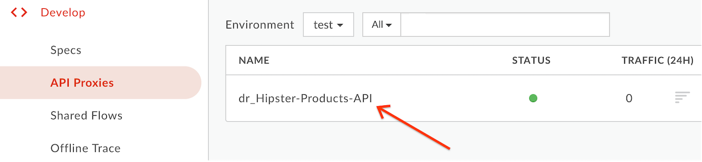

3. Click on the **Develop** tab:


4. Ensure that "**PreFlow**" is selected in the “**Proxy Endpoints**” window, and then click the **+Step** button above the “**Request**” flow:


5. Select the **"OAuth v2.0"** security policy, leave the default name, and then click **Add**:


6. Drag and drop the OAuth v2.0 policy so it is the first policy (before Spike Arrest) and then click **Save**.  After the proxy is saved, click the **Trace** tab in the upper right:


7. Click on the **Start Trace Session** button.  Add `/products` to the end of the URL field.

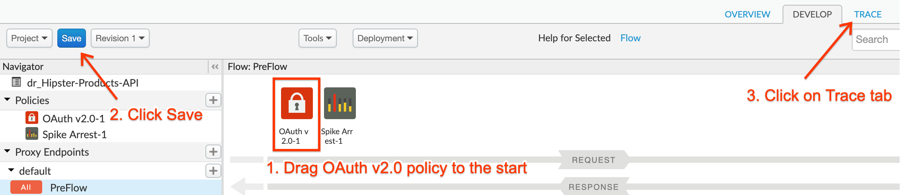

8. Click **Send**:

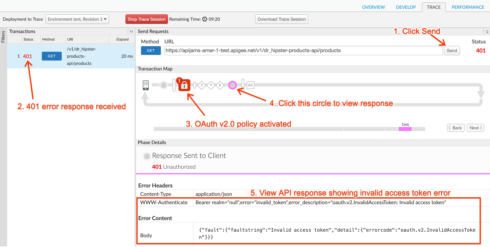

* You should see a 401 error because the proxy is now protected with an OAuth v2.0 policy and the incoming HTTP request to the proxy did not contain an OAuth bearer token.  So now we will need to obtain a valid OAuth token in order to proceed.  This will require registering a **Developer** who creates an **App** that uses an **API Product** that contains the **API Proxy i.e. {yourinitials}_Hipster-Products-API**.

## Create API Product, App Config and Generate Client Key & Secret

1. To provide access to the API, we must first package the API proxy into an [API Product](https://docs.apigee.com/api-platform/publish/what-api-product). For this step you may use the products, developers and apps you created during Module-1.  Alternatively, to do this from scratch first log into the Apigee Edge Management UI, and navigate to **Publish → API Products**:

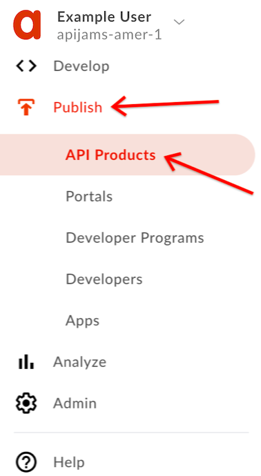

Then, click **+API Product** in the upper right of the screen:


2. Fill out the fields as shown below, replacing with **your initials** at the start of **Name**:


3. Click **Add a proxy** under the **API resources** section:

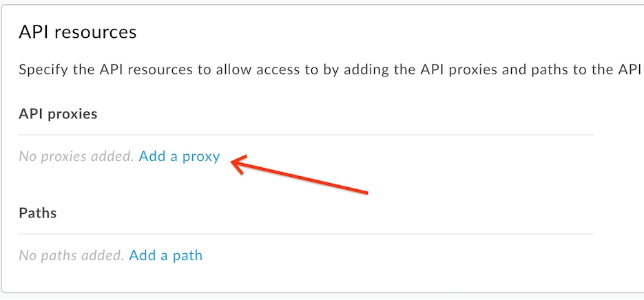

4. Select the **{yourinitials}_Hipster-Products-API** proxy from the list.  Click **Add**:


5. Finally click **Save**:

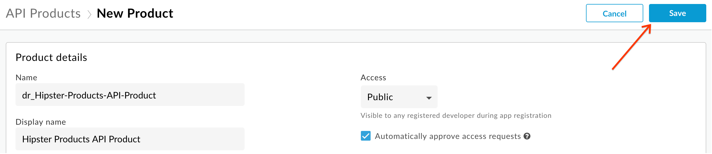

* You should now see the Hipster Product in the list of API Products.  

6. Typically the client app developer will register his/her profile along with the App through a developer portal. However, for this lab we will create these entities through the Apigee Edge Management UI.  First, let's create the developer profile. To do this, click on **Publish** → **Developers** on the side navigation bar:

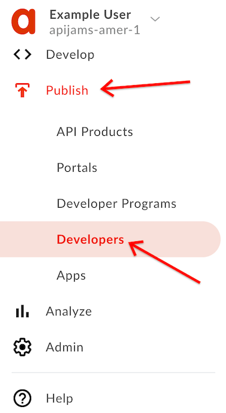

7. Click on the **+Developer** button in the upper right of the screen:


8. Fill out the fields with **your own name and email address** and click **Create**:


You should see the new Developer you just created in the list.  

5. Click on **Publish** → **Apps** from the side navigation menu:

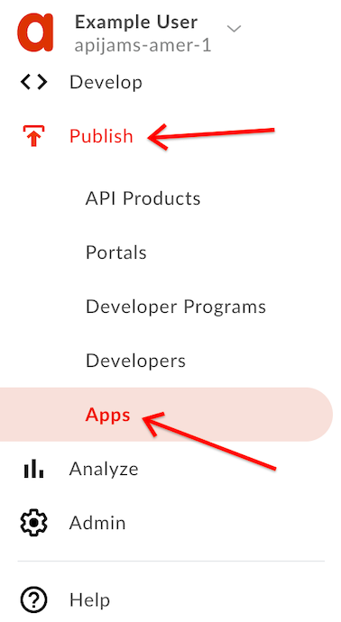

Click on **+App** in the upper right of the screen:


6. Fill out the details in the New App screen as shown below, selecting the developer you just created from the dropdown list, then click **Add product**:


7. Select the **Hipster Products API Product** from the list and then click **Add**:

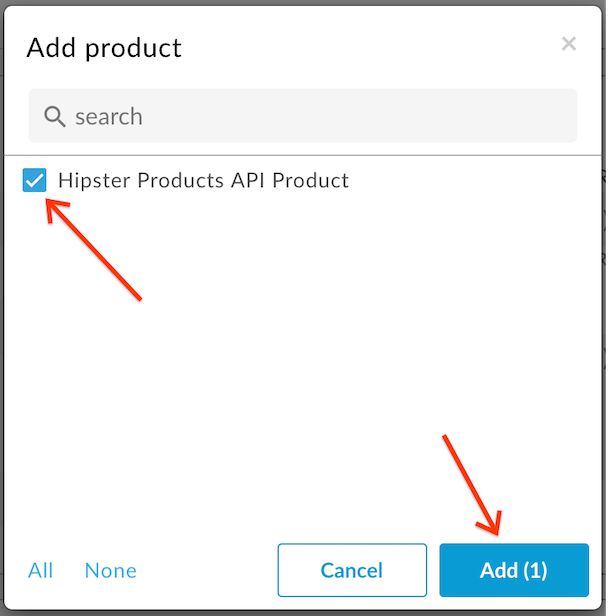

8. Click the **Create** button at the top right of the screen:

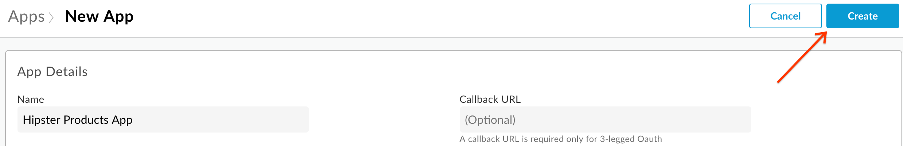

9. You will now see a set of credentials created for your app.  Click the "Show/Hide" buttons next to the **Key** and **Secret** fields. Make a note of the Key and Secret values so you can use them later. These are the client credentials you will need to obtain an OAuth access token:

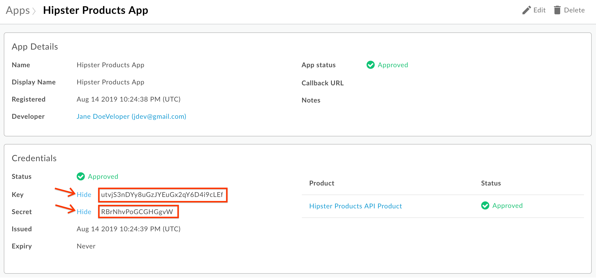

## Test OAuth token generation and API protection

1. First, send a valid request to the OAuth token endpoint to generate a valid access token. You can send this request either using a REST client like the one [here](https://apigee-rest-client.appspot.com/), or by using the `curl` command from a terminal. The HTTP request to send is:

```
POST /oauth/client_credential/accesstoken?grant_type=client_credentials HTTP/1.1
Host: {{org-name}}-{{env}}.apigee.net
Accept: application/json
Content-Type: application/x-www-form-urlencoded

client_id={{app_client_key}}&client_secret={{app_client_secret}}
```

* Replace {{org-name}} with your actual Apigee org name, and {{env}} with the deployment environment for your proxy (eg. test)

* Replace {{app_client_key}} and {{app_client_secret}} with your real Key and Secret you noted down previously

Here is an example `curl` command (you will need to replace values as described above):
```
curl -X POST -H 'Content-Type: application/x-www-form-urlencoded' -H 'Accept: application/json' "https://{{org-name}}-{{env}}.apigee.net/oauth/client_credential/accesstoken?grant_type=client_credentials" -d 'client_id={{app_client_key}}&client_secret={{app_client_secret}}'
```

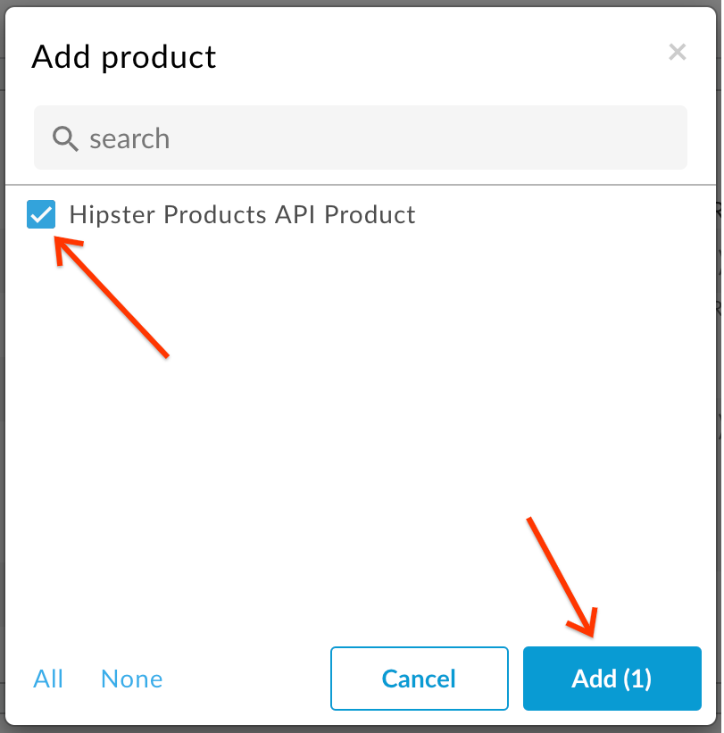

You should now have an OAuth access token returned in the body of the HTTP response.  Copy the value of `access_token` (not including the surrounding quotes) as you will need it for the next step.

2. Now, let's test the protected API by passing in the valid access token. Again, you can send this request either using a REST client like the one [here](https://apigee-rest-client.appspot.com/), or by using the `curl` command in a terminal. The HTTP request to send is:

```
GET /v1/{{yourinitials}}_hipster-products-api/products HTTP/1.1
Host: {{org-name}}-{{env}}.apigee.net
Authorization: Bearer {{access-token}}
```

* Replace {{yourinitials}} with the initials you used when creating the proxy

* Replace {{org-name}} with your actual Apigee org name, and {{env}} with the deployment environment for your proxy (eg. test)

* Add a header named **Authorization**, and in the value field enter **Bearer** followed by the `access_token` value you copied after your last POST request

Here is an example `curl` command (you will need to replace values as described above):
```
curl -X GET -H "Authorization: Bearer {{access-token}}" https://{{org-name}}-{{env}}.apigee.net/v1/{{yourinitials}}_hipster-products-api/products
```

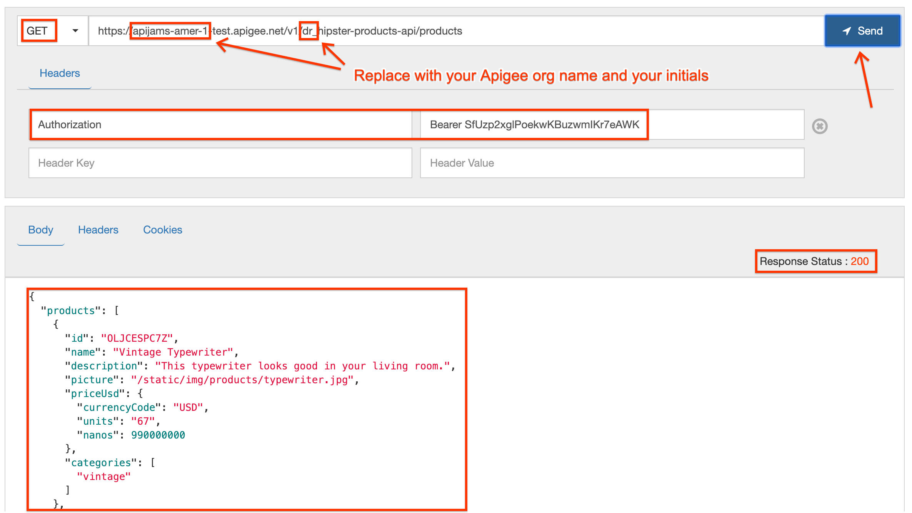

* If you see a 200 response status along with an array of products in the body, your OAuth token was valid and you have received the correct response!  

# Lab Video

If you prefer to skip the steps above and watch a video, you can view this short clip that shows how to implement two-legged OAuth on Apigee Edge [https://youtu.be/0pah5J7yQTQ](https://youtu.be/0pah5J7yQTQ)

# Earn Extra Points

Now that you have learned how to secure your API with OAuth 2.0, try to control the expiry of the access token that is generated using the [<ExpiresIn>](https://docs.apigee.com/api-platform/reference/policies/oauthv2-policy#expiresinelement) configuration element of the [OAuthV2 policy](https://docs.apigee.com/api-platform/reference/policies/oauthv2-policy#expiresinelement).

# Summary

In this lab you learned how to secure an API using two-legged OAuth 2.0 with the client credentials grant type, by creating an OAuth proxy to obtain an access token, and then using that token to validate requests to your API.

# References

* Useful Apigee documentation links on OAuth v2.0:

    * OAuth 2.0: Configuring a new API proxy - [http://docs.apigee.com/api-services/content/understanding-default-oauth-20-configuration](http://docs.apigee.com/api-services/content/understanding-default-oauth-20-configuration)

    * Secure an API with OAuth - [http://docs.apigee.com/tutorials/secure-calls-your-api-through-oauth-20-client-credentials](http://docs.apigee.com/tutorials/secure-calls-your-api-through-oauth-20-client-credentials)

* Community posts and articles with topic "OAuth 2.0" - [https://community.apigee.com/topics/oauth+2.0.html](https://community.apigee.com/topics/oauth+2.0.html)

* Search and Revoke tokens - [https://community.apigee.com/articles/1571/how-to-enable-oauth-20-token-search-and-revocation.html](https://community.apigee.com/articles/1571/how-to-enable-oauth-20-token-search-and-revocation.html)

You may now proceed to [Module-2b](https://github.com/aliceinapiland/apijam/tree/master/Module-2b).

