# Security : Threat Protection

*Duration : 15 mins*

*Persona : API Team / Security*

# Use case

You have an existing Apigee API proxy that takes requests from the Internet and forwards them to an existing service. You have a requirement to ensure the integrity of the API message content, by protecting against threats such as JSON/XML/SQL injection and other malicious payload manipulation.

# How can Apigee Edge help?

Message content is a significant attack vector used by malicious API consumers. Apigee Edge provides a set of out-of-the-box policies that help mitigate the potential for your backend services to be compromised by attackers or by malformed request payloads.

In this lab we will see how to use the following policies:
 - JSON Threat Protection policy
 - Regular Expression Protection policy

# Pre-requisites

* Basic understanding of [JSON](https://www.json.org/) and [XML](https://www.w3.org/TR/2008/REC-xml-20081126) data formats.
* Basic understanding of [SQL injections](https://en.wikipedia.org/wiki/SQL_injection)
* Basic understanding of [Regular Expressions](https://developer.mozilla.org/en-US/docs/Web/JavaScript/Guide/Regular_Expressions)
* Completed a previous [Virtual API Jam](https://github.com/rmistry75/devjam3/tree/master/Labs/VirtualAPIJam) or have the equivalent knowledge of API lifecycle management, and specifically, API proxy policy configuration and enforcement on Apigee Edge. Alternatively, go through the ["Getting started guide"](https://docs.apigee.com/api-platform/get-started/get-started) in the Apigee Docs site.
* Completed [Lab 1 - Traffic Management](https://github.com/aliceinapiland/AdvancedVirtualAPIJam/tree/master/SecurityJam/Lab%201%20Traffic%20Management%20-%20Throttle%20APIs), of this Virtual API Jam - Security

# Instructions

## JSON Threat Protection

1. In your org, select **Develop → API Proxies** in the side navigation menu, and select the API proxy previously created in Lab 1.


2. Click on the **Develop** tab to access the API Proxy development dashboard.

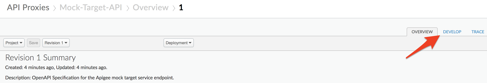

3. Click on the "**Send request and view request headers and body**" flow under Proxy Endpoints default, and then click on **+Step** on the upper right of the Request flow to attach a JSON Threat Protection policy.


4. Select **JSON Threat Protection** policy. Click on **Add** button to add the policy to the selected flow's request pipeline.


5. Select the policy to display the policy's XML configuration in the editor.

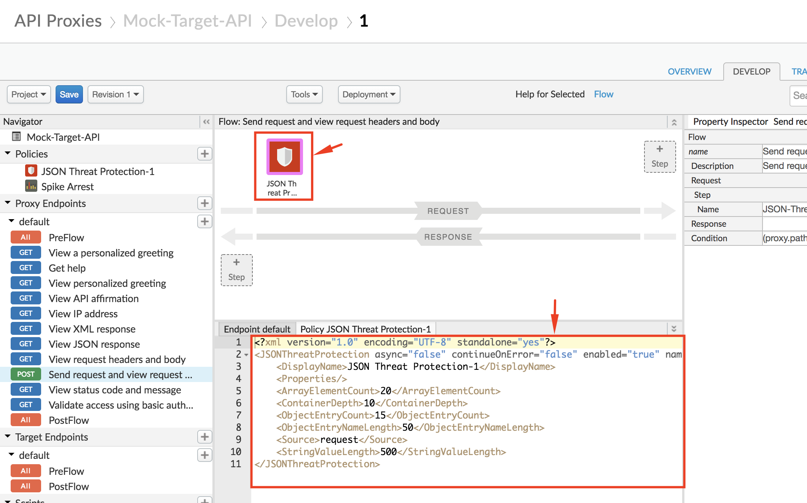

6. Change the policy's XML configuration to the below snippet to enforce protection against JSON payload manipulation threats.
```
<?xml version="1.0" encoding="UTF-8" standalone="yes"?>
<JSONThreatProtection async="false" continueOnError="false" enabled="true" name="JSON-Threat-Protection-1">
    <DisplayName>JSON Threat Protection-1</DisplayName>
    <Properties/>
    <ObjectEntryCount>5</ObjectEntryCount>
    <Source>request</Source>
</JSONThreatProtection>
```

In the above example, we use the JSON Threat Protection policy to ensure that the incoming API request JSON payload does not contain more than 5 fields. If the incoming payload contains more than 5 fields, the API proxy returns an error response.
For a full list of JSON integrity checks that can be performed using this policy, see the [JSON Threat Protection policy documentation](https://docs.apigee.com/api-platform/reference/policies/json-threat-protection-policy#elementreference).

7. Click on **Save** to save the API Proxy changes.


### To Test JSON Threat Protection:

1. To test the changes made, first click on **Trace** tab of the API proxy dashboard, and click on **Start Trace Session** button.

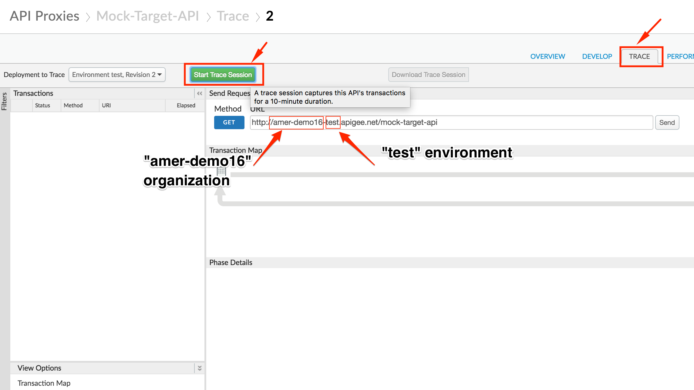

* **Note**: Take note of the Apigee `organization` and `environment` you are working in. In the screenshot above, the organization is `amer-demo16` and the environment is `test`. Your organization name will likely end in `*-eval`

2. Now, send a POST request to your API endpoint at **http://{{your-organization}}-{{your-environment}}.apigee.net/mock-target-api/echo** with the following format:
```
POST /mock-target-api/echo HTTP/1.1
Host: {{your org}}-{{your env}}.apigee.net
Content-Type: application/json

{
"field1": "test_value1",
"field2": "test_value2",
"field3": "test_value3",
"field4": "test_value4",
"field5": "test_value5",
"field6": "test_value6"
}
```

You can make this call either using a REST client like the one [here](https://apigee-rest-client.appspot.com/), or using a terminal command such as **curl**.
```
curl -X POST "http://{{your-org}}-{{your-env}}.apigee.net/mock-target-api/echo" -H "Content-Type: application/json" -d '{"field1": "test_value1", "field2": "test_value2", "field3": "test_value3", "field4": "test_value4", "field5": "test_value5", "field6": "test_value6"}'
```
* **Note:** If you are using a REST client, make sure that your HTTP request has a Header name/value pair of `Content-Type: application/json` as shown below

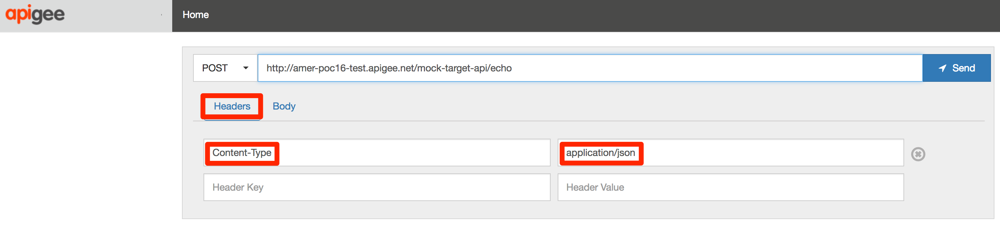

3. The response received will be an error, since we attempted to send more than 5 fields in the POST request payload.

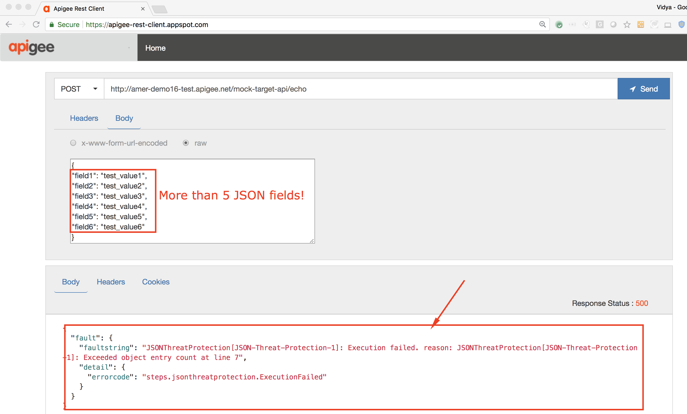

We also see that the JSON Threat Protection policy was triggered to return this error response, when we see the Trace screen.


4. You can now test for a successful API call, by sending the API endpoint a similar POST request, but this time with 5 or fewer fields in the JSON payload.
```
POST /mock-target-api/echo HTTP/1.1
Host: {{your-org}}-{{your-env}}.apigee.net
Content-Type: application/json

{
"field1": "test_value1",
"field2": "test_value2",
"field3": "test_value3",
"field4": "test_value4",
"field5": "test_value5"
}
```

You can make this call either using a REST client like the one [here](https://apigee-rest-client.appspot.com/), or using a terminal command such as **curl**.
```
curl -X POST "http://{{your-org}}-{{your-env}}.apigee.net/mock-target-api/echo" -H "Content-Type: application/json" -d '{"field1": "test_value1", "field2": "test_value2", "field3": "test_value3", "field4": "test_value4", "field5": "test_value5"}'
```

3. The response received will be a successful one, since we attempted to send fewer fields in the POST request payload.

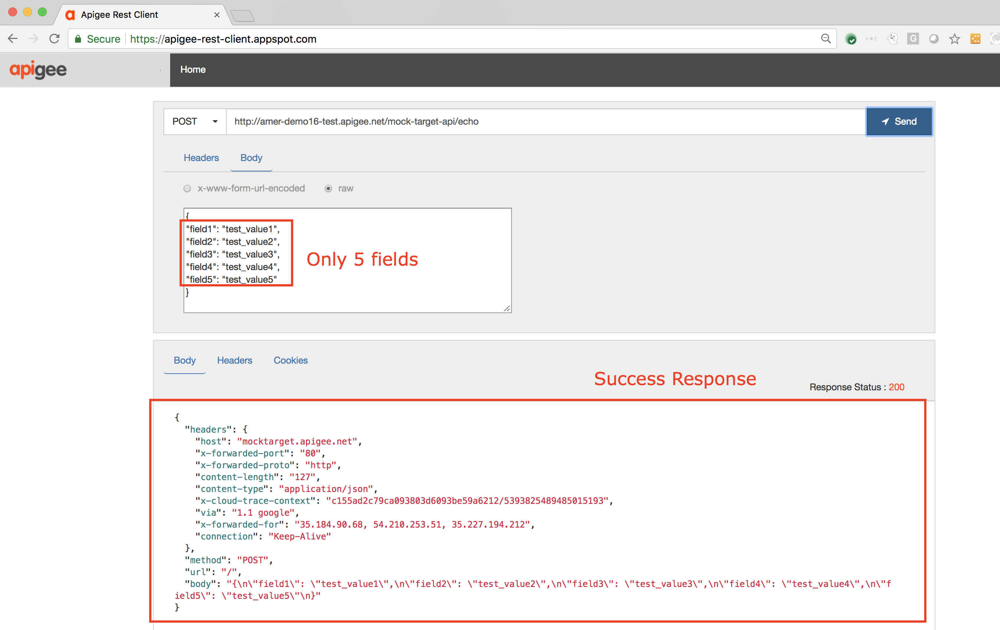

We also see that the JSON Threat Protection policy allowed the request to go through and hit the API target, when we see the Trace screen.


## Regular Expression Protection

### Add Protection Against SQL Injections

1. Click on the "**View IP address**" flow under Proxy Endpoints default. Click on **+Step** on the upper right of the Request flow and attach a Regular Expression Protection policy.


2. Select **Regular Expression Protection** policy. Click on **Add** button to add the policy to the selected flow's request pipeline.

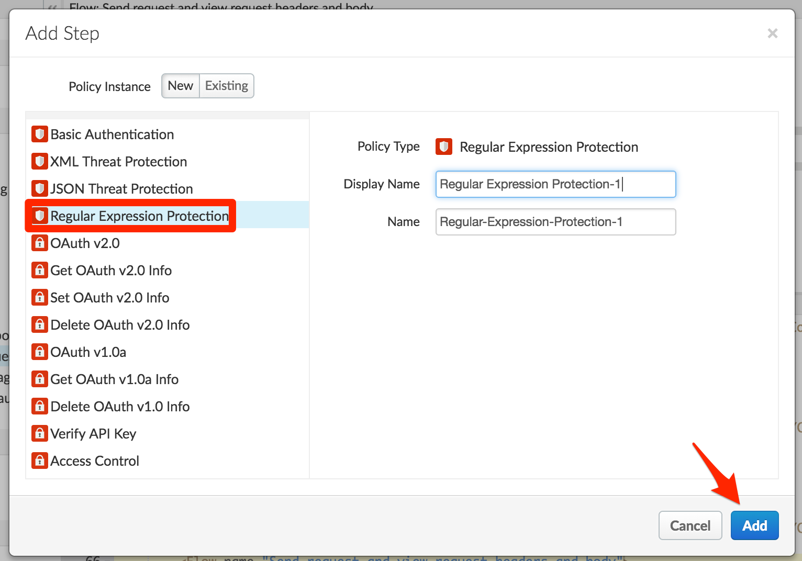

3. Select the policy to display the policy's XML configuration in the editor.

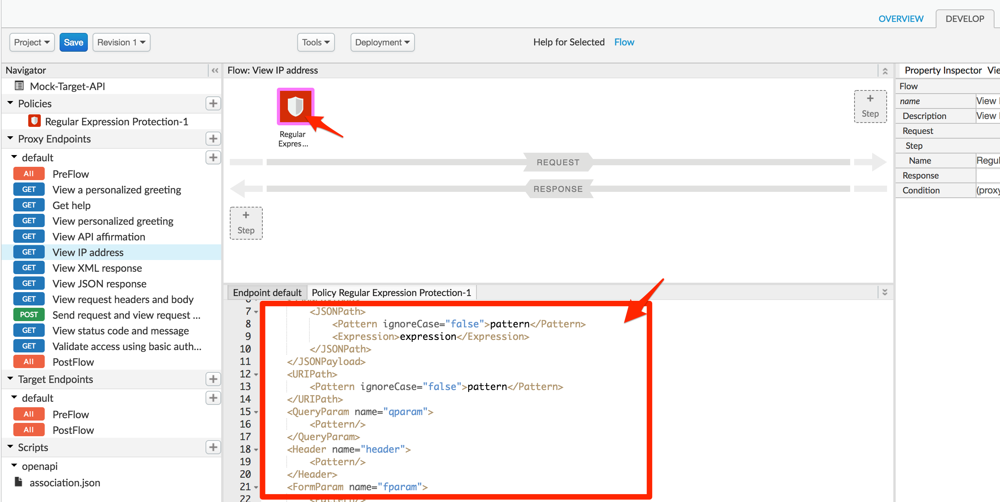

4. Change the policy's XML configuration to the below snippet to protect against SQL injections.
```
<?xml version="1.0" encoding="UTF-8" standalone="yes"?>
<RegularExpressionProtection async="false" continueOnError="false" enabled="true" name="Regular-Expression-Protection-1">
    <Source>request</Source>
    <QueryParam name="query">
        <Pattern>[\s]*(?i)((delete)|(exec)|(drop\s*table)|(insert)|(shutdown)|(update)|(\bor\b))</Pattern>
    </QueryParam>
</RegularExpressionProtection>
```

In the above example, the Regular Expression Protection policy has been configured with a pattern that matches common SQL injection attacks. This pattern will be checked against the value of the query parameter named `query`, and if there is a match, the policy will return an error response. Note that the policy lets you check the pattern against all types of input parameters and body content.

For other sample patterns, reference the [Regular Expression Protection policy documentation](https://docs.apigee.com/api-platform/reference/policies/regular-expression-protection#abouttheregularexpressionprotectionpolicy-exampleblacklistpatterns).

5. Click on **Save** to save the API Proxy changes.

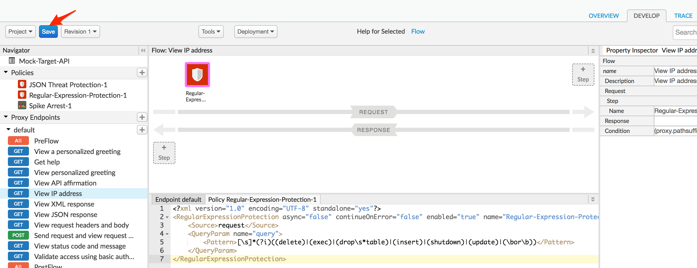

### Test Regular Expression Protection:

1. To test the changes made, first click on **Trace** tab of the API proxy dashboard, and click on **Start Trace Session** button.

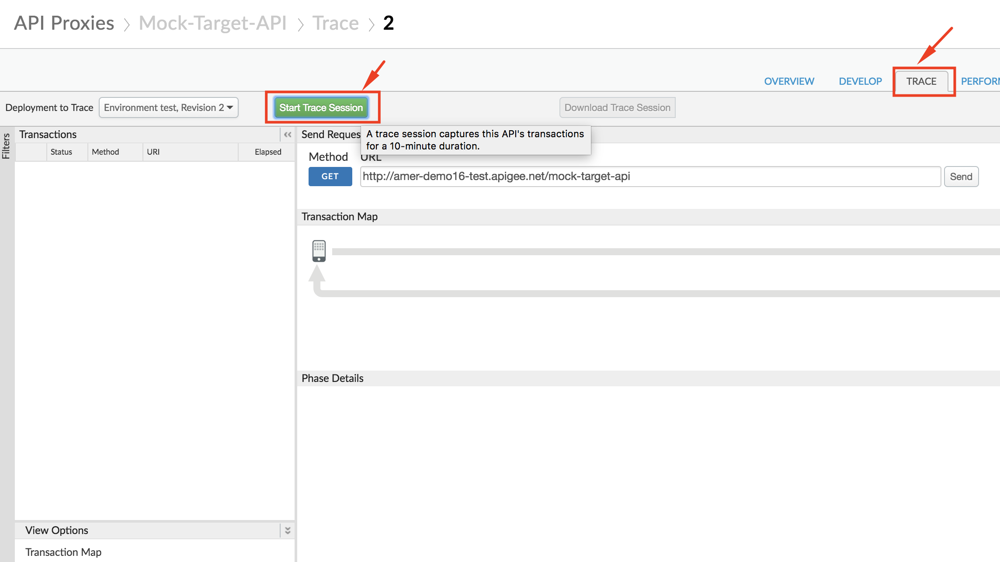

2. Now, send a GET request to your API endpoint at **http://{{your-organization}}-{{your-environment}}.apigee.net/mock-target-api/ip?query=** with any of the following entries in the `query` parameter. Try out all of the entries, and see if you can determine what each attack is trying to do!
```
query=delete
query=password’ OR 1=1
query=5; DROP TABLE USERS;
```

You can make this call either using a REST client like the one [here](https://apigee-rest-client.appspot.com/), or using a terminal command such as **curl**.
```
curl "http://{{your-org}}-{{your-env}}.apigee.net/mock-target-api/ip?query={{insert SQL injection attack here}}"
```

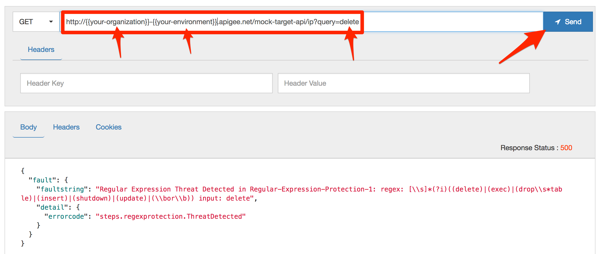

3. The response received will be an error, since we attempted to send a malicious attack that we have configured our policy to recognize.

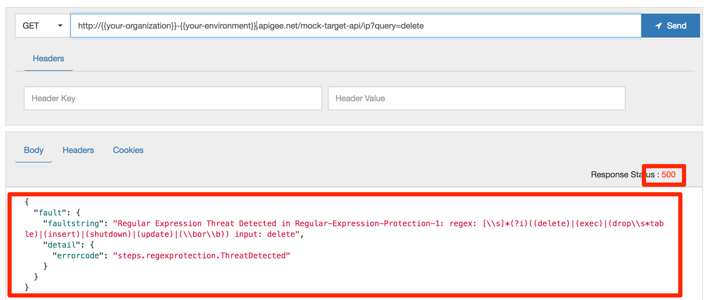

We can also confirm from the Trace screen that the Regular Expression Protection policy was triggered to return this error response.


# Lab Video

If you like to learn by watching, here are short 4 minute videos on using:
- [JSON Threat Protection Policy](https://youtu.be/LIUeaAvRuTQ)
- [RegEx Protection Policy](https://youtu.be/NLg_LE3u-vM)

# Earn Extra-points

Now that you have tried the JSON and Regular Expression Threat Protection policies, try out the [XML Threat Protection policy](https://docs.apigee.com/api-platform/reference/policies/xml-threat-protection-policy) that helps you check the API payload content integrity in the case of XML payloads.

# Summary

That completes this hands-on lesson. In this simple lab you learned how to protect your API payloads against payload content based threats.

# References

* Useful Apigee documentation links on Threat Protection policies  -

    * [JSON Threat Protection Policy](https://docs.apigee.com/api-platform/reference/policies/json-threat-protection-policy)

    * [XML Threat Protection Policy](https://docs.apigee.com/api-platform/reference/policies/xml-threat-protection-policy)

    * [Regular Expression Protection policy](https://docs.apigee.com/api-platform/reference/policies/regular-expression-protection)

    * [Video](https://youtu.be/rC8kZJgwBFM) on using Threat Protection policies in Apigee Edges

Now go to [Lab-3](https://github.com/aliceinapiland/AdvancedVirtualAPIJam/tree/master/SecurityJam/Lab%203%20-%20Securing%20APIs%20with%20OAuth2%20Client%20Credentials)
