# API Security : JWT

*Duration : 15 mins*

*Persona : API Team/Security*

# Use Case

You have an API that is consumed by third parties. You want to secure that API using JSON Web Tokens aka JWTs.

# How can Apigee Edge help?

Both [JWS](https://tools.ietf.org/html/rfc7515) (JSON Web Signature) and [JWT](https://tools.ietf.org/html/rfc7519) (JSON Web Token) are commonly used ways to share claims or assertions between connected applications in a secure fashion.  Apigee Edge provides support for JWS and JWT via out-of-the-box policies.  The JWS/JWT policies enables Edge API proxies to:

* **Generate** a signed JWT or JWS
* **Verify** a signed JWT or JWS and claims within the JWS/JWT
* **Decode** a signed JWT or JWS without validating the signature

For more information on JWS and JWT support in Apigee visit the documentation page here:
[https://docs.apigee.com/api-platform/reference/policies/jwt-policies-overview](https://docs.apigee.com/api-platform/reference/policies/jwt-policies-overview)

# Prerequisites

* Have completed Module-2b [Lab 3](../Lab%203).

# Instructions

1. Go to [https://apigee.com/edge](https://apigee.com/edge) and log in. This is the Edge management UI.

2. Select **Environments** → **Key Value Maps** in the side navigation menu:

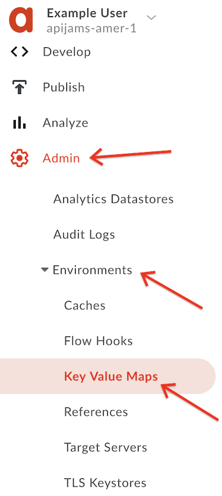

3. Ensure the environment configuration is set to **test**, and click the **+Key value map** button in the upper right corner of the screen:


4. Enter "jwt-secret-key" (must be this name exactly) as the **Name** in the text box and click **Add**:

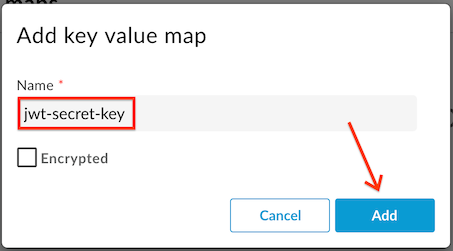

5. Now that the key value map is created, we need to add a Shared Secret.  Click to select the key value map:


6. Click the **+** button to add a key value pair to the map:

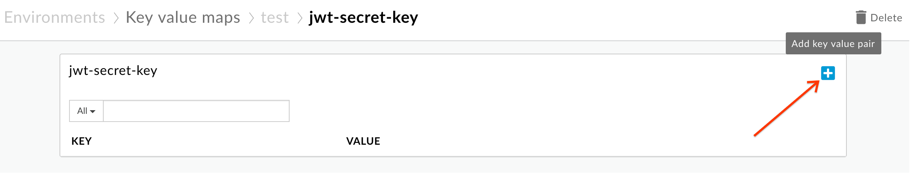

7. Enter the key name as "secret" and the value as "Apigee123", and then click **Add**:

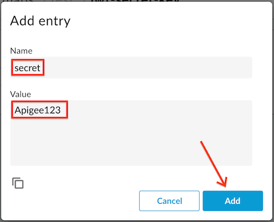

* This shared secret will be used to both generate and verify JWT tokens using the HS256 algorithm.

8. Select **Develop** → **API Proxies** from the side navigation menu:

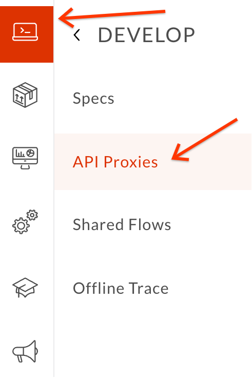

9. Click the **+Proxy** button on the top-right corner to invoke the Create Proxy wizard.


10. Select **Proxy bundle** and then click **Next** to import an existing proxy form a zip archive:


11. Download the Apigee proxy "**JWT.zip**" that generates and verifies JWTs from [here](./resources/JWT.zip?raw=true).  Then click "**Choose File**", select the “**JWT.zip**” file you just downloaded and click **Next**:

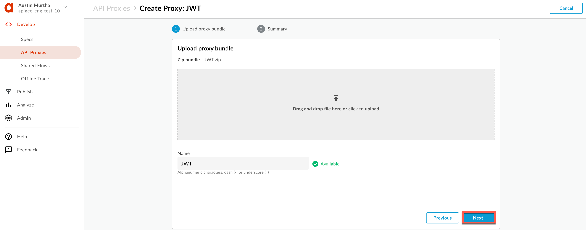

12. Click **Build**:

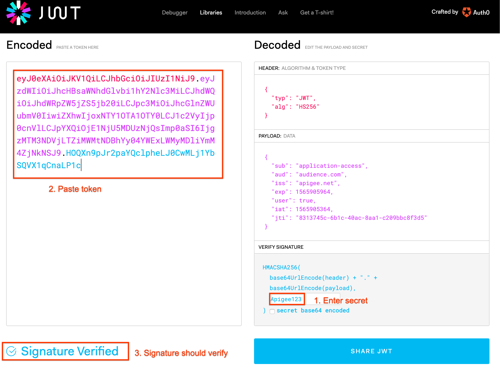

13. You should see a successful "Uploaded proxy" message..  Click on the link to the **JWT** proxy near the bottom of the page:

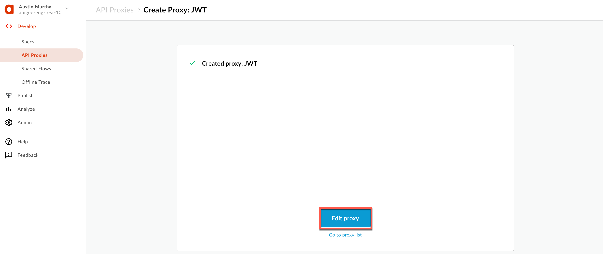

14. Deploy the JWT proxy by clicking on the **Deployment** dropdown and selecting the **test** environment.

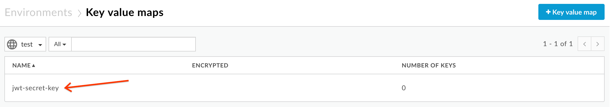

15. Click on the **Develop** tab:

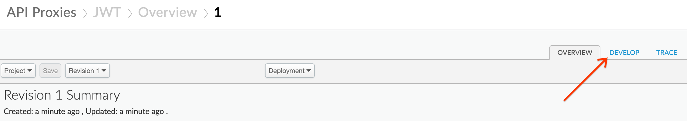

16. You can see that the JWT proxy has two endpoints defined as conditional flows: 

* **Generate JWT** (`/token`) to generate a JWT
* **Verify JWT** (`/verify`) to verify a JWT

Check both flows and read the JWT policies to get a deeper understanding of how they work (reference links available at the end of the lab).  Then click the **Trace** tab:

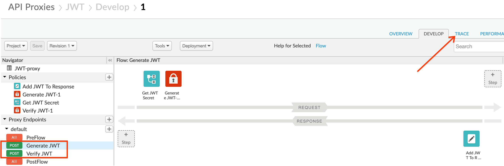

17. Use the **Start Trace Session** button to turn on tracing for the JWT proxy:

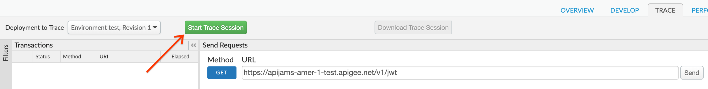

18. Next, send a request to the `/token` endpoint to generate a valid JWT. You can send this request either using a REST client like the one [here](https://apigee-restclient.appspot.com/), or by using the `curl` command from a terminal. The HTTP request to send is:

```
POST /v1/jwt/token HTTP/1.1
Host: {{org-name}}-{{env}}.apigee.net
Content-Length: 0
```

* Replace {{org-name}} with your actual Apigee org name, and {{env}} with the deployment environment for your proxy (eg. test)

Here is an example `curl` command (you will need to replace values as described above):
```
curl -X POST -H "Content-Length: 0" https://{{org-name}}-{{env}}.apigee.net/v1/jwt/token
```

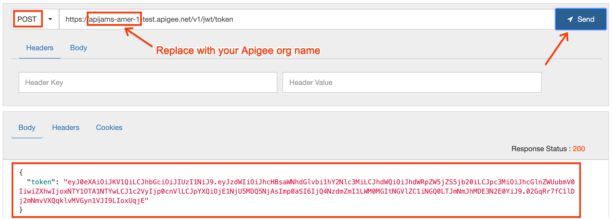

* You should see a token received in HTTP response.  Copy the `token` value (without the surrounding quotes) and review the Trace tool to understand what happened.

19. Go to [http://jwt.io](http://jwt.io). Type the shared secret you configured earlier (e.g. **Apigee123** unless you changed it) in the **Verify Signature** box. Then paste the token in the **Encoded** field (ensure the algorithm is HS256):


20. Now verify the token using the `/verify` proxy endpoint in Apigee.  Use the same REST [tool](https://apigee-restclient.appspot.com/) or `curl` to do so.  The HTTP request is:

```
POST /v1/jwt/verify HTTP/1.1
Host: {{org-name}}-{{env}}.apigee.net
Content-Length: 0
token: {{token}}
```

* Replace {{org-name}} with your actual Apigee org name, and {{env}} with the deployment environment for your proxy (eg. test)

* Replace {{token}} with the value of the JWT

Here is an example `curl` command (you will need to replace values as described above):
```
curl -X POST -I -H "Content-Length: 0" -H "token: {{token}}" https://{{org-name}}-{{env}}.apigee.net/v1/jwt/verify
```

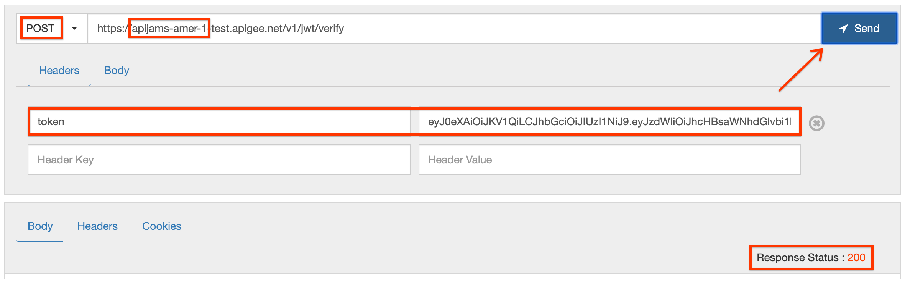

* If you get a 200 response code, the JWT is valid (as expected).  Again, review the Trace tool to understand what happened.

# Earn Extra Points

Change the JWT token generation policy to include [additional claims](https://docs.apigee.com/api-platform/reference/policies/generate-jwt-policy#additionalclaimsclaim) (iss, aud, sub, extra claims) in it, to see how the behavior changes.

You can also try to tamper with the resultig JWT (add/remove characters) and invoke the same `/verify` API call again.  What happens?

# Summary

In this lab, you learned how to use Apigee's out of the box JWT policies to both generate and verify a JWT.  Now you can use these policies to actually secure an API using JWT security.  To do so, you would first want to authenticate a user against their IdP (which also contains "claims" about that user/principal) before calling GenerateJWT and issuing the JWT with claims back to that user (for simplicity, we skipped the user authentication step in this lab and hard coded the claims). The API that is protected would invoke VerifyJWT (either directly or via an Apigee endpoint) to verify the JWT and read/verify its claims.

# References

* [Apigee Edge JWT token support explained in 4 minutes](https://youtu.be/mY5B6YlpkAY)

* [Apigee Edge JWT Policies Overview](https://docs.apigee.com/api-platform/reference/policies/jwt-policies-overview)

* [Adding Additional Claims to your JWT](https://docs.apigee.com/api-platform/reference/policies/generate-jwt-policy#additionalclaimsclaim)

You may now proceed to [Lab 5](../Lab%205).
