# API Security - External IdP Integration using Okta

*Duration : 20 mins*

*Persona : API Team/Security*

# Use case

You have an API that is needs to be consumed by a trusted client application. You want to secure that API using OAuth 2.0 and use an external identity provider such as Okta to protect the application end user's identity.
In this lab we will use Apigee as the OAuth provider to protect the API endpoints using OAuth 2.0. Okta will be used to protect the application end user's identity. We will accomplish this by integrating Okta into the Apigee OAuth proxy, and implement OAuth 2.0 with the **resource owner password credentials** (or ROPC) grant type. 

# How can Apigee Edge help?

(optional) See: [Apigee + Okta - Using OAuth 2.0 Resource Owner / Password Grant Type](https://community.apigee.com/articles/28752/apigeeokta-integration-resource-owner-password-gra.html)

Apigee has built in support to implement OAuth 2.0 with the ROPC grant type. Using the [OAuthV2 policy](https://docs.apigee.com/api-platform/reference/policies/oauthv2-policy), Apigee Edge can be configured to act as the authorization provider for access to the API, while using the [Service Callout policy](https://docs.apigee.com/api-platform/reference/policies/service-callout-policy) to invoke Okta's authentication API to authenticate the identity of the end user.


# Prerequisites

* Have completed the API Jam [Module-2a labs](../../../Module-2a). If not, please complete those first.

# Instructions

For this lab we will use the client application - **Hipster Products App** - that needs to consume the API - **{yourinitials}_Hipster-Products-API** - both of which you built in the previous modules.

The ROPC grant type is mostly used in cases where the app is highly trusted. In this configuration, the end user provides their resource server credentials (username/password) to the client app, which sends them in an access token request to the OAuth authorization server (in this case Apigee Edge). An identity provider or IdP (in this case Okta) validates the credentials, and if they are valid, Apigee Edge proceeds to mint an access token and returns it to the app.

In this scenario, we will set up:

* The end user's identity in Okta
* The API proxy configuration in Apigee Edge to enforce both end user identity authentication, as well as API authorization via OAuth 2.0

## End User Configuration in Okta

1. In this lab, we will use a pre-configured Okta instance to authenticate end user identity. To add a new app end user, we will use the Okta User API.

Invoke the following API request (either from a terminal or a [REST client](https://apigee-restclient.appspot.com/)):

```
POST /api/v1/users?activate=true HTTP/1.1
Host: dev-271499-admin.okta.com
Content-Type: application/json
Authorization: SSWS 004LHmN3InpVQ9pOMWjsdb6ZDUmi1IP8_DLjaOlb6Z

{"profile": {"firstName": "<Enter First Name>","lastName": "<Enter Last Name>","email": "<Enter Email ID>","login": "<Enter Email ID>"},"credentials": {"password" : { "value": "<Enter Password>"}}}
```

* For first Name, last name, email, login, and password: provide your own values

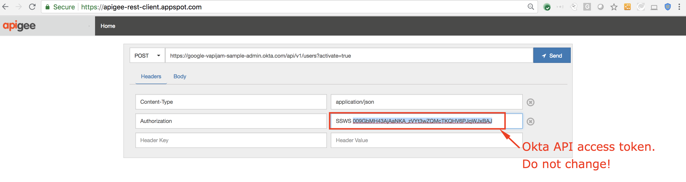

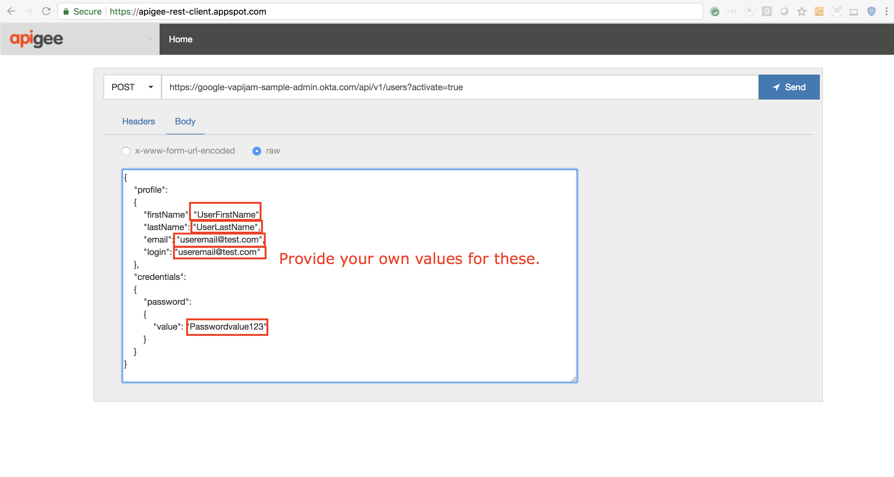

Example `curl` command (replace user details with your own):
```
curl -X POST "https://dev-271499-admin.okta.com/api/v1/users?activate=true" -H "Content-Type: application/json" -H "Authorization: SSWS 004LHmN3InpVQ9pOMWjsdb6ZDUmi1IP8_DLjaOlb6Z" -d '{"profile": {"firstName": "<Enter First Name>","lastName": "<Enter Last Name>","email": "<Enter Email ID>","login": "<Enter Email ID>"},"credentials": {"password" : { "value": "<Enter Password>"}}}'
```

This will create an active end user profile in Okta:


2. Make note of the Username and Password you provided in the above API request. We will use this to authenticate the app end user's identity.

## Create OAuth Token Endpoints

1. First, we must set up the OAuth token endpoint. To do this, download the API proxy bundle from [here](./resources/oauth-okta-integration.zip?raw=true).

2. Once downloaded, navigate to **Develop → API Proxies** from the side navigation menu:


3. Click the **+Proxy** button at the top right of the screen:


4. Select the option **Upload proxy bundle** and click **Next**:


5. On the next screen, choose **Click or Drag** and upload the previously downloaded proxy bundle zip. Then click **Next**:

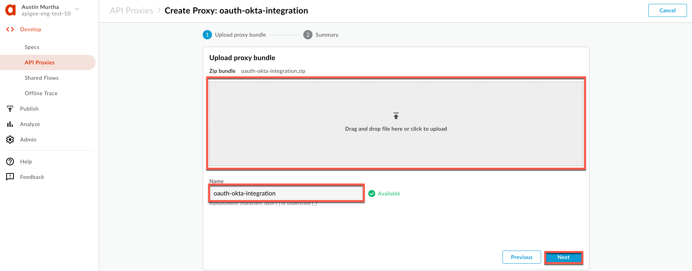

6. On the next screen, click **Create**:

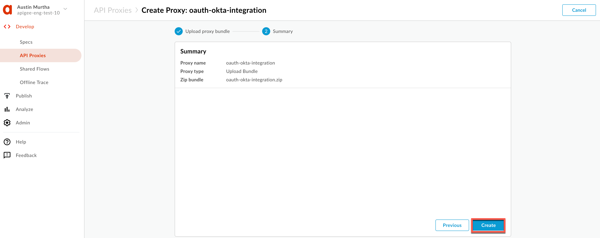

7. Click **Edit Proxy** at the bottom of the page:


8. On the Proxy Overview page, click the **Deployment** drop down, and select the **test** environment. Click **Deploy** in the confirmation pop-up.

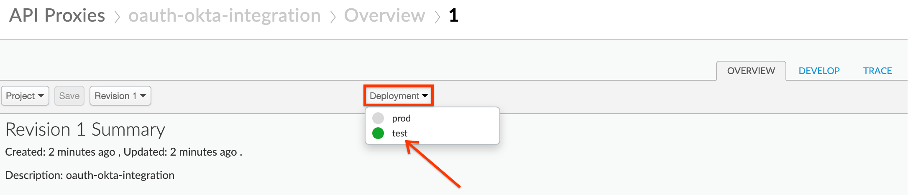

## Test

Now that we have configured the end user credentials in Okta, and the API Proxy in Apigee Edge, let us proceed to test the OAuth ROPC flow end to end.

1. If necessary, retrieve the app credentials for the **Hipster Products App** you created in the previous labs.  Click on **Publish** → **Apps** from the side navigation menu:


2. Select the **Hipster Products App**:

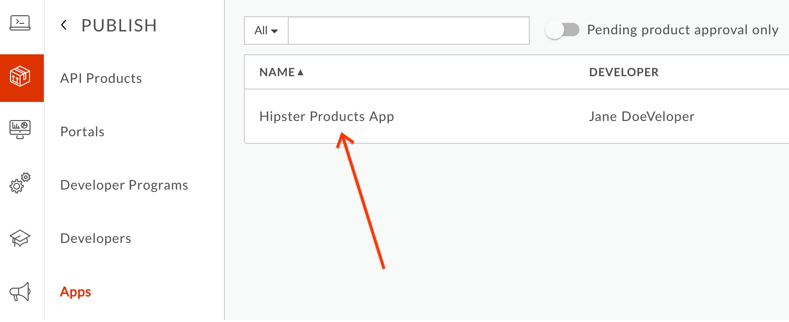

3. Click the "Show/Hide" buttons next to the **Key** and **Secret** fields. Make a note of the Key and Secret values. These are the client credentials you will need to obtain an OAuth access token:


4. (Optional) Navigate to the **Trace** tab on the **oauth-okta-integration** proxy and start a trace session:


5. Send the following token generation request to the access token endpoint, using a terminal or a [REST client](https://apigee-restclient.appspot.com):

```
POST /oauth-ext/token HTTP/1.1
Host: {{org}}-{{env}}.apigee.net
Content-Type: application/x-www-form-urlencoded
Accept: application/json
Authorization: {{Base 64 encoded value of Key:Secret, where Key & Secret are the ones you just noted down}}

grant_type=password&user={{okta_user}}&password={{okta_password}}
```

* Replace {{org-name}} with your actual Apigee org name, and {{env}} with the deployment environment for your proxy (eg. test)

* To obtain a base64 encoded value of 'Key:Secret', you can utilize an open tool like [G Suite Toolbox](https://toolbox.googleapps.com/apps/encode_decode/):

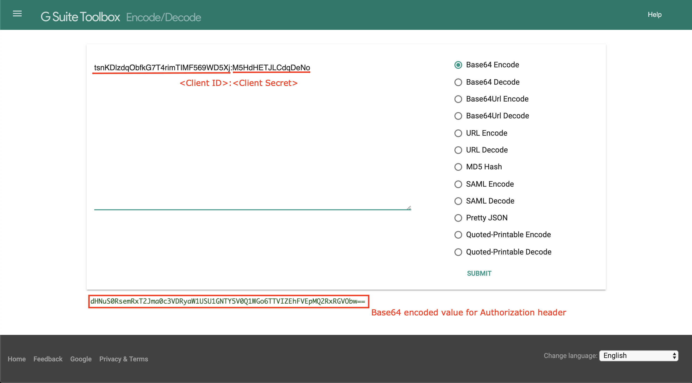

* Replace {{okta_user}} and {{okta_password}} with the values you used to add the app end user to Okta

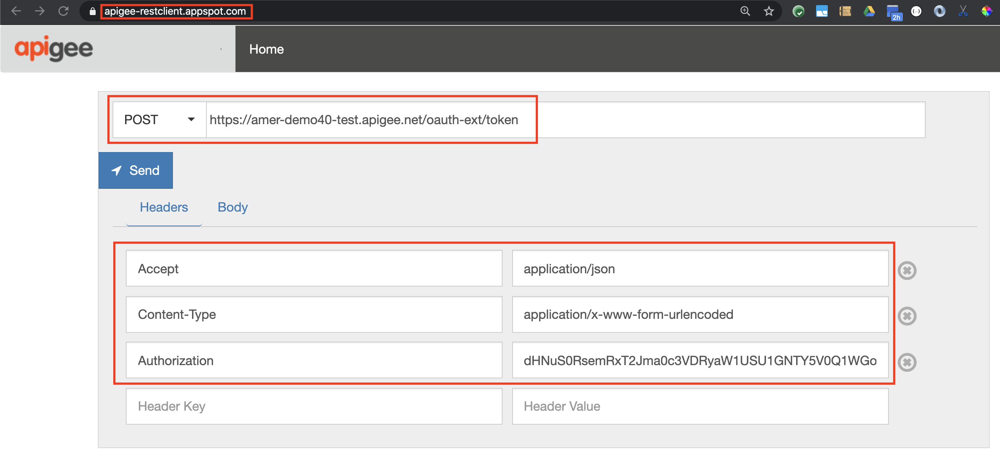

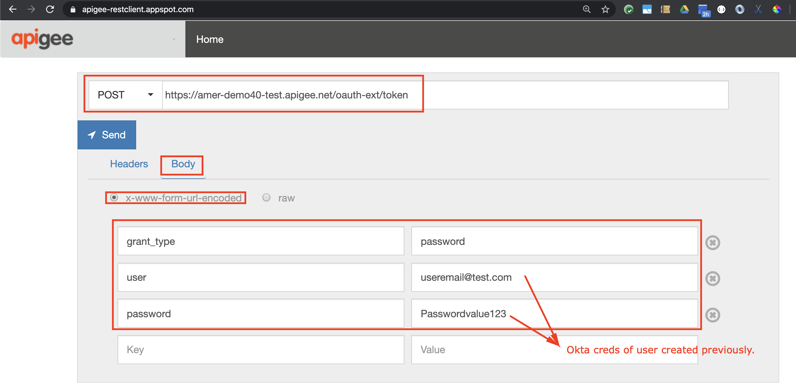

Example `curl` command (replace with values as described above):
```
curl -X POST -H "Accept:application/json" \
-H "Content-Type:application/x-www-form-urlencoded" \
-H "Authorization:{{Base64 encoded Key:Secret}}" \
-d 'grant_type=password&user={{okta_user}}&password={{okta_password}}' \
"https://{{org}}-{{env}}.apigee.net/oauth-ext/token"
```

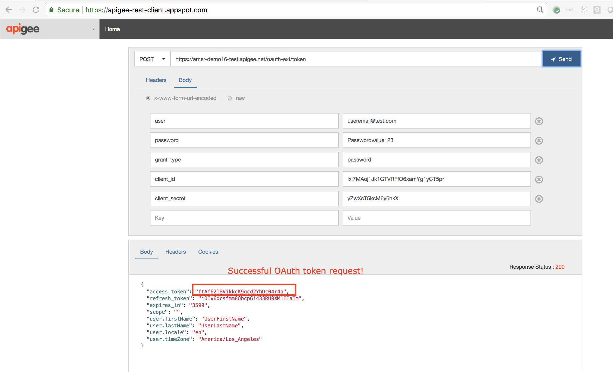

You should now have an OAuth access token returned in the body of the HTTP response.  Copy the value of `access_token` (not including the surrounding quotes) as you will need it for the next step.

Also, note in the trace session that the **Service Callout** policy in the **oauth-okta-integration** proxy is called to validate the end user identity in Okta. Upon successful authentication, the proxy then uses the OAuthV2 policy to generate the access token:


6. Now, let us test the **{yourinitials}_Hipster-Products-API** proxy which we protected with the OAuthV2 policy back in Module-2a lab 2.

7. (Optional) Navigate to the **Trace** screen of the **{yourinitials}_Hipster-Products-API** proxy, and start a trace session:

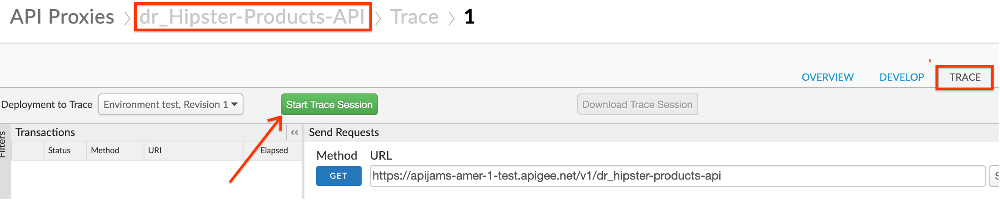

8. Send in a GET request to the `/products` endpoint without an Authorization header:

```
GET /v1/{{yourinitials}}_hipster-products-api/products HTTP/1.1
Host: {{org-name}}-{{env}}.apigee.net
```

* Replace {{yourinitials}} with the initials you used when creating the proxy

* Replace {{org-name}} with your actual Apigee org name, and {{env}} with the deployment environment for your proxy (eg. test)

Notice a 401 unauthorized error response is returned because the access token was not sent in the request:

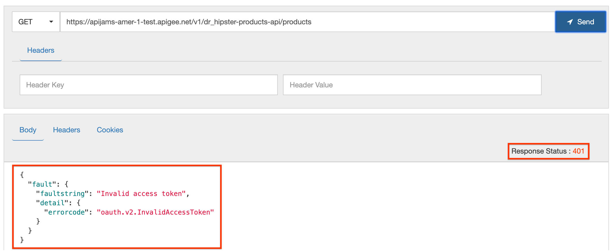

9. Now send the same request, this time adding the access token in the Authorization header:

```
GET /v1/{{yourinitials}}_hipster-products-api/products HTTP/1.1
Host: {{org-name}}-{{env}}.apigee.net
Authorization: Bearer {{access-token}}
```

* Add a header named **Authorization**, and in the value field enter **Bearer** followed by the `access_token` value you copied from the request to the **oauth-okta-integration** endpoint

Once the access token is validated, a successful API response is returned:

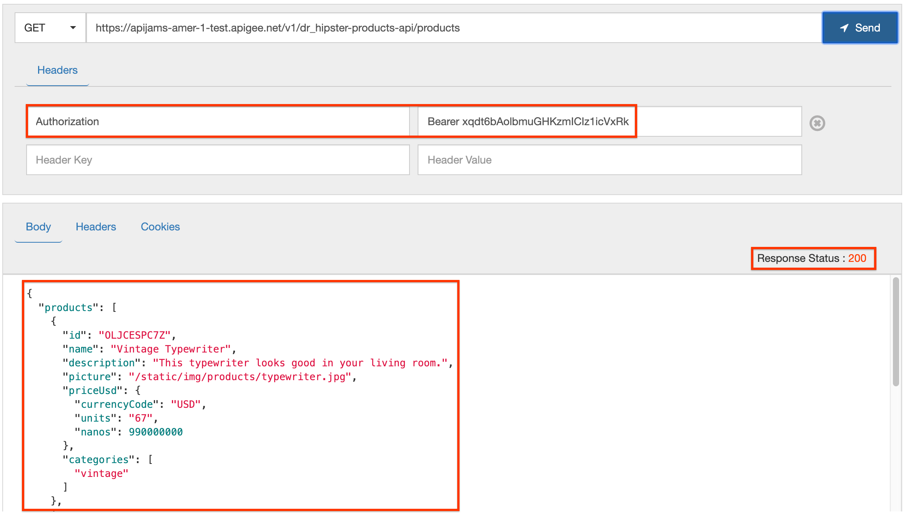

## Lab Video

If you like to learn by watching, here is a short video on the topic: [Apigee/Okta Integration: Resource Owner / Password Grant Flow in Action](https://youtu.be/OKCySDIwZ1E)

## Earn Extra points

* Try out the Okta integration proxy using a *delegated* token generation flow where **Okta** mints the OAuth access token instead of Apigee, as documented here: 
	- [Apigee Community Article](https://community.apigee.com/articles/28752/apigeeokta-integration-resource-owner-password-gra.html)
	- [Proxy bundle](https://github.com/prithpal/apigee-okta-integration)

* Also see the advanced example for Open ID Connect with Okta, as documented [here](https://github.com/apigee/apigee-okta).

## Summary

In this lab, you created an OAuth 2.0 access token endpoint to generate and refresh tokens using the resource owner password credentials (ROPC) grant type, validating end user credentials against an external identity provider (Okta). You also secured your API such that a valid token must be presented to authorize requests to your API.

## References

* [Implementing the Password Grant Type for OAuth 2.0 on Apigee Edge](https://docs.apigee.com/api-platform/security/oauth/implementing-password-grant-type)

* [OAuthV2 policy cofiguration reference](https://docs.apigee.com/api-platform/reference/policies/oauthv2-policy)
