## Module 3 - Lab 1 : Global policy management using Shared Flows, Flow Hooks and Flow Callouts
# Policy Management : Shared Flows

*Duration : 20 mins*

*Persona : API Team / Policy Management*

# Use case:

You are tasked with designing multiple API proxies for your organization, your APIs have similar requirements with respect to Security, Logging and Mediation. You are looking to define a standard implementation for these requirements and would also like a means to enforce certain requirements that all new APIs with your organization should adhere to from an API Governance and Policy management point of view.

# How can Apigee Edge help?

By exposing an API through Apigee Edge, you gain the ability to modify and monitor its behavior using out-of-the-box policies. Edge's out-of-the-box policies enable you to enhance your API with sophisticated features to control traffic, enhance performance, enforce security, and increase the utility of your APIs, without requiring you to write any code or to modify any backend services. 

In additon to these policies, Apigee Edge also provides for manner to group multiple of these policies into a single re-usable collection called Shared Flows. Shared Flows gives you an ability reuse policies / best practices across different API proxies and even across different teams. Furthermore Apigee Edge also provides concepts of flow hooks by which you can have these shared flows invoked automatically within any new proxy that is created within your organization, hence eliminating the need to explicitly callout flows and enforcing API Governance centrally.


# Pre-requisites

* Basic understanding of [OpenAPI Specification](https://github.com/OAI/OpenAPI-Specification) (Swagger)
* Completed a previous Module 2 (a) for our [Virtual API Jam](../../../Module-2a) or have the equivalent knowledge. Alternatively, go through the ["Getting started guide"](https://docs.apigee.com/api-platform/get-started/get-started) in the Apigee Docs site.
* We will be reusing the proxies from the module 2 of virtual Apijam, a copy of the proxy code is available within the resources section in this repo.
* Please ensure that you have an OAuth proxy within your organization, if not, you can follow the instructions from Lab 2(a) of this APIJam. [here](../../../Module-2a/Labs/Lab%202#create-oauth-token-endpoints) 

# Instructions

In this lab we will see how we can bundle certain out of the box policies, that you have already used in our labs, like traffic management policy(Spike Arrest) and Security (OAuth) into a shared flow and have this shared flow invoked within your proxy using the flow callout feature. 

## Create and Deploy a Shared Flow

1. Go to [https://apigee.com/edge](https://apigee.com/edge) and log in. This is the Edge management UI. 

2. Select **Develop → Shared Flows** in the side navigation menu.

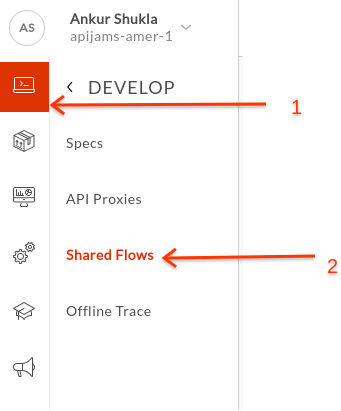

3. Click the **+Shared Flow** button on the top-right corner to invoke the **+New Shared Flow** wizard. 

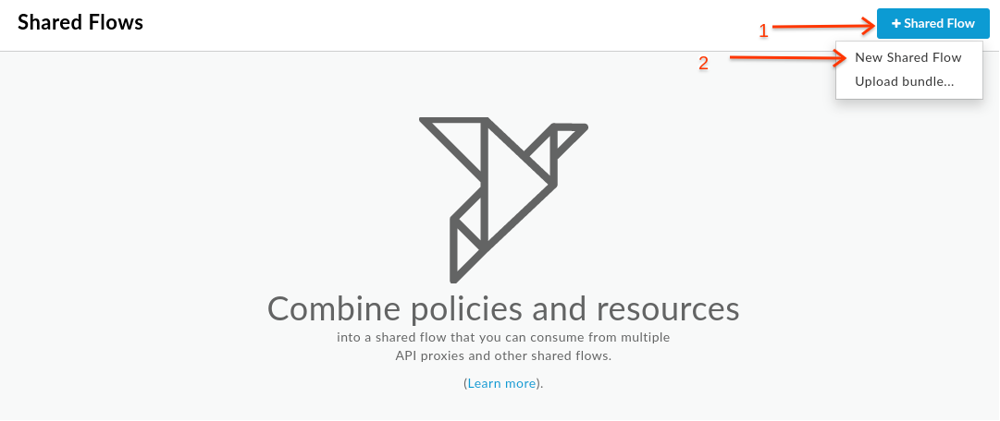

4. Provide a name and description for your shared flow.
 Note - To avoid confusion with others members participating in the APIJam, please prefix your shared flow with your initials.

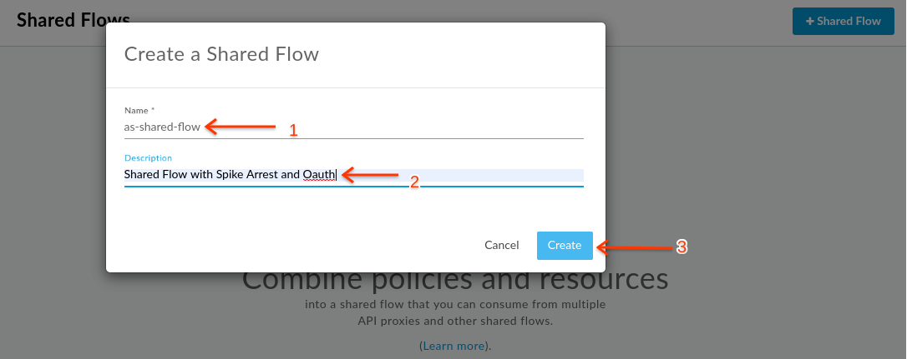

5. Verify that an empty shared flow is created by selecting **Develop** tab in the right side menu.

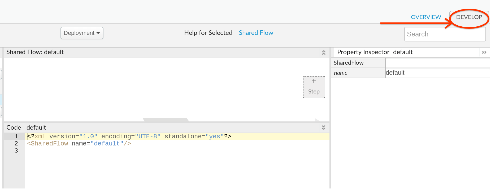

* Shared flow will look similar to a proxy that you have build in previous modules of this APIJam.

Note- Although a **shared flow** appears to look like a proxy, a shared flow has no endpoint. It can be used only from an actual API proxy or shared flow that is in the same organization as the shared flow itself.

* Click on **Deployment** and select the **test** environment to deploy the flow to the test environment. 

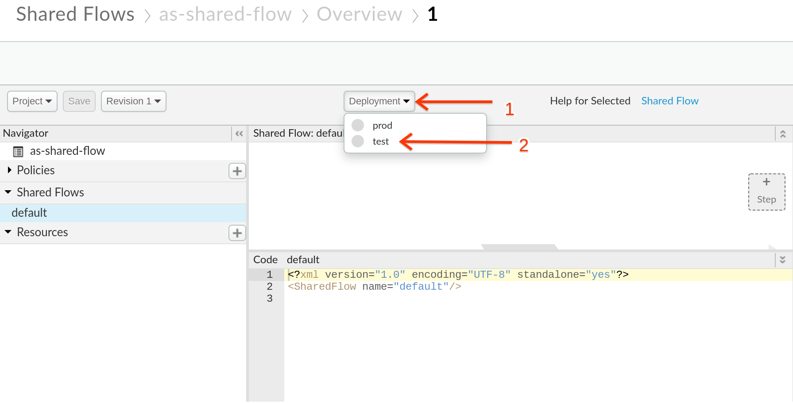

* You will be prompted with a dialog box to confirm the deployment to environment "test", click on **Deploy**.

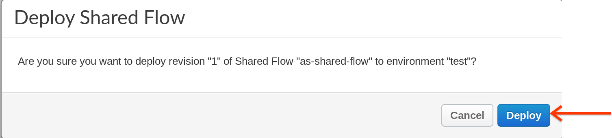

6. Now lets add the policies we want to be part of this FLOW, Click on **default** section under Shared Flows, and then click on **+Step** on the upper right of the Request flow to attach a Spike Arrest policy.


7. Select **Spike Arrest Policy**. Click on **Add** button to add the spike arrest policy to the shared flow canvas.

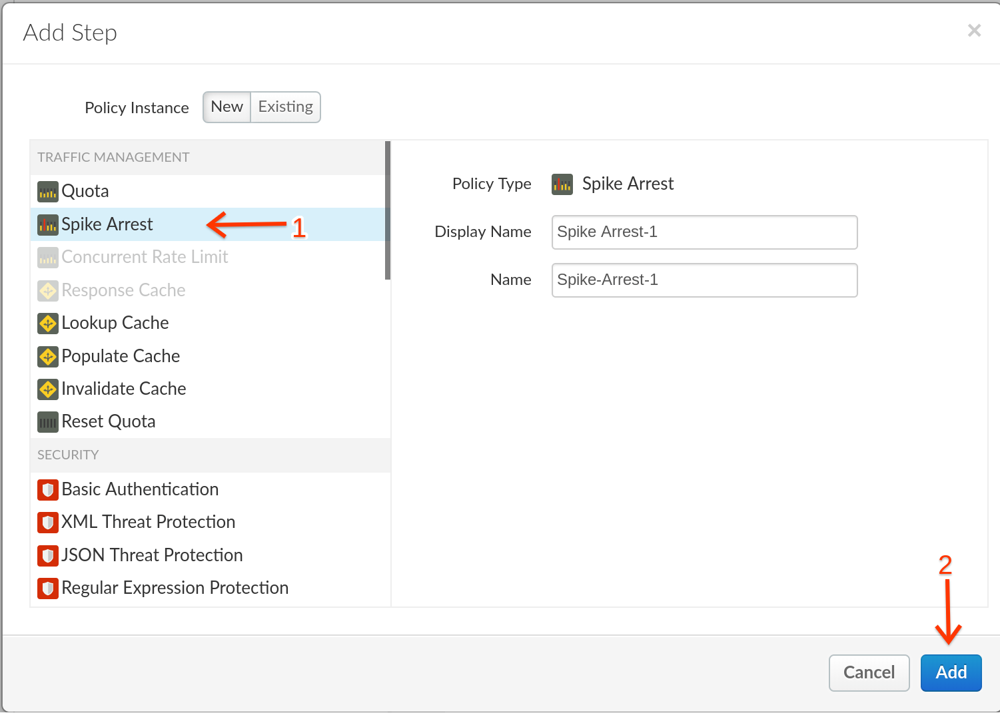

8. Note the Spike Arrest policy icon on top of request flow that shows exactly where the policy is attached. Select the policy to display the policy's XML configuration in the editor. What you now see is the default XML configuration for the Spike Arrest Policy.

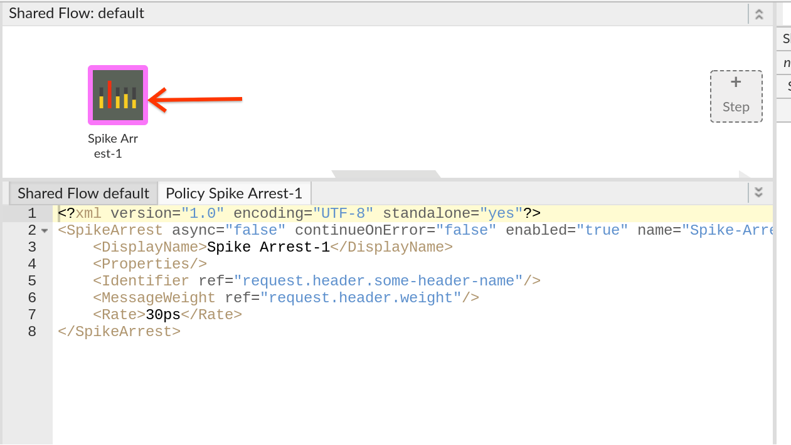

9. Change the Policy XML configuration to the below snippet to enforce a rate of 12 requests per minute.
```
<?xml version="1.0" encoding="UTF-8" standalone="yes"?>
<SpikeArrest async="false" continueOnError="false" enabled="true" name="Spike-Arrest-1">
    <DisplayName>Spike Arrest-1</DisplayName>
    <Properties/>
    <Rate>12pm</Rate>
    <UseEffectiveCount>true</UseEffectiveCount>
</SpikeArrest>
```

10. Similary, Lets add the **OAuth v2.0** Policy to ensure that an API Token based security is enforced in all APIs that are using this flow. 

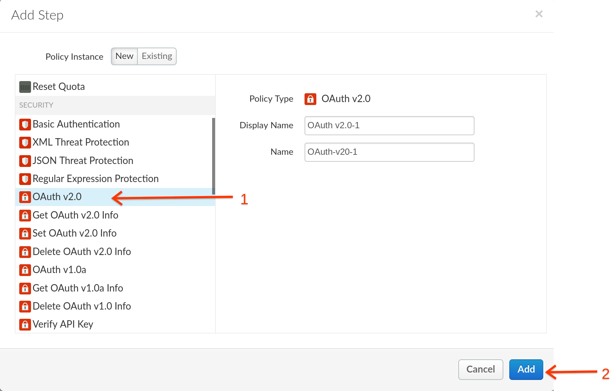

Please ensure OAuth v2.0 policy is the first policy (before Spike Arrest) and then click **Save**.

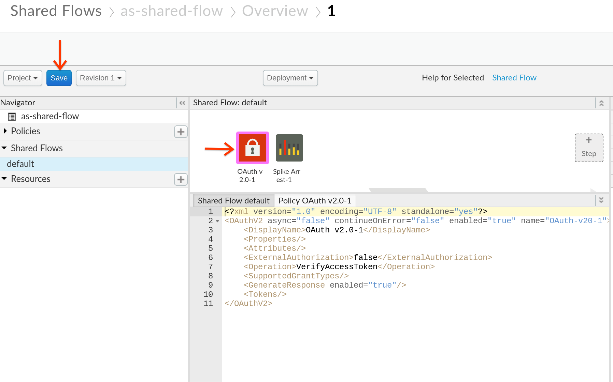

* Note- if your  OAuth v2.0 policy does not appear as the first policy you can use the drag and drop feature to move policies around within the canvas.


## Testing your shared flow using Flow Callouts and Flow Hooks

Your shared flow is now ready for testing. As discussed earlier, Shared flows do not have actual backend implementations, hence for testing our shared flow we will need to either invoke this within a proxy via an explicit **flow callout** or have this flow attached to a **flow hook**. 

To test this flow we will be using the existing proxy that you created within [Module 2(a)](../../Module-2a/Labs/Lab%202). If you have not completed Module 2(a), It is recommended that you review the content of the lab to familiarize with the concepts of Spike Arrest and OAuth first before we proceed with the remainder of this Lab.

If you have completed Module 2 and already have the ***Hipster Products API*** Proxy, you can skip the next sub-section and move directly to Step 1.


### (Optional) Import ***Hipster Products API*** Proxy - Only required if you have not completed Module 2

a. Go to [https://apigee.com/edge](https://apigee.com/edge) and log in. This is the Edge management UI.

b. Select **Develop** → **API Proxies** in the side navigation menu.

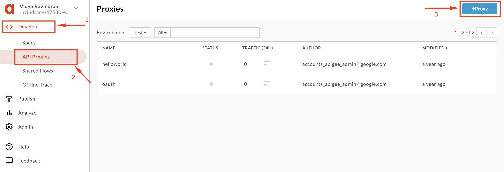

c. Click the **+Proxy** button on the top-right corner to invoke the Create Proxy wizard.

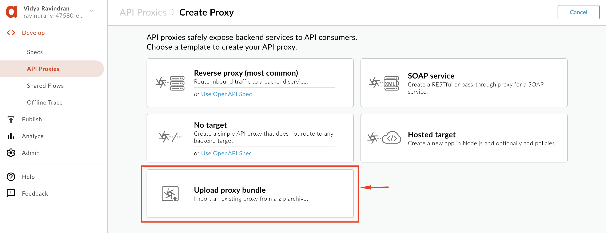

d. Select **Proxy Bundle** and then click **Next** to import an existing proxy form a zip archive.

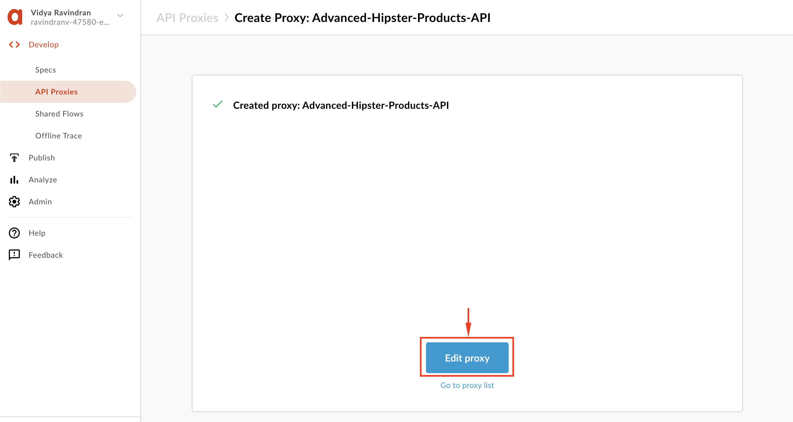

Download the API proxy "as_Hipster-Products-API_rev1_2019_08_20.zip" that implements OAuth client credentials grant type [here](./Resources/as_Hipster-Products-API_rev1_2019_08_15.zip). 

Back in the proxy creation wizard, click "Choose File", select the ***“zip”*** file you just downloaded and click **Next**:

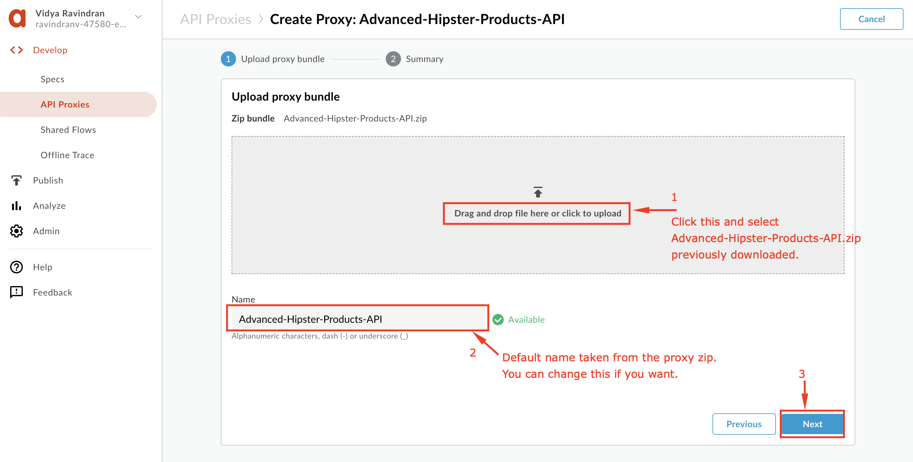

e. Click **Build**:

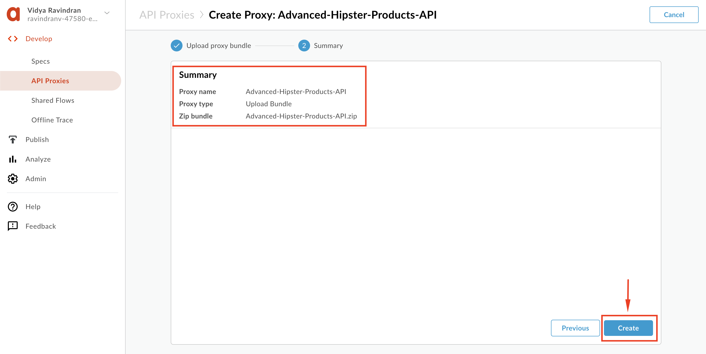

You should see a successful "Uploaded proxy" message as shown below.  You now have the **Hipster Products Api Proxy** from Module 2.  Click "Hipster Products API" near the bottom of the page:

f. Click on **Develop** Tab and and Then Select **<your_initials>_Hipster-Products-API** under the Navigator section.
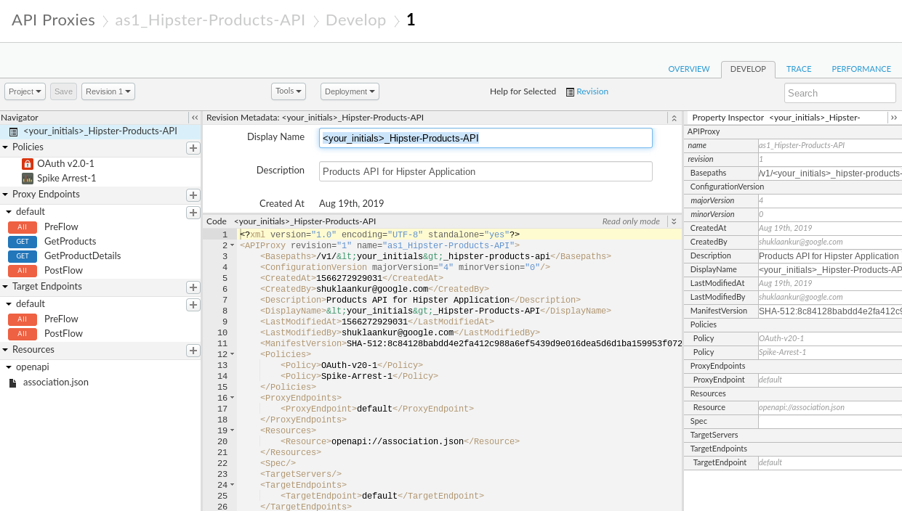


g. Replace <Your_Initials> with your initials within the Display Name and Basepaths sections as show below and click Save 
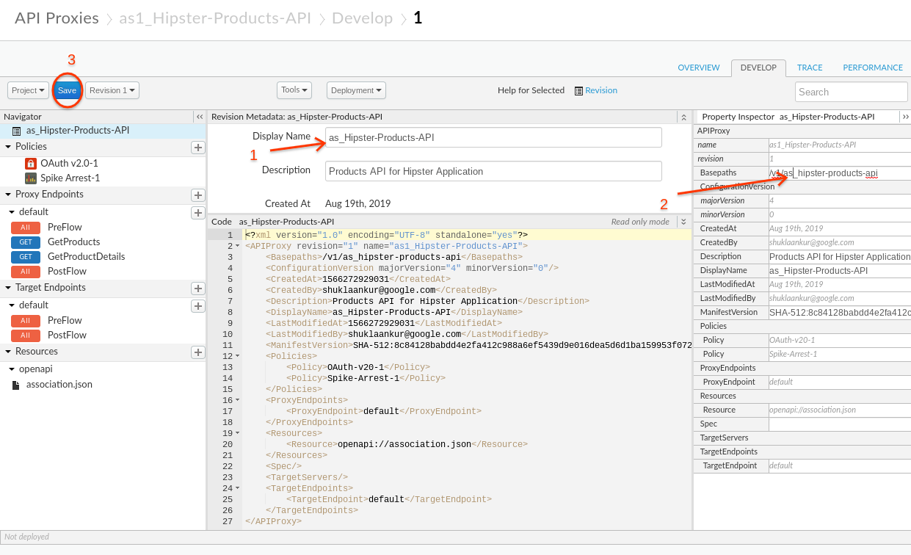

Within ***Develop*** Tab, Under the Proxy Enpoints sections, Update the <BasePath> Element with your Initials.
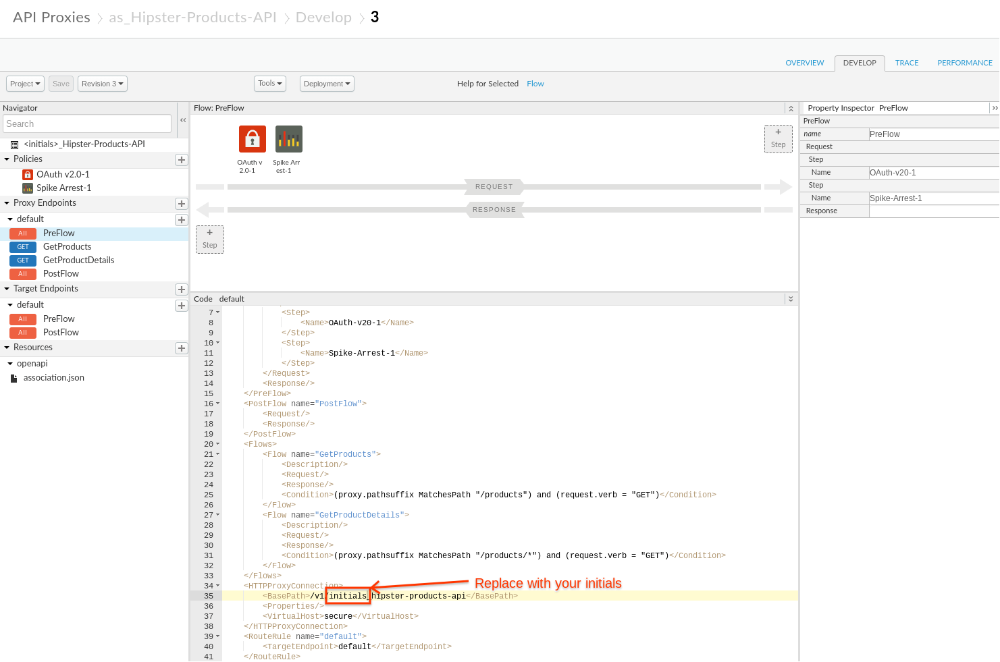

 
h. Deploy the proxy by clicking on the **Deployment** dropdown and selecting the **test** environment:

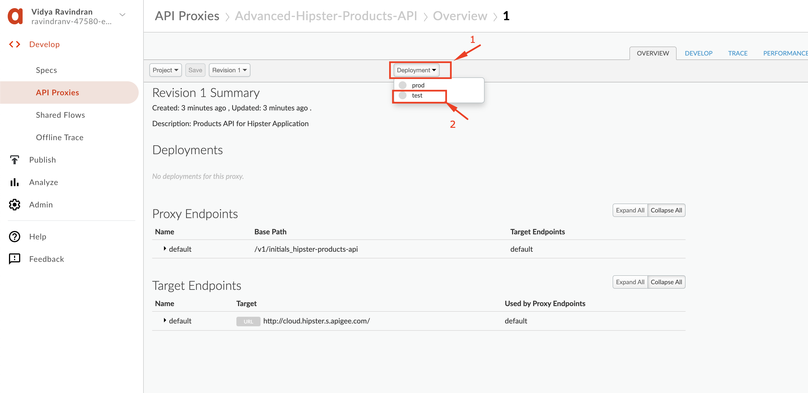

Your proxy is now ready for testing, if you would like to test this, please follow instructions from Module 2. The steps below will detail how to invoke the shared flow that you have created as a part of this Lab. Following the tests from Module 2 is an import pre-requisite as you will need your application Key and Secret for the remainder of this Lab.

1. Since the Hipster API already contians the Policies for OAuth and Spike arrest, we will start by removing these polcies from the preflow. Click on each of the policies and select small "x" sign on the top right corner of the policy icon to remove the polcies from execution sequence.
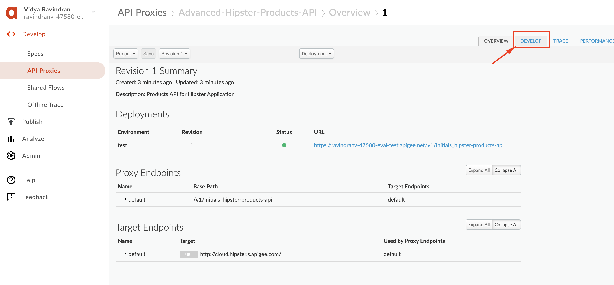

2. Click on **+ Step** Icon to Add Policies and select the **Flow Callout** Policy from within ***Extention*** section of the policy menu. Within the **Shared flow** dropdown menu you should see your shared flow, select it and click on Add 
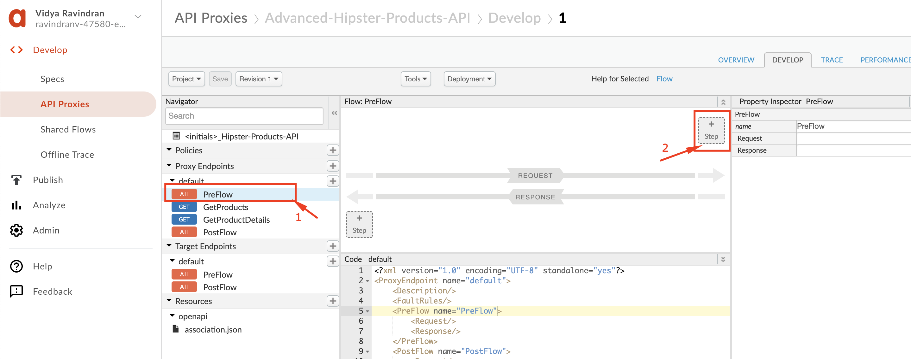

3. Save Your Proxy and Click on **Trace** Tab to start testing.
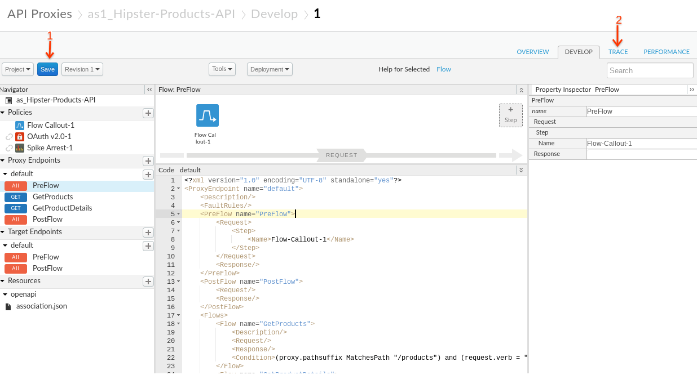

4.  Click on **Start Trace Session** to see API Proxy with spike arrest in action.
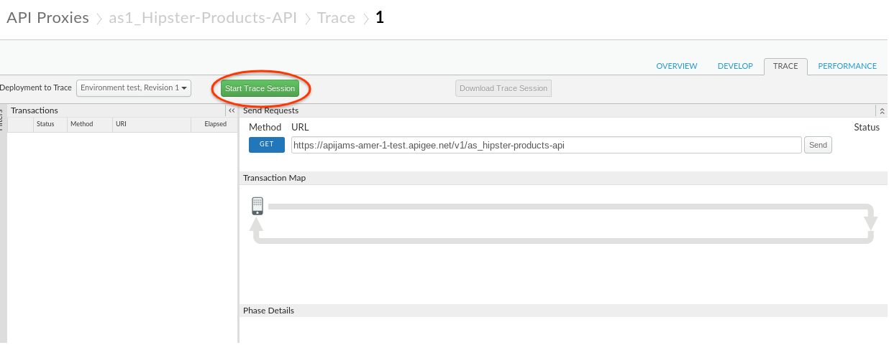

5. To streamline testing you can externalize credentials and org specefic details as below:

```
export APP_CLIENT_SECRET="secret"
export APP_CLIENT_KEY="key"
export ORG_NAME="orgname"
export ENV="envname"
```

Note - for App Client Key and Secret, you will need an ***App*** created within Apigee Edge and Module 2 talks about API Products, Api Developer and Application creation process. It also details out how to obtain your Applications Key and Secret that are needed for this lab.

6. We will be using application creadentials (Client ID and Secret) to Make ***curl***  POST Call to the OAuth Endpoint to obtain an API Token using the Client credential OAuth grant type:
```
curl -X POST -H 'Content-Type: application/x-www-form-urlencoded' -H 'Accept: application/json' "https://$ORG_NAME-$ENV.apigee.net/oauth/client_credential/accesstoken?grant_type=client_credentials" -d "client_id=$APP_CLIENT_KEY&client_secret=$APP_CLIENT_SECRET"
```

You should see a response with status ***200 OK*** like below:
```
curl -X POST -H 'Content-Type: application/x-www-form-urlencoded' -H 'Accept: application/json' "https://$ORG_NAME-$ENV.apigee.net/oauth/client_credential/accesstoken?grant_type=client_credentials" -d "client_id=$APP_CLIENT_KEY&client_secret=$APP_CLIENT_SECRET"
{
  "refresh_token_expires_in" : "0",
  "api_product_list" : "[dr_Hipster-Products-API-Product]",
  "api_product_list_json" : [ "dr_Hipster-Products-API-Product" ],
  "organization_name" : "apijams-amer-1",
  "developer.email" : "jdev@gmail.com",
  "token_type" : "BearerToken",
  "issued_at" : "1566275920240",
  "client_id" : "<Client ID>",
  "access_token" : "<Token>",
  "application_name" : "ae65d3ab-38bf-44c8-955c-c9bc5ebdbf86",
  "scope" : "",
  "expires_in" : "3599",
  "refresh_count" : "0",
  "status" : "approved"
}%                                         
```

Note - Apigee also provides a rest client that you can use to make these calls if you do not have access to a terminal or would like a UI based utility. This tool can be accessed [here] (https://apigee-rest-client.appspot.com).

Here are the details of the call:

```
Rest Endpoint - https://$ORG_NAME-$ENV.apigee.net/oauth/client_credential/accesstoken?grant_type=client_credentials
Rest VERB - POST
Request Headers-> Value - 
      Accept ->  Application/json
      Content-Type -> application/x-www-form-urlencoded
Request Body - client_id=<Your Apps Client ID>&client_secret=<Secret>
```

7. Take the token from above response and externalise it using another ENV Variable like below:
```
export ACCESS_TOKEN="Token from Above Response"
```
Now make the actual Call your Hispter API using below CURL and Look at the trace:
```
curl -X GET -H "Authorization: Bearer $ACCESS-TOKEN" "https://$ORG_NAME-$ENV.apigee.net/v1/<Your Initials>_hipster-products-api/products"

```

Call Details if you are using a UI Utility:
```
Rest Endpoint - https://$ORG_NAME-$ENV.apigee.net/v1/<Your Initials>_hipster-products-api/products
Rest VERB - GET
Request Headers-> Value - 
      Authorization ->  Bearer <Your API Token>
```
Note - Be sure to replace <Your Initials> above within the proxy base path.

Your should see a ***200 OK*** response with a Listing of the Product catalog in your Response. 
You can also see your API Calls in action within the Trace Tool and will note that the Flow Call out was initiated with Spike Arrest and Oauth policies applied to this call.

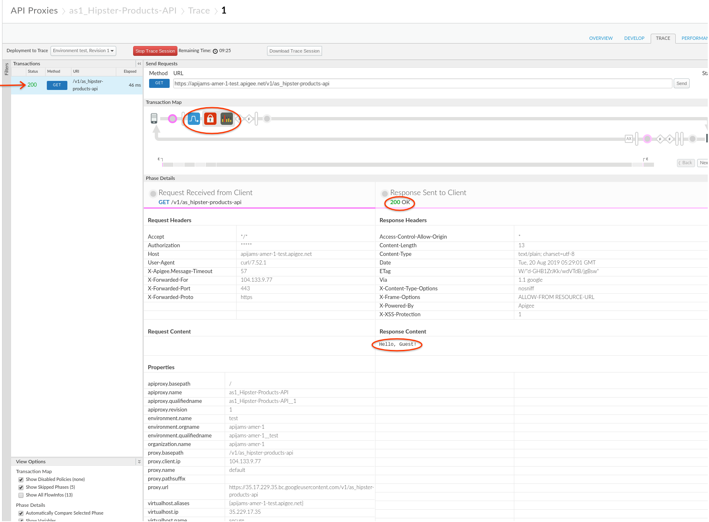

8. Lets re-enter the above CURL command Multiple Times in Quick succession to Engage our Spike Arrest Policy, You should see an error like below:
```
{"fault":{"faultstring":"Spike arrest violation. Allowed rate : MessageRate{messagesPerPeriod=12, periodInMicroseconds=240000000, maxBurstMessageCount=1.0}","detail":{"errorcode":"policies.ratelimit.SpikeArrestViolation"}}}%  
```

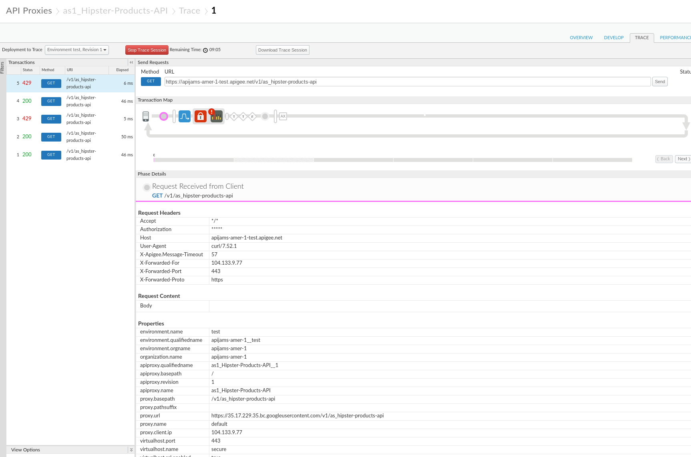


9. You can now Omit the API Key from your Curl Call and see that you get a ***401 Unathorized** Error
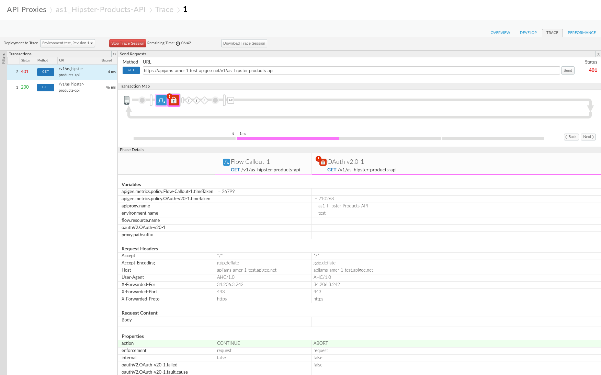

This concludes our Lab for Shared Flows and Next we will look at the concept of Flow Hooks.

## Flow Hooks

So far in this Lab, you have seen how to group multiple policies for execution into a single flow and how to invoke flows from within your proxy using the flow call out feature. However, in all of this the onus for ensuring that policy is applied within a proxy is still on the Proxy developer to either include a policy or a flow that will execute the policy. 

***Flow Hooks*** provides a mechanism for an Organization Administrator to enforce a shared flow as a **governance** feature in a manner that mandates to all proxies within an Environment. Think of Flow Hooks as a way to ENFORCE one or more of the Shared Flows to ALL the API Proxies running in a particular environment. This gives you a separately implemented and deployed sequence of logic that is are part of a proxy's implementation code (either directly or referenced through a flowCallout policy).  

## Enforcement Points -

There are 4 enforcement points where you can associate a ***Shared Flow*** to be automatically invoked within your proxy execution. 

***Pre-proxy Flow Hook*** - for logic that needs to be enforced BEFORE a proxy endpoint executes for ALL API Proxies deployed to that environment.

For example, you could have logic for enforcing security across all the APIs in an environment.

***Pre-target Flow Hook*** - for logic that needs to be enforced right BEFORE reaching out to a target backend for ALL API Proxies deployed to that environment.

For example, you could implement logging before the request reaches the backend. You could also enforce mediation by removing certain fields from the request.

***Post-target Flow Hook*** - for logic that needs to be enforced BEFORE the API Proxy response executes for ALL API Proxies deployed to that environment.This will be enforced right after the response comes back from the backend. You can use it to log the backend response or perform some mediation by removing sensitive fields from the backend response.

***Post-proxy Flow Hook*** - for logic that needs to be enforced AFTER the proxy endpoint and right before the response is sent out to the client for ALL API Proxies deployed to that environment.

This could include some enforcement logic for CORS, logging the response, or performing some mashup or formatting.

## Using Flow Hooks
In this last section of our Lab we will see how we can use the Flow Hooks feature to automatically execute the our ***shared flow*** within the ***Hipster Products API*** Proxy.

1) Lets start by removing the flow callout policy that we have within our proxy and click on Save to re-deploy our proxy. As our proxy stands, the current version of our proxy has no policy enforcement in place. So all incoming calls will be relayed to backend without any traffic limiting or OAuth security.

Hint - To remove the flow callout feature we just go to the develop tab within your proxy and click on the x on the top righthand corner of the policy box.

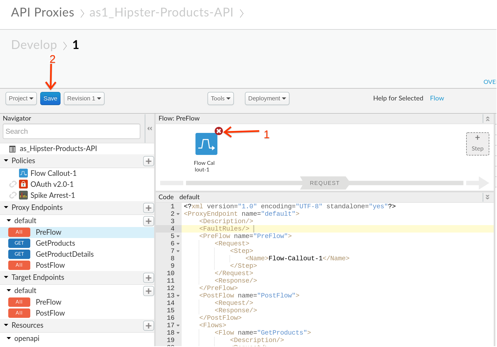

Note - Click on Save to ensure that the new changes are now applied to your proxy.

2) From the left Hand Menu, select Admin -> Environments -> Flow Hooks

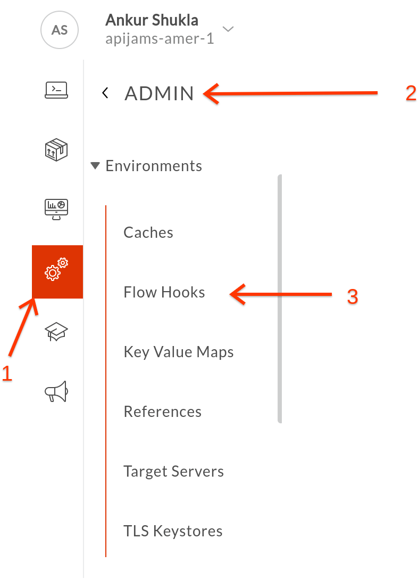

3) From the Flow Hooks Options, Select **test** Environment and then click on on the ***Pencil*** Sign on right end of the Pre-Proxy to invoke the ***Pre-Proxy flow*** configuration dailog.

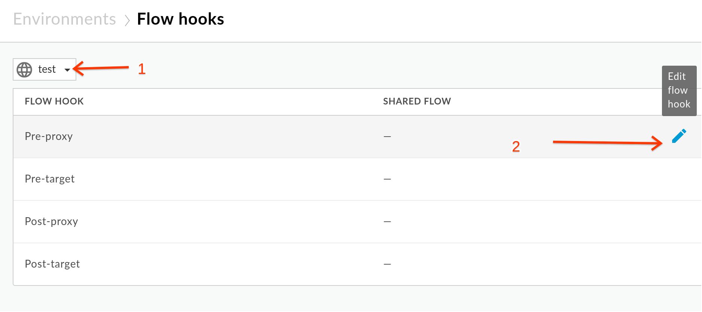

4) Select your ***Shared Flow***from the dropdown and then click OK.


You have now applied your Shared flow to all Proxies within the ***Test*** Enviroment. 

5) To ensure that the Flow Hook is in effect and your shared flow is being applied to your proxies, you can make calls to the 'Hipster Product API' just like before:

Make an API Call to your Hispter Product API using below CURL and Look at the trace:
```
curl -X GET -H "Authorization: Bearer $ACCESS-TOKEN" "https://$ORG_NAME-$ENV.apigee.net/v1/<Your Initials>_hipster-products-api/products"

```

Call Details if you are using a UI Tool:
```
Rest Endpoint - https://$ORG_NAME-$ENV.apigee.net/v1/<Your Initials>_hipster-products-api/products
Rest VERB - GET
Request Headers-> Value - 
      Authorization ->  Bearer <Your API Token>
```
Note - Be sure to replace <Your Initials> above within the proxy base path.

You should see a 200 OK response with a listing of the Product catalog in your Response. 
You can also see your API Calls in action within the Trace Tool and will note that the Flow Call out was initiated with Spike Arrest and OAuth policies applied to this call.


# Lab Video

If you like to learn by watching, here are some short videos on using [Shared Flows](https://youtu.be/-7xx34uD8Kk) and [Flows Hooks](https://youtu.be/-lP5tI3ppZI).

# Earn Extra-points

Now that you are familiar with the concept of Shared flow and how to invoke them, continue explore more about Shared flows and how you can [invoke one shared flow from another flow.](https://docs.apigee.com/api-platform/fundamentals/shared-flows#calling-a-shared-flow) 

# Summary

That completes this hands-on lesson. In this simple lab you learned how to re-use policies accross multiple proxies using shared flows and flow hooks.

# References

* Useful Apigee documentation links on Flows, Flow Hooks, OAuth, Spike Arrest Policy  - 

    * [Spike Arrest Policy](http://docs.apigee.com/api-services/reference/spike-arrest-policy)

    * [OAuth Policy](https://docs.apigee.com/api-platform/security/oauth/oauth-introduction)

    * [Shared Flows](https://docs.apigee.com/api-platform/fundamentals/shared-flows)

    * [Flow Hooks](https://docs.apigee.com/api-platform/fundamentals/flow-hooks)

Now go to [Lab-2](../Lab%202)

