## Lab 2 - Build composite APIs using Service Callouts and Proxy Chaining

*Duration : 30 mins*

*Persona : API Team*

# Use case

API Team members may want to expose calls through Apigee Edge that "mashup" data from more than one backend resource. An Apigee proxy pattern known as policy composition facilitates this use case. The Service Callout policy leveraged in this pattern allows you to call out to another service from your API proxy flow. You can make callouts to either an external service, such as an external RESTful endpoint or internal services, such as an API proxy in the same organization and environment (also known as proxy chaining).

In the external use case, you make a callout to a third-party API that's external to your proxy. The response from the third-party API is parsed and inserted into your API's response message, enriching and "mashing up" the data for app end users. You can also make a request using the Service Callout policy in the request flow, then pass the information in the response to the TargetEndpoint of the API proxy.

In the internal use case, you call a proxy that's in the same organization and environment as the one you're calling from. This is known as proxy chaining.  You might find this useful when you have a proxy that offers some discrete low-level functionality that one or more other proxies will consume i.e. a proxy that exposes CRUD operations (create/read/update/delete) with a backend data store could be the target proxy for multiple other proxies that expose the data to clients.

# How can Apigee Edge help?

Apigee enables API developers to expose data from multiple backend resources through a single API call using Service Callout policies.  A Service Callout policy allows you to make calls to both internal and external services and create a "mashup" of the data returned from multiple backend systems.

In this lab, we will explore how to leverage Service Callout policies and proxy chaining to reduce the latency of an API call and improve the roundtrip time of data retrieval versus making multiple external API calls in sequence to join data from multiple sources.

# Pre-requisites

1. If you don't already have a Google Account (Gmail or Google Apps), you must [create one.](https://accounts.google.com/SignUp)
2. Once created, go to [https://cloud.google.com/](https://cloud.google.com/) and click the "Get started for free" button in the top right corner of the page. 
3. Next, you will be asked to login to your Gmail account, choose your country then accept the terms & conditions.
4. Fill in the details required to create your account. After completed click on “Start my free trial“. A valid credit card is required to create a Google Cloud Platform account.  

* When you begin the free trial, Google creates a billing account for you and credits $300 to your account. Anything you do that would normally result in a charge is billed against this credit. You will receive billing statements indicating how much of your free credit has been spent.  [Further details about GCP Free Tiers and billing credits during a free trial can be found here](https://cloud.google.com/free/docs/gcp-free-tier#free-trial).

5. Last, you need to create a project. Sign in to [Google Cloud Platform console](console.cloud.google.com) and create a new project by clicking the new project button in the modal popup that appears after clicking on the project dropdown on the top navigation bar.


# Instructions

We will leverage the policy composition proxy design pattern to do a reverse geocode lookup of our address using latitude and longitude, then feed that information to a fictitious products API to generate a list of products that are local to our location from a single client API call. Let's begin.

## Enable the Google Maps API and Create an API Key

You must have at least one API key associated with your project to do the next steps in this lab.

To get an API key:

1. Go to the [Google Cloud Platform Console](https://console.cloud.google.com).
2. From the **Project** drop-down menu, select the project you created in the pre-requisites section to add an API key to.
3. From the **Navigation** menu, select **APIs & Services → Credentials**.
4. On the **Credentials** page, click **Create credentials → API key**. 
The API key created dialog displays your newly created API key (an encrypted string).

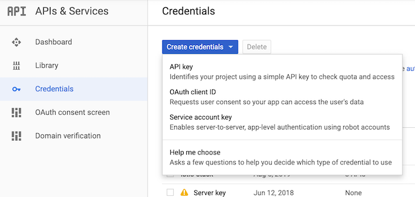

5. Click Close.  The new API key is listed on the **Credentials** page under **API keys**. 

Note: You may want to restrict the API key and what GCP services it can leverage. Follow these instructions on how to [restrict API keys](https://developers.google.com/maps/documentation/geocoding/get-api-key#restrict_key).

# Create the Geolocation proxy
1. Go to the left navigation menu. **Develop → API Proxies**.

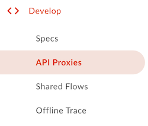

2. Click the **+Proxy** button in the top right corner of the page to enter the proxy creation wizard.

3. Ensure that **Reverse proxy** is selected and click **Next** at the bottom right of the wizard.

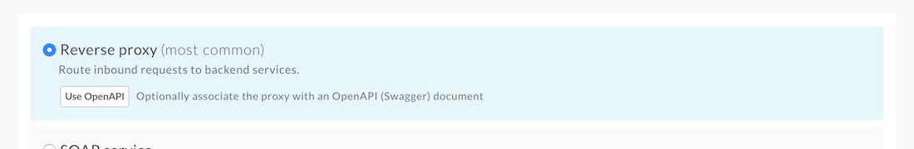

4. Enter the following into the **Details** step of the creation wizard:
   * Proxy Name: Geocode
   * Proxy Base Path: /geocode
   * Existing API: [https://maps.googleapis.com/maps/api/geocode/json](https://maps.googleapis.com/maps/api/geocode/json)
   * Details: Get a formatted address from the Google Maps API using latitude and longitude parameters.

5. In the **Security** step, click **Pass Through** then click the **Next** button.

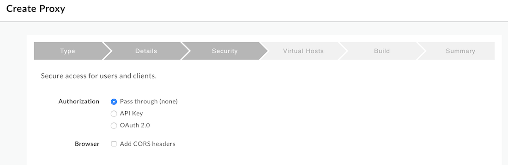

6. In the **Virtual Hosts** step, un-select **default**. **Next**

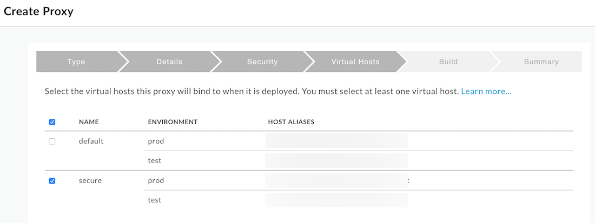

7. In the last step click, **Build and Deploy**. Once created, click the link at the bottom of the screen to be taken to the proxy. Your proxy should look similar to the following:

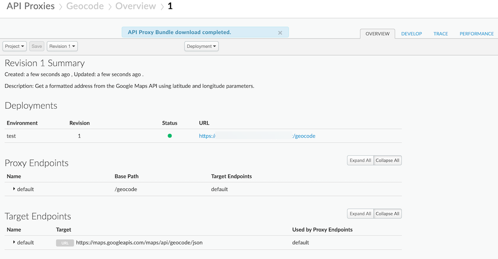

## Using the Google Maps Reverse Geocoding API in our proxy
Now that the proxy has been created, we'll use the [Google Maps Reverse Geocoding API](https://developers.google.com/maps/documentation/geocoding/start#reverse) to do an address lookup based on our approximate location. The following section describes how to setup the Google Maps Geocoding API's reverse address lookup in an API proxy we will leverage in a later section of this lab.

1. In the **Geocode** proxy editor, click on the **Develop** tab.

2. In the Proxy PreFlow section, click on the **+Step** icon to add a policy to the proxy preflow.

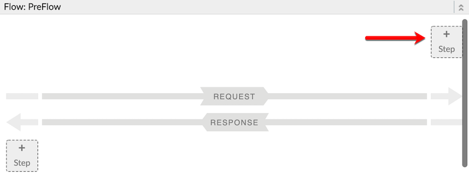

3. In the **Add policy** modal dialog, scroll down to the **Mediation** section and select the **Extract Variables** policy.  Enter the following details into the input boxes:
   * Display Name: EV-LatitudeLongitude
   * Name: EV-LatitudeLongitude

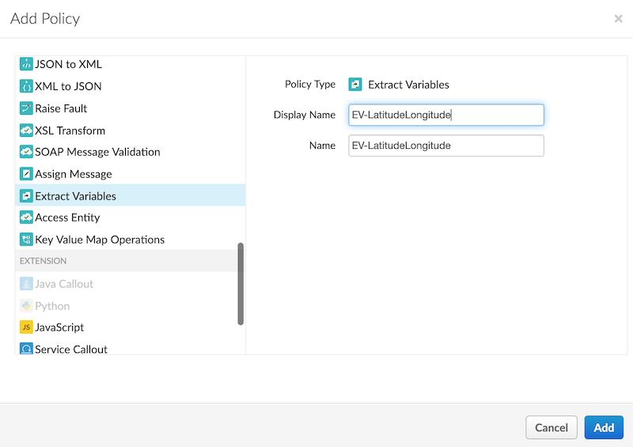

4. Replace the XML contents of the policy with the following:
```
<?xml version="1.0" encoding="UTF-8" standalone="yes"?>
<ExtractVariables async="false" continueOnError="false" enabled="true" name="EV-LatitudeLongitude">
    <DisplayName>EV-LatitudeLongitude</DisplayName>
    <Source>request</Source>
    <QueryParam name="lat">
        <Pattern ignoreCase="true">{latitude}</Pattern>
    </QueryParam>
    <QueryParam name="long">
        <Pattern ignoreCase="true">{longitude}</Pattern>
    </QueryParam>
    <IgnoreUnresolvedVariables>true</IgnoreUnresolvedVariables>
</ExtractVariables>
```

5. Add an **AssignMessage** policy to the proxy preflow after the **Extract Variables** policy we just created.  Use the following details:
   * Display Name: AM-GenerateGeocodingRequest
   * Name: AM-GenerateGeocodingRequest

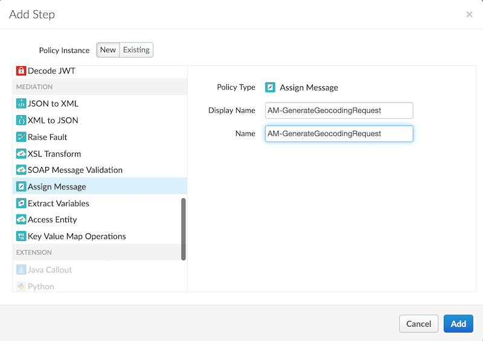

6. Replace the XML contents of the AssignMessage policy with the following. Make sure to replace the API key with the key generated in the prerequisites of this lab.
```
<?xml version="1.0" encoding="UTF-8" standalone="yes"?>
<AssignMessage async="false" continueOnError="false" enabled="true" name="AM-GenerateGeocodingRequest">
    <DisplayName>AM-GenerateGeocodingRequest</DisplayName>
    <AssignTo createNew="false" type="request"/>
    <Set>
        <QueryParams>
            <QueryParam name="latlng">{latitude},{longitude}</QueryParam>
            <QueryParam name="key">YOUR_API_KEY_HERE</QueryParam>
        </QueryParams>
        <Verb>GET</Verb>
    </Set>
    <Remove>
        <QueryParams>
            <QueryParam name="lat"/>
            <QueryParam name="long"/>
        </QueryParams>
    </Remove>
    <IgnoreUnresolvedVariables>true</IgnoreUnresolvedVariables>
</AssignMessage>
```

We will now ensure that the Geocode proxy is functioning as intended by starting a trace session and verifying we can perform a reverse geocode lookup. 

7.  Go to the **Trace** tab and press the **Start Trace Session** button. Enter the query parameters below to URL and hit **Send**.  You should see a response similar to the one in the image below (make sure you have the response sent by the target server selected).
   * Query parameters: ?lat=40.7414688&long=-74.0033873

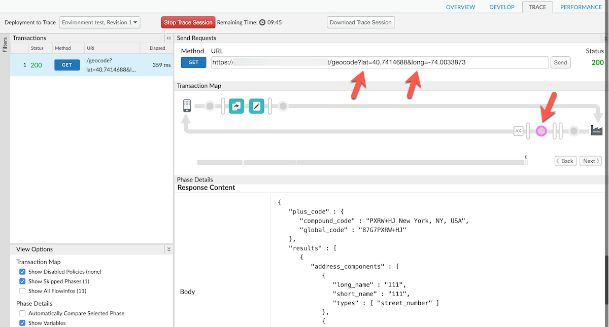

# Create the composite proxy
We will now create a composite proxy which we will use to mashup data from the geocode call with data from our Hipster shop products service.

1. Go to the left navigation menu. **Develop → API Proxies**.

2. Click the **+Proxy** button in the top right corner of the page to enter the proxy creation wizard.

3. Ensure that **Reverse proxy** is selected and click **Next** at the bottom right of the wizard.

4. Enter the following into the **Details** step of the creation wizard:
   * Proxy Name: LocalProducts
   * Proxy Base Path: /local-products
   * Existing API: [http://cloud.hipster.s.apigee.com/products](http://cloud.hipster.s.apigee.com/products)
   * Details: Gets a list of products from a Hipster Shop store near me.

5. In the **Security** step, click **Pass Through** then click the **Next** button.

6. In the **Virtual Hosts** step, un-select **default**. **Next**

7. In the last step click, **Build and Deploy**. Once created, click the link at the bottom of the screen to be taken to the proxy.

## Getting a formatted address using our Geocode proxy
We will now leverage the Geocode proxy to return a formatted address and pass that to our products API to return only products local to our location.  Pay close attention to the Service Callout setup and how variables are passed between policies in the proxy flow.

1. Add a new **ServiceCallout** policy to the proxy endpoint's preflow.  Name it according to the details below:
   * Display Name: SC-ReverseGeocodeLookup
   * Name: SC-ReverseGeocodeLookup
   * Select the **Proxy Chaining** radio option
   * Proxy Name: Geocode
   * Proxy Endpoint: default

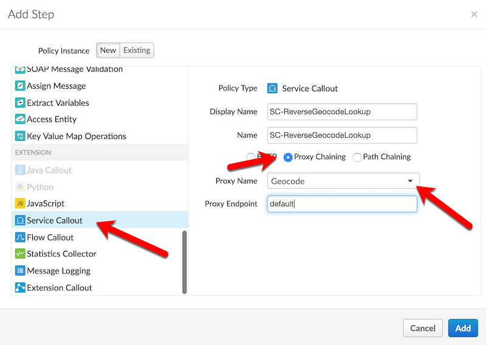

2. Modify the **ServiceCallout** policy's XML content to match the below snippet:
```
<?xml version="1.0" encoding="UTF-8" standalone="yes"?>
<ServiceCallout async="false" continueOnError="false" enabled="true" name="SC-ReverseGeocodeLookup">
    <DisplayName>SC-ReverseGeocodeLookup</DisplayName>
    <Properties/>
    <Request clearPayload="true" variable="request">
        <IgnoreUnresolvedVariables>false</IgnoreUnresolvedVariables>
    </Request>
    <Response>geocodeResponse</Response>
    <LocalTargetConnection>
        <APIProxy>Geocode</APIProxy>
        <ProxyEndpoint>default</ProxyEndpoint>
    </LocalTargetConnection>
</ServiceCallout>
```

3. Add an **ExtractVariables** policy immediately after the Service Callout policy.
   * Display Name: EV-Address
   * Name: EV-Address

4. Modify the **ExtractVariables** policy's XML content to match the below snippet:
```
<?xml version="1.0" encoding="UTF-8" standalone="yes"?>
<ExtractVariables async="false" continueOnError="false" enabled="true" name="EV-Address">
    <DisplayName>EV-Address</DisplayName>
    <IgnoreUnresolvedVariables>true</IgnoreUnresolvedVariables>
    <JSONPayload>
        <Variable name="address">
            <JSONPath>$.results[0].formatted_address</JSONPath>
        </Variable>
    </JSONPayload>
    <Source clearPayload="false">geocodeResponse</Source>
</ExtractVariables>
```

5. Add an **AssignMessage** policy immediately after the Extract Variables policy.
   * Display Name: AM-AddAddress
   * Name: AM-AddAddress

6. Modify the **ExtractVariables** policy's XML content to match the below snippet:
```
<?xml version="1.0" encoding="UTF-8" standalone="yes"?>
<AssignMessage async="false" continueOnError="false" enabled="true" name="AM-AddAddressHeader">
    <DisplayName>AM-AddAddressHeader</DisplayName>
    <Add>
        <Headers>
            <Header name="address">{address}</Header>
        </Headers>
    </Add>
    <IgnoreUnresolvedVariables>true</IgnoreUnresolvedVariables>
    <AssignTo createNew="true" transport="http" type="request"/>
</AssignMessage>
```

Your Proxy Editor Preflow diagram should now looks similar to the image below:
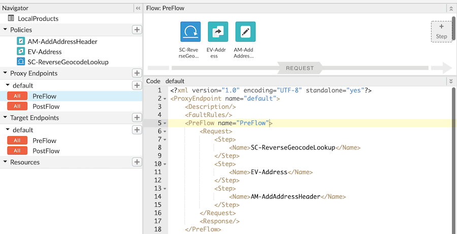

7. The last thing to do is test the proxy to ensure its working properly! Switch to the Trace tab and set the following query parameters on the outbound request then hit send:
   * Query parameters: ?lat=40.7414688&long=-74.0033873

The response you receive should look similar to the below image. Pay attention to the items with arrows pointing to them to inspect the trace view. 

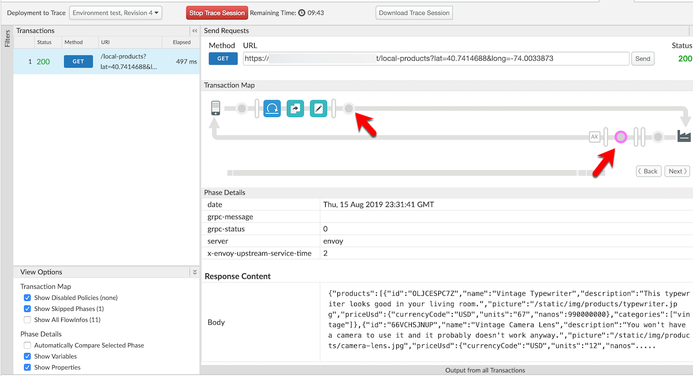

Notice that the address from the first callout was extracted and input as a header to the final call to the /products API. This allows you to provide a facade to perform advanced API actions from a single call without your end clients having to know the internal details of your APIs.

# Lab Video

If you like to learn by watching, here is a short video on leveraging policy composition - ???

# Earn Extra-points

Now that you have created a mashup using a service callout, click on the **Develop** tab & explore how the variables from each call were passed between each policy. Explore the Trace tab in the Proxy editor and trace the variables as they are passed between each policy of the proxy's flow.

# Quiz

1. What does a Service Callout policy let you do?
2. Should you use a Service Callout policy in a proxy with no target?
3. How does chaining proxies together via Service Callouts reduce latency?

# Summary

That completes this hands-on lesson. In this simple lab you learned how to create two proxies and chain them together to leverage the data returned from the first call to effect the outcome 

# References

* Useful Apigee documentation links on Policy Composition - 

    * API Proxy Cookbook, Using Policy Composition - [https://docs.apigee.com/api-platform/samples/cookbook/using-policy-composition](https://docs.apigee.com/api-platform/samples/cookbook/using-policy-composition)

    * Service Callout Policy Reference - [https://docs.apigee.com/api-platform/reference/policies/service-callout-policy#relatedtopics](https://docs.apigee.com/api-platform/reference/policies/service-callout-policy#relatedtopics) 

    * Best practices for API proxy design and development - [https://docs.apigee.com/api-platform/fundamentals/best-practices-api-proxy-design-and-development#servicecallouts](https://docs.apigee.com/api-platform/fundamentals/best-practices-api-proxy-design-and-development#servicecallouts) 


# Rate this lab

How did you like this lab? Rate [here](https://goo.gl/forms/G8LAPkDWVNncR9iw2).

Now go to [Lab-3](https://github.com/aliceinapiland/apijam/tree/master/Module-3/Lab%203)
