## Lab 3 - API Message logging using the Apigee Stackdriver Extension

*Duration : 30 mins*

*Persona : API Team*

# Use case
Apigee provides extension policies to allow you to quickly leverage third party cloud services as part of the API proxies you deploy. It is common for API teams to need logging and monitoring to be able to diagnose and troubleshoot issues which may arise in production for the client applications they support through the platform. In this lab we'll explore using the Google Cloud Stackdriver Logging Extension to write log data to Stackdriver Logging.

# How can Apigee Edge help?
Apigee provides Extensions policies to integrate external resources into API proxies. For example, you can integrate Google Cloud Platform services such as Google Stackdriver Logging. At run time, an API proxy uses the extension to exchange requests and responses with the external resource. The Extension configuration is a one time setup after which you can leverage the extension policy in your API proxies to perform actions that the third party service can provide. In this lab, we will write log message to Google Stackdriver Logging using the extension policy provided.

# Pre-requisites

1. If you don't already have a Google Account (Gmail or Google Apps), you must [create one.](https://accounts.google.com/SignUp)
2. Once created, go to [https://cloud.google.com/](https://cloud.google.com/) and click the "Get started for free" button in the top right corner of the page. 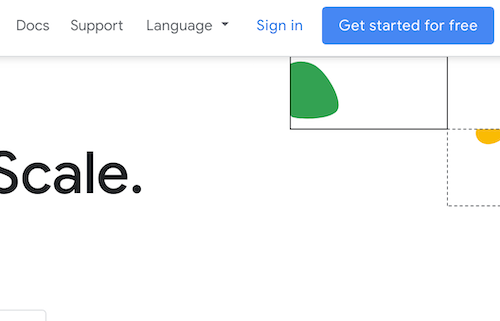
3. Next, you will be asked to login to your Gmail account, choose your country then accept the terms & conditions.
4. Fill in the details required to create your account. After completed click on “Start my free trial“. A valid credit card is required to create a Google Cloud Platform account.  

* When you begin the free trial, Google creates a billing account for you and credits $300 to your account. Anything you do that would normally result in a charge is billed against this credit. You will receive billing statements indicating how much of your free credit has been spent.  [Further details about GCP Free Tiers and billing credits during a free trial can be found here](https://cloud.google.com/free/docs/gcp-free-tier#free-trial).

5. Last, you need to create a project. Sign in to [Google Cloud Platform console](console.cloud.google.com) and create a new project by clicking the new project button in the modal popup that appears after clicking on the project dropdown on the top navigation bar.
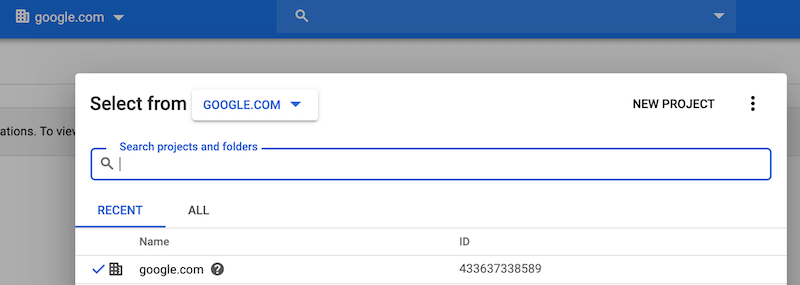

# Instructions

## Enable the Google Stackdriver Logging API and Create a Service Account

You must have a service account  key associated with your project to do the next steps in this lab.

To create a service account for this lab:

1. Go to the [Google Cloud Platform Console](https://console.cloud.google.com).
2. From the **Project** drop-down menu, select the project you created in the pre-requisites section to add an API key to.
3. From the **Navigation** menu, select **APIs & Services → Library**.
4. At the top search box do a search for "Stackdriver Logging API" and select the result that matches that title exactly.
5. In the next screen, enable the API and wait for the green indicator.

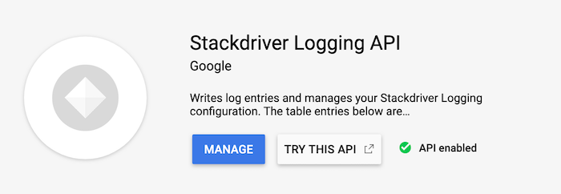

6. From the **Navigation** menu, select **APIs & Services → Credentials**.
7. On the **Credentials** page, click **Create credentials → Service account key**.

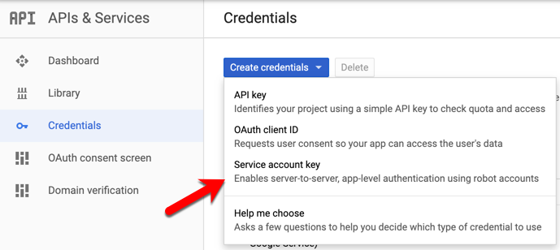

8. In the **Create service account key** window enter the following:
   * Service account: Select **New service account**
   * Service account name: **apigee-logs**
   * Role: **Project → Owner**

Click **Create**. This will download a service account file to your local machine. We will use the contents to setup our Google Stackdriver Logging Extension.

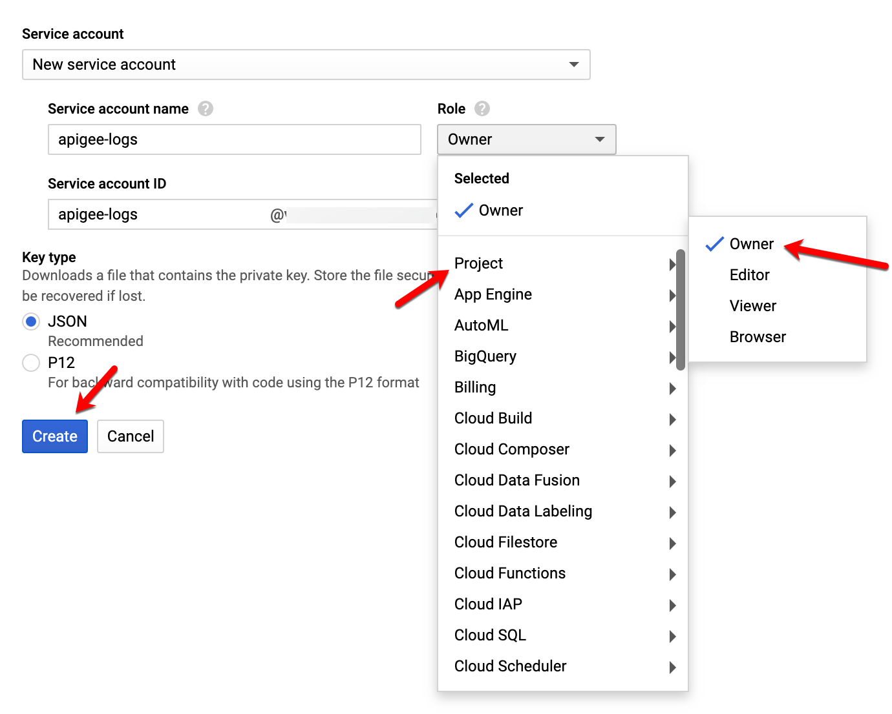

This completes the service account setup.

* Note: The Role field authorizes your service account to access resources. You can view and change this field later by using the GCP Console. If you are developing a production app, specify more granular permissions than Project > Owner. For more information, see granting roles to service accounts.

# Create and Configure the Google Stackdriver Logging Extension
1. In Apigee Edge console, go to **Admin → Extensions** and click the **+Add Extension** button in the top right corner of the screen.

2. Search for **Stackdriver** in the New Extension creation wizard and click **Google Stackdriver Logging**

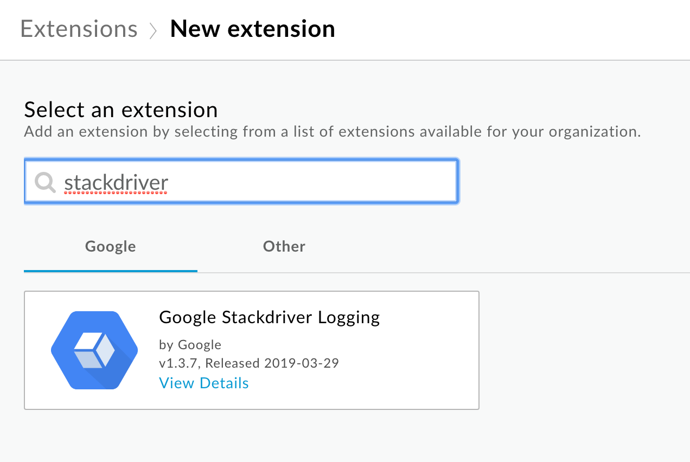

3. Give the extension the following properties:
   * Name: Stackdriver
   * Description: Leverage Google Stackdriver for logging.

Click **Create** when finished.

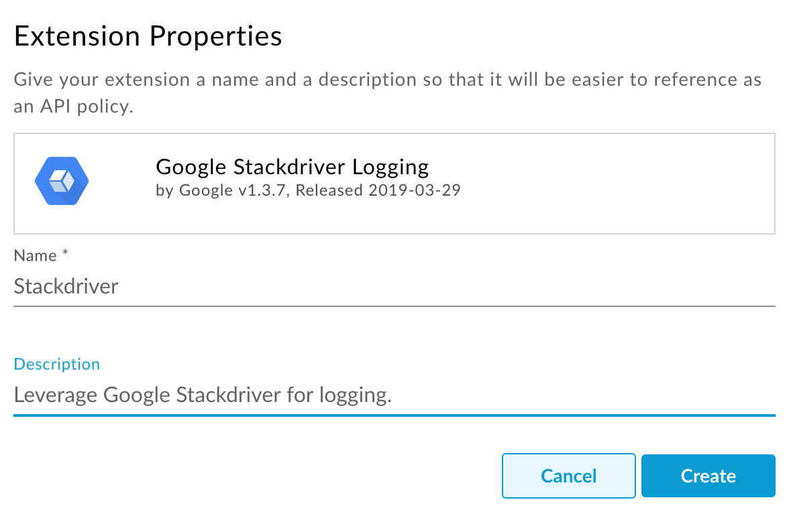

4. Under **Environment Configurations** click on the **test** environment to configure it's properties.

5. In the **Configurations: test** modal box that appears, set the following properties:
   * GCP Project ID: {{INSERT_YOUR_GCP_PROJECT_ID_HERE}}
   * Credential: {{Copy and paste the entire contents of the JSON Service Account file here}}


Click **Save**.

6. Click **Deploy** for the **test** environment and wait for the Extension to deploy. This may take a few minutes.

# Create a Proxy to leverage the Google Stackdriver Logging Extension
1. Go to **Develop → API Proxies** and click the **+Proxy** button in the top right corner of the page.

2. Select **Reverse Proxy** then click **Next**.

3. Enter the following for the proxy details:
   * Proxy Name: StackdriverLogging
   * Proxy Base Path: /log
   * Existing API: http://cloud.hipster.s.apigee.com/products
   * Description: Example showing how to use Google Stackdriver Logging with Apigee.

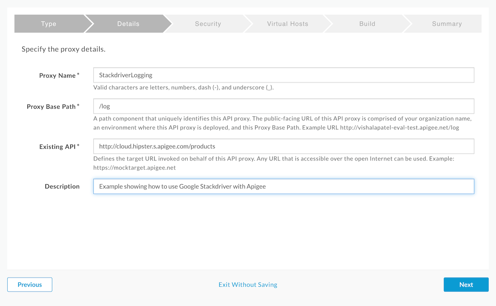

Click **Next**.

4. In the **Security** step, click **Pass Through** then click the **Next** button.

5. In the **Virtual Hosts** step, un-select **default**. Click **Next**.

6. In the last step click, **Build and Deploy**. Once created, click the link at the bottom of the screen to be taken to the proxy.

# Add the Google Stackdriver Logging Extension Policy to the PreFlow Response
1. Go to the **Develop** tab of the proxy editor.

2. Click the **+Step** button of the proxy endpoint PreFlow Response.

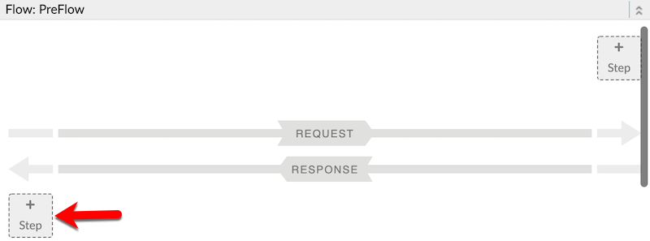

3. Scroll all the way down to the bottom of the **Add Step** modal and select Extension Callout. Add the following properties:
   * Display Name: EC-Stackdriver
   * Extension: StackdriverLogging
   * Action: log

Click **Add**.

4. Replace the contents of the XML configuration for the Extension Callout with the following snippet (you will need to replace the GCP PROJECT ID with your own):
```
<?xml version="1.0" encoding="UTF-8" standalone="yes"?>
<ConnectorCallout async="false" continueOnError="true" enabled="true" name="EC-Stackdriver">
    <DisplayName>EC-Stackdriver</DisplayName>
    <Connector>StackdriverLogging</Connector>
    <Action>log</Action>
    <Input><![CDATA[{
      "logName" : "apigee-log-data",
      "metadata": {
          "resource": {
              "type": "global",
              "labels": {
                  "project_id": "INSERT_YOUR_GCP_PROJECT_ID_HERE"
              }
          }
      },
      "message" : {response.content}
    }]]></Input>
</ConnectorCallout>
```

5. Switch over to the **Trace** tab of the proxy editor and click **Start Trace Session**.

6. Press send a few times to send log data to our newly created **Global** log entry **apigee-log-data**. We will confirm that logs were sent to Stackdriver Logging in our GCP project in the next steps. Click the elements in the trace pointed out in the image below to confirm you are seeing the same data that is returned from our products API to Stackdriver Logging.

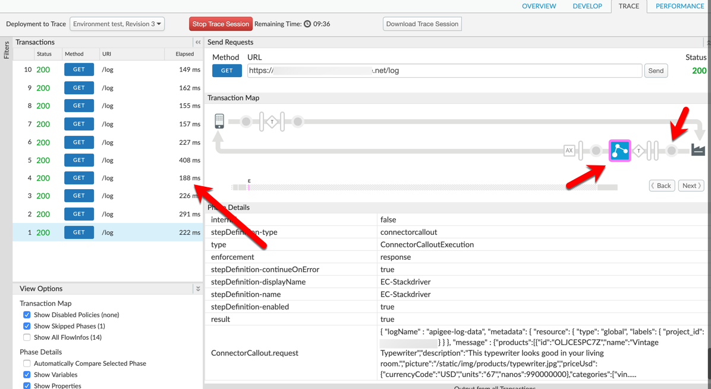

# Confirm Log Messages Appear in Stackdriver Logging
1. Switch back to your GCP project console. From the **Navigation** menu, select **Logging → Logs Viewer** under **Stackdriver**

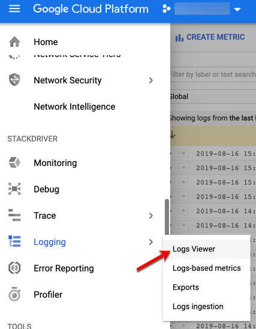

2. Select the following values for the first two drop down menus of the Log Viewer to see the log data we recently created. You should see the same number of entries that you created in the trace of the API proxy.
   * Global
   * apigee-log-data

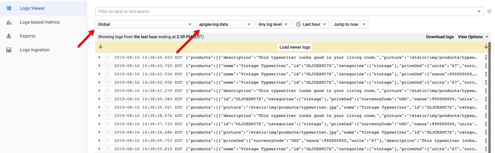

This concludes the hands on portion of this lab. If you experience any issues viewing log data please ask your instructor for assistance.

# Lab Video

If you like to learn by watching, here is a short video on leveraging extension policies in API proxies - ????

# Earn Extra-points

Now that you understand how to log data with the Google Stackdriver Logging extension. See if you can configure and deploy other Extensions available from the list of supported Extensions page. 

# Quiz

1. What are Extension policies designed to do?
2. Which Google Cloud Platform services do Extension policies current support (name 3)?
3. Why would an API Team want to leverage an Extension policy rather than make service callouts?

# Summary

That completes this hands-on lesson. In this lab you learned how to create an Extension Policy that leverages Google Stackdriver Logging and send data to a Google Cloud Platform project without the need to understand the underlying REST APIs that Google Cloud exposes for interacting with its services or implementing complex authentication logic.

# References

* Useful Apigee documentation links on Policy Composition - 

    * Extensions Overview - [https://docs.apigee.com/api-platform/extensions/extensions-overview](https://docs.apigee.com/api-platform/extensions/extensions-overview)

    * Extensions Reference - [https://docs.apigee.com/api-platform/reference/extensions/reference-overview-extensions](https://docs.apigee.com/api-platform/reference/extensions/reference-overview-extensions) 


# Rate this lab

How did you like this lab? Rate [here](https://goo.gl/forms/G8LAPkDWVNncR9iw2).

Now go to [Module-4](https://github.com/aliceinapiland/apijam/tree/master/Module-4/Lab%201)