# Lab 1 - Route and Load Balancing across multiple API target backends using Target Server and Route Rule configurations

_Duration : 20 mins_

_Persona : API Team_

## Use Case

Backend target URLs often change as an API is promoted from development through testing and finally into production. The ability to externalize these endpoints ensures you can take your API configurations without making manual changes as part of your deployment/promotion process.

It is also common for enterprises to have multiple backend systems that provide duplicate functionality for certain sets of data. Another example is a company might be supporting both legacy and new services concurrently due to business reasons. From an API perspective, it's desirable to mask the routing and load balancing complexity from the end API consumer to make it appear as though the organization has single unified API for a given business function or data type. Therefore, it's helpful to have a way to conditionally route a request to a particular backend based on information in the request, and perform load balancing across the backend systems to optimize performances.

## How can Apigee Edge help?

Apigee Edge includes the ability to externalize your backend target URL through a concept known as Target Servers. Target Servers are configured for each environment and allow you to replace a static target URL in your API Proxy definition with a named target server that is automatically replaced at runtime. This allows you to change the backend URL in a single place without impacting the API Proxy configurations. 

The Routing Rule construct allows API developers to include conditional logic and multiple backend target endpoint definitions for a single API Proxy. The Load Balance construct can be used to load balance the traffic between multiple backend servers. 
In this lab, we will examine the steps required to implement Target Servers, Routing Rules and Load Balancing inside Apigee Edge.

## Pre-requisites

None.

## Instructions

### Part 1: Target Servers and Route Rule


1. Go to https://apigee.com/edge and log in. This is the Edge management UI.

2. Select __Develop → API Proxies__ in the side navigation menu.
Create the API Proxy using the proxy bundle which can be found here. Complete the configurations as shown in the following diagram. Click __Next__ when finished


3. Click on __+Proxy__ to create a new API Proxy

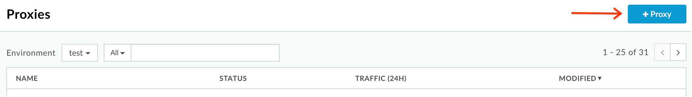

4. Select the Proxy bundle option then click on __Next__


5. Create the API Proxy using the proxy bundle which can be found [here](../../Resources/xx_Hipster-Products-API.zip). Complete the configurations as shown in the following diagram. Click __Next__ when finished.

     `Proxy Name: {Initials}_Hipster-Products-API`


6. Click __Build__ in the next screen to upload the Proxy

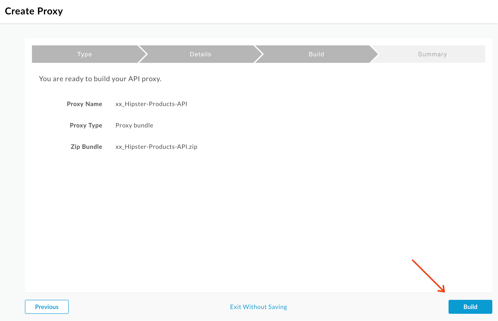

7. Check that the Proxy is uploaded successfully. Click on {Initials}\_Hipster-Products-API to view the API Proxy configurations.


8. There should be 2 Target Endpoints created. These Target Endpoints currently point directly to the backend URL.


9. Next, create the Target Servers to externalize the backend URL. Click on __Admin->Environment->Target Servers__


10. Click on __+Target Server__ to add Target Servers for the target endpoints in the API Proxy.

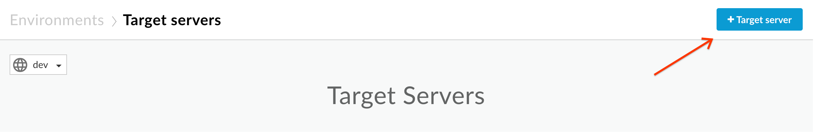

11. Create a Target Server for the SOAP endpoint using the following configurations indicated in the screenshot below:

      ```
      Name: {initials}_legacy_hipster
      Host: hipster-soap.apigee.io
      Port: 443
      ```

    Click on __Add__ to create the Target Server

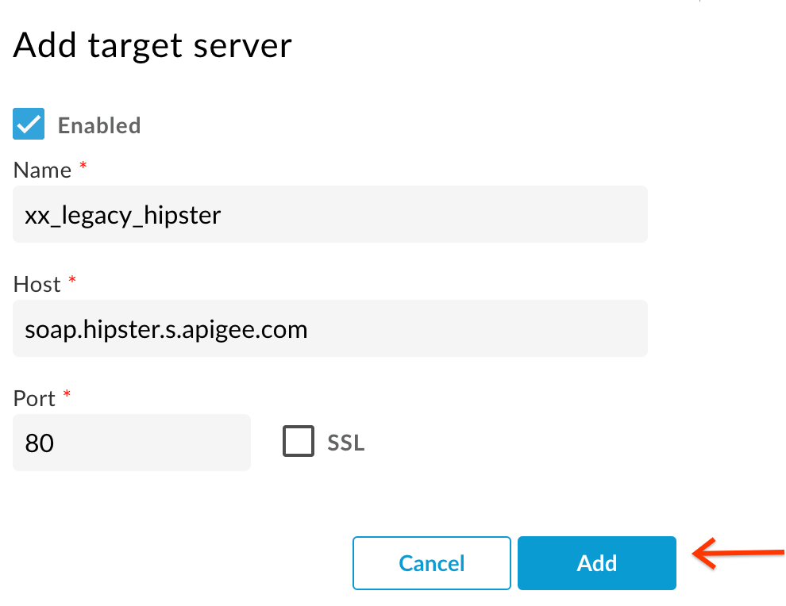

12. Create one more Target Server for the cloud endpoint:

      ```
      Name: {initials}_cloud_hipster
      Host: cloud.hipster.s.apigee.com
      Port: 80
      ```

    Click on __Add__ to create the Target Server

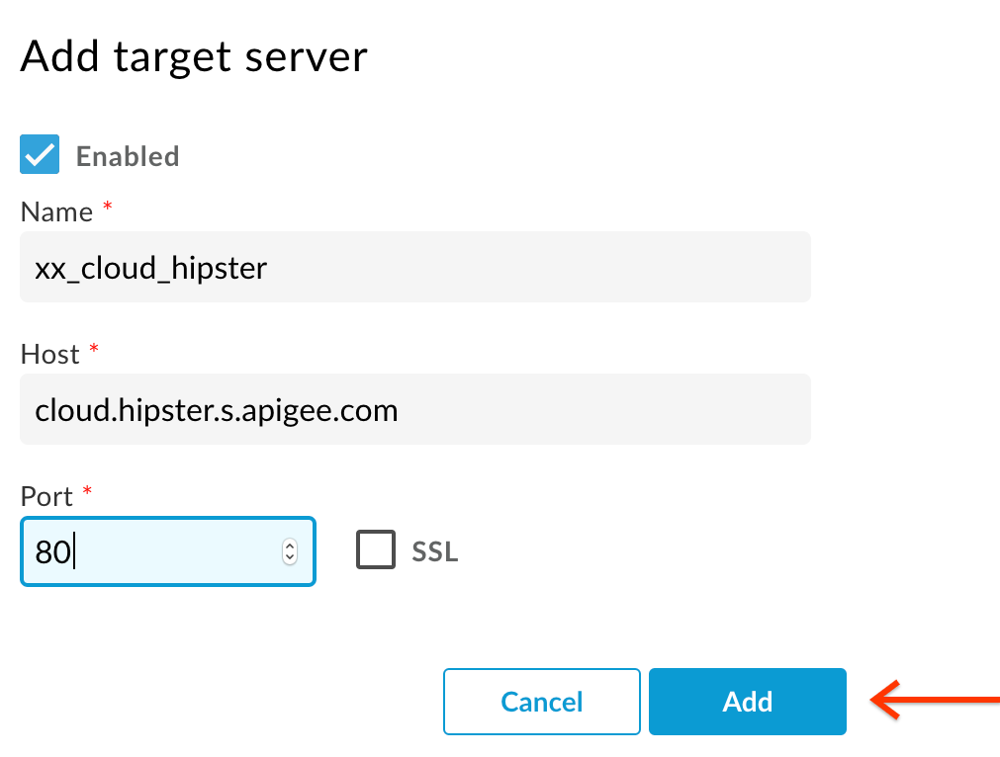

13. Check that you should have 2 Target Servers created:

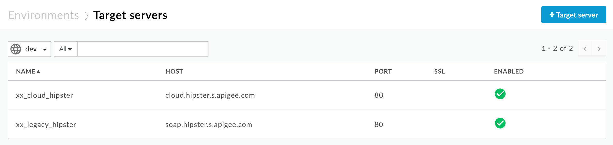

14. Click on __Develop -> API Proxies__, and select {Initials}\_Hipster-Products-API


15. Click __DEVELOP__ to see the configuration details.


16. Scroll down to find the Target Endpoints, click on default and find the HTTPTargetConnection property.


17. Replace it with the Target Server configuration:

      ```
      <HTTPTargetConnection>
          <LoadBalancer>
            <Server name="{initials}_legacy_hipster" />
          </LoadBalancer>
          <Path>/hipster</Path>
      </HTTPTargetConnection>
      ```

Save the configurations and make sure that the Proxy has been deployed.

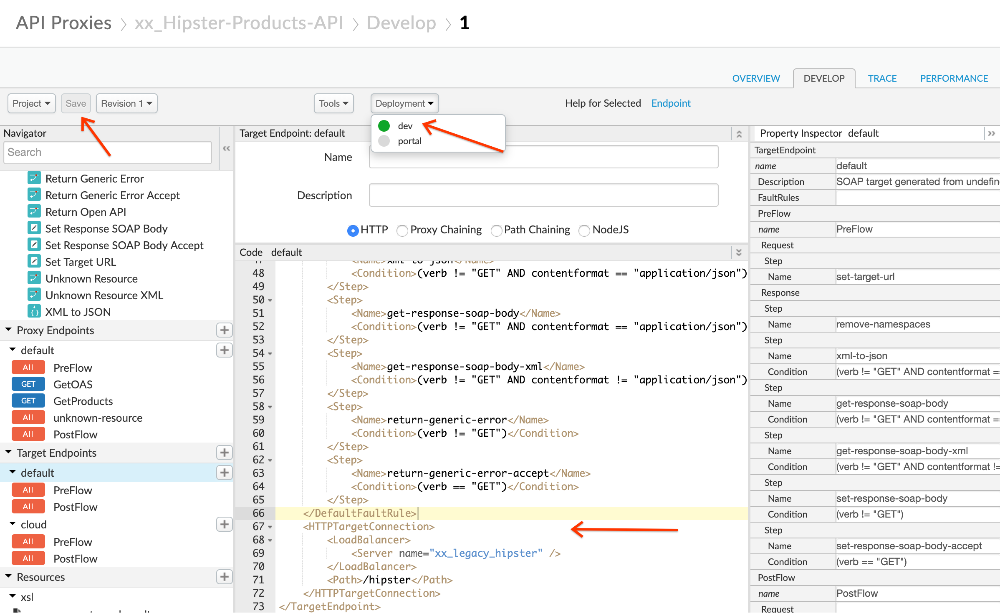

18. Test using a tool like Postman or using the browser to verify that the API call to the SOAP backend is successful:

	`http://{your_demo_server}/{initials}_hipster-products-api/products`
  
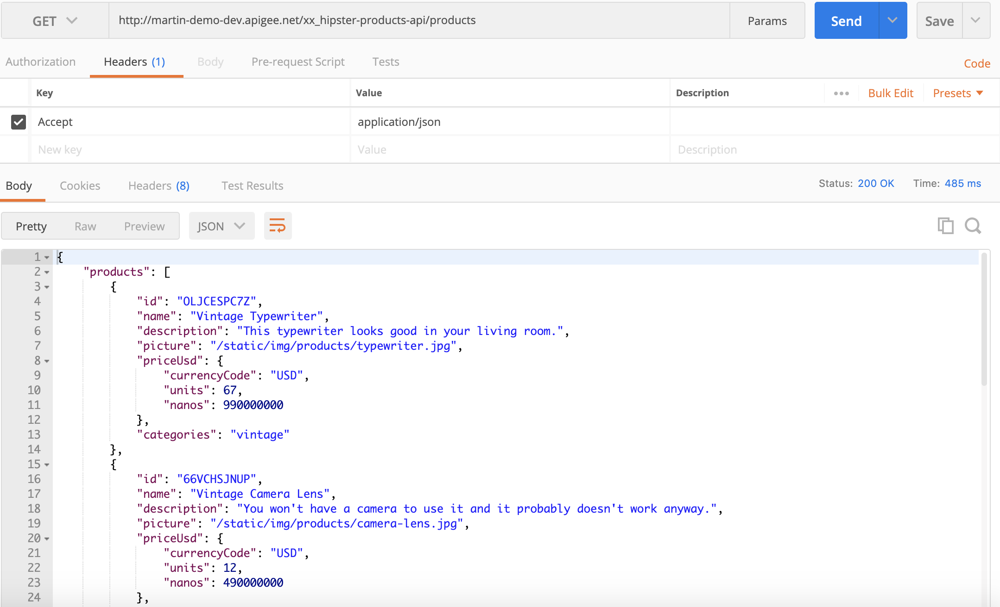

19. Click on the cloud target endpoint and do the same:

      ```
      <HTTPTargetConnection>
          <LoadBalancer>
            <Server name="{initials}_cloud_hipster" />
          </LoadBalancer>
          <Path>/products</Path>
      </HTTPTargetConnection>
      ```

Save the configurations and make sure that the Proxy has been deployed.


20. Next, create a *Route Rule* to route to either the cloud endpoint or the soap endpoint. Click on the default Proxy Endpoint. Currently, the default Proxy Endpoint points to the default Target Endpoint, which is the soap endpoint.

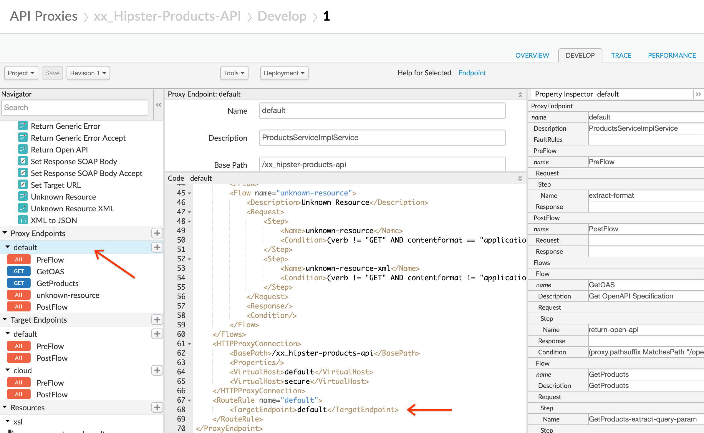

21. Add a *Route Rule* to route the API call to the cloud endpoint based on the request query param:

      ```
      <RouteRule name="cloudRoute">
            <TargetEndpoint>cloud</TargetEndpoint>
            <Condition>(request.queryparam.target = "cloud")</Condition>
      </RouteRule>
      ```

Save the configurations.


22. Add a flow to the Proxy Endpoint for cloud

With the default Proxy Endpoint still selected, copy the following configuration as the first Flow under the <Flows> collection:

      ```
      <Flow name="GET CLOUD">
        <Description/>
        <Request/>
        <Response/>
        <Condition>(request.queryparam.target = "cloud")</Condition>
      </Flow>
      ```

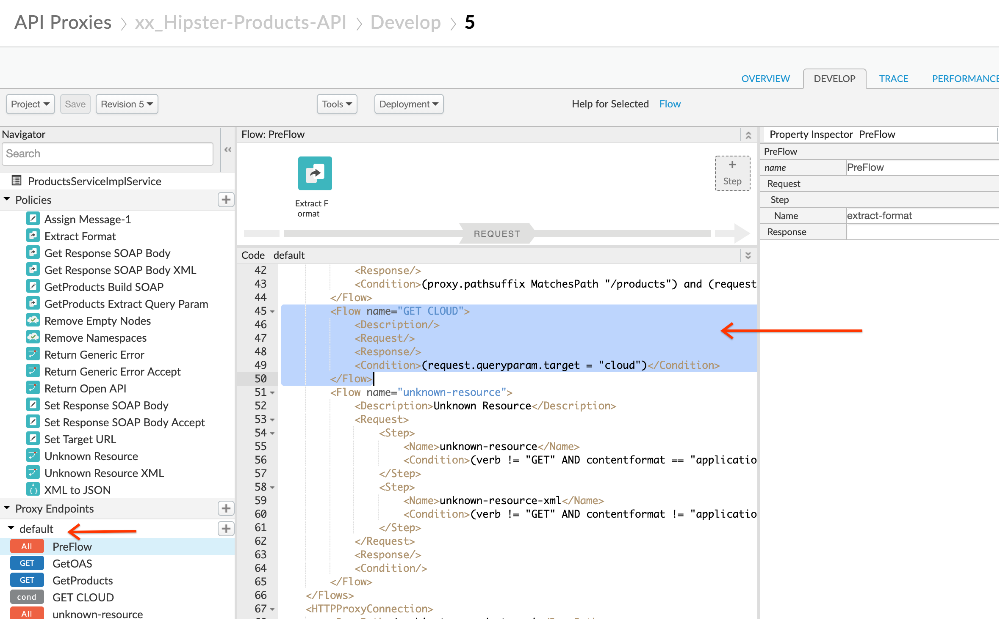

23. Add Step in cloud target endpoint to remove query param before sending to the backend cloud service. Click on the Preflow of the cloud target endpoint, and then the +Step button on the top right hand corner. Scroll down to find the Assign Message policy. Click __Add__ to add the policy to the flow.


24. Click on the Assigned-Message-1 box and use the following configurations 

      ```
      <?xml version="1.0" encoding="UTF-8" standalone="yes"?>
      <AssignMessage async="false" continueOnError="false" enabled="true" name="Assign-Message-1">
          <DisplayName>Assign Message-1</DisplayName>
          <Properties/>
          <Remove>
              <QueryParams>
                  <QueryParam name="target"/>
              </QueryParams>
          </Remove>
          <IgnoreUnresolvedVariables>true</IgnoreUnresolvedVariables>
          <AssignTo createNew="false" transport="http" type="request"/>
      </AssignMessage>
      ```


25. Click on __TRACE__ and start trace session. Copy the URL to test the API in a browser or using a tool like Postman. To route to the soap target endpoint:

`http://{yourVirtualHost}/{initials}_hipster-products-api/products`

In the TRACE tool, you will see that the API call has been routed to the soap endpoint:


26. Route the API call to the cloud endpoint:

`http://{yourVirtualHost}/{initials}_hipster-products-api?target=cloud`

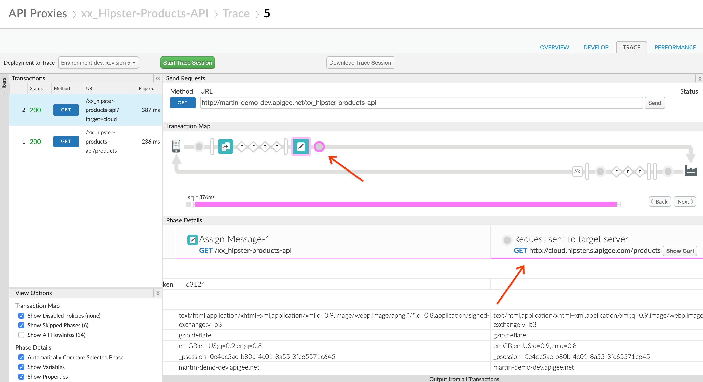


Congratulations! You have successfully created APIs which relies on named target servers instead of hard coded URLs, and used Route Rules to route the API call to different target endpoints.

### Lab Video

[Routing Rules Video](https://www.youtube.com/watch?v=URxpF9iWRaA&t=)

### Earn Extra Points
The current configurations handle error conditions by returning a “unknown resource” error.  E.g. if you send a value of ?target=cloudd, the route will not match and response with a “unknown resource”. Add in necessary login to your API Proxy to return a custom message or an empty JSON body when an invalid target is provided.

### Quiz
1. What is the purpose of using Target Servers?

2. What is a Route Rule, how is it used in Apigee Edge?

3. What is the relationship between a Route Rule and a Target Endpoint in an API Proxy?

4. What are some other scenarios where Route Rules could be beneficial?

### Summary
This lab demonstrates how to use target servers and route rules to conditionally route an API request to multiple backends based on some aspect of the incoming request. By applying Route Rules you can use Apigee Edge to provide a single facade to create a more usable API for your consumers.

### References

[Route Rules Documentation](https://docs.apigee.com/api-platform/fundamentals/understanding-routes)


## Part2: Load Balancing across multiple Target Servers

In the real deployment environment, this scenario is common where the user has multiple backend servers serving the same API call. For this lab, we will use 2 different target endpoints to demonstrate how load balancing between multiple backend services can be achieved.

1. Go to https://apigee.com/edge and log in. This is the Edge management UI.

2. Select __Develop → API Proxies__ in the side navigation menu


3. Click on __+Proxy__ to create a new API Proxy


4. Select the Proxy bundle option then click on Next


5. Create the API Proxy using the proxy bundle which can be found [here](../../Resources/xx_LB-TargetServers.zip). Complete the configurations as shown in the following diagram. Click __Next__ when finished.

	`Proxy Name: {Initials}_LB-TargetServers`
	
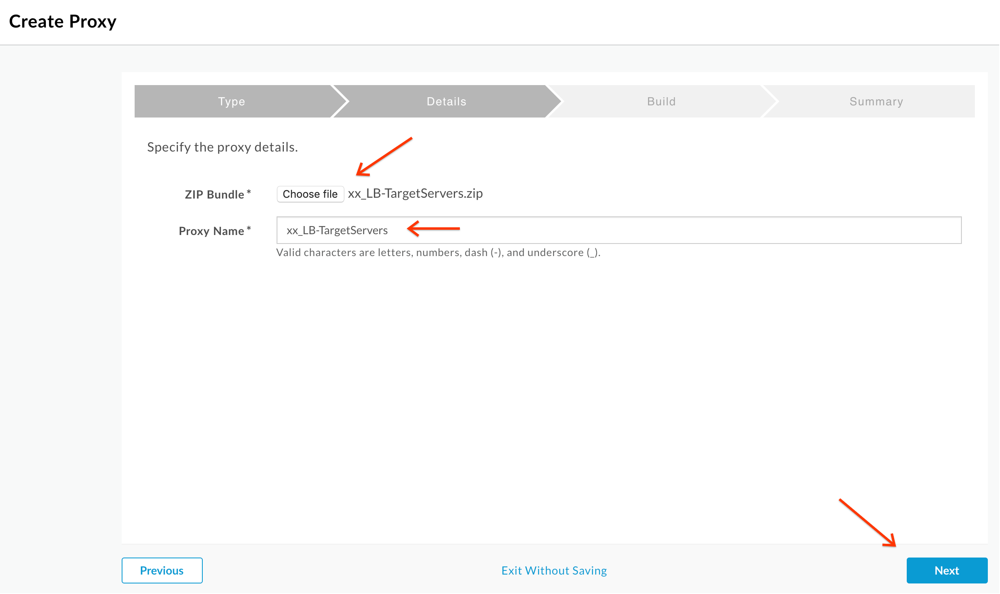

6. Click __Build__ in the next screen to upload the Proxy


7. heck that the Proxy is uploaded successfully

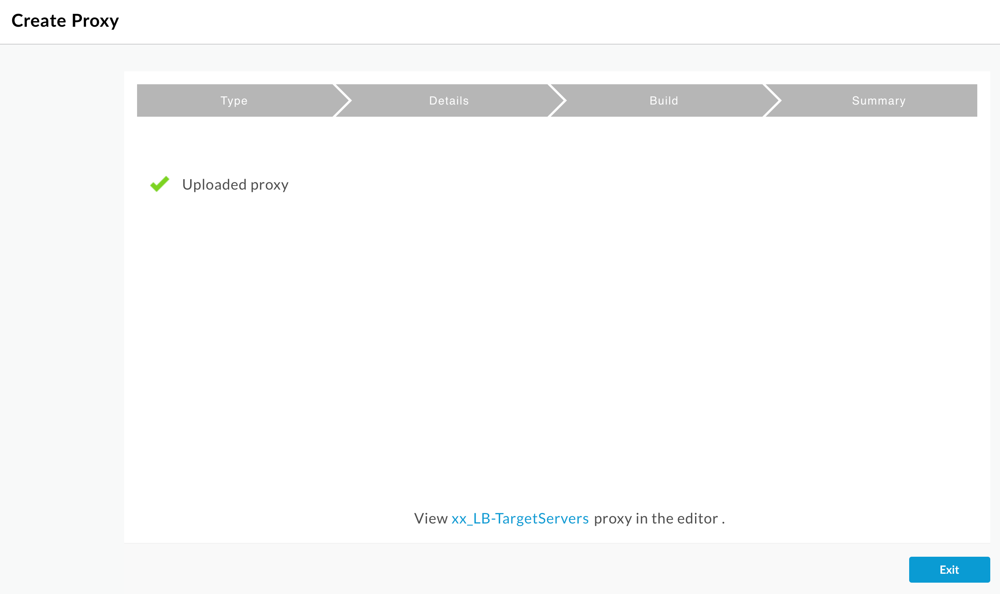

8. Next, create the Target Servers to do Load Balancing to the backend services. Click on __Admin->Environment->Target Servers__

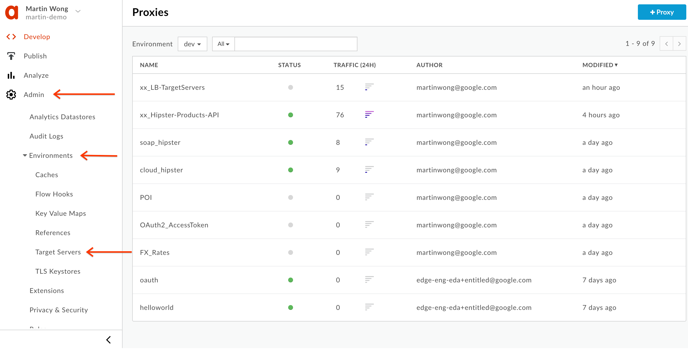

9. Click on __+Target server__ to add the first Target Server using the following configurations:

	```
	Name: {initials}_lb1-targetServer
	Host: mocktarget.apigee.net
	Port: 80
	```

Click on __Add__ to create the Target Server.

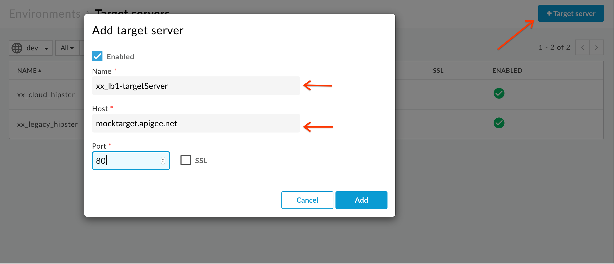

10. Add the second Target Server using the following configurations:

	```
	Name: {initials}_lb2-targetServer
	Host: httpbin.org
	Port: 80
	```

Click on __Add__ to create the Target Server.

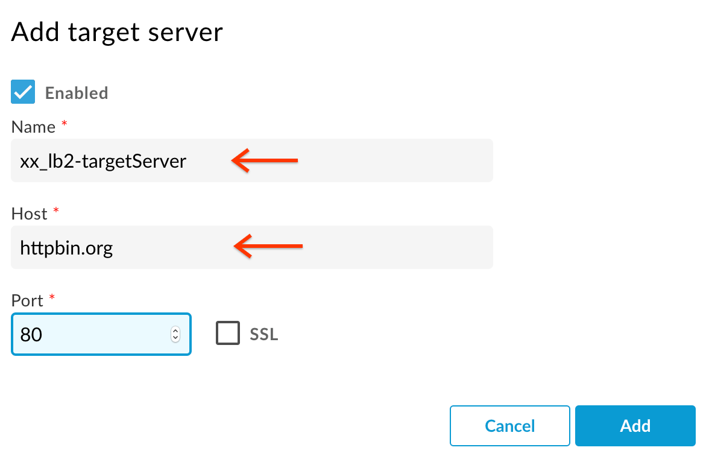

11. Now you should have 2 Target Servers created, each pointing to a different endpoints:

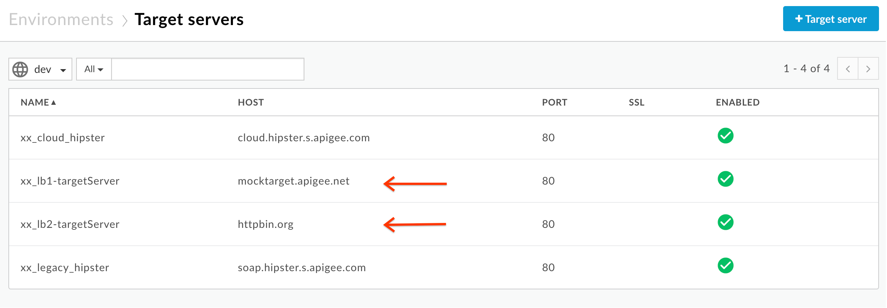

12. Next, we will configure the load balancer across the two Target Servers. Go to __Develop -> API Proxies__ and click on the {Initials}\_LB-TargetServers API Proxy which was created earlier. Click on __DEVELOP__

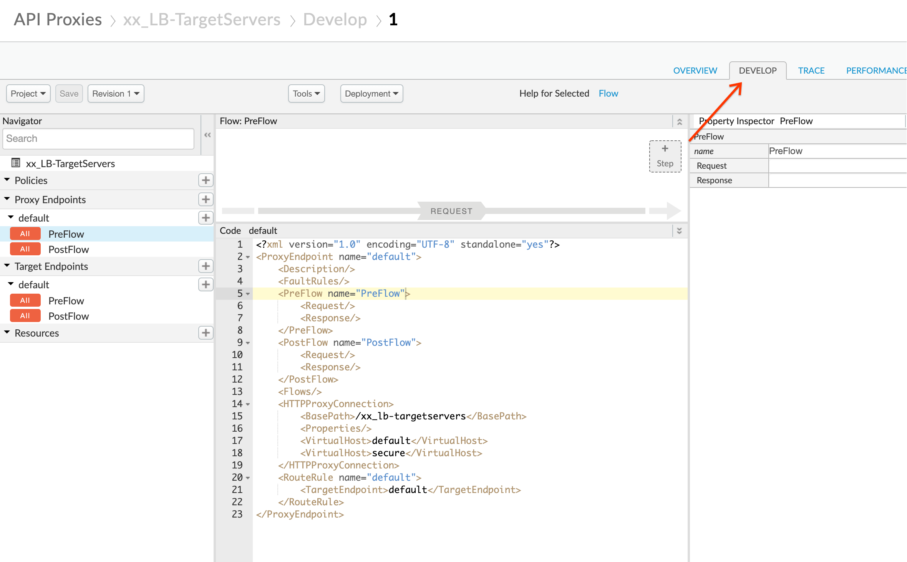

13. Click on the default Target Endpoint. Replace the hardcoded target URL in HTTPTargetConnection configurations with:

	```
	<HTTPTargetConnection> 
		<LoadBalancer>
      			<Server name="{initials}_lb1-targetServer" />
    		</LoadBalancer>
    	</HTTPTargetConnection>
	```
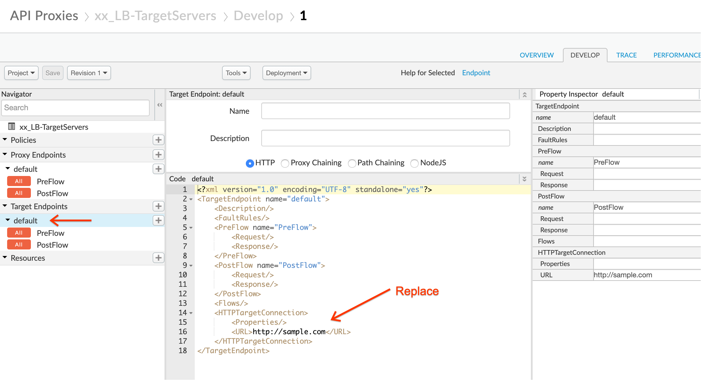

14. Click on __Save__ and the first target endpoint is now pointing to the {initials}\_lb1-targetServer.


15. Add the second Target Server to the default target endpoint:

	```
	<HTTPTargetConnection> 
		<LoadBalancer>
      			<Server name="{initials}_lb1-targetServer" />
			<Server name="{initials}_lb2-targetServer" />
    		</LoadBalancer>
    	</HTTPTargetConnection>
	```

Click on __Save__ to save the configurations.


16. Click on __TRACE__ and Start Trace Session. Copy the URL and test it using a Browser or a tool like Postman.

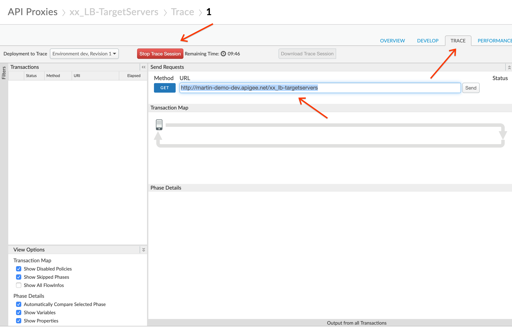

17. You should see the API calls being load balanced across the two endpoints:

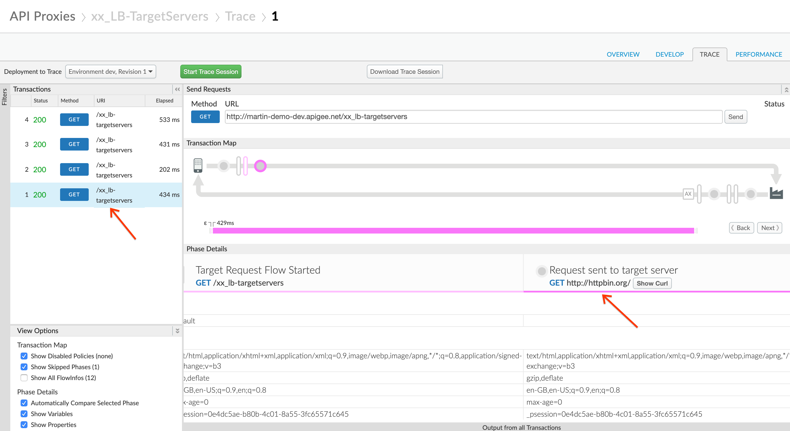


Congratulations! You have successfully used the Load Balancer construct to load balance the API traffic across two different backend services.

### Lab Video
[Load Balancing using Target Servers Video](https://www.youtube.com/watch?v=kil11uZ7ttY&t=)

### Earn Extra Points
The current configurations does not specify the type of load balancing algorithm used. Add necessary configuration to indicate the type of algorithm you would like to use.

### Quiz
What is the purpose and when do you used load balancing?
What is a Load Balancer construct, and how is it used in Apigee Edge?
What is the relationship between a Load Balancer construct and a Target Endpoint in an API Proxy?

### Summary
This lab demonstrates how to use the Load Balancer to distribute API traffic across two different Target Servers. 

### References
[Load Balancer documentation](https://docs.apigee.com/api-platform/deploy/load-balancing-across-backend-servers)


      


